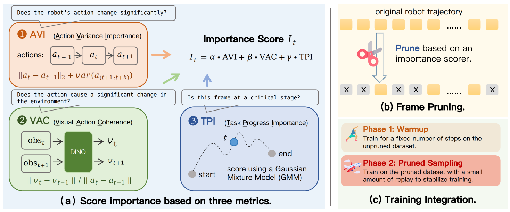

## FrameSkip: Learning from Fewer but More Informative Frames in VLA Training

### 一. 工作动机

**核心问题**：现有 VLA 模仿学习训练通常默认一条示范里的**每一帧具有同等监督价值**，因此会从密集轨迹中**均匀采样**训练样本。但机器人轨迹天然存在明显的**时间冗余**：大量时间步只是平滑移动、靠近目标、搬运物体或保持抓取状态；而真正决定任务成败的关键阶段，例如 **对齐、接触、抓取、释放**，往往只占很小比例。均匀采样会导致这些**稀疏但重要**的关键帧被大量低信息帧稀释，形成**时间监督不平衡**。

**核心思想**：FrameSkip 定义了一种**时间监督分配**方法：在固定训练预算下，**减少模型暴露于冗余低变化片段的次数，增加模型暴露于关键操作转换阶段的次数**。具体来说，FrameSkip 在 **dataloader** 层面根据每一帧的**重要性分数**选择训练帧，**只保留更有信息量的帧**，并将训练样本**重映射**到这些高重要性帧上。

> 和模型结构类方法不同，FrameSkip 的关键在于：**同样的模型、同样的 loss、同样的推理方式，只改变训练时哪些帧更频繁地被看到。** 它不改变 VLA 架构、不改变 action head、不改变训练目标，也不改变推理流程。

---

### 二. FrameSkip 方法

FrameSkip 是一个**训练阶段-数据层-帧选择**框架。它的整体流程可以分为三步：

1. 对每条机器人轨迹中的每一帧计算 **frame-level 重要性分数**；
2. 在给定保留比例 r 的情况下，保留高重要性帧，构造**压缩后的轨迹视图**；
3. 在训练时通过 dataloader 的**索引重映射机制**，把原始采样请求映射到被保留的关键帧上。

##### A. 问题定义

给定一条机器人示范轨迹：

$$
\tau = \{(o_t, a_t, l)\}_{t=1}^{T}
$$

其中：

- $o_t$ ：第 $t$ 步的视觉观测；
- $a_t$ ：第 $t$ 步的动作；
- $l$ ：整条轨迹对应的语言指令；
- $T$ ：轨迹长度。

标准 VLA 训练默认使用**所有时间步**，相当于假设每个 $t$ 对策略学习同等重要。FrameSkip 则希望在给定保留比例 $r ∈ (0, 1]$ 的情况下，选择一个时间步子集：

$$
S_r \subseteq \{1, \ldots, T\}, \quad |S_r| \approx rT
$$

使得**被保留的帧尽量包含对策略学习最有价值的监督信号**。

##### B. Frame-level 重要性分数计算

FrameSkip 的核心是给每一帧计算重要性分数。论文认为，一个帧更重要，通常有三类信号：

- **当前动作发生明显变化**；
- **动作变化确实导致了视觉环境变化**；
- **当前进度处于任务中的关键交互阶段**。

因此 FrameSkip 组合了三个主要指标：**AVI、VAC、TPI**，并额外加入**夹爪状态转换保留机制**。

1. **AVI：Action Variation Importance（动作变化重要性）**

   $$AVI(t) = \|a _t - a _{t-1}\| _2 + \lambda \cdot MeanVar(a _{t+1:t+k})$$

   其中：
   
   - 第一项 $||a_t - a_{t-1}||_2$ 衡量**当前动作相比上一时刻是否发生明显变化**；

   - 第二项 $MeanVar(a_{t+1:t+k})$ 衡量**未来短窗口内动作是否持续变化**；

   - 论文默认 $k = 3$ ， $λ = 0.1$ 。

   直观理解：

   > 如果某一帧附近动作变化很大，它很可能对应接触、抓取、释放、方向切换等关键行为转折，因此应该被更高概率保留。

   不过，动作变化大并不总是意味着关键交互，也可能只是控制抖动或不稳定动作。因此仅用 AVI 不够。

2. **VAC：Visual-Action Coherence（视觉-动作一致性）**：

   $$VAC(t) = \frac{\|v _t - v _{t-1}\| _2}{\|a _t - a _{t-1}\| _2 + \epsilon}$$

   其中：
   
   * $v_t$ 是由 DINOv2 视觉编码器从观测 $o_t$ 中提取的视觉特征；

   - 分子表示视觉变化，分母表示动作变化， $ε$ 用于避免除零。

   直观理解：

   > 如果一个较小动作变化导致明显视觉变化，比如物体开始移动、接触发生、抓取成功、物体被放下，那么这个帧往往非常关键。

   VAC 的价值在于弥补 AVI 的不足： **AVI 只看动作本身，而 VAC 进一步判断动作是否和环境变化产生了关联**。

   论文实现中，为了降低预处理成本，VAC 不会对所有帧都完整计算 DINOv2 特征，而是在每条轨迹中**稀疏采样最多 16 个视频帧**，再将 VAC 分数**插值回原始轨迹长度**，并**对极端值做裁剪**。

3. **TPI：Task Progress Importance（任务进度重要性）**

   首先定义归一化进度：

   $$p_t = \frac{t - 1}{T - 1}$$

   FrameSkip 的具体做法是：对每个 benchmark，先**人工或规则**地标出**某个关键阶段（例如对齐、抓取、释放）的大致时间范围**，然后取这个时间范围的**中心帧**，将它换算成**归一化任务进度 $p$**。然后用**一维高斯混合模型**拟合这些关键阶段的中心位置:

   $\displaystyle q(p) = \sum_{m=1}^{M} \pi_m \mathcal{N}(p; \mu_m, \sigma_m^2)$

   $q(p)$ 表示**不同任务进度位置上出现关键阶段的概率密度**，即**表示当前帧所在的任务进度位置有多可能是关键操作阶段**，接着定义：

   $\displaystyle TPI(t) = \frac{q(p_t)}{\max_s q(p_s)}$

   直观理解：
   
   >  如果根据任务统计，某个轨迹进度位置更可能出现抓取、对齐、释放等关键阶段，那么该位置附近的帧应被赋予更高重要性。

   如果没有这类少量阶段标注，也可以直接使用**与数据集无关的高斯先验**：

   $$TPI(t) = \exp\left(-\frac{(p_t - 0.5)^2}{\sigma^2}\right)$$

   它假设关键交互阶段更可能出现在**轨迹中部**，论文默认 $σ² = 0.2$ 。
   
4. **总分**

   三个指标会先在每条轨迹内部做 **min-max 归一化**，然后组合成总分：

   $$I(t) = \alpha \widehat{AVI}(t) + \beta \widehat{VAC}(t) + \gamma \widehat{TPI}(t)$$

   默认权重为： $α = 0.6$ / $β = 0.2$ / $γ = 0.2$ ，即 FrameSkip 主要依赖 AVI，VAC 和 TPI 作为辅助信号。

##### C. 基于比例的帧剪枝

计算出每一帧的重要性分数后，FrameSkip 不再均匀使用所有帧，而是**按照目标保留比例 $r$ ，从每条轨迹中保留更重要的帧**。

实际实现时，并不是简单粗暴地只取分数最高的帧，还会加入一些**保护规则**：

- 保留轨迹的第一帧和最后一帧；
- 保留 gripper / end-effector 状态发生变化的帧；
- 保留 action change 特别大的帧；
- gap filling：如果保留帧之间间隔过大，可以补充一些中间帧，避免轨迹过于不连续。

##### D. 缓存压缩视图

FrameSkip 会提前为每条轨迹计算好**不同保留比例**下应该保留哪些帧，并把结果**缓存**下来，训练时直接读取，不需要每次重新计算 importance score 和剪枝结果。

例如同一条轨迹可以提前缓存：

- $r=1.0$ ：完整轨迹，不剪枝；
- $r=0.5$ ：保留 50% 重要帧；
- $r=0.2$ ：保留 20% 重要帧；
- $r=0.1$ ：保留 10% 重要帧。

这些不同版本就叫**压缩视图（Compressed Views）**。训练时可以根据需要在不同 view 之间切换。

这么做有两个好处：

1. **节省训练开销**：importance score 和保留帧索引都提前算好，**训练时不用重复计算**。
2. **方便做不同压缩率实验**：同一套缓存可以支持多个 retention ratio，**便于比较保留 10%、20%、50% 帧时的效果**。

---

### 三. 训练与使用

FrameSkip 的训练流程分成两个阶段：**全帧 warmup** 和**基于全帧锚点的剪枝采样**。

##### A. 全帧 warmup

训练最开始的 $N_{warm}$ 步，FrameSkip 不进行剪枝，而是使用 $r = 1.0$ 的完整轨迹视图，等价于标准全帧训练。

动机是：

> 先让模型从完整密集轨迹中建立基本的 visual-action grounding，然后再切换到高重要性帧为主的训练分布。

如果一开始就只看稀疏关键帧，模型可能还没学会基础的观测-动作对应关系，训练会不稳定。

##### B. 基于全帧锚点的剪枝采样

warmup 结束后，**大多数 mini-batches 从 Compressed View 中采样，少量 mini-batches 仍然从 Full-frame View 中采样**。

论文主设置为：

- **目标保留比例 $r = 0.2$**；
- 训练时采用 **5:1 schedule**：
  - 连续 5 个 mini-batches 来自 Compressed View；
  - 插入 1 个 mini-batch 来自 Full-frame View。

这样做的作用是：

- pruned mini-batches 让梯度主要来自关键帧；
- full-frame anchor mini-batches 保留全轨迹上下文，避免模型只过拟合稀疏转折点。

##### C. Dataloader 索引重映射机制

FrameSkip 不会真正改写原始数据集，而是在 dataloader 中进行**索引重映射**。外部采样器仍然像原来一样请求“原始轨迹中的某个时间步”，但 **FrameSkip 会在 dataloader 内部把这个时间步重映射到压缩视图里最近的可用保留帧**。

具体来说：

1. 原始采样器先采样一个**轨迹索引**和**该轨迹中的原始时间步**；
2. 根据当前**目标保留比例**，从缓存的压缩视图中读取该轨迹缓存好的**保留索引**；
3. 用**二分查找**将**请求的时间步**映射到**不早于该时间步的第一个保留时间步**（如果超过范围，则映射到最后一个保留时间步）；
5. 用原始数据读取逻辑加载映射后的帧。

这样做的好处是：

> **不用改原始数据读取接口，也不用改训练代码的大框架**，只是在 dataloader 中间加一层索引转换。

---

### 四. 实验

##### 实验模型与框架

论文在 StarVLA 框架下实现所有 VLA 策略。整体上是一个 two-expert architecture：

- **understanding expert**：初始化自 `Qwen3-4B-VL-Instruct`，负责编码语言指令和视觉观测；
- **action expert**：随机初始化的 `Diffusion Transformer`，用 flow-matching objective 生成连续机器人动作；
- VLM 的 last hidden states 作为 conditioning features 输入 action expert。

所有对比方法使用相同模型架构、优化器和训练配置，差异只来自 frame selection 策略。

训练设置：

- global batch size = 128；
- 使用 8 张 NVIDIA H100 GPU；
- DeepSpeed ZeRO-2；
- 主设置 retention ratio r = 0.2；
- pruned : full-frame anchor = 5 : 1。

##### A. 研究问题一：FrameSkip 是否优于 Full-Frame Training？

- **实验设置**：在 RoboCasa-GR1、SimplerEnv 和 LIBERO 三个 benchmark 上，对比标准 full-frame training 和 FrameSkip。三者覆盖不同 robot embodiment、控制方式和任务类型。
  - RoboCasa-GR1：GR1 双手 / 双臂 tabletop manipulation，24 个任务；
  - SimplerEnv：WidowX manipulation，训练在 BridgeV2 real-robot 数据上，测试在 held-out simulation tasks；
  - LIBERO：Franka 单臂语言条件操作，包含 Spatial、Object、Goal、Long 四个 suite。

- **实验结论**：FrameSkip 在三个 benchmark 上都提升了性能。宏平均成功率从 full-frame training 的 **66.50%** 提升到 **76.15%**，同时主设置只保留 **20% unique frames**。

##### B. 研究问题二：保留多少帧最合适？

- **实验设置**：在 RoboCasa-GR1 上比较不同 retention ratio： $r\in\lbrace \text{10％},\text{20％},\text{30％},\text{40％},\text{50％},\text{60％},\text{100％}\rbrace$
  
- **实验结论**：所有 pruned settings 都超过 full-frame training，其中 $r=50\%$ 最好，但 $r=20\%\text{--}30\%$ 已经表现很强。

##### C. 研究问题三：重要性分数的每个组成部分是否都有用？

- **实验设置**：固定相同 retention ratio 和训练 schedule，只改变 frame scoring rule：
  
  - Random（随机剪枝）；
  - AVI；
  - AVI + TPI；
  - AVI + VAC；
  - AVI + VAC + TPI；
  - FrameSkip Full，即再加入 gripper-transition preservation。
  
- **实验结论**：随机剪枝也有一定效果，但完整 FrameSkip 明显更强；加入 VAC、TPI、gripper preservation 后逐步提升，可以看出：

  - AVI 是最核心的基础信号；

  - VAC 对 SimplerEnv 提升特别明显，说明视觉-动作耦合信息对跨环境泛化很重要；

  - TPI 提供了任务阶段先验；

  - gripper-transition preservation 是完整方法取得最好结果的重要补充。

##### D. 研究问题四：Warmup 步数是否敏感？

- **实验设置**：在 RoboCasa-GR1 上比较不同 full-frame warmup steps：2500、5000、7500、10000、12500、15000。
  
- **实验结论**：FrameSkip 对 warmup 长度不太敏感，5000 步最好，但不同设置差距很小。这说明短暂 full-frame warmup 足以建立初始 visual-action grounding，之后就可以将训练重点转向高重要性帧。

---

### 五. 局限性

论文没有单独设置 “Limitations” 小节，但从方法和实验可以总结出以下局限：

* **Frame importance 仍然是启发式的**：AVI、VAC、TPI 和 gripper-transition preservation 都是基于**启发式规则、轨迹统计或弱先验**，并不直接等价于“某一帧对最终任务成功的因果重要性”。例如动作变化大可能来自关键交互，也可能来自控制噪声。**公式背后的原理有待推敲。**
* **TPI 可能依赖少量阶段标注或任务先验**：主实验中的 dataset-adaptive GMM-TPI 需要从少量训练轨迹中人工标注中心帧。虽然这些标注不进入策略训练，但仍然**增加了预处理成本**。没有标注时只能使用中部高斯先验，这可能不适合所有任务。
* **对长程任务的上下文保留仍需谨慎**：如果 retention ratio 太低，可能会**破坏轨迹连续性**，使模型缺少必要的过程上下文。论文通过 full-frame anchors 和 gap filling 缓解这一点，但最优 ratio 仍可能随任务、机器人和数据质量变化。
* **目前主要验证在仿真 benchmark**：论文实验覆盖 RoboCasa-GR1、SimplerEnv 和 LIBERO，但没有系统展示**真实机器人部署效果**。对于真实机器人数据，视觉噪声、时延、示教风格差异可能影响 frame importance 估计的稳定性。

---

### 六. 对 FastWAM / WAM 预训练的启发

FrameSkip 对 FastWAM 很有参考价值，因为 FastWAM 预训练同样会面对大量 dense video-action trajectory，其中很多片段只是低信息量的平滑过渡。因此可以借鉴 FrameSkip，**提高这些关键片段在预训练中的采样概率**。
