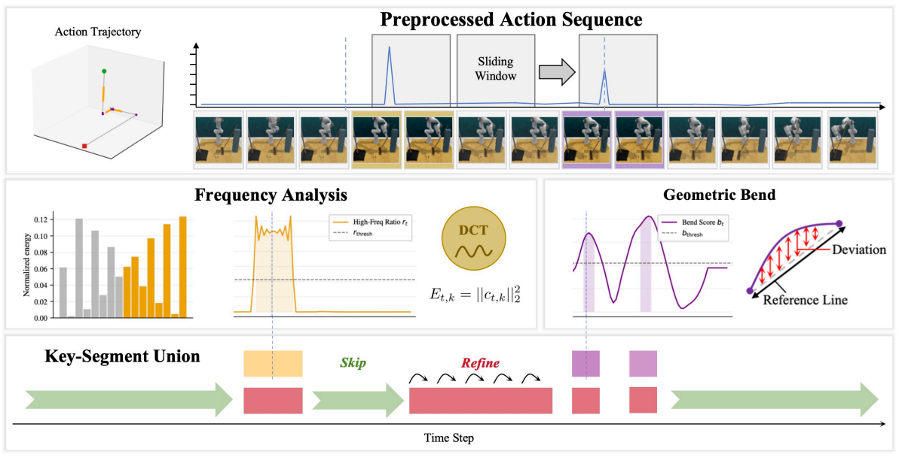

## SkiP: When to Skip and When to Refine for Efficient Robot Manipulation

### 一. 工作动机

**核心问题**：现有模仿学习策略通常在**每个控制步**都预测未来动作，不管当前处于平滑移动阶段，还是处于**接触、抓取、对齐**等高精度阶段。这种统一处理方式并不合理：机器人轨迹中大量步骤只是穿过自由空间，动作变化平滑、信息密度较低；而少量关键步骤集中在**接触、抓取、对齐、释放**等阶段，需要更密集、更高分辨率的动作预测。

**核心思想**：SkiP 认为，模仿学习中的时间分辨率可以通过**监督目标设计**来控制，而不一定要通过额外的复杂模型结构实现。它将轨迹划分为两类片段：

- **skip segment**：低信息、平滑、可预测的片段，适合**直接跳过**；
- **key segment**：高信息、动作复杂、通常靠近接触或精细操作的片段，需要**密集 refine**。

SkiP 的关键做法是 **action relabeling**：

- 在 **skip segment** 中，不再让模型预测下一步动作，而是让模型预测**下一个 key segment 入口处的动作**；
- 在 **key segment** 中，仍然让模型预测**正常的下一步动作**。

> 和 FrameSkip 不同，FrameSkip 是改变训练时“哪些帧更常被看到”，而 SkiP 是改变训练时“当前帧对应的动作标签是什么”。它不是减少训练样本，而是让模型**在冗余片段学会跳过**，**在关键片段学会细化**。

---

### 二. SkiP 方法

SkiP 是一个**训练目标重标注**方法，整体流程可以分为三步：

1. 使用 **MSK (Motion Spectrum Keying)** 从动作轨迹中自动划分出 **key segment** 和 **skip segment**；
2. 根据当前时间步属于哪类片段，**重标注对应的 action chunk**；
3. 使用原来的 imitation loss 训练同一个策略，使其**同时学到 skip 和 refine 两种行为**。

##### A. 问题定义

给定一条机器人示范轨迹：

$$
\tau = \{(o_t, a_t)\}_{t=1}^{T}
$$

其中：

- $o_t$ ：第 $t$ 步的观测；
- $a_t$ ：第 $t$ 步的连续动作；
- $T$ ：轨迹长度。

标准 behavior cloning 通常把每个时间步都看成一样的监督点，让模型在每个 $t$ 上预测**下一步动作**或**从 $t+1$ 开始的 action chunk**。

SkiP 认为这会导致两个问题：

- 在 free-space 阶段，逐步预测是**冗余**的，密集预测可能**累积预测误差**；
- 在 contact-rich 阶段，必须**保留密集控制**，否则容易错过窄容差的接触、对齐和抓取窗口。

因此 SkiP 的目标是：

> 让策略在低信息片段**用更少决策跨过去**，在高信息片段集中进行**密集动作修正**。

##### B. MSK：Motion Spectrum Keying（运动频谱关键段识别）

SkiP 还需要知道哪些时间步是 key，哪些时间步是 skip。为此论文提出了 **MSK**，即 **Motion Spectrum Keying**。

MSK 的作用是：根据动作信号本身的**局部复杂度**，自动找出需要密集 refine 的关键片段。它主要包括三类信号：

1. **DCT 频谱分析**

   SkiP 首先以每个时间步为中心，取一个**长度为 16 的动作窗口**，然后对这个窗口做 **DCT 计算**，得到频谱系数，其中第一个系数是整体平均/直流成分，前半部分视为低频部分，**后半部分视为高频部分**，计算高频能量（后半部分 DCT 系数平方和）占总能量（所有 DCT 系数平方和）的比例，如果这个比例超过**该 episode 内所有时间步对应的高频比例的 75% 分位数**，就将该时间步标为 frequency-positive，连续的 frequency-positive 时间步再**合并**成 key segment，其中**长度小于 3 步的 segment 会被丢弃**。

   >  直观理解：
   >
   > * 如果一段动作**非常平滑**，说明机器人可能只是**在自由空间里移动**；
   > * 如果一段动作有很多**快速变化**、**高频成分**，说明机器人可能正在**接触、调整、对齐、抓取或修正**。

2. **Bend-based augmentation（基于弯折程度的关键段增强）**

   仅靠高频变化还不够，因为有些关键操作不一定表现为明显高频震荡，而是表现为**轨迹几何形状发生弯折**。例如机器人原本沿直线靠近，但突然需要绕开、调整角度、改变接触方向，这类情况可能不一定有非常强的高频信号，但**轨迹相对直线参考会出现明显偏离**。

   因此 SkiP 额外计算一个 **bend score**：仍以每个时间步 `t` 为中心，取一个**长度为 16 的动作窗口**，将窗口起点和终点连成一条“如果它是直线运动，本该走的路径” `L`。然后计算窗口内**每个点到 `L` 的距离**，并**除以 `L` 的长度**，得到该点相对直线运动路径的归一化偏离程度。最后对窗口内所有点的归一化偏离取**平均**，作为以 `t` 为中心的局部窗口的弯折程度。如果该 bend score 超过预设阈值 **`0.3`**，就认为 `t` 附近发生了明显弯折，于是将中心时间步 `t` 标记为 **bend keyframe**。之后对该 keyframe 做 `±2-step expansion`，即**把 `[t-2, t+2]` 范围内的时间步都加入 key segment**，相邻或重叠的扩展片段最终**合并**为连续的 key segment。

3. **Heuristic keyframes（启发式关键帧）**

   最后，SkiP 还会把一些**启发式**关键点附近的时间步加入 key segment，例如：

   * 夹爪状态变化（从开到关、从关到开）
   * 末端执行器速度过零点（某个运动维度的速度从正变负或从负变正，意味着运动方向发生反转）

最终的 key segment 是三类结果的**并集**：

$$
\text{key segment = 频谱高频片段 ∪ 几何弯折片段 ∪ 启发式关键点邻域}
$$

剩下的时间步就是 skip segment。

> MSK 的特点是：不需要人工标注，不需要训练额外模型，**只依赖动作序列本身**，因此比较**轻量**、**任务无关**。

##### C. Action Relabeling（动作重标注）

Action relabeling 是 SkiP 的核心机制。假设一条轨迹已经被划分为若干个 segment。对任意时间步 $t$ ，可以判断它属于：

- **key segment**：需要 refine；
- **skip segment**：可以 skip。

SkiP 对训练标签做如下处理：

1. **如果当前时间步在 key segment 中**：
   - 训练目标保持不变，模型**仍然预测从下一步开始的 action chunk**；
   - 作用是训练模型在接触、抓取、对齐等阶段做**细粒度修正**。
2. **如果当前时间步在 skip segment 中，并且未来还有 key segment**：
   - 训练目标不再是下一步动作，而是改成**下一个 key segment 入口处开始的 action chunk**；
   - 作用是训练模型从当前平滑阶段**直接跳到**下一个关键操作阶段。
3. **如果当前时间步在 skip segment 中，但后面已经没有 key segment**：
   - 退化为**普通下一步预测**，避免轨迹尾部没有目标可跳。

> 如果 target chunk 超出轨迹末尾：超出部分用 0 padding，同时使用 mask 忽略这些 padding 位置的 loss。

经过 action relabeling 后，同一个策略会学到两种行为模式：

- **skip mode**：在平滑低信息阶段输出**较大的动作位移**，**快速跳向下一个关键阶段**；
- **refine mode**：在关键阶段输出**较小动作修正**，进行**密集精细控制**。

> SkiP 不是简单让动作整体变大或整体变快，而是学到了**阶段相关的两种时间尺度**。

---

### 三. 训练与使用

SkiP 的训练和使用可以分为两个阶段：**离线轨迹标注与重标注**、**标准 policy 训练与推理**。

##### A. 离线轨迹标注

训练前，SkiP 会先对每条 demonstration 的动作序列运行 MSK，得到每个时间步的二值标签：

- `1`：key segment；
- `0`：skip segment。

这个过程只发生在**训练数据预处理阶段**，不需要在推理时运行。

##### B. 构造 SkiP 训练样本

给定一个训练时间步 `i`，SkiP 根据 Action Relabeling 构造 target chunk。

##### C. Policy 训练

SkiP 使用**原有 policy backbone 的 imitation loss**。不同实验中它被接到不同策略架构上：

- RLBench：使用类似 CoA 的 transformer-based policy；
- RoboMimic：使用 Diffusion Policy 的 UNet backbone；
- RoboTwin：使用 DP3 的 3D diffusion backbone；
- real-robot 和 RLBench-18：在 $π_{0.5}$ checkpoint 上微调。

这说明 SkiP 本身不是某个特定架构，而是一种**即插即用的 supervision design**。

##### D. 推理阶段

推理时，SkiP 不需要显式判断当前是 skip 还是 refine，也不需要额外 planner。

模型只接收当前观测并输出 action chunk。由于训练时已经通过 relabeling 学到了两种模式，因此**模型会根据当前状态自动决定**：

- 当前是**平滑过渡阶段**时，输出**更大的跳跃动作**；
- 当前是**接触或精细操作阶段**时，输出**更小的修正动作**。

> 也就是说，skip/refine 行为是通过训练目标**内化**到 policy 里的，而不是推理时**手动切换**出来的。

---

### 四. 实验

##### 实验模型与框架

SkiP 在多个 benchmark、多个 policy backbone 和多个 observation modality 上验证，包括：

- **RLBench**：60 个任务，Franka Panda，4 个 RGB camera，使用 transformer-based policy；
- **RoboMimic**：4 个 image-based manipulation 任务，使用 Diffusion Policy UNet；
- **RoboTwin**：8 个双臂任务，使用 DP3 point-cloud policy；
- **real-robot**：3 个 tabletop 真实机器人任务，在 $π_{0.5}$ 上微调；
- **RLBench-18**：作为真实机器人设置的仿真对应实验。

主要指标包括：

- **SR**：任务成功率；
- **Steps**：平均执行环境步数；
- **Stepssucc**：只在成功 episode 上统计的平均执行步数。

##### A. 研究问题一：SkiP 是否能同时提升成功率和执行效率？

- **实验设置**：在 RLBench-10 和 RLBench-60 上，对比 DP、ACT、CoA-fwd、CoA-rev、KF-only 和 SkiP。

- **实验结论**：SkiP 在 RLBench-10 上取得**最高平均 SR**，同时使用**最少的执行步数**；在 RLBench-60 上，SkiP 位于 SR-Steps trade-off 的最优区域，即**成功率更高**、**执行步数更少**。

直观解释：

> SkiP 在 free-space 阶段减少不必要的逐步预测，在 key segment 附近集中控制，因此既减少了执行步数，也降低了中间预测误差累积。

##### B. 研究问题二：SkiP 是否能迁移到不同 policy backbone？

- **实验设置**：在 RoboMimic 上使用 Diffusion Policy UNet，在 RoboTwin 上使用 DP3，在 real-robot 设置中微调 $π_{0.5}$ 。

- **实验结论**：SkiP 在不同架构上都能带来收益，说明它**不是依赖某个特定模型结构**，而是依赖更通用的动作监督重标注思想。尤其在 RoboMimic 中，SkiP 在平均 SR 上超过 CoA-rev，并在困难任务 `square` 上提升明显，同时减少成功 episode 中的执行步数。

##### C. 研究问题三：MSK 是否比其他 key segment 标注方法更有效？

- **实验设置**：比较不同 key segment 生成方式，例如：
  - random segment：随机选一些片段当作 key segment；
  - velocity-only：只根据速度大小来找关键段，速度高的地方被认为更关键；
  - low-velocity key：把低速度片段当作关键段；
  - VLM-derived key segment：用 VLM 根据视频/轨迹语义阶段来划分 key segment；
  - MSK。

- **实验结论**：MSK **优于这些替代方案**。随机片段表现较差，说明关键段数量相同并不够，**关键在于 segment 放在哪里**；velocity-only 容易**误判**；low-velocity key 是较强替代方案，但**仍然捕捉不到一些轨迹曲率和复杂局部运动模式**。VLM-derived key segment 在部分任务上有竞争力，但在 RLBench 和 RoboMimic 中明显不如 MSK，说明**语义阶段边界不一定足够精确**，尤其是在接触丰富的控制任务中。

##### D. 研究问题四：MSK 的组成部分是否都有用？

- **实验设置**：消融 MSK 中的不同组成部分，例如只用高频能量、加入 bend score、加入 heuristic keyframes、改变 DCT window size 和 quantile threshold。

- **实验结论**：**完整 MSK 效果最好**。高频能量能够捕捉局部快速变化，bend score 能补充几何轨迹弯折，heuristic keyframes 能保证 gripper state 变化等关键事件不被漏掉。默认设置中，DCT window size 为 `W=16`，quantile threshold 为 `q=0.75`。

##### E. 研究问题五：SkiP 是否真的学到了 skip 和 refine 两种模式？

- **实验设置**：统计每次 policy call 的 action displacement（动作对应的**位移幅度**），并和 CoA-rev、CoA-fwd 对比。

- **实验结论**：SkiP 的 action displacement 呈现明显双峰模式：
  - skip-mode call 产生较大位移；
  - key-mode call 产生较小调整。

这说明 SkiP 不是简单把所有动作整体放大，而是确实学到了“**平滑阶段大步跳过、关键阶段小步细化**”的行为模式。

---

### 五. 局限性

论文在结论中提到了一些局限，并在 appendix 中进一步讨论。结合方法本身，可以总结为以下几点：

* **依赖 absolute target action**：SkiP 的 skip 行为本质上是让模型从当前状态直接预测**未来关键段入口处的动作目标**，因此**更适合 absolute action 表示**。如果动作是纯 delta action，就不能让模型直接预测未来关键段入口处的动作目标，需要重新设计动作表示或 relabeling 方式（例如把未来目标换算成从当前状态出发的累计 delta）。
* **key segment 质量非常关键**：SkiP 的效果**依赖 MSK 是否能准确找到真正需要 refine 的片段**。如果 key segment 标错，模型可能在该细化的地方跳过，或在本该跳过的地方保留密集控制。
* **MSK 仍然是启发式方法**：MSK 通过 DCT 高频能量、bend score 和 heuristic keyframes 判断关键片段，但这些信号**并不直接等价**于“对任务成功的因果重要性”。例如某些高频动作可能来自示教抖动，而某些低频但高精度的缓慢插入动作也可能非常关键。
* **skip 可能带来不可恢复错误**：如果模型在 free-space 阶段预测了过大的跳跃动作，可能导致**越过合适的交互窗口**，或**把机器人带到偏离训练分布的状态**。虽然 key segment 中的 refine 可以缓解这一点，但前提是 skip 后仍然落在可恢复范围内。

---

### 六. 对 FastWAM / WAM 预训练的启发

SkiP 对 FastWAM / WAM 预训练很有参考价值，因为 WAM 同样需要处理 dense video-action trajectory，而轨迹内部的时间信息密度高度不均匀。可以借鉴的方向包括：

1. **让 action DiT 学习阶段自适应的时间尺度**

   FastWAM 的 action chunk 不一定始终对应固定时间间隔。可以让 free-space 阶段的监督目标指向**更远的未来**，而让 contact-rich 阶段保持**短 horizon**、**密集动作预测**。

2. **将 skip/refine 与 video DiT 结合**

   对 video DiT 来说，平滑移动阶段可能只需要预测较远期的关键视觉状态，而关键操作阶段需要更细粒度地预测接触、抓取、释放等局部变化。因此可以考虑：

   - skip segment：预测**下一个关键视觉状态**；
   - key segment：预测**连续短期视觉变化**。

3. **用动作频谱或轨迹几何复杂度指导预训练采样**

   MSK 不只可以用于 action relabeling，也可以用于 FastWAM 的数据采样。高频动作片段、轨迹弯折片段、gripper transition 附近，可以被赋予更高采样概率。

4. **和 FrameSkip 形成互补**

   FrameSkip 更像是“多看关键帧”，SkiP 更像是“在不同片段使用不同监督目标”。如果结合到 FastWAM 中，可以形成两层方法：

   - 数据层：提高关键片段采样概率；
   - 监督层：在 skip segment 中预测更远的 action / future latent，在 key segment 中保持密集预测。

总体来说，SkiP 的核心启发是：

> **WAM 预训练不一定要在所有时间步上学习同一种固定时间尺度的预测任务；可以根据轨迹阶段，让模型在低信息片段学习长跨度跳转，在关键片段学习短跨度细化。**
