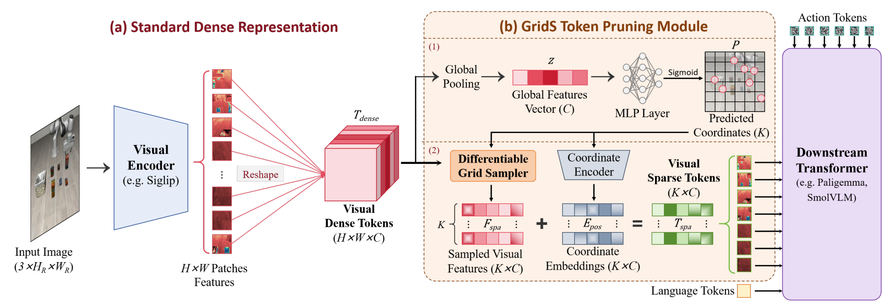
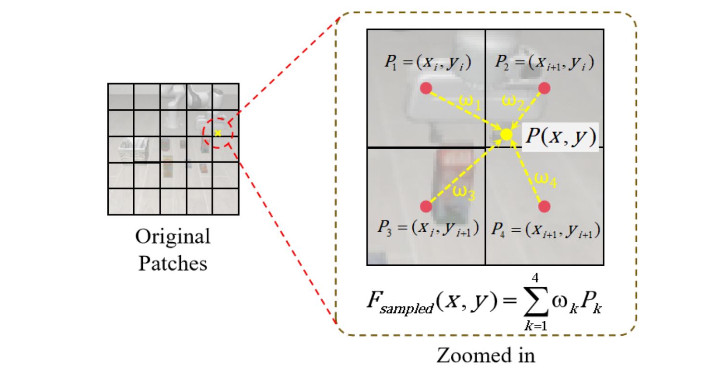

## See What Matters: Differentiable Grid Sample Pruning for Generalizable Vision-Language-Action Model

> 论文：[arXiv:2605.11817](https://arxiv.org/abs/2605.11817)
> GitHub：[Fediory/Grid-Sampler](https://github.com/Fediory/Grid-Sampler)

### 一. 工作动机

**核心问题**：现有 VLA 模型通常会把图像编码成密集视觉 token，例如 ViT 常见的 $16\times16=256$ 个视觉 token。下游 Transformer 需要同时处理视觉、语言和动作 token，计算量会随着序列长度增长而显著增加，因此**密集视觉 token 成为 VLA 训练和推理效率的重要瓶颈**。

**关键矛盾**：直接减少视觉 token 可以提升效率，但传统 token pruning 往往存在性能损失。原因在于机器人操作不仅需要识别物体语义，还需要保留**接触点、边缘、抓取位置、相对几何关系**等细粒度信息。普通离散剪枝只能在固定 patch 网格上做选择，**如果关键交互点刚好落在两个 patch 之间，就会产生空间量化误差，导致精细操作信息丢失**。

**核心思想**：GridS 不再把视觉压缩看成“从固定网格中离散选择 token”，而是将其改写为一个**可微的、任务感知的连续重采样问题**。模型先**预测少量连续空间坐标**，再通过 **双线性插值** 从原始 dense feature map 中采样特征，从而在保留关键几何信息的同时大幅减少视觉 token 数量。

> GridS 的关键不是简单少看 token，而是**让模型自己学习“应该从哪里取 token”**，并且这个采样位置可以通过任务 loss 端到端优化。

---

### 二. GridS 方法

GridS 是一个插入在 **vision encoder** 和下游 **VLA Transformer** 之间的视觉 token 压缩模块。它的整体流程可以分为三步：

1. 从 dense visual tokens 中提取**全局上下文**，根据全局上下文预测**少量连续采样坐标**；
2. 在连续坐标处做**可微双线性采样**；
3. 加入**坐标位置编码**，得到 sparse visual tokens。



##### A. 标准 VLA 的视觉 token 冗余

给定输入图像 $I$ ，vision encoder 会输出 dense feature grid：

$$
T_{dense} \in \mathbb{R}^{H \times W \times C}
$$

其中：

- $H\times W$ ：视觉 patch 数量；
- $C$ ：每个视觉 token 的特征维度。

例如 $H=W=16$ 时，一张图像会产生 256 个视觉 token。

但机器人操作中，**大量 token 可能来自背景、桌面、无关物体或静态区域**，真正和动作相关的区域通常只占少数，例如目标物体、夹爪、接触点、容器开口、插入孔位、物体边缘和姿态变化区域等。

因此，GridS 认为：

> VLA 不需要均匀处理所有视觉 patch，而应**学习少量 task-relevant visual tokens**。

##### B. Global Coordinate Prediction（全局坐标预测）

GridS 首先对 visual dense tokens 做全局平均池化，得到一个全局上下文向量：

$$
z = \frac{1}{H \times W}\sum_i \sum_j T_{dense}^{(i,j)} \in \mathbb{R}^C
$$

这个向量可以理解为当前图像的整体语义与场景摘要。

接着，一个轻量 MLP 根据 $z$ 预测 $K$ 个连续二维坐标：

$$
P = \sigma(MLP(z)), \quad P \in [0,1]^{K \times 2}
$$

其中：

- $K$ 是希望保留的视觉 token 数量， $K << H × W$ ；
- $σ$ 是 sigmoid 函数，约束结果落在 $[0,1]$ ，保证坐标落在图像范围内；
- **每个坐标表示模型希望从 dense feature map 中采样的位置**。

直观理解：

> 模型先看完整图像的全局特征，然后决定**应该从哪些空间位置提取少量关键视觉 token**。

##### C. Differentiable Bilinear Sampling（可微双线性采样）

传统 token pruning 是从固定 patch 网格中选 token，例如选第 5 个、第 18 个 patch。

GridS 则预测连续坐标，例如 $(x, y) = (5.3, 7.6)$ ，**这个位置通常不正好落在某个整数 patch 上**。

因此，GridS 使用 **bilinear interpolation** 从周围四个 patch 中加权采样：



1. 找到连续坐标周围的四个**邻近网格点**（邻近网格点来自未经过池化的 visual dense tokens）；
2. 根据采样点到四个邻居的**距离**计算权重；
3. 对四个邻居的特征做**加权求和**，得到该位置的 sampled feature。

例如采样点位于两个 patch 中间时，它可以同时利用两侧 patch 的特征，而不是被迫二选一。

这样做有两个好处：

- **保留 sub-patch 级别的空间信息**，减少离散 patch selection 的量化误差；
- **整个采样过程可微**，任务 loss 可以反向传播到坐标预测 MLP，让采样点自动移动到更有利于动作预测的位置。

##### D. Geometry Injection（几何注入）

连续采样得到的特征虽然保留了局部视觉内容，**但由于 token 不再位于规则网格中，原始空间结构会被打乱**。

因此 GridS 使用一个 **Coordinate Encoder** 将预测坐标编码成位置嵌入：

$$
E_{pos} \in \mathbb{R}^{K \times C}
$$

然后将位置嵌入加到采样特征上：

$$
T_{spa} = F_{spa} + E_{pos}
$$

其中：

- $F_{spa}$ ：通过 bilinear sampling 得到的视觉特征；
- $E_{pos}$ ：坐标位置编码；
- $T_{spa}$ ：最终输入下游 Transformer 的 sparse visual tokens。

直观理解：

> GridS 不仅告诉模型“这里有什么”，还告诉模型“这个 token 来自图像中的哪个位置”。

##### E. End-to-End Joint Optimization

GridS 和 VLA policy 一起端到端训练，直接使用原始 VLA 的主要任务 loss。

也就是说：

- 对于 flow-matching VLA，GridS 通过 action flow matching loss 学习采样位置；
- 对于 autoregressive VLA，GridS 通过动作 token 预测 loss 学习采样位置。

这和很多 training-free pruning 方法不同。GridS 不是在训练后用启发式规则删 token，而是**在训练过程中让模型学习“哪些视觉区域对动作生成最重要”**。

---

### 三. 训练与使用

##### A. 插入位置

GridS 插入在：

```text
image → vision encoder → GridS → downstream Transformer → action
```

也就是说，vision encoder 仍然先输出 dense feature map，但 **GridS 会在进入下游 Transformer 之前，将视觉 token 数量从 $H × W$ 压缩到 $K$**。

例如：

```text
原始视觉 token 数：256
GridS 后视觉 token 数：16 或 4
```

##### B. 训练方式

GridS 不需要单独训练采样器，而是**和 VLA 一起 fine-tuning**：

1. vision encoder 输出 dense visual tokens；
2. GridS 预测连续采样坐标；
3. 通过 bilinear sampling 得到 sparse visual tokens；
4. 将 sparse visual tokens 与 language tokens、action tokens 一起输入下游 Transformer；
5. 根据原始 VLA action loss 更新模型；
6. **任务 loss 反向传播到 GridS，使其学习更好的采样位置（可训练部分是 coordinate predictor MLP 和 Coordinate Encoder）**。

##### C. 推理方式

推理时，GridS 只保留少量视觉 token，因此可以**减少下游 Transformer 的计算量**。

它的推理流程是：

1. 输入当前图像和语言指令；
2. vision encoder 提取 dense feature map；
3. GridS 预测少量关键坐标；
4. 采样得到 sparse visual tokens；
5. 下游 VLA 根据 sparse tokens 生成动作。

GridS 不改变 VLA 的动作输出形式，也不改变低层控制器。

---

### 四. 实验

##### 实验模型与框架

论文在三类 VLA 模型上验证 GridS：

- **π0**：flow-matching VLA；
- **π0.5**：更强的 flow-matching VLA；
- **SmolVLA**：autoregressive VLA。

实验覆盖：

- LIBERO；
- ALOHA；
- SO100 真实机器人任务；
- OOD 视觉干扰场景；
- 额外扩展到 LIBERO-PLUS 和 RoboTwin。

##### A. 研究问题一：GridS 是否能在大幅压缩 token 的同时保持性能？

**实验设置**：在 LIBERO 上，将 π0 和 π0.5 的视觉 token 从 256 压缩到 16 或 4，并和 FastV、SparseVLM、VLA-Cache 等方法对比。

**实验结论**：GridS 在大幅减少视觉 token 的同时，没有降低成功率，反而在多个设置中提升性能。

典型结果：

- π0 baseline：256 tokens，平均成功率 94.4%；
- π0 + GridS16：16 tokens，平均成功率 96.0%；
- π0 + GridS4：4 tokens，平均成功率 95.5%；
- π0.5 baseline：256 tokens，平均成功率 96.7%；
- π0.5 + GridS16：16 tokens，平均成功率 97.7%。

这说明 GridS 的收益不仅来自计算减少，也可能来自过滤背景噪声、减少视觉冗余。

##### B. 研究问题二：GridS 是否优于离散 token pruning？

**实验设置**：在 π0 上比较 GridS、FastV、SparseVLM 和 VLA-Cache。

**实验结论**：传统离散 pruning 会带来成功率下降。例如 FastV 和 SparseVLM 分别让 π0 的平均成功率下降 1.5% 和 4.6%。GridS 则通过连续采样和联合优化，避免了离散 patch dropping 带来的空间信息损失。

直观理解：

> 离散 pruning 是“删掉一些 patch”；GridS 是“在连续空间中重新采样更有用的 token”。

##### C. 研究问题三：GridS 在精细操作任务上是否有效？

**实验设置**：在 ALOHA benchmark 上评估 Transfer Cube 和 Bimanual Insertion。

**实验结论**：GridS 使用 16 个视觉 token 时，平均成功率从 π0 baseline 的 86.3% 提升到 87.0%。其中 Human Insertion 从 56.7% 提升到 64.2%，说明 GridS 对更复杂、更高精度的操作有一定帮助。

##### D. 研究问题四：GridS 在真实机器人和 OOD 场景中是否有效？

**实验设置**：在 SO100 机械臂上评估三个真实任务：

- Pick & Place；
- Transfer Pen；
- Stack Cubes。

同时构造包含视觉干扰和空间扰动的 OOD 场景。

**实验结论**：GridS 在真实任务中明显优于 baseline，尤其在 Stack Cubes 中提升最大：

- baseline 成功率约 7.6%；
- GridS 成功率 60.0%；
- 提升约 52.4%。

在 Transfer Pen 和 Stack Cubes 的 OOD 设置中，baseline 基本失败，而 GridS 仍保持一定性能。论文认为这是因为 GridS 能主动过滤无关背景和干扰物，更集中地关注目标区域。

##### E. 研究问题五：保留多少 token 最合适？

**实验设置**：在真实 Stack Cubes 任务上比较不同 token 数量：

- $K=4$
- $K=8$
- $K=16$
- $K=32$

**实验结论**：性能呈现类似倒 U 型趋势， $K=16$ 最好。

结果显示：

- $K=4$ ：信息过少，任务失败；
- $K=8$ ：有一定效果；
- $K=16$ ：成功率最高；
- $K=32$ ：token 过多，可能重新引入冗余和干扰。

这说明视觉 token 不是越少越好，也不是越多越好。关键在于：

> 保留足够关键几何信息，同时去掉无关冗余信息。

##### F. 研究问题六：GridS 的效率提升体现在哪里？

论文从 FLOPs、推理时间和训练速度三方面分析。

在 LIBERO 上，π0 使用 GridS16 后：

- FLOPs 从 216.01G 降到 51.65G；
- 推理时间从 8.17s 降到 6.05s；
- 平均成功率从 94.4% 提升到 96.0%。

论文还指出，单 batch 推理时 wall-clock speedup 只有约 1.2×，因为底层 JAX kernel 已经高度优化；但在大 batch 训练或高吞吐设置下，GridS 的优势更明显，训练速度最高可提升约 3.4×。

---

### 五. 局限性

论文没有单独设置 “Limitations” 小节，但从方法和实验可以总结出以下局限：

* **极端压缩会丢失必要几何信息**：当 $K=4$ 时，真实 Stack Cubes 任务完全失败，说明过少 token 无法支持高精度空间关系建模。
* **最优 token 数量依赖任务**：简单语义任务可能只需要很少 token，但长程任务、空间关系任务和接触操作通常需要更多视觉细节。
* **单次推理加速并不总是非常明显**：虽然 FLOPs 大幅下降，但在 batch size = 1 的部署场景中，wall-clock speedup 可能受 kernel overhead 限制。
* **需要端到端 fine-tuning**：GridS 的优势来自联合优化，不是训练后直接插入即可使用。因此如果不能重新 fine-tune VLA，收益可能有限。
* **可能存在采样遗漏风险**：如果 GridS 在某些时刻没有采到关键接触点或短暂变化区域，下游策略可能丢失关键状态信息。
* **主要解决空间冗余，不直接解决时间冗余**：GridS 关注“哪些视觉区域重要”，而不是“哪些时间步重要”。它和 FrameSkip / SkiP 关注的问题互补。

---

### 六. 对 FastWAM / WAM 预训练的启发

GridS 对 FastWAM 的启发主要在于：**WAM 预训练不仅存在时间冗余，也存在空间冗余**。

FastWAM 同时包含 action modeling 和 video/world modeling。如果直接使用 dense visual tokens，模型可能会把大量计算浪费在背景、桌面、无关物体和静态区域上，而真正影响未来状态和动作的区域通常是：

- 目标物体；
- gripper；
- 接触点；
- 容器开口；
- 插入孔；
- 即将发生状态变化的局部区域。

因此，可以考虑把 GridS 思想引入 FastWAM：

> 在进入 ActionDiT 或 VideoDiT 之前，学习一个 task-aware / action-aware visual token sampler，让模型只保留对动作生成和未来状态预测最关键的视觉 token。

进一步可以和 FrameSkip / SkiP 结合：

- FrameSkip / SkiP 解决**时间维度**：哪些时间片段更重要；
- GridS 解决**空间维度**：每个时间步中哪些视觉区域更重要。

一个可能的研究方向是：

> **Spatio-Temporal Importance-Aware FastWAM Pretraining**：在时间上关注 key segment，在空间上关注 task-relevant visual tokens。

具体可以设计为：

1. 在 key segment 中保留更多视觉 token，因为接触和对齐需要更高空间精度；
2. 在 skip segment 中保留更少视觉 token，因为平滑移动阶段对局部细节要求较低；
3. 让采样位置由 action / language / history condition 控制，而不只是由单帧图像决定；
4. 对 VideoDiT 的未来预测区域进行加权，让模型重点预测会被机器人动作影响的区域。

需要注意的是，FastWAM 的 VideoDiT 可能需要比普通 VLA 更完整的场景上下文，因此不能简单照搬极端 token pruning。更稳妥的方式是：

> 先使用中等压缩比例，例如 $K=16$ 或 $K=32$ ，并在关键片段保留更高 token budget。
