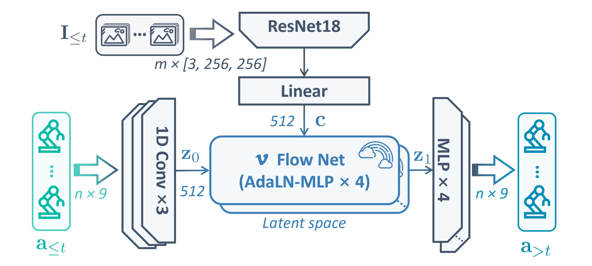
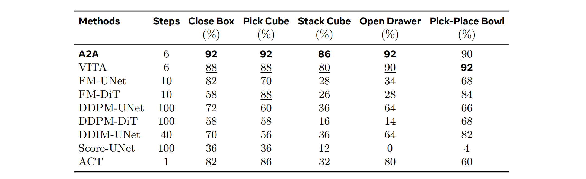
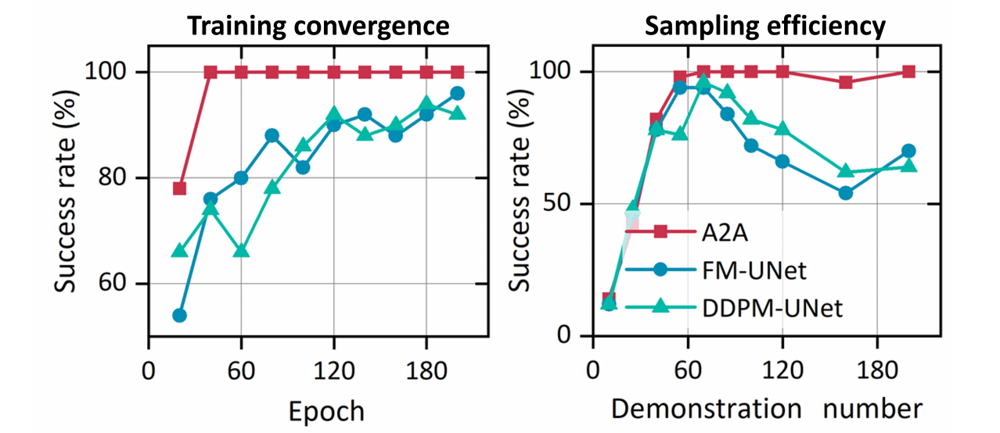
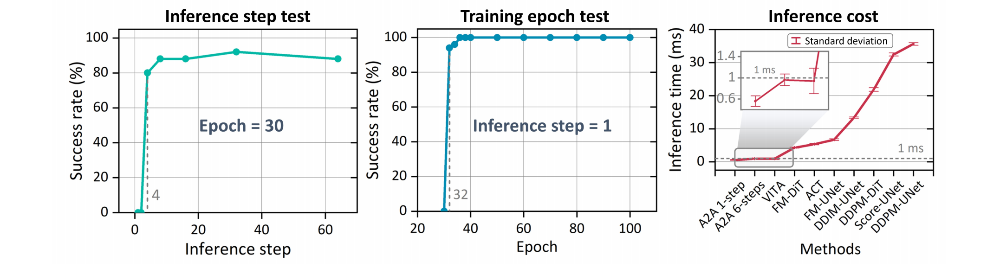
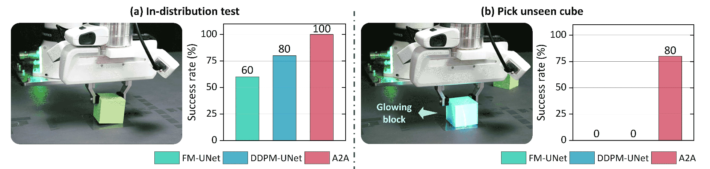
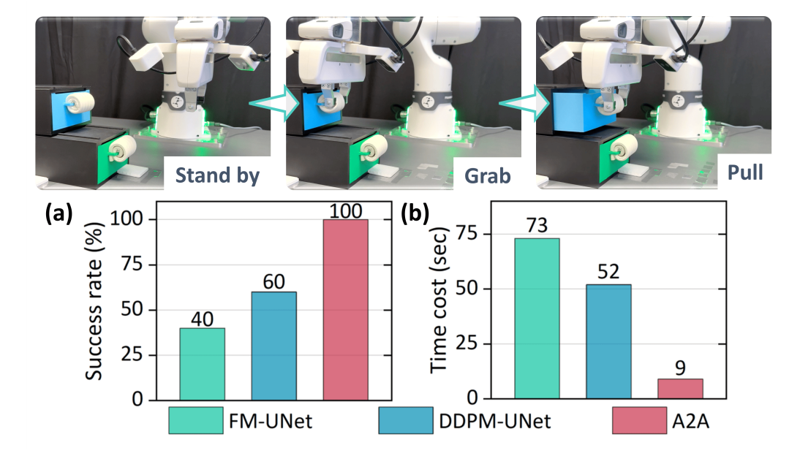
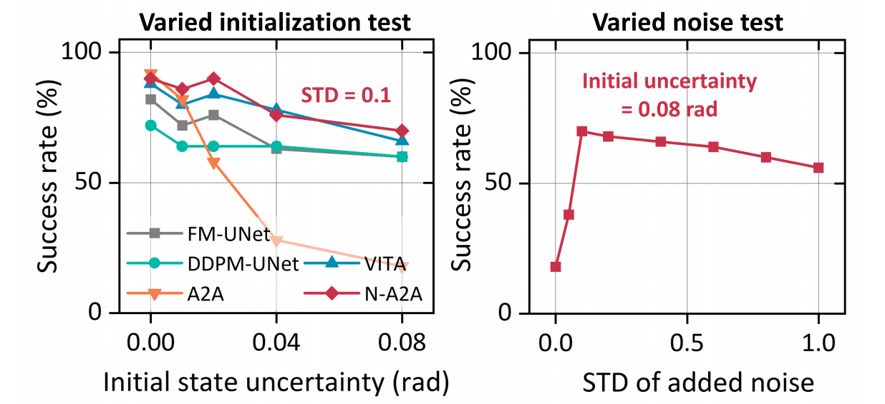
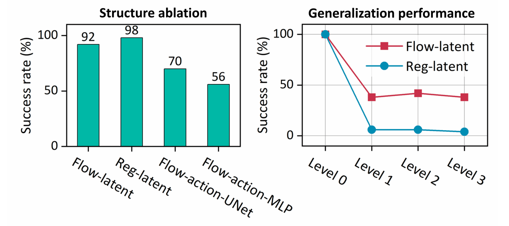

## Action-to-Action Flow Matching

> 论文：https://arxiv.org/pdf/2602.07322 
> 代码：https://github.com/JIAjindou/A2A_Flow_Matching 
> 项目：https://jingliangli.com/A2A_Flow_Matching/

### 一. 概述

**研究动机**：Diffusion Policy / Flow Matching Policy 虽然能建模多模态连续动作，但通常从随机高斯噪声开始生成动作，需要多步去噪，导致推理延迟较高。对于实时机器人控制来说，**这种“从零开始去噪”的范式并不一定必要**，因为机器人本身有连续的 proprioceptive feedback，历史动作天然包含了当前运动状态和未来动作趋势。视觉生成任务通常必须**从随机噪声开始**，因为没有明显的生成先验；但机器人控制不同，**上一段执行动作和下一段未来动作之间通常具有很强的时间连续性**。既然历史动作已经接近未来动作分布，为什么还要每次都从随机噪声开始？

**核心思想**：A2A 不再把高斯噪声作为生成起点，而是**把历史 proprioceptive actions 编码成 latent starting point，再学习从历史动作 latent 到未来动作 latent 的 flow**。由于历史动作和未来动作在物理上连续，二者分布距离更短，所以生成路径更简单，可以用轻量 MLP 和很少 inference steps，甚至 one-step，生成高质量动作。

> 传统 diffusion / flow policy 是 “noise-to-action”：从**随机噪声**生成动作。 
> A2A 是 “action-to-action”：从**历史动作**生成未来动作。

---

### 二. A2A 方法

A2A 的核心思路是：**将动作生成从“噪声到动作”的长路径，改成“历史动作到未来动作”的短路径**。它不是简单把历史动作拼接到条件里，而是把历史动作作为 flow 的 source distribution，让模型学习从历史动作分布到未来动作分布的传输。

#### 1. 与传统范式的区别

传统 Diffusion / Flow policy 通常从高斯噪声开始：

```text
Gaussian noise + condition → future action
```

A2A 则从历史动作开始：

```text
historical proprioceptive actions + visual condition → future action
```

也就是说，A2A 的 source 不再是随机噪声，而是机器人刚刚执行过的一段动作历史。因为机器人动作是连续的，历史动作和未来动作之间通常不会差得太远，所以 action-to-action transport 比 noise-to-action transport 更短、更稳定。

论文中特别强调，**历史动作 $a_{\le t}$ 用的是机器人实际执行后的动作反馈，而不是上一轮模型输出的 commanded actions**。这样可以更好反映真实机器人状态，避免低层控制误差带来的偏差。

> **A2A 和 OFP 的 Warm-Start 的区别**
>
> | 方法                   | OFP Warm-Start                                  | A2A                                          |
> | ---------------------- | ----------------------------------------------- | -------------------------------------------- |
> | 历史动作作用           | 推理时初始化 prior                              | 训练和推理中的 source distribution           |
> | 起点                   | shift + pad 上一轮剩余 action，加噪后作为初始点 | proprioceptive action history 编码成 $z_0$ |
> | 是否改变训练目标       | 不一定，主要是推理初始化技巧                    | 是，直接训练 action-to-action flow           |
> | 生成空间               | 通常仍在 action/noisy action space              | 高维 action latent space                     |
> | 核心假设               | 相邻 action chunk 相似                          | 历史动作分布和未来动作分布接近               |
> | 对 Fast-WAM 的迁移成本 | 较低                                            | 较高，需要改 action expert 输入与训练目标    |

#### 2. 输入与输出

A2A 使用一段**历史动作**和**历史视觉观测**来预测**未来动作**：

* **历史动作**： $a_{≤t} = {a_{t-n+1}, ..., a_t}$
* **历史视觉观测**： $I_{≤t} = {I_{t-m+1}, ..., I_t}$
* **未来动作**： $a_{>t} = {a_{t+1}, ..., a_{t+n}}$

其中 $n$ 是动作 horizon， $m$ 是视觉 observation horizon。论文实验中通常设置 $n=m=8$ 。

#### 3. Latent space 中的 action-to-action flow



A2A 没有直接在原始动作空间里做 flow，而是**先把动作 chunk 编码到高维 latent space**。具体包括三个路径：

* **Condition path**：视觉观测 $I_{≤t} \in m \times [3, 256, 256]$ $\rightarrow$ ResNet-18 $\rightarrow$ MLP $\rightarrow$ global condition $c \in 512$
* **Source path**：历史动作 $a_{≤t} \in n \times 9$ $\rightarrow$ 1D CNN action encoder $\rightarrow$ latent starting point $z_0 \in 512$
* **Target path**：未来动作 $a_{>t} \in n \times 9$ $\rightarrow$ 1D CNN action encoder $\rightarrow$ target latent $z_1 \in 512$ 

然后模型在 latent space 中学习 flow： $z_0 \rightarrow z_1$ ，其中 Flow Net 使用 AdaLN-MLP blocks，预测从 $z_0$ 到 $z_1$ 的 vector field。

> A2A 选择在 latent space 中做 flow 的原因是：**低维动作空间不容易对齐历史动作和未来动作的分布；映射到高维 latent 后，历史动作 latent 和未来动作 latent 的结构更容易对齐，transport 更平滑，也更适合轻量 MLP 学习**。

#### 4. Flow Matching Loss

普通 Flow Matching 通常学习从噪声 $x_0\sim \mathcal{N}(0,I)$ 到数据 $x_1\sim p_{data}$ 的传输。A2A 则把 source 和 target 换成：

* source：历史动作 latent $z_0$
* target：未来动作 latent $z_1$

它使用线性路径：

$$
z_\tau = (1-\tau)z_0+\tau z_1
$$

目标速度是：

$$
z_1-z_0
$$

模型 $f_\theta(z_\tau,\tau,c)$ 学习在视觉条件 $c$ 下，从历史动作 latent 走向未来动作 latent 的速度场。对应的 Flow Matching loss 是：

$$
L_{FM} = \left\| f_\theta(z_\tau,\tau,c)-(z_1-z_0) \right\|^2
$$

Flow Matching Loss 学习的是“**最近执行过的动作趋势应该怎么延续和调整成未来动作**”。

#### 5. Autoencoder Reconstruction Loss

为了保证 action encoder 能**保留原始动作 chunk 的结构信息**，同时 action decoder 能**准确重构动作**，论文使用 action autoencoder reconstruction loss：

$$
L_{AE} = \|a_{>t}-D_a(E_a(a_{>t}))\|_1
$$

其中 $E_a$ 和 $D_a$ 分别表示 action encoder 和 action decoder。

#### 6. Inference Consistency Loss

A2A 还加入了 inference consistency loss，用来**对齐 ODE 推理得到的 latent 和真实未来动作 latent**，同时也**约束解码后的动作接近真实 future action**。对应损失是：

$$
L_{IC} = \|\hat{z}_1-E_a(a_{>t})\|_1 + \lambda_0\|D_a(\hat{z}_1)-a_{>t}\|_1
$$

> **Flow Matching Loss 和 Inference Consistency Loss 确实有相关性，但侧重点不同**：前者是在随机中间时间 $\tau$ 上做“点”级别的速度场监督，后者则是检查经过完整 ODE 推理后的最终结果是否真的对齐目标 latent 和真实动作。前者只保证每个局部速度点学得对，后者约束“这些局部速度经过推理组合起来以后，最终结果也要对”。

> $L_{FM}$ 是在随机中间时间 $\tau$ 上做点级别的速度场监督：给定 $z_\tau$ ，让 Flow Net 预测从历史动作 latent $z_0$ 到未来动作 latent $z_1$ 的方向，也就是学“**历史动作趋势如何延续到未来动作**”。 $L_{AE}$ 是保证 action encoder / decoder 能**保留动作结构**并**准确重构动作**。 $L_{IC}$ 则是把模型真实推理后的结果 $\hat z_1$ 拿出来，要求它**在 latent space 接近 $E_a(a_{>t})$**，并且**解码后接近真实 future action**。

---

### 三. 训练流程

> 输入：历史动作 $a_{≤t}$ 、历史视觉观测 $I_{≤t}$ 、未来动作 $a_{>t}$

1. 视觉编码： $I_{≤t}$ $\rightarrow$ ResNet-18 + MLP $\rightarrow$ condition $c$

2. 历史动作编码： $a_{≤t}$ $\rightarrow$ action encoder $E_a$ $\rightarrow$ source latent $z_0$

3. 未来动作编码： $a_{>t}$ $\rightarrow$ action encoder $E_a$ $\rightarrow$ target latent $z_1$

4. Flow Matching：
   1. 采样 $τ ∈ [0,1]$

   2. 构造 $z_τ = (1-τ)z_0 + τz_1$

   3. Flow Net 预测 $f_θ(z_τ, τ, c)$

   4. 计算 $L_{FM}$

5. Action autoencoder reconstruction：用 $E_a$ 和 $D_a$ 编码/解码未来动作，计算 $L_{AE}$

6. Inference consistency：
   1. 用 Flow Net 从 $z_0$ 推理得到 $\hat{z}_1$
   2. 要求 $\hat{z}\sb{1}$ 接近 $E\sb{a}(a\sb{>t})$ ， $D\sb{a}(\hat{z}\sb{1})$ 接近 $a\sb{>t}$
   3. 计算 $L_{IC}$

7. 总 loss： $L_{total} = λ_1 L_{FM} + λ_2 L_{AE} + λ_3 L_{IC}$

> 论文中统一使用的主要超参数包括： $λ_1 = 1, λ_2 = 0.5, λ_3 = 1$ , batch size = 32

---

### 四. 推理流程

推理时，A2A 不需要从高斯噪声开始，而是**直接用历史动作作为起点**：

1. 获取最近 n 步 proprioceptive action history $a_{≤t} \in n \times 9$

2. 获取最近 m 帧视觉观测 $I_{≤t} \in m \times [3, 256, 256]$

3. 编码视觉条件 $I_{≤t} → c \in 512$

4. 编码历史动作： $a_{≤t} → z_0 \in 512$

5. 从 $z_0$ 出发，通过 Flow Net 推理得到未来 latent $\hat{z}_1 \in 512$

6. 用 action decoder 解码： $\hat{z}_1 →$ future action chunk $\in n \times 9$

---

### 五. 实验结果

论文主要验证三个问题：A2A 是否训练更快、推理更快、泛化更强。

#### 1. 仿真任务成功率



其中 Stack Cube 和 Pick Cube 来自仿真基准 ManiSkill，Close Box 来自仿真基准 RLBench，Open Drawer 和 Pick-Place Bowl 来自仿真基准 LIBERO。以上任务均在 100 demonstrations 微调 30 epochs。

#### 2. 训练效率



* 在 Close Box 任务上，**A2A 可以在较少训练 epoch 下快速收敛**，并在 40 epochs 内达到稳定的 100% 成功率。相比 DDPM-UNet 和 FM-UNet，A2A 训练更快、更稳定。
* 在数据量变化实验中，**A2A 随 demonstration 数量增加能快速达到高性能**，而 DDPM / FM baseline 波动更明显。这说明利用历史动作作为 source distribution 可以降低学习难度，提高数据效率。

#### 3. 推理成本



* A2A 的推理成本非常低。论文报告在 NVIDIA RTX 5090 上，A2A 的推理延迟低于 1 ms，其中 single-step inference 只有 **0.56 ms**。
* 推理步数实验显示：**增加 inference steps 可以快速提高成功率，但超过 4 steps 后收益明显变小**。因此 A2A 既可以使用 one-step 追求低延迟，也可以使用 4～6 steps 换取更稳定的动作质量。
* 训练轮数实验显示：**仅训练 32 个 epochs 就能达到接近 100% 的成功率**。

#### 4. 真实机器人实验





论文在 Franka 真实机器人上测试 Pick Cube 和 Open Drawer，模型在 30 条轨迹上训练 100 个 peoch，每种方法进行10次独立评估。

结果显示：

* 在只有 30 条训练轨迹的设置下，**A2A 在 in-distribution 测试中达到 100% 成功率**，优于 DDPM-UNet 和 FM-UNet。
* 在 Pick Cube 的 unseen glowing cube 测试中，baseline 方法失败，而 **A2A 仍达到 80% 成功率**。
* Open Drawer 中，A2A 不仅成功率更高，**完成时间也明显更短**。

#### 5. 泛化与鲁棒性



> 左图：不同初始状态不确定性水平（指机器人初始姿态/关节状态被扰动的程度）下的成功率；右图：不同初始噪声水平（指给历史动作序列加的高斯噪声强度）下的成功率，初始状态不确定性设定为0.08弧度。
>
> 参数设置：close box 任务，在 100 demonstrations 微调 30 epochs。
>
> N-A2A 指初始动作分布中包含0.1个标准差的高斯噪声。

* **A2A 在视觉扰动下表现更稳**。论文在 Close Box 中测试背景纹理、光照、相机视角等不同等级的随机化。A2A 在 Level 1–3 中仍保持比其他方法更好的成功率。论文认为这来自它的解耦策略：视觉信息主要作为 condition，历史动作作为生成起点。这样低维 proprioceptive action 不会简单被高维视觉特征淹没，从而在视觉扰动下仍能保持一定的物理连续性。

* **不过 A2A 对历史动作本身的不确定性更敏感**。因为它依赖历史动作作为 source，如果历史动作偏差较大，生成结果也会受影响。论文发现，**向历史动作加入少量高斯噪声可以提升对 action-level uncertainty 的鲁棒性**。

#### 6. 消融实验

论文主要回答两个问题：是否需要 generative flow？是否需要 latent space？



##### 6.1 Regression 还是 Flow Matching？

作者将 flow matching 替换成 regression，其他结构保持一致。结果显示，在训练分布内，regression 和 flow matching 都可以达到较高成功率；但在环境扰动下，flow matching 的泛化能力更强。这说明 **A2A 的生成式建模不是只为了提升训练集性能，更重要的是增强对视觉扰动和环境变化的鲁棒性**。

##### 6.2 原始 action space 还是 latent space？

作者还测试了直接在原始 action space 中做 flow（backbone 分别使用 UNet 和 MLP）。结果显示，raw action space 中的 flow 收敛效果明显差于 latent-space flow。论文认为，**高维 latent space 能更好地对齐历史动作和未来动作的分布，使 flow 路径更平滑、更接近直线。因此 latent-space flow 是 A2A 成功的关键之一**。

---

### 七. 局限性

1. **依赖动作连续性**：A2A 适合平滑连续控制任务，但对于离散或 switch-like 动作，例如 gripper open / close，历史动作连续性帮助有限。
   
2. **对历史动作误差敏感**：因为 A2A 以历史动作作为 source distribution，如果历史动作受扰动或低层执行误差较大，模型可能受到影响。论文通过给历史动作加少量噪声缓解，但如何最优融合 clean history 和 noise 仍是开放问题。
   
3. **迁移到大型 VLA / WAM 成本较高**：A2A 的方法不仅是一个推理技巧，而是改变 action generation 的 source distribution 和训练目标。若迁移到 Fast-WAM，需要重新设计 action expert 的输入、latent space 和训练流程。
   
4. **任务范围仍偏连续控制**：论文虽然包含仿真和真实 Franka 任务，但主要还是较平滑的 manipulation。对于长程、多阶段、强语义任务，还需要进一步验证。
   
5. **损失权重需要手动调节**：A2A 的总目标包含 $L_{FM}$ 、 $L_{AE}$ 、 $L_{IC}$ ，权重需要人工设定。论文也将 adaptive loss weighting 留作未来工作。

---

### 八. 总结

A2A 是一个把机器人动作生成从 **noise-to-action** 改成 **action-to-action** 的 flow matching policy。它利用历史 proprioceptive actions 作为生成起点，在高维 latent space 中学习从历史动作分布到未来动作分布的 flow。由于历史动作和未来动作具有物理连续性，生成路径比从随机噪声开始更短，因此 A2A 可以用轻量 MLP 和很少 inference steps 实现高效动作生成。

对 Fast-WAM 来说，A2A 最重要的启发不是具体网络结构，而是：

> 与其只压缩 denoising steps，不如同时考虑让 action generation 的起点更接近目标动作分布。
