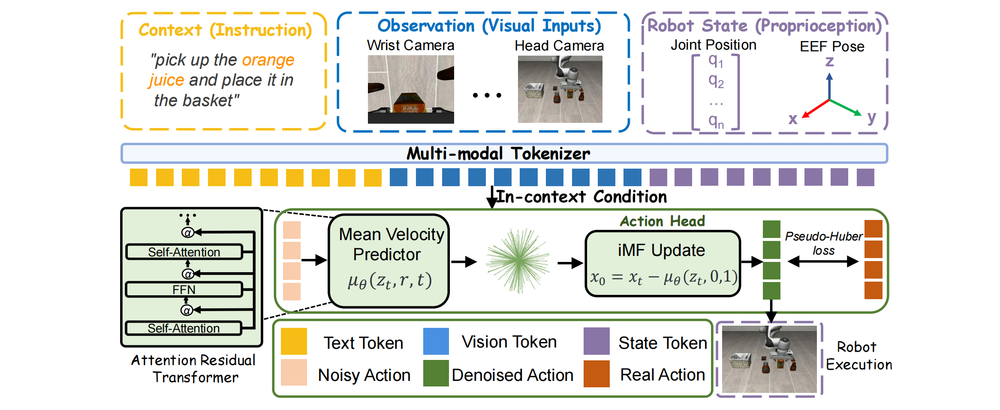
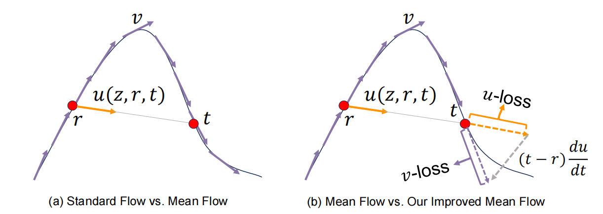
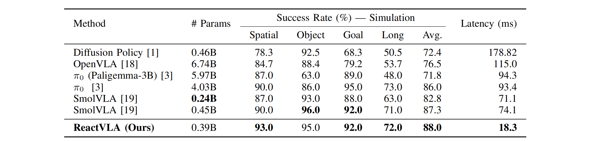
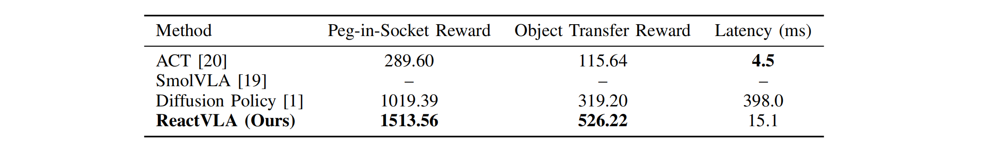
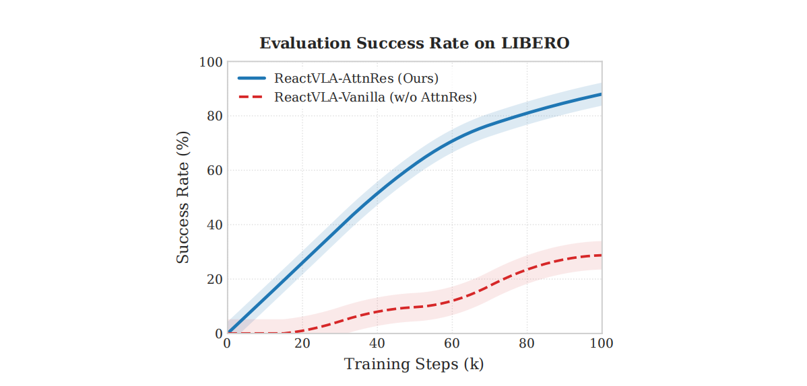
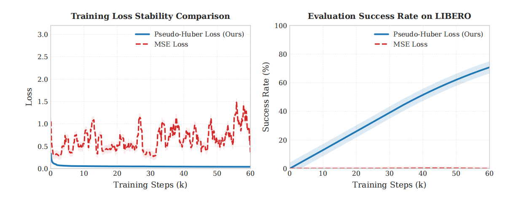
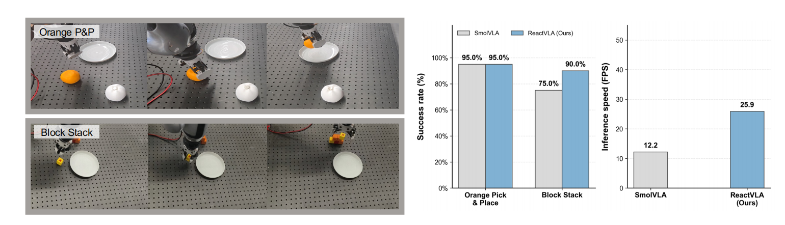

## ReactVLA: Fast and Lightweight Reactive Robot Manipulation via Improved Mean Flow Action Generation

> 论文：https://arxiv.org/pdf/2606.14255

### 一. 概述

**研究动机**：Diffusion / Flow-based VLA 能够生成连续、多模态的 action chunk，但通常需要多次 denoising。多步 action generation 会带来较高推理延迟，降低闭环控制频率，使机器人难以及时应对接触变化、物体运动和执行误差。这个问题在精密插入、堆叠和双臂协作等任务中尤其明显。

论文关注的问题可以概括为：

> 能否让一个轻量级 VLA 使用 **one-to-few-step** 生成高质量 action chunk，同时保留足够强的视觉、语言和机器人状态表征，从而实现低延迟的 reactive control？

**关键矛盾**：普通 Flow Matching 学习的是当前位置的**瞬时速度场**。推理时如果只做一步，相当于用起点处的局部速度近似整段生成轨迹，容易产生较大的积分误差。MeanFlow 改为学习某个时间区间内的**平均速度**，更适合一次跨越较长的生成区间；但 low-step generation 会把更大的生成难度压到单次网络前向中，因此还要求 backbone 在较深网络中充分保留视觉、语言和 proprioception 信息。

**核心思想**：ReactVLA 由两个主要部分组成：

1. **Improved Mean Flow（iMF）Action Generator**：让 action head 预测从当前噪声时间到目标时间之间的平均速度，并通过 JVP correction 在瞬时速度空间中训练，从而支持 one-to-few-step action generation。
2. **Attention Residuals（AttnRes）Transformer**：不再把所有历史层特征简单等权相加，而是让每一层动态选择更有用的历史表示，减轻深层 Transformer 中的多模态表征稀释。

此外，ReactVLA 使用**伪 Huber 损失**代替普通 MSE，降低 JVP 训练过程中大误差和梯度尖峰造成的不稳定。

---

### 二. ReactVLA 整体框架

ReactVLA 在每个闭环控制周期输入：多视角 RGB 图像、自然语言任务指令、机器人状态，然后生成未来的 action chunk：

$$
a_{t:t+H}\sim \pi_\theta(\cdot\mid o_t), \qquad o_t=\{I_t,s_t,l\}.
$$

论文使用：

- 两路视觉输入：agent-view camera 和 wrist camera；
- 视觉编码器：冻结的 SigLip2；
- 语言编码器：SmolVLM 的 text encoder；
- proprioception：8 维 robot state，经线性层编码为一个 state token；
- observation horizon： $n_{obs}=1$ 。
- action horizon： $H=16$ ；
- action dimension： $d_a=7$ ；
- 每轮执行前 $K=8$ 个动作；

多模态条件 token 记为：

$$
C= [ E_{vis}(I_{agent}), E_{vis}(I_{wrist}), E_{text}(l), E_{prop}(s_t) ].
$$

Action Transformer 的完整输入序列为：

$$
X=[\phi(r),\phi(t),W_cC,W_az_t],
$$

其中：

- $t$ 是当前噪声时间；
- $r$ 是希望生成到的目标时间，满足 $r\le t$ ；
- $\phi(r),\phi(t)$ 是 sinusoidal(正弦) time embedding；
- $z_t\in\mathbb R^{H\times d_a}$ 是当前 noisy action trajectory；
- 多模态条件和 noisy action 都投影到 hidden dimension 768。

> **简单理解**：视觉、语言和机器人状态告诉模型“当前任务是什么、场景是什么”； $z_t,r,t$ 告诉 action head“当前 action 有多噪，以及这一步要从哪个时间走到哪个目标时间”。

---

### 三. Improved Mean Flow 如何迁移到动作生成

#### 1. Flow Matching 的 action probability path

设真实 action chunk 为 $x$ ，Gaussian noise 为 $e$ 。ReactVLA 使用线性 probability path：

$$
z_t=(1-t)x+te, \qquad t\in[0,1].
$$

训练时的 conditional velocity target 为：

$$
v_g=\frac{dz_t}{dt}=e-x.
$$

生成时则从 $t=1$ 的纯噪声反向走到 $t=0$ 的 clean action。

普通 Flow Matching 网络主要预测当前点的瞬时速度：

$$
v_\theta(z_t,t\mid C)\approx e-x.
$$

如果将一次 Euler update 直接覆盖整个 $1\rightarrow0$ 区间，相当于假设起点处的瞬时速度能够代表整段轨迹，因此 one-step 误差通常较大。

#### 2. MeanFlow：预测区间平均速度

ReactVLA 不只输入当前时间 $t$ ，还输入目标时间 $r$ ，让网络预测区间 $[r,t]$ 的平均速度：

$$
u(z_t,r,t) = \frac{1}{t-r} \int_r^t v(z_\tau,\tau)d\tau, \qquad 0\le r<t\le1.
$$

从当前状态 $z_t$ 生成到更干净的 $z_r$ 时，更新为：

$$
z_r=z_t-(t-r)u(z_t,r,t).
$$

因此：

- 当 $r\approx t$ 时，平均速度接近局部瞬时速度；
- 当 $r=0,t=1$ 时，模型可以尝试一步从纯噪声生成完整 action chunk；
- 将 $[1,0]$ 划分为几个区间时，同一个模型也支持 few-step inference。

> MeanFlow 的关键不是简单增加一个时间输入，而是要求网络输出能够代表**整个时间区间的有限跨度 transport**，而不是只代表当前位置附近的一小段运动。

#### 3. MeanFlow identity

根据平均速度定义：

$$
(t-r)u(z_t,r,t)=\int_r^t v(z_\tau,\tau)d\tau.
$$

对 $t$ 求导，可以得到：

$$
u(z_t,r,t)+(t-r)\frac{d}{dt}u(z_t,r,t)=v(z_t,t).
$$

于是：

$$
u(z_t,r,t) = v(z_t,t) - (t-r)\frac{d}{dt}u(z_t,r,t).
$$

由于 $u$ 不仅显式依赖时间 $t$ ，还通过 $z_t$ 隐式依赖 $t$ ，因此总导数为：

$$
\frac{d}{dt}u(z_t,r,t) = \frac{\partial u}{\partial z_t}v(z_t,t) + \frac{\partial u}{\partial t}.
$$

这个总导数可以写成 JVP：

$$
\frac{d}{dt}u(z_t,r,t) = \mathrm{JVP} \left( u; (v(z_t,t),0,1) \right).
$$

其中 tangent direction $(v,0,1)$ 表示： $z_t$ 沿瞬时速度 $v$ 变化、 $r$ 保持不变、 $t$ 以速度 1 变化。

#### 4. iMF 的训练形式

ReactVLA 使用同一个网络 $u_\theta$ 表示平均速度，并令：

$$
v_\theta(z_t,t) = u_\theta(z_t,t,t).
$$

当 $r=t$ 时，区间长度收缩到零，平均速度退化为瞬时速度。

接着计算：

$$
\dot u_\theta = \mathrm{JVP} \left( u_\theta; (v_\theta,0,1) \right),
$$

并构造 corrected instantaneous velocity prediction：

$$
V_\theta(z_t,r,t) = u_\theta(z_t,r,t) + (t-r)\mathrm{sg}(\dot u_\theta).
$$

最后让 $V_\theta$ 回归已知的 conditional instantaneous velocity：

$$
v_g=e-x.
$$

这体现了 iMF 的核心思想：

> **网络输出空间是 average velocity $u_\theta$ ，但监督目标位于 instantaneous velocity space。**

与原始 MeanFlow 相比，训练 target 不再把网络自身预测直接当成回归目标，而是回归已知的 $e-x$ ，因此更接近标准监督回归问题。

#### 5. ReactVLA 的时间采样

训练时，ReactVLA 从 Logit-Normal distribution（先从普通高斯分布中采样，再通过 sigmoid 将结果压缩到 $(0,1)$ ）中分别采样 $r,t$ ：

$$
r,t\sim\mathrm{LogitNormal}(\mu=-0.4,\sigma=1.0),
$$

然后排序，使：

$$
0\le r\le t\le1.
$$

此外，以 0.5 的概率强制设置：

$$
r=t.
$$

这样训练数据中一半是有限区间 MeanFlow target，另一半退化为普通 instantaneous Flow Matching target。

> **这一点对迁移到 FastWAM 很重要**：ReactVLA 并不是只训练长区间平均速度，而是显式混入大量 $r=t$ 的局部速度样本，用于保留普通 Flow Matching 能力并稳定训练。

#### 6. Action-space 的具体处理

ReactVLA 直接在**归一化的连续动作轨迹空间 $x\in\mathbb R^{16\times7}$** 中训练，不使用额外 action tokenizer 或 latent action encoder，训练和生成过程都在归一化后的 action space 中完成，最终输出再 unnormalize 为机器人原生控制命令。

因此，ReactVLA 对 iMF 的 action adaptation 本身相对直接，主要变化是：

* 图像 sample x → 替换为连续 action chunk x
* 图像条件 → 替换为视觉 + 语言 + proprioception 条件
* iMF average-velocity network → 替换为 conditional Action Transformer

---

### 四. Attention Residuals：保留多模态条件信息

ReactVLA 认为 low-step generation 会提高单次网络前向的难度，因此只修改 action objective 还不够，还需要更强的条件表示。

#### 1. 普通 residual accumulation 的问题

PreNorm Transformer 的普通 residual update 为：

$$
h_l=h_{l-1}+f_{l-1}(h_{l-1}).
$$

展开后：

$$
h_l=h_1+\sum_{i=1}^{l-1}f_i(h_i).
$$

也就是说，**所有历史层输出都以固定权重累加**。网络越深，早期视觉、语言和状态特征可能在多次无差别叠加中逐渐被稀释，新层相对于累积状态的贡献也可能越来越弱。

#### 2. AttnRes 的动态深度路由

ReactVLA 的 AttnRes 会缓存前面各层的输出。对于第 $l$ 层，它不再只接收第 $l-1$ 层，而是**从所有历史表示中加权选择**：

$$
h_l= \sum_{i=0}^{l-1}\alpha_{i\rightarrow l}v_i, \qquad \sum_{i=0}^{l-1}\alpha_{i\rightarrow l}=1.
$$

其中：

- $v_i$ ：Transformer 第 $i$ 个历史层产生的 hidden representation；
- $\alpha_{i\rightarrow l}$ ：第 $l$ 层分配给第 $i$ 个历史表示的权重；
- $h_l$ ：送入第 $l$ 层的融合表示。

权重通过 layer-specific learnable query 得到：

$$
e_{i\rightarrow l} = w_l^\top\mathrm{RMSNorm}(v_i),
$$

$$
\alpha_{i\rightarrow l} = \frac{\exp(e_{i\rightarrow l})} {\sum_{j=0}^{l-1}\exp(e_{j\rightarrow l})}.
$$

> **RMSNorm 是什么？**
>
> 对于一个 hidden vector：

$$
x=[x_1,x_2,\dots,x_d]\in\mathbb R^d,
$$

> RMSNorm 首先计算均方根：

$$
\mathrm{RMS}(x) = \sqrt{ \frac{1}{d}\sum_{j=1}^{d}x_j^2+\epsilon }.
$$

> 然后归一化并乘以可学习的缩放参数 $\gamma$ ：

$$
\mathrm{RMSNorm}(x) = \gamma\odot \frac{x} {\sqrt{ \frac{1}{d}\sum_{j=1}^{d}x_j^2+\epsilon }}.
$$

> ReactVLA 中：

$$
d=768,\qquad \epsilon=10^{-6}.
$$

> **RMSNorm 归一化可以避免某个历史层仅仅因为 hidden vector 数值幅度较大，就获得更高的路由分数**。这样更多反映表示的方向和内容是否重要，而不是它的绝对数值大小。

简单理解：

> 每一层不再默认把所有历史层等权相加，而是根据当前输入动态检索“**哪几层保存的信息最适合当前 action prediction**”。

ReactVLA 的 action backbone 包含 16 个 AttnRes Transformer blocks，hidden size 为 768，并使用：

- 8 个 query heads 和 8 个 key-value heads；

- dropout rate 为 0.05。

- RoPE，base frequency 为 10,000；

  > **RoPE 是 Rotary Position Embedding，旋转位置编码**。它不会像传统位置编码那样把一个位置向量直接加到 token embedding 上，而是在 self-attention 中，根据 token 位置旋转 Query 和 Key 的部分维度。
  >
  > **第一步：给不同维度设置不同频率**
  >
  > 将每个 attention head 的 96 个维度两两分组：

$$
(0,1),(2,3),\dots,(94,95).
$$

  > 第 $k$ 组的旋转频率为：

$$
\omega_k = \frac{1}{B^{2k/d_h}} = 10000^{-2k/96}, \qquad k=0,1,\dots,47.
$$

  > **第二步：根据 token 位置计算旋转角**
  >
  > 假设当前 token 的序列位置为 $p$ ，那么第 $k$ 组维度的旋转角度为：

$$
\theta_{p,k}=p\omega_k.
$$

  > **第三步：旋转 Query 和 Key**
  >
  > 设某个 attention head 中，Query 的第 $k$ 对维度为：

$$
\begin{bmatrix} q_{2k}\\ q_{2k+1} \end{bmatrix}.
$$

  > 经过 RoPE 后：

$$
\begin{bmatrix} q'_{2k}\\ q'_{2k+1} \end{bmatrix} = \begin{bmatrix} \cos\theta_{p,k} & -\sin\theta_{p,k}\\ \sin\theta_{p,k} & \cos\theta_{p,k} \end{bmatrix} \begin{bmatrix} q_{2k}\\ q_{2k+1} \end{bmatrix}.
$$

  > 展开就是：

$$
q'_{2k} = q_{2k}\cos\theta_{p,k} - q_{2k+1}\sin\theta_{p,k},
$$

  > Key 也进行相同的旋转：

$$
k'_p=R_p k_p.
$$

  > Value 通常不使用 RoPE。
  >
  > **为什么旋转可以表示位置？**
  >
  > 假设两个 token 的位置分别为 $p$ 和 $q$ ，旋转后的 attention 内积满足：

$$
(R_pq_p)^\top(R_qk_q) = q_p^\top R_{q-p}k_q.
$$

  > 因此，最终 attention score 自然依赖：

$$
q-p,
$$

  > 也就是两个 token 的**相对位置**，而不是只依赖各自的绝对位置。

- SwiGLU FFN，intermediate dimension 为 2048；

  > **SwiGLU 不只是一个普通激活函数，而是一种带门控机制的 FFN 结构（Swish-Gated Linear Unit）**。
  >
  > 其中真正的基础激活函数是 SiLU / Swish：

$$
\mathrm{SiLU}(x) = x\sigma(x) = \frac{x}{1+e^{-x}}.
$$

  > 对于输入 hidden state：

$$
x\in\mathbb R^{768},
$$

  > SwiGLU 首先进行两条不同的线性投影：

$$
g=xW_g+b_g,\\ u=xW_u+b_u.
$$

  > 在 ReactVLA 中，两条投影通常进入 FFN intermediate dimension：

$$
g,u\in\mathbb R^{2048}.
$$

  > 然后对其中一条使用 SiLU，并与另一条逐元素相乘：

$$
h = \mathrm{SiLU}(g)\odot u.
$$

  > 可以理解为：

$$
\text{输出特征} = \text{候选内容} \times \text{软门控权重}.
$$

  > 最后投影回原来的 hidden size：

$$
\mathrm{SwiGLU}(x) = \left[ \mathrm{SiLU}(xW_g+b_g) \odot (xW_u+b_u) \right]W_d+b_d.
$$

  > 对应维度是：

$$
768 \xrightarrow[]{W_g,W_u} 2048 \xrightarrow[]{\text{逐元素门控}} 2048 \xrightarrow[]{W_d} 768.
$$

#### 3. AttnRes 与 iMF 的关系

AttnRes 不是 iMF 必需组成部分，而是 ReactVLA 为 low-step action generation 额外设计的 backbone enhancement。论文的解释是：当推理步数降低后，每次 action model evaluation 必须一次性完成更多生成工作，因此更依赖完整、稳定的 multimodal context。

> 对于 FastWAM，iMF 可以先独立迁移到现有 Action DiT；AttnRes 是否需要迁移，应当在 iMF baseline 跑通后单独验证，避免同时修改 objective 和 backbone 导致无法判断收益来源。

---

### 五. Pseudo-Huber Loss（伪 Huber 损失）：稳定 JVP 训练

ReactVLA 不使用普通 MSE（ $\left\|V_\theta - v_g\right\|^2$ ），而是用 Pseudo-Huber Loss 监督修正后的瞬时速度：

$$
e=V_\theta(z_t,r,t)-v_g,\\ \mathcal L(\theta) = \frac{1}{D} \sum_{d=1}^{D}\delta^2 \left( \sqrt{1+\left(\frac{e_d}{\delta}\right)^2}-1 \right).
$$

> 文中默认 $\delta=1$

Pseudo-Huber 与 MSE 的最优解相同，都是让：

$$
V_\theta(z_t,r,t)\rightarrow v_g.
$$

两者的区别主要在训练过程。MSE 的梯度与误差成正比：

$$
\frac{\partial \mathcal L_{\mathrm{MSE}}}{\partial e_d}=e_d,
$$

因此误差越大，参数更新也越剧烈。而 Pseudo-Huber 的梯度为：

$$
\frac{\partial \mathcal L}{\partial e_d} = \frac{e_d} {\sqrt{1+(e_d/\delta)^2}},
$$

当误差很大时，其梯度幅度最多接近 $\delta$ ，不会无限增大。

**训练初期， $u_\theta$ 和 $v_\theta$ 还不准确，JVP correction 可能产生很大的前向值，使部分样本的 transport error 异常增大。若使用 MSE，这些异常样本会产生很大的梯度，导致 loss 尖峰甚至训练不稳定；Pseudo-Huber 会限制它们对参数更新的影响。**

同时，当误差较小时，Pseudo-Huber 近似于 MSE：

$$
\mathcal L_{\text{Pseudo-Huber}} \approx \frac{1}{2}e_d^2.
$$

因此它可以概括为：

> **大误差时限制更新幅度，避免 JVP 异常值破坏训练；小误差时保持类似 MSE 的精细拟合能力。**

---

### 六. 训练流程

输入：真实 action chunk $x$ 、多模态 context $C$ 、模型参数 $\theta$

1. 编码多模态条件：

$$
h_{ctx}=\mathrm{AttnResTransformer}_\theta(C)
$$

2. 采样 Gaussian noise：

$$
e\sim\mathcal N(0,I)
$$

3. 从 Logit-Normal distribution 采样 $r,t$ ，排序后保证 $r\le t$ ；以 0.5 概率令 $r=t$ 。

4. 构造 noisy action：

$$
z_t=(1-t)x+te
$$

5. 构造已知的 instantaneous velocity target：

$$
v_g=e-x
$$

6. 令同一个 average-velocity network 在零长度区间预测瞬时速度：

$$
v_\theta=u_\theta(z_t,t,t\mid h_{ctx})
$$

7. 计算区间平均速度及其 JVP：

$$
u_\theta=u_\theta(z_t,r,t\mid h_{ctx})
$$

$$
\dot u_\theta = \mathrm{JVP} \left( u_\theta, (z_t,r,t), (v_\theta,0,1) \right)
$$

8. 构造 corrected velocity prediction：

$$
V_\theta = u_\theta+(t-r)\mathrm{sg}(\dot u_\theta)
$$

9. 使用 Pseudo-Huber loss：

$$
\mathcal L = \mathrm{PseudoHuber}_\delta (V_\theta-v_g)
$$

10. 更新模型参数 $\theta$ 。

---

### 七. 推理流程

#### 1. Few-step action generation

推理从纯 Gaussian noise 开始：

$$
z_1\sim\mathcal N(0,I).
$$

将时间区间划分为：

$$
1=t_0>t_1>\cdots>t_N=0.
$$

每一步使用平均速度进行 Euler-style update：

$$
z_{t_{i+1}} = z_{t_i} - (t_i-t_{i+1}) u_\theta(z_{t_i},t_{i+1},t_i\mid C).
$$

到达 $t=0$ 后， $z_0$ 就是预测的 normalized action trajectory。

#### 2. 论文实际使用的推理步数

在 LIBERO 和 RoboIMI 仿真实验中，ReactVLA 使用 **2-step inference**：

$$
1.0\rightarrow0.5\rightarrow0.0.
$$

在真实机器人实验中，为了保证动作平滑和稳定，论文使用 **5-step inference**。

理论上的 one-step 形式为：

$$
\hat x = z_1-u_\theta(z_1,0,1\mid C).
$$

但需要注意：

> 论文虽然反复表述 ReactVLA 支持 one-to-few-step generation，但主要定量实验使用的是仿真 2-step 和真实机器人 5-step，没有单独汇报 1-step success rate，也没有给出 1-step / 2-step / 5-step 的系统对比。

#### 3. Receding-horizon execution

模型预测 16 步 action trajectory，但每个闭环周期只执行前 8 步：

$$
\hat a_{1:8}=z_{0,0:7}.
$$

当这 8 个动作执行完后，重新读取最新 observation，再生成新的 action chunk。该过程属于标准的 receding-horizon closed-loop control。

---

### 八. 实验结果

论文主要验证三个问题：

1. iMF + AttnRes 能否在少步推理下保持 action quality？
2. Pseudo-Huber 和 AttnRes 是否能改善训练稳定性？
3. 降低 action generation latency 是否能提升 reactive control？

#### 1. LIBERO

ReactVLA 将 LIBERO-Spatial、LIBERO-Object、LIBERO-Goal 和 LIBERO-Long 四个 suite 的 demonstration 合并，在 40 个任务上进行统一 multi-task training。

ReactVLA 使用 2-step action generation，在保持较高成功率的同时显著降低 policy latency。

#### 2. RoboIMI 双臂精密操作

RoboIMI 是论文自建的 MuJoCo 双臂仿真平台，包含：

- **Peg-in-Socket**：一只手抓取 peg，另一只手持 socket，完成动态双臂插入；
- **Object Transfer**：一只手抓取物体并交接给另一只手。

每个任务评估 100 个 rollouts，指标是 cumulative reward（累积回报），而不是成功率。

论文认为，ReactVLA 的较低延迟允许它在相同物理时间内完成更多闭环更新，因此在双臂协调和精密插入中进展更快、更稳定。

#### 3. AttnRes 消融

论文将完整 ReactVLA 与普通 residual connection 的 ReactVLA-Vanilla 比较：

- AttnRes 版本更快收敛，并最终达到 88.0% LIBERO success rate；
- Vanilla residual 版本最终**只有 28.7%**。

这说明在论文的轻量级 16-layer action backbone 中，dynamic depth-wise routing 对保持多模态条件信息非常重要。

#### 4. Pseudo-Huber 消融

**使用 MSE 时，训练 loss 出现频繁尖峰，LIBERO success rate 基本无法正常提升；使用 Pseudo-Huber 后，loss 更平滑，success rate 稳定增长。**

该结果说明 ReactVLA 的 iMF implementation 对 loss 形式比较敏感。迁移到 FastWAM 时，如果当前 iMF 使用 MSE 出现 loss spike、NaN 或梯度异常，Pseudo-Huber 应当作为优先检查项。

#### 5. 真实机器人实验

论文在 Diana 7 单臂机器人上测试两个任务（Orange Pick-and-Place 和 Block Stack） ，每个任务收集 50 条 teleoperation demonstrations，并评估 20 次：

两种方法在简单的 Orange Pick-and-Place 上相同，但 ReactVLA 在更精细的 Block Stack 上更好。论文将其归因于较低延迟带来的更及时闭环修正。

需要注意，真实机器人中 ReactVLA 使用的是 5-step，而不是 1-step 或 2-step。

---

### 九. 局限性

1. **没有充分验证严格 1-step 性能**：论文主要结果采用仿真 2-step、真实机器人 5-step，没有充分验证严格 1-step 性能。
2. **整体增益难以完全归因于 iMF**：完整方法同时修改 iMF objective、AttnRes backbone 和 Pseudo-Huber loss，但没有给出标准 FM vs. iMF 的干净对照。
3. **AttnRes 消融差距过大**：普通 residual 版本从 88.0% 降至 28.7%，说明训练结果高度依赖 backbone 设计，也使得单独判断 iMF 的贡献比较困难。

---

### 十. 总结

ReactVLA 是一个面向低延迟 closed-loop manipulation 的轻量 VLA。它将 improved Mean Flow 迁移到连续 action chunk generation，并在此基础上，使用 AttnRes 保留深层 Transformer 中的多模态条件信息，使用 Pseudo-Huber 抑制 iMF/JVP 训练中的大误差和梯度不稳定。

对 FastWAM 而言，最值得直接借鉴的是：**iMF 迁移、时间采样、Pseudo-Huber loss**。AttnRes 更适合作为后续独立变量，而不是与 iMF 同时迁移。
