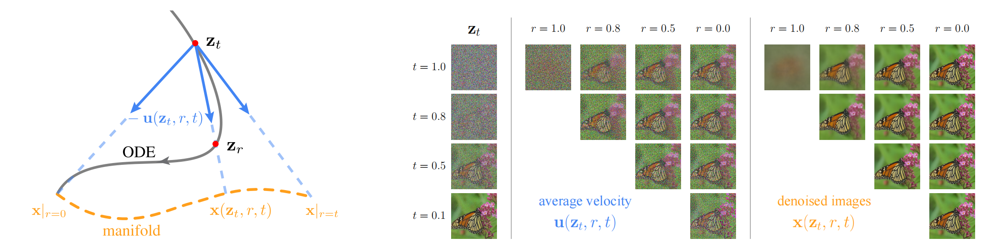

## One-step Latent-free Image Generation with Pixel Mean Flows

> 论文：https://arxiv.org/pdf/2601.22158 
> 代码：https://github.com/Lyy-iiis/pMF

### 一. 研究动机

现有图像生成模型通常有两个重要设计：

1. **multi-step sampling**：通过多步 denoising，把复杂生成过程拆成许多小步；
2. **latent space generation**：先用 VAE tokenizer 把图像压缩到 latent space，再在 latent space 中生成，最后通过 decoder 还原到像素图像。

这两个设计都能降低建模难度，但也带来额外开销。随着 MeanFlow / iMF 这类 one-step 方法的发展，多步采样的必要性正在下降；同时，JiT 等工作也说明 Transformer 可以直接在 pixel space 中建模。因此，一个自然问题是：

> 能不能直接**从噪声一步生成像素图像**，而不依赖 latent tokenizer？

但这件事并不简单。one-step generation 本身要求模型**一次完成大跨度生成**；pixel-space generation 又要求模型**直接处理高维像素空间**。把两者合在一起，对网络容量和训练目标都提出了更高要求。

pMF 的目标就是：**在不使用 latent tokenizer 的情况下，让模型直接在像素空间完成 one-step image generation。**

---

### 二. 核心思想

pMF 的核心思想是：**网络输出空间和 loss 空间可以分开。**

iMF 中，模型直接预测 average velocity $u_\theta$ ，再通过 MeanFlow identity 转换成 $V_\theta$ ，最后在 velocity space 中计算 loss。pMF 认为，在 pixel space 中直接预测 $u_\theta$ 很困难，因为 $\boldsymbol{u}$ **本身更像 noisy image，维度高、噪声重，不太落在自然图像流形上，不容易被 Transformer 学好**。

因此 pMF 改成：**网络不直接输出 average velocity，而是输出一个更像 clean image 的量 $x_\theta$**。这个 $x_\theta$ 可以理解为 denoised image prediction，**它更接近图像数据流形，视觉上更接近我们能看懂的图像，因此更容易学习**。

但是，pMF 并没有把训练退化成普通的图像回归。它仍然保留 MeanFlow / iMF 的训练框架：先把网络输出的 $x_\theta$ 转换成 average velocity $u_\theta$ ，再转换成 instantaneous velocity 形式的 $V_\theta$ ，最后用 Flow Matching 的 velocity target 监督。

可以简单记为：

* iMF：网络输出 average velocity $u_θ$ ，转成 $V_θ$ ，loss 在 velocity space 中计算
* pMF：网络输出 denoised image $x_θ$ ，先把 $x_θ$ 转成 $u_θ$ ，再转成 $V_θ$ ，loss 仍然在 velocity space 中计算

也就是说：

> pMF 让网络输出更容易学习的 clean image / denoised image，但训练约束仍然保持 flow-consistent。

---

### 三. 模型方法

pMF 建立在 iMF 和 JiT 的基础上。它主要做了三件事：**定义 denoised image field、建立 $x \rightarrow u \rightarrow V$ 的转换、在 pixel prediction 上加入 perceptual loss。**

#### 1. 从 average velocity 到 denoised image field

普通 Flow Matching 使用线性路径：

$$
z_t=(1-t)x+t\epsilon
$$

其中 $x$ 是真实图像， $\epsilon$ 是噪声。MeanFlow 定义从 $r$ 到 $t$ 的 average velocity：

$$
u(z_t,r,t) = \frac{1}{t-r} \int_r^t v(z_\tau,\tau)d\tau
$$

pMF 在此基础上定义一个新的量：

$$
x(z_t,r,t) = z_t-t\cdot u(z_t,r,t)
$$

这个 $x(z_t,r,t)$ 可以理解为由 average velocity 诱导出来的 denoised image field。它不是普通意义上的单一 clean image，而是一个依赖 $z_t,r,t$ 的二维时间场。论文认为， $\boldsymbol{x(z_t,r,t)}$ **更接近低维图像流形，所以比直接预测 $u$ 更容易**。

> **为什么 $x$ -prediction 更容易？**
>
> pMF 认为，直接预测 average velocity $u$ 很难，**因为 $u$ 本质上是一个速度张量，不是图像本身，它表示“从 $r$ 到 $t$ 这段轨迹平均应该怎么移动”，所以显示出来不像自然图像**。相比之下，作者定义
>
> $\displaystyle x(z_t,r,t)=z_t-t\cdot u(z_t,r,t)$
>
> **这个 $x$ 是在用平均速度把当前 noisy image 往 denoised image 方向还原，因此更像 denoised image**。特别地，当 $r=0$ 时， $x$ 正好等于 ODE 终点的 clean image；当 $r=t$ 时， $x$ 退化为常见的 denoised image prediction。对于中间情况 $0<r<t$ ，论文没有给出严格证明，而是通过 Figure 1 的可视化说明：** $x$ 通常也比 $u$ 更像干净或略模糊的图像**。因此，pMF 选择让网络预测更接近图像流形的 $x$ ，再把 $x$ 转换成 $u$ 和 $V$ 来计算 velocity loss。
>
> 

#### 2. $x \rightarrow u \rightarrow V$ 的转换

pMF 让网络直接输出：

$$
x_\theta(z_t,r,t)=net_\theta(z_t,r,t)
$$

然后通过下面的关系把它转换成 average velocity：

$$
u_\theta(z_t,r,t) = \frac{1}{t} \left( z_t-x_\theta(z_t,r,t) \right)
$$

> 这一步来自 pMF 定义的： $x=z_t-t\cdot u$

接下来，pMF 复用 iMF 的 MeanFlow identity，把 $u_\theta$ 转成 instantaneous velocity 形式的预测：

$$
V_\theta = u_\theta + (t-r)\mathrm{JVP}_{sg}
$$

最后用普通 Flow Matching 的 velocity target 监督：

$$
v=\epsilon-x
$$

训练损失为：

$$
L_{pMF} = \left\| V_\theta-v \right\|^2
$$

所以 pMF 的整体链路是：

```text
网络输出 xθ
→ 转换成 average velocity uθ
→ 通过 MeanFlow identity 转换成 Vθ
→ 用 velocity target ε-x 监督
```

这就是论文中说的：**prediction space 是 $x$ ，loss space 是 $v$**。

#### 3. Perceptual Loss（感知损失）

因为 pMF 的网络直接输出像素空间中的 $x_\theta$ ，也就是 denoised image-like prediction，所以可以额外加入 perceptual loss。它不是直接比较像素差异，而是**先把 $x_\theta$ 和真实图像 $x$ 输入一个预训练视觉模型，例如 VGG 或 ConvNeXt，再比较它们中间层特征的差异**。

常见形式可以写成：

$$
L_{perc} = \sum_l \left\| \phi_l(x_\theta)-\phi_l(x) \right\|^2
$$

其中 $\phi_l$ 表示预训练视觉模型第 $l$ 层的特征。相比普通像素损失，perceptual loss 更关注边缘、纹理和语义结构等视觉感知层面的相似性。

pMF 的总损失为：

$$
L = L_{pMF} + \lambda L_{perc}
$$

其中 $L_{pMF}$ 保证生成过程符合 MeanFlow / velocity 约束， $L_{perc}$ 则**让网络输出的 $x_\theta$ 在视觉效果上更接近真实图像**。实际训练中，perceptual loss 可以只在噪声较低时使用，因为高噪声下的 $x_\theta$ 可能本来就较模糊，不适合强行和 clean image 做感知特征对齐。

---

### 四. 训练流程

pMF 的训练流程可以简化为下面几步。

#### 1. 采样图像、噪声和时间

输入真实图像 $x$ ，采样噪声 $\epsilon\sim\mathcal{N}(0,I)$ ，采样时间 $t,r$ ，加噪得到当前时间的带噪数据 $z_t$ ：

$$
z_t=(1-t)x+t\epsilon
$$

其中 $t$ 是当前噪声时间， $r$ 是目标时间，满足： $0\le r\le t\le 1$

#### 2. 网络直接预测 denoised image

pMF 的网络不直接预测 velocity，而是直接输出：

$$
\begin{aligned}
x_\theta(z_t,r,t)&=\operatorname{net}_\theta(z_t,r,t),\\
x_\theta(z_t,t,t)&=\operatorname{net}_\theta(z_t,t,t)
\end{aligned}
$$

这个输出可以理解为当前 noisy input $z_t$ 对应的 denoised image-like prediction。

#### 3. 将 $x_\theta$ 转换成 average velocity

根据 $x=z_t-t\cdot u$ ，得到：

$$
\begin{aligned}
u_\theta(z_t,r,t)&=\frac{z_t-x_\theta(z_t,r,t)}{t},\\
v_\theta(z_t,t)&=u_\theta(z_t,t,t)=\frac{z_t-x_\theta(z_t,t,t)}{t}
\end{aligned}
$$

这一步把网络输出的 denoised image 转换成 MeanFlow 需要的 average velocity。

#### 4. 计算 JVP 并构造 $V_\theta$

和 iMF 一样，pMF 使用 MeanFlow identity：

$$
V_\theta = u_\theta + (t-r)\mathrm{JVP}_{sg}(u_\theta;v_\theta)
$$

其中 JVP 用于计算 $u_\theta$ 随当前时间和当前位置变化的趋势，sg 表示 stop-gradient，用来避免高阶梯度导致优化困难。

#### 5. 计算 pMF loss

用普通 Flow Matching 的 velocity target $\epsilon-x$ 作为监督，计算：

$$
L_{pMF} = \left\| V_\theta-(\epsilon-x) \right\|^2
$$

#### 6. 加入 perceptual loss

因为网络直接输出 $x_\theta$ ，可以额外计算 perceptual loss $L_{perc}(x_\theta,x)$ ，总损失为：

$$
L = L_{pMF} + \lambda L_{perc}
$$

论文中指出，perceptual loss 可以只在噪声较低时使用，也就是当 $t\le t_{thr}$ 时使用。因为如果噪声太高， $x_\theta$ 本身可能较模糊，强行做感知约束未必合适。

---

### 五. 推理流程

pMF 推理时也是 one-step 形式。由于网络输出的是像素图像 $x_\theta$ ，所以推理过程更直观。

对于 one-step generation：

1. 从噪声分布采样：

   $$z_1\sim\mathcal{N}(0,I)$$

2. 设置目标区间：

   $$r=0,\quad t=1$$

3. 网络直接预测像素图像：

   $\displaystyle x_\theta(z_1,0,1)$

> 这和 iMF 的推理略有不同：iMF 输出的是 average velocity，再用 $z_0=z_1-u_\theta$ 得到图像；pMF 直接输出 denoised image $x_\theta$ 。因此论文称它具有 “what-you-see-is-what-you-get” 的性质。

如果使用 few-step，也可以按照不同 $(r,t)$ 区间多次更新，但 pMF 的核心目标是 one-step、latent-free generation。

---

### 六. 对 Fast-WAM 的启发

pMF 对 Fast-WAM 最重要的启发是：**当 1-step 生成失败时，问题可能不只是 average velocity 学得不好，也可能是网络直接预测 velocity / average velocity 本身不够容易。可以让网络直接输出更接近数据本身的对象，再通过转换保持 flow 约束。**

pMF 最值得迁移的思路是：**从 velocity prediction 改成 clean action prediction**

> 对应到 Fast-WAM，可以把 pMF 的 $x$ -prediction 改成 **action prediction**：
>
> * pMF：网络直接输出 clean image $x_θ$
> * Fast-WAM：action expert 直接输出 clean action chunk â
>
> 然后再把 clean action prediction 转换成 average velocity：
>
> $\displaystyle u_\theta = \frac{z_t-\hat a}{t}$
>
> 最后仍然用 iMF / MeanFlow 的 velocity loss 来训练：
>
> $$L = \left\| V_\theta-(\epsilon-a) \right\|^2$$
>
> 这样模型输出的是更容易解释、更接近执行目标的 clean action，但训练约束仍然保持 flow-consistent。

pMF 来自图像生成，迁移到 action generation 时需要注意：

1. **action chunk 不一定有类似 image manifold 的高维结构。** 
   图像像素空间很高维，clean image 明显比 noisy velocity 更接近低维流形；action space 维度低得多，这个优势可能没图像中那么明显。
3. **JVP 训练成本较高。** 
   pMF 仍然基于 iMF，需要 JVP。如果 Fast-WAM action expert 很大，训练成本需要评估。
4. **动作的“感知损失”没有图像中那么直接。** 
   pMF 中 perceptual loss 很自然，因为输出是图像；迁移到 action 时，需要考虑是否使用 action smoothness、teacher distillation、task success proxy 等替代约束。

---

### 七. 总结

pMF 可以理解为：**在 iMF 的 one-step MeanFlow 框架上，把网络输出从 average velocity 改成 denoised image，同时通过 $x\rightarrow u\rightarrow V$ 的转换，继续在 velocity space 中训练。**

对 Fast-WAM 来说，pMF 的关键启发是：

> 如果 1-step velocity prediction 很难，可以让 action expert 直接预测 clean action / residual action，但仍然通过 MeanFlow-style velocity loss 保持生成式约束。

因此，pMF 可能比 iMF 更适合做 Fast-WAM 的低成本实验：先把 one-step action head 的输出目标从 velocity 改成 clean action，再观察是否能缓解 inference steps = 1 时的性能下降。
