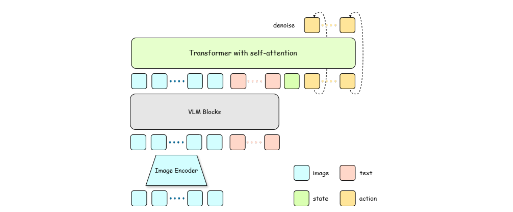
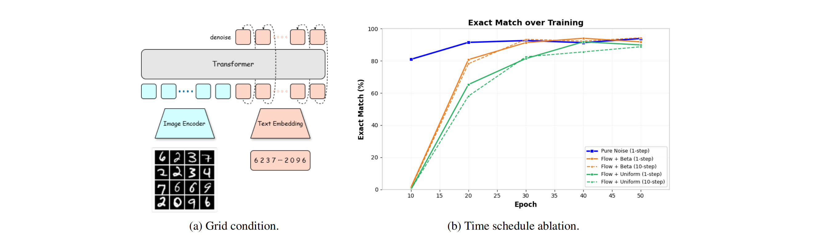
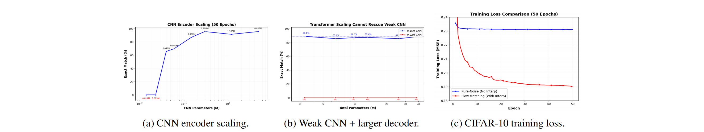
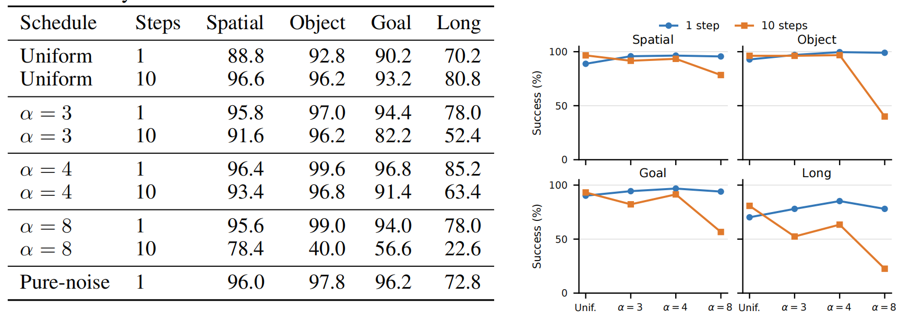
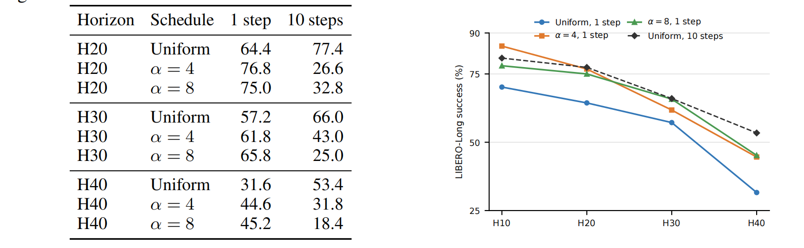
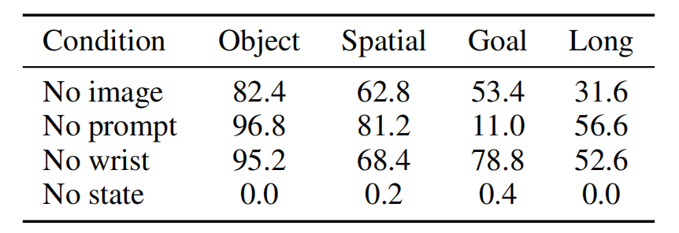
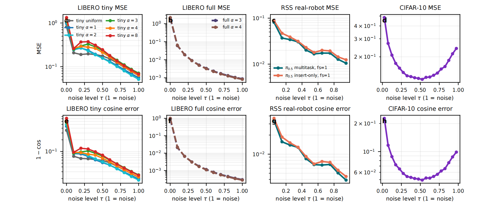

## Let It Be Simple: One-Step Action Generation for Vision-Language-Action Models

> 论文：https://arxiv.org/pdf/2606.05737

### 一. 概述

**研究动机**：现有 diffusion / flow-based VLA 通常沿用图像生成的思路，从高斯噪声开始，通过多次 denoising 或 ODE integration 生成 action chunk。为了实现一步生成，视觉生成领域往往需要 consistency training、distillation、MeanFlow 等复杂机制，**学习跨越较大时间区间的一步映射（例如学习平均速度）**。论文认为，VLA 动作生成与图像生成存在一个关键区别：

- 图像生成通常是“相对有限的条件 → 高维、复杂图像”；
- VLA 是“丰富的图像、语言和 robot state → 低维 action chunk”。

如果视觉语言主干已经充分理解当前场景和任务，那么**条件动作分布可能更加集中**，不同候选动作对应的速度方向冲突更小。因此，**学到的 marginal velocity field 可能更接近直线**。此时，action head 不一定需要显式学习区间平均速度，而可以**直接使用噪声端预测的局部速度进行一步生成**。

> **为什么局部速度也能用于一步生成？**
> 对单个样本，Flow Matching 的条件路径是直线；面对整个数据分布时，模型在每个位置学习可能速度的条件均值 $v^*(x,t,c) = \mathbb E[x_1-x_0\mid x_t=x,t,c]$ 。如果给定条件后仍对应许多不同动作，这些速度的条件均值会随位置变化，形成弯曲的 marginal flow，需要多步积分。Let It Be Simple 认为 VLA 的条件信息足够丰富、动作目标足够紧凑，因此条件动作分布更加集中，速度方向之间的冲突较小，学到的速度场更接近直线，使噪声端的局部速度可以近似整段位移，从而支持一步生成。

**核心思想**：一步推理只在**纯噪声端**调用一次模型，因此**噪声端附近的速度预测精度最重要**。论文保持标准 Flow Matching 的 velocity prediction 和训练目标不变，**只将训练时间采样向高噪声区域偏移**，使模型更集中地学习 one-step inference 真正使用的位置。

---

### 二. 模型方法

#### 1. 标准 Conditional Flow Matching

论文采用以下时间方向：

- \(t=0\)：pure noise；
- \(t=1\)：clean action。

给定真实动作 \(x_1\) 和噪声 \(x_0\sim\mathcal N(0,I)\)，构造：

\[
x_t=t x_1+(1-t)x_0.
\]

对应的 conditional velocity 为：

\[
v_g=x_1-x_0.
\]

模型预测普通瞬时速度：

\[
v_\theta(x_t,t,c),
\]

并采用标准 MSE：

\[
\mathcal L_{\mathrm{CFM}}
=
\mathbb E_{t,x_0,x_1,c}\left[
\left\|v_\theta(x_t,t,c)-(x_1-x_0)\right\|_2^2
\right].
\]

#### 2. High-Noise Time Shift

先采样：

\[
u\sim U(0,1),
\]

再进行时间偏移：

\[
t
=
\frac{u}{1+(\alpha-1)(1-u)},
\qquad \alpha>1.
\]

由于正文中 \(t=0\) 是 pure noise，\(\alpha>1\) 会把样本向高噪声端移动。例如 \(u=0.5\) 时：

\[
\alpha=1\Rightarrow t=0.5,
\qquad
\alpha=4\Rightarrow t=0.2.
\]

因此模型会看到更多高噪声 action，更充分地训练：

\[
v_\theta(x_0,0,c),
\]

即一步推理实际使用的速度预测。

> 该偏移并非越强越好。训练过度集中在噪声端，会削弱中间时间的速度精度，因此可能提升 one-step，却损害 ten-step decoding。

#### 3. 模型架构

论文采用“**强 condition encoder + 轻量 action decoder**”的结构，整体基于 OpenPI：

- SigLIP 编码视觉输入；
- PaliGemma / Gemma 融合视觉与语言 token；
- robot state 作为额外条件；
- 轻量 Transformer action head 接收 condition、time 和 noisy action token，并输出 velocity。

论文使用两种规模：

| 模型 | Condition encoder | Action head |
|---|---|---|
| Tiny (210M + 30M) | 截取的 SigLIP + 4 层 Gemma Tiny | 4 层 Transformer |
| Full (1.4B + 30M) | 完整 SigLIP + 4 层 PaliGemma | 4 层 Transformer |

Action head 的主要配置为：4 层、hidden width 768、12 个 attention heads、FFN dimension 3072。OpenPI 使用 32 维统一 action interface，LIBERO 只有 7 个真实动作维度；tiny 主实验只监督这 7 个物理维度。

论文还使用 **Pure-noise training** 作为极端对照：始终输入独立高斯噪声并直接预测 clean action。它可以测试条件是否足以直接决定动作，但不再支持普通多步 flow decoding。

---

### 三. 训练流程

输入：图像与语言条件 \(c\)、robot state、真实 action chunk \(x_1\)

1. 采样高斯噪声：
   $$
   x_0\sim\mathcal N(0,I).
   $$

2. 采样基础时间：
   $$
   u\sim U(0,1).
   $$

3. 使用 \(\alpha\) 将时间向高噪声端偏移：
   $$
   t
   =
   \frac{u}{1+(\alpha-1)(1-u)}.
   $$

4. 构造 noisy action：
   $$
   x_t=t x_1+(1-t)x_0.
   $$

5. 模型预测瞬时速度：
   $$
   \hat v=v_\theta(x_t,t,c).
   $$

6. 使用标准 Flow Matching loss：
   $$
   \mathcal L
   =
   \left\|\hat v-(x_1-x_0)\right\|_2^2.
   $$

7. 正常反向传播更新模型。

与普通 Flow Matching 相比，唯一核心变化是第 3 步的时间采样分布。

> OpenPI 使用相反的时间方向：\(t_{\mathrm{op}}=1\) 为 noise、\(t_{\mathrm{op}}=0\) 为 clean。此时应使用：
>
> $$
> t_{\mathrm{op,shifted}}
> =
> \frac{\alpha t_{\mathrm{op}}}
> {1+(\alpha-1)t_{\mathrm{op}}},
> $$
>
> $\alpha > 1$，将样本向 \(t_{\mathrm{op}}=1\) 偏移。迁移到其他代码库时，必须先确认时间方向。

---

### 四. 推理流程

#### 1. One-step inference

从纯噪声开始：

\[
x_0\sim\mathcal N(0,I),
\]

模型只 forward 一次：

\[
\hat v=v_\theta(x_0,0,c),
\]

然后执行一步 Euler update：

\[
\hat x_1=x_0+\hat v.
\]

因此 one-step inference 只依赖 noise endpoint 附近的速度精度。

#### 2. Multi-step inference

将 \([0,1]\) 划分为 \(K\) 个区间：

\[
0=\tau_0<\tau_1<\cdots<\tau_K=1,
\]

逐步更新：

\[
x_{\tau_{k+1}}
=
x_{\tau_k}
+
(\tau_{k+1}-\tau_k)
 v_\theta(x_{\tau_k},\tau_k,c).
\]

由于 high-noise schedule 会减少中间时间的训练占比，因此增加 NFE 不一定继续提升性能，甚至可能比 one-step 更差。

---

### 五. 实验

#### 1. MNIST Grid-to-Sequence

论文先设计一个图生文任务：输入 \(4\times4\) 的 MNIST 数字图像网格，输出按行排列的 16 位数字序列。该任务具有“rich condition + compact target”的结构（输入条件几乎完全决定了输出结果）。

主要发现：

- **将训练偏向高噪声状态可以显著提高精确匹配的准确率，尤其是对于单步解码而言**；
- 更强的视觉 encoder 能提高性能上限；
- 弱 encoder 无法靠增大 decoder 完全弥补；
- **在 CIFAR-10 class-to-image 中，pure-noise training 效果明显较差，说明该结论不适用于弱条件、高维目标的图像生成**。

#### 2. Standard LIBERO

$$
t
=
\frac{u}{1+(\alpha-1)(1-u)}.
$$

Tiny model、action horizon \(H=10\) 的结果如下：

**\(\alpha=4\) 的 one-step 平均成功率高于 Uniform ten-step**，但**同一 high-noise checkpoint 使用 ten-step 时可能明显退化**。

使用 Full encoder 后，标准 velocity objective 仍能获得很强的一步性能，其中 LIBERO-Long 最高达到 95.6%。

#### 3. Action horizon 与条件消融

**随着 action horizon 变长，一步生成难度增加**：

- H20、H30 中 high-noise schedule 能恢复大部分 one-step 性能；
- H40 时 one-step 与 ten-step 的差距重新出现。

移除条件输入后，one-step 性能明显下降；移除 robot state 后几乎完全失败。这说明**一步生成依赖丰富、准确的条件表示，而不只是 action decoder 的能力**。

#### 4. Velocity-Field Diagnostics

论文沿 flow trajectory 统计 velocity prediction 的 MSE 和 cosine error。LIBERO tiny、full encoder 以及真实机器人 \(\pi_{0.5}\) 都表现为：越**靠近 noise endpoint，velocity error 越低**。CIFAR-10 class-to-image 则**在轨迹中间误差最低**。这支持论文的解释：VLA 的丰富条件能够在 noisy action 几乎不含目标信息时，仍然帮助模型推断动作方向。

> **为什么两者曲线趋势不同？**
> 对于 VLA，外部条件已经基本确定目标动作，因此在纯噪声端只需根据条件恢复一个紧凑 action chunk；对于 CIFAR-10，类别条件无法确定具体图像，必须等插值输入本身显露部分图像结构后，速度预测才变得更容易。

#### 5. LIBERO-Plus、LIBERO-Pro 与真实机器人

在 LIBERO-Plus 的 18 组可比设置中，one-step 全部不低于同一 checkpoint 的 ten-step，平均领先 **5.4** 个成功率百分点。

在 LIBERO-Pro 上，Standard LIBERO 训练的 full-encoder checkpoint 直接 zero-shot 测试：$\text{1-step}=44.2\%,  \text{10-step}=43.5\%.$

在双臂 YAM RSS 真实机器人任务上，同一 \(\pi_{0.5}\) checkpoint 只改变推理步数：

| 任务 | 1 step | 10 steps |
|---|---:|---:|
| Insert mouse battery | 80% | 80% |
| Seal water bottle cap | **60%** | 35% |
| Tower of Hanoi | **100%** | 50% |

不过 one-step 每个任务只有 5 次试验，因此只能作为小样本的跨架构验证。

---

### 六. 局限性

1. **理论解释仍以直觉和经验诊断为主。** 论文观察到 VLA 在 noise endpoint 的误差较低，但没有严格证明什么条件下标准 Flow Matching 一定可以一步生成。

2. **最佳 \(\alpha\) 缺乏自动选择方法。** 不同 benchmark、action horizon、condition set 和 replanning protocol 的最优 noise shift 不同。

3. **不适用于所有 target complexity。** 当 action horizon 很长时，一步生成仍会明显掉点。

4. **可能损害多步生成能力。** 训练过度偏向高噪声端，会牺牲中间时间的速度精度。

5. **真实机器人实验规模较小。** 每个任务的 one-step 结果仅来自 5 次 trial。

---

### 七. 总结

Let It Be Simple 的核心结论是：

> **VLA action generation 具有 rich condition $\rightarrow$ compact target 的结构，因此标准 Flow Matching 可能已经具备一步生成能力；在引入复杂 distillation 或 MeanFlow 之前，应先尝试把训练重点移向一步推理实际使用的高噪声区域。**

方法可以概括为：

\[
\boxed{
\text{Standard Flow Matching}
+
\text{High-noise biased time sampling}
}
\]

它不改变网络输出、训练目标或模型架构，只调整时间采样分布，因此是成本很低但很重要的 one-step baseline。
