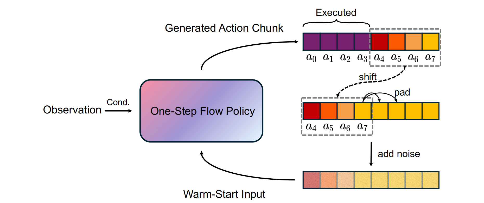

## One-Step Flow Policy: Self-Distillation for Fast Visuomotor Policies

> 论文：[arXiv:2603.12480](https://arxiv.org/abs/2603.12480)

### 一. 概述

**研究动机**：Flow Matching Policy 和 Diffusion Policy 很适合机器人模仿学习，因为它们可以生成连续、多模态的动作分布。但是这类方法通常不是一次性输出动作，而是从随机噪声开始，经过**多步 ODE / denoising** 逐步生成 action chunk。对于机器人闭环控制来说，多步 action generation 会带来**明显推理延迟**，降低控制频率，在高精度抓取、接触丰富操作和动态交互任务中尤其容易影响成功率。

论文关注的问题可以概括为：

> 能不能让 flow-based robot policy 在 **一步** 或 **少步** 内生成高质量动作，同时不牺牲动作精度？

**关键矛盾**：为什么不能直接把普通 Flow Matching 的多步推理改成一步？原因是普通 Flow Matching 学到的主要是“**局部速度场**”。它擅长每次从当前 noisy action 出发，预测一小段局部速度，然后慢慢积分到真实动作；但**它并没有专门学习“从噪声一步跳到最终动作”的能力**。

> **为什么普通 Flow Matching 学到的主要是“局部速度场”，而不是“区间平均速度场”？**
>
> 对于单个样本对 $(\epsilon,a)$ ，Flow Matching 构造的是直线路径，监督目标 $a-\epsilon$ 是这条直线的恒定斜率，因此既可以看作当前位置的局部速度，也可以看作任意区间的平均速度。但面对整个训练集时，同一个 $z_t$ 可能对应许多不同样本对，模型最终学习的是这些直线斜率的条件均值。该均值会随 $(z_t,t)$ 改变，从而形成弯曲的边缘速度场，因此学到的均值只能表示局部速度，需要经过多步迭代才能到达终点。
>
> 普通 Flow Matching 通常写成 $v_\theta(z_t,t\mid o)$ ，输入只有当前位置 $z_t$ 和当前时间 $t$ ，没有目标时间 $r$ ，因此模型只被要求预测当前位置的瞬时速度，没有“从 $t$ 跳到 $r$ ”这一明确区间概念。更关键的是，监督目标 $a-\epsilon$ 不随 $r$ 改变。因此，即使额外输入 $r$ ，模型也没有训练信号去区分不同区间，很容易忽略 $r$ ，退化回普通瞬时速度场。相比之下，虽然监督目标 $a-\epsilon$ 不显式依赖 $t$ ，但它参与了 $z_t$ 的构造，与输入 $z_t$ 共享同一个样本对 $(a,\epsilon)$。因此，模型可以根据 $z_t,t$ 推断当前状态下 $a-\epsilon$ 的条件均值，并将其作为局部速度。相比之下，如果 $r$ 既不参与 $z_t$ 的构造，也不改变监督目标，那么它不会提供新的预测信息，模型很容易直接忽略 $r$。
>
> 综上，模型主要学到的是“当前位置附近该往哪里走一小步”的局部速度场，而不是“从 $t$ 一步跳到 $r$ 的整段平均速度”。

**核心思想**：OFP 的目标是从头训练一个能够 one-step / few-step 生成动作的 flow policy。它不依赖外部预训练 teacher，而是通过 **self-distillation** 让模型自己给自己构造训练信号。具体来说，OFP 将原先预测的瞬时速度改为**区间平均速度**，用 **self-consistency** 学习区间平均速度，用 **self-guidance** 提高 one-step 动作精度，再用 **warm-start** 缩短从初始状态到目标动作的生成距离。

---

### 二. OFP 方法

OFP 的核心思路是：**不再只学习当前时间点的瞬时速度，而是让模型学习从当前时间到目标时间之间的平均速度**。这样模型既可以一步从噪声跳到动作，也可以在需要更高精度时使用 few-step refinement。

#### 1. 模型结构：从瞬时速度改为区间平均速度

普通 Flow Matching Policy 的 action head 通常可以写成：

$$
v_t = v_θ(z_t, t | o)
$$

其中：

- $v_t$ ：当前时间点附近的局部速度；
- $v_θ$ ：Flow Matching Policy 网络；
- $z_t$ ：当前 noisy action；
- $t$ ：当前噪声时间；
- $o$ ：当前 observation。

OFP 改成：

$$
u_{t,r} = v_θ(z_t, t, r | o)
$$

其中额外引入了一个 **目标时间 $r$**，表示希望模型预测**从当前时间 $t$ 到目标时间 $r$ 的平均速度**。

对应的更新公式是：

$$
z_r = z_t + (r-t)u_{t,r}
$$

因此，同一个模型可以支持两种模式：

* $t$ 接近 $r$ ：局部速度模式，接近普通 Flow Matching。
* $t = 0, r = 1$ ：一步生成模式，从纯噪声一步生成 action chunk。

> 这里 OFP 和普通 Flow Matching 的关键区别是：普通 Flow Matching 主要学习局部瞬时速度；OFP 显式输入 $(t,r)$ ，让模型知道“这次要从哪个时间走到哪个目标时间”。

#### 2. Self-Consistency Training：让模型学会跨区间跳跃

定义了区间平均速度之后，关键问题是：**这个平均速度应该怎么监督？** 如果直接用线性插值得到的 $z_r$ 来构造目标，那么：

$$
z_t=(1-t)\epsilon+ta,\quad z_r=(1-r)\epsilon+ra
$$

于是：

$$
\frac{z_r-z_t}{r-t}=a-\epsilon
$$

这其实仍然退化成普通 Flow Matching 的 conditional velocity。

OFP 因此使用 **Self-Consistency Training**。它的核心是：**在同一条生成轨迹上，从不同时间点出发，最终应该预测到一致的目标位置。** 具体来说:

1. OFP 会先采样起点时间 $t$ 和目标时间 $r$ ，满足 $0\le t\le r\le 1$ ，然后在 $[t,r]$ 之间采样一个中间时间 $m$ 。接着用真实动作 $a$ 和噪声 $\epsilon$ 构造：

   $$z_t=(1-t)\epsilon+ta,\quad z_m=(1-m)\epsilon+ma$$

   其中 $z_t$ 是起点 noisy action， $z_m$ 是中间 noisy action。

2. 然后，OFP 让 **EMA teacher** 从 $z_m$ 出发，预测从 $m$ 到 $r$ 的平均速度，并得到一个预测终点：

   $$\hat{z} _r=z _m+(r-m)u _{\theta^-}(z _m,m,r|o)$$

   这里的 **EMA teacher** 不是外部 teacher，而是当前 student 模型参数的滑动平均版本。它变化更慢，因此输出相对稳定。

3. 有了 $\hat{z}_r$ 后，OFP 用它来构造从 $z_t$ 到 $\hat{z}_r$ 的平均速度目标：

   $$u_{\text{target}}=\frac{\hat{z}_r-z_t}{r-t}$$

   然后训练 student 去预测这个目标。

> **简单理解**：OFP 让 EMA teacher 根据模型当前学到的生成轨迹，从中间点 $z_m$ 预测到目标时间 $r$ 的终点 $\hat z_r$ ；然后让 student 从更早的 $z_t$ 直接预测到同一个 $\hat z_r$ 。这样 student 学到的是沿模型当前生成轨迹，从 $t$ 到 $r$ 这一整段应该如何走，也就是该区间上的平均速度。

> 关于“**从噪声 $\epsilon$ 到真实动作 $a$ 的直线速度**”和“**局部速度场**”的区别：
>
> - “**从 $\epsilon$ 到 $a$ 的直线速度**”是训练样本层面的监督目标，是在给定**某个具体样本对** $(\epsilon,a)$ 的条件下定义的速度，它不是整个数据分布上的平均速度，也称为 conditional velocity；
> - “**局部速度场**”是模型学完之后在推理时使用的东西。推理时，模型只看到当前 noisy action $z_t$ ，并不知道它原本对应哪个 $\epsilon$ 和哪个真实动作 $a$ 。同一个 $z_t$ 附近可能对应很多条不同的 $(\epsilon,a)$ 路径，所以模型真正需要学的是这些 conditional velocity **在数据分布下的综合效果**，也称为 marginal velocity field。

OFP 还使用 **Time-Contracting Schedule** 来采样 $m$ ：

$$
m\sim U[t,\;t+(r-t)\rho(s)]
$$

其中 $s$ 是训练步数， $\rho(s)$ 会随着训练逐渐减小。训练早期， $\rho(s)\approx 1$ ， $m$ 可以在 $[t,r]$ 中较大范围采样，teacher 预测相对容易；训练后期， $\rho(s)\to 0$ ， $m$ 越来越靠近 $t$ ，模型被要求学习更严格的局部一致性。论文也说明，这种设计可以从稳定初始化逐渐过渡到更精细的轨迹约束。

#### 3. Boundary Anchoring：保留普通 Flow Matching 能力

只做 self-consistency 可能会让模型脱离原始专家动作路径。为了让模型仍然扎根在专家数据分布中，OFP 加入了普通 Flow Matching 监督，论文称为 **Boundary Anchoring**。

可以简单理解为：

* Self-Consistency：教模型做跨时间区间的跳跃。
* Boundary Anchoring：保证模型仍然会普通 Flow Matching 的局部速度预测。

对应地，当 $r=t$ 时，模型仍然要预测普通局部速度：

$$
u_\theta(z_t,t,t|o)\approx a-\epsilon
$$

这个设计很重要，因为它让 OFP 不只是 one-step generator。推理时如果愿意多花一点计算，也可以用 2-step、4-step 等 few-step sampling 获得更高精度。

#### 4. Self-Guided Regularization：让 one-step 动作更精确

Self-Consistency Training 主要解决的是“模型能不能从一个时间区间直接跳到另一个时间区间”，也就是让模型学会 one-step / few-step 的区间平均速度。**但它不一定保证 one-step 生成的动作足够精确**。对于机器人操作来说，这一点很关键：抓取、插入、对齐等任务中，动作稍微偏一点就可能失败。因此 OFP 进一步引入 **Self-Guided Regularization**，让 one-step 预测更靠近当前任务下的专家动作高密度区域。具体流程如下：

1. 首先，student 根据当前 noisy action $z_t$ 、时间区间 $[t,1]$ 和 observation $o$ ，预测一个 one-step velocity：

   $$y = u_\theta(z_t,t,1\mid o)$$

   这个 $y$ 会得到一个 one-step action prediction：

   $$\hat a = z_t + (1-t)y$$

   但这个 $\hat a$ 可能还不够精确。于是 OFP 会把 $\hat a$ 重新加噪到某个随机时间 $t'$ ，得到 $\tilde z_{t'}$ 。这样做是因为 **flow model 更擅长在 noisy action space 中估计速度，而不是直接在 clean action 上判断“这个动作该往哪里修正”**。

2. 接着，EMA teacher **在同一个 $\tilde z_{t'}$ 上做两次预测**：

   * conditional prediction：输入 observation $o$ ，表示“**当前任务下应该如何修正**”。
   * unconditional prediction：输入空条件 $φ$ ，表示“**不知道具体任务时，普通动作分布大概如何修正**”。

   两者的差异就是任务条件带来的修正方向：

   $$g = u_{\theta^-}(\tilde z_{t'},t',t'|o) - u_{\theta^-}(\tilde z_{t'},t',t'|\phi)$$

   可以直观理解为：**当前任务相对于普通动作分布，多出来的任务相关修正方向**

3. 然后 OFP 用这个 guidance direction 构造一个 stop-gradient 的 伪目标：

   $$y_{\text{target}}=\text{sg}[y+g]$$

   其中 $\text{sg}[\cdot]$ 表示 stop-gradient，也就是这个 target 只作为监督目标，**不让梯度反传到 EMA teacher 或 target 构造过程**。

4. 最后用 MSE 训练 student：

   $$L_{\text{self-guidance}} = \|y-y_{\text{target}}\|^2$$

   这个 loss 的效果是：让 student 当前的 one-step velocity $y$ 往 $y+g$ 的方向移动。也就是说，它不是在推理时额外加一个 guidance step，而是在训练时让模型逐渐学会：**以后自己输出的 one-step velocity 就应该包含这种 conditional guidance 修正**。

> Self-Guided Regularization 的指导信号来自 EMA teacher 自己的 conditional / unconditional 预测差异，所以叫 **self-guided**。它借鉴的是 Classifier-Free Guidance 的思想：**无条件预测代表泛化动作趋势，有条件预测代表当前任务下的动作趋势**，两者差异就能告诉模型“**不要只生成普通动作，要往当前 observation 对应的专家动作模式靠近**”。

一句话总结：**Self-Guided Regularization 先让 student 生成 one-step 动作，再把该动作重新加噪，用 EMA teacher 的 conditional - unconditional 差异构造修正方向，并通过 pseudo-target 训练 student，让 one-step 预测更偏向任务相关的专家动作模式。**

#### 5. Warm-Start：用上一轮剩余动作初始化，而不是从纯噪声开始



Warm-Start 的核心思想是：**连续控制中，相邻两次 action chunk 通常高度相关，因此下一轮生成动作时，不一定要从纯高斯噪声开始，可以利用上一轮还没执行完的动作作为先验。** 这样可以减少从初始状态到目标动作的生成距离，让 one-step / few-step 生成更容易、更平滑。

假设上一轮生成的 action chunk 是：

$$
a^{prev}=[a_1,a_2,\dots,a_H]
$$

机器人只执行前 $h$ 个动作 $[a_1, ..., a_h]$ ，那么剩下的动作 $[a_{h+1}, ..., a_H]$ 其实已经是上一轮模型对未来动作的预测。

1. OFP 先将这部分未执行动作前移，并用最后一个动作 $a_H$ 重复补齐长度，得到 warm-start prior：

   $$a_{\text{warm}}=[a_{h+1},...,a_H,\underbrace{a_H,...,a_H}_{h\text{ 次}}]$$

2. 得到 $a_{\text{warm}}$ 后，OFP 不会直接把它当作最终动作，而是把它和高斯噪声混合，构造初始 noisy action：

   $$z_{t_w}=(1-t_w)\epsilon+t_w a_{\text{warm}}$$

   其中 $t_w\in(0,1]$ 是 warm-start 的噪声水平，也可以理解为“相信上一轮动作先验的程度”。 $t_w$ 越大，越接近 $a_{\text{warm}}$ ； $t_w$ 越小，越接近纯噪声。论文实验中 $t_w$ 是手动设置的超参数，效果最好的是 $t_w=0.15$ ，说明它只加入少量历史动作先验，主要仍保留噪声带来的修正空间。

3. 最后，模型从 $z_{t_w}$ 出发生成新的 action chunk：

   $$\hat a=z_{t_w}+(1-t_w)u_\theta(z_{t_w},t_w,1|o)$$

需要注意的是，Warm-Start 第一次推理时不能用，因为还没有上一轮 action chunk。它主要在第二次及之后的连续 replan 中发挥作用。它本身不需要额外训练，更像一个推理阶段的初始化技巧。

---

### 三. 训练流程

OFP 是一个 from-scratch self-distillation 框架，不需要外部预训练 teacher。训练时主要包含三类 loss：

$$
L = L_{flow} + λ_c L_{self-consistency} + λ_g L_{self-guidance}
$$

各部分含义如下：

| 训练项 | 作用 |
|---|---|
| $L_{\text{flow}}$ | 保留普通 Flow Matching 的局部速度能力 |
| $L_{\text{self-consistency}}$ | 学习区间平均速度，使模型支持 one-step / few-step 跳跃 |
| $L_{\text{self-guidance}}$ | 提升 one-step 动作精度，让预测更靠近专家动作高密度区域 |

简化训练流程如下：

> 输入：observation $o$ 、真实 action chunk $a$ 、噪声 $\epsilon$
>
> * **Flow Anchoring**：
>
>    1. 采样时间 $t$ ，并构造加噪动作：
>
>       $$z_t=(1-t)\epsilon+ta$$
>
>    2. 让 student 在局部速度模式下预测当前位置的速度：
>
>       $$u_\theta(z_t,t,t|o)$$
>
>       这里令目标时间也等于 $t$ ，表示模型预测的是当前时间点附近的局部速度。
>
>    3. 使用普通 Flow Matching 的 conditional velocity 作为监督目标：
>
>       $$a-\epsilon$$
>
>       计算：
>
>       $$L_{flow} = \left\| u_\theta(z_t,t,t|o)-(a-\epsilon) \right\|^2$$
>
>       这部分的作用是保留普通 Flow Matching 能力，防止模型只学习跨区间跳跃而偏离专家动作分布。
>
> * **Self-Consistency**：
>
>    1. 采样起点时间 $t$ 、目标时间 $r$ ，满足 $t<r$ ；再根据 Time-Contracting Schedule 在 $[t,r]$ 中采样中间时间 $m$ ：
>
>       $$m\sim U[t,\;t+(r-t)\rho(s)]$$
>
>    2. 构造起点和中间点的 noisy action：
>
>       $$z_t=(1-t)\epsilon+ta$$
>
>       $$z_m=(1-m)\epsilon+ma$$
>
>    3. EMA teacher 从 $z_m$ 出发，预测从 $m$ 到 $r$ 的平均速度，并得到预测终点：
>
>       $$\hat{z} _r = z _m+(r-m)u _{\theta^-}(z _m,m,r|o)$$
>
>    4. 用 teacher 预测的终点构造从 $t$ 到 $r$ 的平均速度目标：
>
>       $$u_{target} = \frac{\hat{z}_r-z_t}{r-t}$$
>
>    5. student 直接从 $z_t$ 预测从 $t$ 到 $r$ 的平均速度：
>
>       $$u_\theta(z_t,t,r|o)$$
>
>       计算：
>
>       $$L_{self-consistency} = \left\| u_\theta(z_t,t,r|o)-u_{target} \right\|^2$$
>
>       这部分的作用是让 student 学会：teacher 从中间点 $z_m$ 预测到的终点 $\hat{z}_r$ ，student 从更早的 $z_t$ 出发也应该能直接预测到。也就是让模型学习跨区间的一致平均速度。
>
> * **Self-Guidance**：
>
>    1. student 先做一次 one-step 预测：
>
>       $$y = u_\theta(z_t,t,1|o)$$
>
>       得到：
>
>       $$\hat{a} = z_t + (1-t)y$$
>
>    2. 将 $\hat{a}$ 重新加噪到随机时间 $t'$ ：
>
>       $$\tilde{z}_{t'}=(1-t')\epsilon'+t'\hat{a}$$
>
>       这一步是为了把 one-step 结果放回 flow model 熟悉的 noisy action space。
>
>    3. EMA teacher 在 $\tilde{z}_{t'}$ 上分别进行 conditional / unconditional 预测：
>
>       $$u_{\theta^-}(\tilde{z}_{t'},t',t'|o)$$
>
>       $$u_{\theta^-}(\tilde{z}_{t'},t',t'|\phi)$$
>
>    4. 用二者差异构造 guidance direction：
>
>       $$g = u _{\theta^-}(\tilde{z} _{t'},t',t'|o) - u _{\theta^-}(\tilde{z} _{t'},t',t'|\phi)$$
>
>       这里的 $g$ 可以理解为“当前任务条件相对于普通动作分布，多出来的修正方向”。
>
>    5. 构造 stop-gradient pseudo target：
>
>       $$y_{target} = \text{sg}[y+g]$$
>
>    6. student 学习这个 pseudo target，计算：
>
>       $$L_{self-guidance} = \left\| y-y_{target} \right\|^2$$
>
>       这部分的作用是让 one-step velocity 往 conditional expert mode 靠近，使一步生成的动作更精确。
>
> 总 loss：
>
> $$L = L_{flow} + \lambda_c L_{self-consistency} + \lambda_g L_{self-guidance}$$
>
> 更新 student 模型参数 $\theta$
>
> 更新 EMA teacher 参数 $\theta^-$

---

### 四. 推理流程

OFP 支持 one-step 和 few-step 两种推理方式。

#### 1. One-step inference

最低延迟模式下，OFP 直接从噪声一步生成动作：

$$
\hat{a}=\epsilon+u_\theta(\epsilon,0,1|o)
$$

这个过程只需要一次 action model forward。

#### 2. Few-step inference

如果任务对精度要求更高，也可以把 $[0,1]$ 分成多个小区间：

$$
z_0 → z_{τ1} → z_{τ2} → ... → z_1
$$

每一步都预测当前小区间的平均速度：

$$
a_θ(z_{τk}, τ_k, τ_{k+1} | o)
$$

因此 OFP 比 OneDP 这类只能 one-step 的方法更灵活：它可以在低延迟和高精度之间切换。

> 在连续 replan 中，OFP 可以不用纯噪声初始化，而是从上一轮剩余动作构造 warm-start prior：
>
> ```text
> 上一轮 action chunk
> → 执行前 h 个动作
> → 剩余动作 shift + pad
> → 加噪得到初始 z_tw
> → 一步或少步生成新 action chunk
> ```
>
> 这个机制不需要额外训练，适合直接迁移到现有 action chunk policy 中。

---

### 五. 实验结果

论文主要验证三个问题：

1. OFP 的 one-step 动作是否足够准？
2. OFP 是否真的比多步 flow / diffusion policy 快？
3. OFP 能否迁移到大模型 VLA，例如 π0.5？

#### 1. 2D image-based manipulation

在 Adroit 和 DexArt 的 7 个 2D image-based manipulation 任务上，OFP 在 NFE=1 时取得最高平均成功率：

| 方法 | NFE | 平均成功率 |
|---|---:|---:|
| DP | 100 | 64.2 |
| FM Policy | 100 | 67.2 |
| CP | 1 | 59.7 |
| OneDP | 1 | 63.3 |
| MP1 | 1 | 60.5 |
| OFP | 1 | **68.3** |

这个结果说明，OFP 不只是减少推理步数，而且 one-step 成功率还超过了 100-step DP 和 100-step FM Policy。

#### 2. 3D pointcloud manipulation

3D 实验覆盖 56 个任务，包括 Adroit、DexArt 和 MetaWorld 多任务设置：

| 方法 | NFE | 平均成功率 |
|---|---:|---:|
| DP3 | 100 | 66.4 |
| FM Policy | 100 | 59.8 |
| CP | 1 | 54.7 |
| OneDP | 1 | 62.4 |
| MP1 | 1 | 57.4 |
| OFP | 1 | **71.6** |

OFP 在 3D 设置中优势更明显，尤其是 MetaWorld 多任务场景。这说明 self-guidance 不只是加速技巧，也可能改善多任务动作分布的质量。

#### 3. 推理速度

在 56 个 3D 任务上：

| 方法 | NFE | 每个 action chunk 推理时间 |
|---|---:|---:|
| DP3 | 100 | 3225.67 ms |
| FM Policy | 100 | 1865.72 ms |
| OFP | 1 | 17.58 ms |

论文报告 OFP 相比 DP3 约 **183×** 加速，相比 FM Policy 约 **106×** 加速。

#### 4. Few-step 能力

OFP 不是只能 one-step。论文在 Bucket、Faucet、Laptop、Toilet 四个任务上比较了 NFE=1 和 NFE=4：

| 方法 | NFE | 平均成功率 |
|---|---:|---:|
| OneDP | 1 | 62.5 |
| CP | 1 | 60.7 |
| CP | 4 | 64.2 |
| OFP | 1 | **64.5** |
| OFP | 4 | **66.2** |

这说明 OFP 具有比较灵活的 latency-accuracy trade-off：低延迟时可以 one-step，需要更稳时可以 few-step。

#### 5. 集成到 π0.5 + RoboTwin 2.0

论文还将 OFP 集成到 π0.5，并在 RoboTwin 2.0 的四个任务上测试。所有加速方法都是 NFE=1，而 π0.5 baseline 是 NFE=10。

| 方法 | NFE | 平均成功率 |
|---|---:|---:|
| CFM | 1 | 约 79 |
| Shortcut | 1 | 约 81 |
| iMF | 1 | 约 87 |
| π0.5 baseline | 10 | 约 92 |
| OFP | 1 | **94.7** |

OFP 在 one-step 下超过了原始 10-step π0.5。这一点对 VLA / Fast-WAM 推理加速很重要，因为它说明 OFP 不只适用于小型 policy，也能迁移到更大的 VLA action expert。

---

### 六. 局限性

1. **真实机器人验证不足**：论文主要在仿真 benchmark 上评估，虽然任务数量很多，但真实机器人上的稳定性还需要进一步验证。
2. **超参数比较敏感**：self-guidance 权重、self-consistency / self-guidance 子 batch 比例、时间采样分布都会影响效果。过强的 guidance 可能导致 mode collapse。
3. **不是简单 plug-and-play 模块**：OFP 更像一个完整训练框架，而不是在已有 action expert 上加一个小 adapter。相比 SnapFlow，它对现有 Fast-WAM action head 的直接迁移成本更高。

---

### 七. 总结

OFP 是一个面向 flow-based robot policy 的 one-step / few-step action generation 方法。它的核心是让模型学习 **区间平均速度**，而不是只学习局部瞬时速度；再通过 **self-consistency** 保证跨时间区间的轨迹一致性，通过 **self-guidance** 提高 one-step 动作精度，并通过 **warm-start** 利用连续控制中的动作相关性，缩短从初始状态到目标动作的生成距离。
