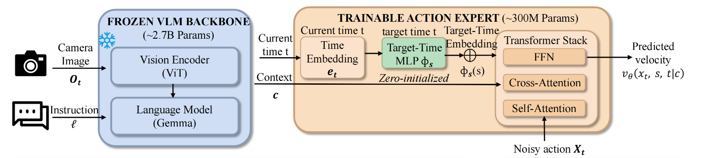
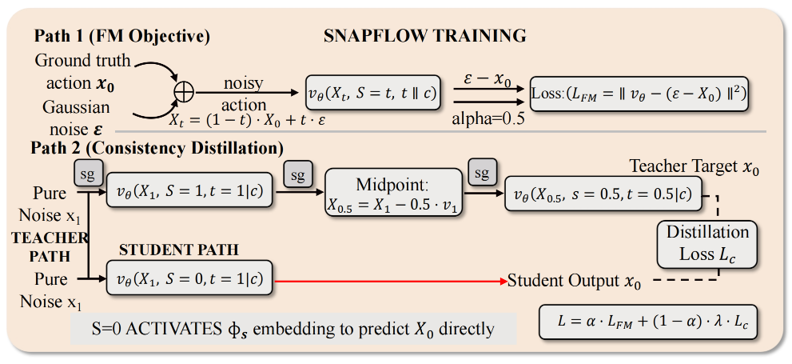

## SnapFlow: One-Step Action Generation for Flow-Matching VLAs via Progressive Self-Distillation

### 一. 工作动机

**核心问题**：π0、π0.5、SmolVLA 这类 flow-matching VLA 通常不是一次性输出动作，而是从随机噪声开始，经过多步 denoising / ODE integration，逐步生成一个 action chunk。常见设置是 **10 个 denoising steps**，也就是 action expert 要连续 forward 多次。这会带来明显的推理延迟。论文中以 π0.5 为例，10-step action denoising 占据端到端推理时间的大部分：总推理约 274 ms，其中 denoising 约 241 ms。也就是说，真正拖慢部署的不是只看图像和语言的 VLM prefix，而是后面的多步 action generation。

**关键矛盾**：能不能直接把 10 步改成 1 步？直觉上可以，但论文指出效果不稳定。原因是原始 flow-matching action head 学到的是“**局部速度场**”：它擅长每次走一小步，从噪声慢慢走到动作；但如果直接让它一步从纯噪声跳到最终动作，它并没有被训练好做这种“大跳跃”。

可以简单理解为：

> 原模型学会的是“每次修正一点点”，不是“一步到位”。 
> 如果强行只走一步，就可能方向不准，动作质量下降。

**核心思想**：SnapFlow 的目标是让 flow-matching VLA 学会 **one-step action generation**。它不重新设计 policy，也不引入外部 teacher，而是**用模型自己的多步预测构造一个“捷径目标”，再训练 action expert 学会一步预测**。最终推理时只需要一次 action expert forward，就能从噪声生成 action chunk。

---

### 二. SnapFlow 方法

SnapFlow 的核心思路是：**不改变原 VLA 主体结构，只让 action expert 学会同时支持“局部小步预测”和“一步生成动作”两种模式**。为此，它主要做了三件事：引入 target-time embedding 区分两种模式，用 two-step shortcut 构造一步生成目标，再用 FM/consistency 混合训练稳定模型。

#### 1. 模型结构：同一个 action expert 支持两种模式



普通 flow-matching VLA 中，action expert 只知道当前噪声时间 t，默认任务是预测当前位置附近的**局部速度**。因此推理时需要从 t=1 的纯噪声开始，多步 denoising 到 t=0 的动作。

SnapFlow 额外引入一个 **target time s**，表示希望模型预测 **从当前时间 t 到目标时间 s** 之间的平均速度。这样，同一个 action expert 就可以根据 (s,t) 的不同，切换成两种模式：

```text
s = t：
局部速度模式，对应普通 flow matching。
模型只预测当前时间点附近的一小步速度。

s = 0, t = 1：
一步生成模式。
模型预测从纯噪声到最终动作所需的整体平均速度。
```

为了让模型知道当前要执行哪种模式，SnapFlow 增加了一个很小的 **target-time MLP**，把目标时间 s 编码成 target-time embedding，并加到原有的 time embedding 上：

```text
当前时间 t → 原有 time embedding → e_t
目标时间 s → target-time MLP → φ_s

最终时间条件 = e_t + φ_s
```

> 这里要注意：**s 不是由 t 生成的，而是外部指定的目标时间**。训练时会根据任务手动设置 s=t 或 s=0；推理时则固定设置 s=0, t=1。

这个 target-time MLP 是 **zero-initialized** 的，所以刚开始不会破坏原来的 flow-matching action expert。随着训练进行，模型逐渐学会区分“预测局部速度”和“预测一步平均速度”。

#### 2. Two-step shortcut：用两小步构造一步生成目标



有了两种模式之后，SnapFlow 需要教模型学会“一步生成”。直接用真实动作和噪声之间的单个 conditional velocity 来监督一步生成并不稳定，因此 SnapFlow 使用 **two-step shortcut target**。

具体来说，它先让同一个模型在**局部速度模式**下做两次短距离预测：

```text
纯噪声 x1
→ 用模型预测 t=1 处的局部速度 v1
→ 走半步，得到中间点 x0.5
→ 再用模型预测 t=0.5 处的局部速度 v0.5
```

然后**把这两个局部速度取平均，作为从 t=1 到 t=0 的近似平均速度**：

```text
v_target ≈ (v1 + v0.5) / 2
```

这个 v_target 就是一步生成模式要学习的目标：

```text
Fθ(x1, s=0, t=1 | c) ≈ v_target
```

也就是说，SnapFlow 的 self-distillation 可以理解为：

> 用**同一个模型**在“**局部速度模式**”下产生 two-step shortcut target，再训练**同一个模型**在“**一步生成模式**”下去匹配这个 target。

> 这里虽然论文图中会出现 teacher path 和 student path，但它们不是两个独立模型，而是**同一个模型的两种使用方式**。teacher path 产生的 v_1 和 v_0.5 会使用 stop-gradient，只作为监督目标；student path 才接收梯度，学习一步生成。

#### 3. FM/Consistency 混合训练：既保留局部能力，又学习一步能力

如果只训练 one-step shortcut，模型可能会忘记原本的局部速度场；如果只训练普通 flow matching，模型又学不会一步生成。因此 SnapFlow 混合两种训练信号：

> 总 loss = 普通 flow matching loss + shortcut consistency loss

其中，普通 flow matching loss 对应局部速度模式：

> s = t
> 模型学习当前时间点附近的瞬时速度

shortcut consistency loss 对应一步生成模式：

> s = 0, t = 1
> 模型学习从纯噪声一步跳到最终动作的平均速度

论文默认使用平衡的混合比例，例如 $\alpha=0.5$ 。可以直观理解为：一部分训练信号继续保持模型“一小步一小步走”的能力，另一部分训练信号教模型“一步走完”。

这种混合训练很重要，因为 two-step shortcut target 本身依赖模型的局部速度预测。如果局部速度预测变差，那么构造出来的一步目标也会变差。因此，**普通 FM loss 负责维持局部速度场质量，shortcut consistency loss 负责让模型掌握一步生成能力**。

---

### 三. 训练流程

SnapFlow 从一个已经训练好的 flow-matching VLA checkpoint 出发。论文中主要在 π0.5 和 SmolVLA 上验证。

训练时：

1. 冻结 VLM backbone，也就是图像和语言理解部分；
2. **只训练 action expert 和新增的 target-time MLP**；
3. 一部分样本继续做普通 flow matching；
4. 一部分样本用 two-step shortcut 构造 consistency target；
5. 两个 loss 混合优化。

简化流程如下：

```text
输入：图像、语言指令、真实 action chunk

普通 FM 分支：
真实动作 + 噪声 → 带噪动作 xt
action expert 预测局部 velocity
计算 L_FM

Shortcut 分支：
从纯噪声 x1 出发
当前模型预测两段局部速度 v1 和 v0.5
构造 v_target = (v1 + v0.5) / 2
action expert 学习一步预测这个 v_target
计算 L_shortcut

总 loss：
L = α L_FM + (1 - α) λ L_shortcut
```

> SnapFlow 虽然训练时会多做一些额外 forward 来构造 shortcut target，但这是训练成本；推理时不会保留这些额外过程。

> 训练 30k steps 只需要一张 A800，大约 12 小时

---

### 四. 推理流程

推理时 SnapFlow 非常简单。给定当前图像和语言指令：

```text
图像 + 语言
→ VLM prefix 得到 context c
→ 采样一个纯噪声 action x1
→ 设置(s=0,t=1)，action expert 单次 forward，预测从 t=1 到 s=0 的 velocity
→ 一步得到 action chunk
```

> 原始 flow-matching VLA 需要类似：
>
> ```text
> x1 → x0.9 → x0.8 → ... → x0
> ```
>
> SnapFlow 变成：
>
> ```text
> x1 → x0
> ```
>

> 端到端推理延迟降到约 83 ms，相比原来的 274 ms baseline，大约快 3.3 倍

---

### 五. 实验结果

论文主要验证两个问题：**一步生成是否还准？是否真的加速？**

#### 1. π0.5 on LIBERO

在 π0.5 上，SnapFlow 在 LIBERO 四个 suite 上达到 **98.75% average success**，而原始 10-step baseline 是 **97.75%**。这说明一步生成并没有明显牺牲成功率，甚至略高。

推理速度方面：

| 方法 | Action denoising steps | E2E latency | 说明 |
|---|---:|---:|---|
| π0.5 baseline | 10 | 274 ms | 原始多步生成 |
| Naive 1-step | 1 | 81 ms | 不重新训练，直接减少步数 |
| SnapFlow | 1 | 83 ms | 经过 self-distillation 的一步生成 |

SnapFlow 和 naive 1-step 的速度接近，但 SnapFlow 的动作质量更稳定。这个结果说明：**速度提升来自减少推理步数，质量提升来自专门训练 one-step 能力**。

#### 2. SmolVLA

论文还在更小的 SmolVLA 上验证，说明 SnapFlow 不只适用于 π0.5。结果显示 SnapFlow 能降低 MSE，并带来约 **3.56× end-to-end acceleration**。这说明 SnapFlow 更像是一个通用 action-head 加速方法，而不是只适配某个单一模型。

#### 3. 和其他加速方法的关系

论文强调 SnapFlow 和视觉 token pruning、layer distillation 等方法是互补的：

- token pruning：减少视觉 token 数；
- layer distillation：减少每次 forward 的模型层数；
- SnapFlow：减少 action expert forward 次数。

因此 SnapFlow 可以和 GridS、EfficientVLA、Shallow-π 等方法组合，形成更大的加速收益。

---

### 六. 局限性

1. 实验主要集中在 LIBERO 仿真和 PushT 等设置，**缺少充分的真实机器人验证**。对于真实机器人，one-step action generation 是否足够稳定，还需要进一步测试。
2. 当 action denoising 被压缩到一步之后，**新的瓶颈会变成 VLM prefix 或视觉编码部分**。论文中也指出，SnapFlow 后 VLM prefix 占端到端推理时间的比例会升高。因此后续仍需要和视觉 token 压缩、VLM 层压缩、cache 等方法结合。

---

### 七. 总结

SnapFlow 是一个面向 flow-matching VLA 的 action head 推理加速方法。它通过 **progressive self-distillation**，让原本需要 10 步 denoising 的 action expert 学会一步生成 action chunk，从而**在基本保持成功率的同时显著降低推理延迟**。对 FastWAM 来说，它最直接的启发是：**在“world branch 单次 forward”之外，action branch 也可以进一步从多步 denoising 压缩为 one-step generation**。
