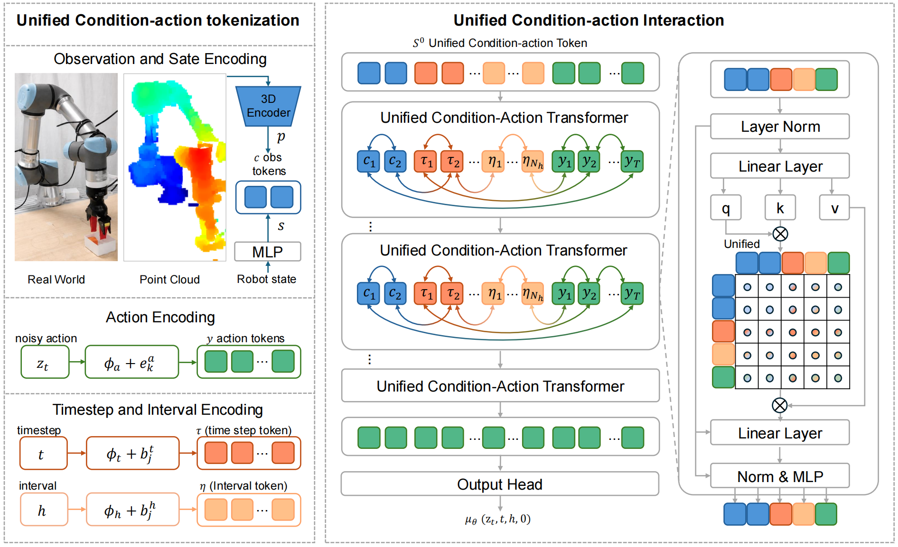

## Unified Condition-Action Modeling for Accurate One-Step Action Generation

> 论文：[arXiv:2608.16153](https://arxiv.org/abs/2608.16153)
> 项目：[UCA-Flow Project Page](https://uca-policy.github.io/UCA.github.io/)
> GitHub：[Juggler8338/UCA](https://github.com/Juggler8338/UCA)

### 一. 概述

**研究动机**：Diffusion Policy、Flow Matching Policy 和 MeanFlow Policy 能够建模多模态 action distribution，但仍面临两类问题：

1. Diffusion / Flow Policy 通常依赖多次迭代，推理延迟较高；
2. 现有策略常把 observation、timestep 等条件编码成固定的外部信号，再通过 AdaLN 或 Cross-Attention 单向注入 action generator。对于 one-step generation，一次前向必须完成整段噪声到动作的映射，固定 condition representation 可能无法随当前 noisy action 和生成阶段动态调整。

**核心思想**：UCA-Flow 将 observation、timestep $t$ 、interval $h$ 和 noisy action $z_t$ 全部表示为 token，在同一个 **Unified Condition-Action Transformer** 中通过 self-attention 联合更新；训练目标则建立在 iMF 风格的 MeanFlow identity 上，并增加 **Dual-Pass Supervision**，同时约束区间平均速度和零区间瞬时速度。推理时从 Gaussian noise 出发，只调用一次模型即可生成 action trajectory。可以将其概括为：

$$
\text{UCA-Flow}
=
\text{iMF-style MeanFlow objective}
+
\text{Dual-Pass Supervision}
+
\text{Unified Condition-Action Transformer}.
$$

### 二. 模型方法

#### 1. Action probability path 与平均速度

设专家 action trajectory 为：

$$
x\in\mathbb{R}^{T\times d_a},
$$

Gaussian noise 为 $\epsilon\sim\mathcal{N}(0,I)$ 。论文使用从 clean action 到 noise 的线性路径：

$$
z_t=(1-t)x+t\epsilon,\qquad t\in[0,1].
$$

因此：

- $t=0$ 时， $z_0=x$ ；
- $t=1$ 时， $z_1=\epsilon$ ；
- 路径的 conditional instantaneous velocity 为：

  $$
  v=\frac{dz_t}{dt}=\epsilon-x.
  $$

设目标时间为 $r\le t$ ，区间长度为：

$$
h=t-r.
$$

UCA-Flow 预测：

$$
u_\theta(z_t,t,h,o),
$$

表示从 $r=t-h$ 到 $t$ 这一段上的 interval-aware average velocity。与使用 $(r,t)$ 表示区间的 MeanFlow / iMF 相比，UCA-Flow 只是将区间重参数化为 $(t,h)$ ；其生成方向和物理含义不变。

> UCA-Flow 采用单输出头形式

#### 2. Unified Condition-Action Tokenization

UCA-Flow 将所有输入投影到相同 hidden space，构成一个统一序列。

**Observation tokens**：对 observation history 中第 $i$ 个时刻的 point-cloud feature $p_i$ 和 robot-state feature $s_i$ 进行拼接、投影，并加入可学习的位置编码：

$$
c_i=\phi_o([p_i;s_i])+e_i^o.
$$

论文使用两个 observation steps，因此：

$$
O=[c_1,c_2].
$$

**Timestep / interval tokens**：分别用 sinusoidal positional embedding 和独立 MLP 编码 $t$ 与 $h$ ：

$$
e_t=\phi_t(\mathrm{PE}(t)),\qquad
e_h=\phi_h(\mathrm{PE}(h)).
$$

为了提高表示容量，论文允许复制成 $N_t$ 个 timestep tokens 和 $N_h$ 个 interval tokens，并为不同 token 加入可学习身份偏置：

$$
\tau_j=e_t+b_j^t,\qquad j=1,\ldots,N_t,
$$

$$
\eta_j=e_h+b_j^h,\qquad j=1,\ldots,N_h.
$$

其中， $t$ 表示当前 noisy action 位于 probability path 的哪个位置； $h$ 表示本次 average velocity 应覆盖多长的生成区间。

**Action tokens**：对 noisy action trajectory 的每一个 horizon step 分别投影，并加入 action position embedding：

$$
y_k=\phi_a(z_{t,k})+e_k^a,\qquad k=1,\ldots,T.
$$

最终输入序列为：

$$
S^0=[c_1,c_2,\tau_1,\ldots,\tau_{N_t},\eta_1,\ldots,\eta_{N_h},y_1,\ldots,y_T].
$$

官方代码的默认配置为 8 个 Transformer blocks、hidden size 384、8 个 attention heads，并设置 $N_t=N_h=1$ ；这些属于当前代码实现配置，而非方法必须固定的取值。

#### 3. Unified Condition-Action Transformer

记第 $\ell$ 层的 condition tokens 和 action tokens 分别为 $P_{t,h,o}^{\ell}$ 与 $Y^\ell$ 。每一层对完整序列做 multi-head self-attention 和 FFN：

$$
[P_{t,h,o}^{\ell+1},Y^{\ell+1}]
=
\mathrm{UCA\text{-}Transformer}^{\ell}
([P_{t,h,o}^{\ell},Y^\ell]).
$$

它与外部条件注入的关键差别是：

- AdaLN：condition 主要生成 scale、shift、gate，condition representation 本身不会根据 action state 更新；
- Cross-Attention：通常由 action token 查询固定的 condition key / value，信息以 condition $\rightarrow$ action 为主；
- UCA-Flow：**condition 和 action 都在同一 self-attention 序列中更新**，形成跨层的 action $\rightarrow$ condition $\rightarrow$ action 信息路径。

具体来说，第 $\ell$ 层的 condition tokens 可以吸收 $Y^\ell$ 中当前 noisy action 的信息，形成 action-aware condition representation；下一层的 action tokens 再根据这些已更新的条件表示修正 trajectory。论文的 saliency visualization 显示，UCA-Flow 相比 AdaLN / Cross-Attention 更集中于 end-effector、target object 和 upper-arm joints 等任务相关区域。

经过 $L$ 层后，只保留最终 action tokens：

$$
Y^L=[y_1^L,\ldots,y_T^L],
$$

并通过单一输出 head $\psi$ 得到 average velocity trajectory：

$$
u_\theta(z_t,t,h,o)=\psi(Y^L)\in\mathbb{R}^{T\times d_a}.
$$

#### 4. iMF-style MeanFlow identity

UCA-Flow 使用 $h=t-r$ 表示生成区间。沿着固定 $r$ 的 probability path 增大 $t$ 时， $dh/dt=1$ ，因此 average velocity 的总导数为：

$$
D_tu_\theta
=
\nabla_z u_\theta\cdot\mathrm{sg}(v_\theta)
+
\partial_tu_\theta
+
\partial_hu_\theta.
$$

其中零区间预测：

$$
v_\theta=u_\theta(z_t,t,0,o)
$$

近似 instantaneous velocity，并作为 JVP 的 state direction。换成传统 iMF 的 $(z_t,r,t)$ 坐标后，同一导数对应 tangent direction $(\mathrm{sg}(v_\theta),0,1)$ ；在 UCA-Flow 的 $(z_t,t,h)$ 坐标中则对应 $(\mathrm{sg}(v_\theta),1,1)$ 。

基于 MeanFlow identity，构造 compound velocity：

$$
V_\theta=u_\theta+h\mathrm{sg}(D_tu_\theta).
$$

这一步体现了 iMF 的核心：**网络输出的是 average velocity $u_\theta$ ，但训练在已知的 instantaneous velocity target $v=\epsilon-x$ 上完成。**

#### 5. Dual-Pass Supervision

UCA-Flow 在每个训练样本上做两次模型前向：

1. **Instantaneous pass**：令 $h=0$ ，得到 $v_\theta=u_\theta(z_t,t,0,o)$ ；
2. **Average pass**：输入采样得到的 $h=t-r$ ，得到 $u_\theta=u_\theta(z_t,t,h,o)$ 。

两条分支使用同一个 target $v=\epsilon-x$ ：

$$
\mathcal{L}
=
\rho\!\left(V_\theta-\mathrm{sg}(v)\right)
+
\rho\!\left(v_\theta-\mathrm{sg}(v)\right).
$$

其中 adaptive weighted L2 loss 定义为：

$$
\rho(\Delta)
=
\mathrm{sg}\!\left(
\frac{1}{(\lVert\Delta\rVert_2^2+c)^{1-\gamma}}
\right)
\lVert\Delta\rVert_2^2.
$$

- 第一项让 finite-interval average branch 学会 one-step transport；
- 第二项直接校准零区间 instantaneous prediction，使它既能提供更可靠的 JVP direction，也能通过额外监督稳定共享 token representation；
- $v_\theta$ 在作为 JVP direction 时会 stop-gradient，但在第二项 loss 中仍然接收梯度。

官方代码以 1:1 权重相加两项 loss，并采用 $\gamma=0.5$ 、 $c=10^{-3}$ 。

#### 6. 与 ReactVLA 的异同

| 维度 | UCA-Flow | ReactVLA |
|---|---|---|
| MeanFlow 基础 | iMF-style $v$ -loss： $u_\theta\rightarrow V_\theta\rightarrow v$ | 明确迁移 iMF，同样学习 average velocity 并用 JVP correction |
| 额外训练设计 | 显式增加 $\rho(v_\theta-v)$ ，形成 Dual-Pass Supervision | 只用 $V_\theta-v$ 主损失；以 0.5 概率令 $r=t$ 混入普通 FM 样本 |
| Loss | Adaptive weighted L2 | Pseudo-Huber，重点限制大误差梯度 |
| 架构创新 | condition 与 action 在共享 self-attention 序列中逐层双向更新 | 重点是 AttnRes，在网络深度维度动态选择历史层表示 |
| 条件模态 | 3D point cloud + robot state，无语言输入 | 双视角 RGB + language + proprioception，属于 VLA |
| 典型模型规模 | 官方配置为 8 层、hidden size 384 的 compact Transformer | 16 层、hidden size 768，论文报告约 0.39B 参数 |
| 主要推理设置 | 实验使用真正的 1-NFE | 支持 one-to-few-step，但主要仿真实验使用 2-step，真实机器人使用 5-step |
| 评测范围 | 37 个 Adroit / Meta-World 单任务策略 + 2 个 UR5e 真实任务 | LIBERO multi-task、RoboIMI 双臂任务 + Diana 7 真实任务 |

两者的共同研究范式都是：

$$
\text{iMF action generation}+\text{更适合低步数生成的 Transformer 设计}.
$$

区别在于，ReactVLA 将贡献重点放在 **跨深度的 AttnRes routing**；UCA-Flow 则把 **condition-action 在每层共享 self-attention 中共同演化**单独定义为核心机制，并用 Cross-Attention / AdaLN replacement 做直接消融。

此外，两篇论文的任务、输入模态、模型规模和推理步数均不同，因此不能直接横向比较 success rate 或 latency 数值。

### 三. 训练流程

#### 1. 训练数据

- **仿真**：Adroit 的 3 个 dexterous-hand tasks 和 Meta-World 的 34 个 tabletop tasks，每个任务使用 10 条 expert demonstrations，并按单任务训练策略。
- **真实机器人**：UR5e + RealSense L515，Pick and Place 与 Drawer Close 各收集 40 条 human demonstrations。

#### 2. 单次训练迭代

1. 编码最近两个 observation steps 中的 point cloud 和 robot state，得到 observation tokens。
2. 采样 expert action $x$ 、Gaussian noise $\epsilon$ 和满足 $t\ge r$ 的时间对，令 $h=t-r$ 。
3. 构造 noisy action 与 Flow Matching target：

   $$
   z_t=(1-t)x+t\epsilon,\qquad v=\epsilon-x.
   $$

4. 进行 instantaneous pass：

   $$
   v_\theta=u_\theta(z_t,t,0,o).
   $$

5. 进行 average pass：

   $$
   u_\theta=u_\theta(z_t,t,h,o).
   $$

6. 以 $\mathrm{sg}(v_\theta)$ 为 state tangent，通过 JVP 计算 $D_tu_\theta$ ，再得到：

   $$
   V_\theta=u_\theta+h\mathrm{sg}(D_tu_\theta).
   $$

7. 计算 Dual-Pass loss：

   $$
   \mathcal{L}=\rho(V_\theta-v)+\rho(v_\theta-v),
   $$

   并更新 observation encoder、Unified Condition-Action Transformer 和输出 head。

#### 3. 训练与实现设置

- 优化器为 AdamW，batch size 128，learning rate $1\times10^{-4}$ ；
- 仿真 observation window 为 2，prediction horizon 为 4；
- Adroit / Meta-World 分别训练 3,000 / 1,000 epochs，每 200 epochs 评估一次；
- point cloud 通过 FPS 下采样到 Adroit 1,024 点、Meta-World 512 点；
- 真实机器人 prediction horizon 为 16，observation stride 为 2，每个任务训练 300 epochs；
- 仿真训练使用单张 NVIDIA RTX A5000。

论文只说明采样 $t\ge r$ 。官方代码进一步采用 Logit-Normal 时间采样：先独立采样两个 $\mathrm{LogitNormal}(-0.4,1.0)$ 变量，再取最大值为 $t$ 、最小值为 $r$ ；Dual-Pass 版本的 finite-interval branch 默认不额外令 $r=t$ ，因为 $h=0$ 的 instantaneous branch 已在每个样本上单独计算。

> 训练成本高于普通单前向回归：每个样本需要 instantaneous pass、average pass 和 JVP。论文未报告训练吞吐、显存占用或相对训练成本；低延迟优势针对 inference。

### 四. 推理流程

UCA-Flow 推理时不使用 Dual-Pass loss，也不计算 JVP，只保留一次 average-velocity forward：

1. 获取当前 observation history $o$ ，编码 point cloud 和 robot state；
2. 在归一化 action space 中采样：

   $$
   z_1=\epsilon,\qquad \epsilon\sim\mathcal{N}(0,I).
   $$

3. 设置完整生成区间：

   $$
   t=1,\qquad h=1.
   $$

4. 将 observation、 $t$ 、 $h$ 和 $z_1$ token 化后，用 Unified Condition-Action Transformer 预测：

   $$
   u_\theta(z_1,1,1,o).
   $$

5. 一步生成 clean action trajectory：

   $$
   \hat{x}=z_1-u_\theta(z_1,1,1,o).
   $$

6. 将 $\hat{x}$ 反归一化为机器人控制命令，并在 receding-horizon control 中执行相应 action chunk，随后根据新 observation 再次规划。

因此，训练期虽然包含 Dual-Pass 和 JVP，部署时仍满足：

$$
\boxed{\text{1-NFE}=\text{one model forward}=\text{one-step action generation}.}
$$

### 五. 实验

#### 1. 实验设置

- **仿真基准**：3 个 Adroit tasks；34 个 Meta-World tasks，其中 Easy / Medium / Hard / Very Hard 分别为 21 / 4 / 4 / 5 个。
- **真实平台**：UR5e 机械臂，顶部 RealSense L515 RGB-D camera；Pick and Place、Drawer Close 两项任务。
- **对比方法**：DP3、Simple DP3、FlowPolicy、MP1。
- **评价指标**：success rate、inference latency、NFE；真实任务每项评估 20 次。
- **统计方式**：仿真使用 3 个随机种子 0、1、2，报告每个种子 top-5 checkpoints 的结果。

#### 2. 实验结果

##### （1）37 个仿真任务的成功率

| 方法 | NFE | Hammer | Door | Pen | Easy (21) | Medium (4) | Hard (4) | Very Hard (5) | Average |
|---|---:|---:|---:|---:|---:|---:|---:|---:|---:|
| DP3 | 10 | 100 ± 0 | 56 ± 5 | 46 ± 10 | 87.3 ± 2.2 | 44.5 ± 8.7 | 32.7 ± 7.7 | 39.4 ± 9.0 | 68.7 ± 4.7 |
| Simple DP3 | 10 | 98 ± 2 | 40 ± 17 | 36 ± 4 | 86.8 ± 2.3 | 42.0 ± 6.5 | 38.7 ± 7.5 | 35.0 ± 11.6 | 67.4 ± 5.0 |
| FlowPolicy | 1 | 98 ± 1 | 61 ± 2 | 54 ± 4 | 84.8 ± 2.2 | 58.2 ± 7.9 | 40.2 ± 4.5 | 52.2 ± 5.0 | 71.6 ± 3.5 |
| MP1 | 1 | 100 ± 0 | 69 ± 2 | 58 ± 5 | 88.2 ± 1.1 | 68.0 ± 3.1 | 58.1 ± 5.0 | 67.2 ± 2.7 | 78.9 ± 2.1 |
| **UCA-Flow** | **1** | **100 ± 0** | **77.3 ± 2.0** | **63.0 ± 3.4** | **92.4 ± 1.2** | **79.3 ± 3.4** | **68.0 ± 2.0** | **85.3 ± 2.0** | **88.2 ± 1.7** |

UCA-Flow 的平均成功率为 88.2%，比最强 baseline MP1 的 78.9% 高 **9.3 个百分点**；相对同为 1-NFE 的 FlowPolicy 高 16.6 个百分点。增益在 Very Hard tasks 上尤其明显：85.3% 对 67.2%。

##### （2）推理速度

| 方法 | NFE | 平均延迟 / ms | 相对 UCA-Flow 的延迟 |
|---|---:|---:|---:|
| DP3 | 10 | 132.2 ± 11.2 | 45.6× |
| Simple DP3 | 10 | 97.0 ± 9.2 | 33.4× |
| FlowPolicy | 1 | 12.6 ± 1.5 | 4.3× |
| MP1 | 1 | 6.8 ± 0.1 | 2.3× |
| **UCA-Flow** | **1** | **2.9 ± 0.1** | **1.0×** |

UCA-Flow 不仅通过 1-NFE 避免 iterative sampling，其 compact Transformer 还使它比另外两个 one-step baselines 更快。论文在单张 RTX A5000 上、稳定 GPU load 且三个 seed 同时运行的条件下测量延迟；这些绝对数值依赖硬件和测量协议。

##### （3）核心组件消融

`-DualPass` 移除额外 instantaneous-velocity supervision；`-Unified/c` 和 `-Unified/a` 分别以 Cross-Attention、AdaLN 替换统一 condition-action 建模。下表摘录代表性任务：

| 方法 | Adroit Door | Adroit Pen | Peg Insert Side | Shelf Place |
|---|---:|---:|---:|---:|
| **UCA-Flow** | **77.3 ± 2.0** | **63.0 ± 3.4** | **90.6 ± 4.0** | **74.0 ± 3.5** |
| -DualPass | 74.3 ± 5.0 | 57.0 ± 3.6 | 88.0 ± 3.6 | 64.0 ± 7.8 |
| -Unified/c | 68.2 ± 1.8 | 58.2 ± 6.9 | 86.3 ± 3.2 | 56.6 ± 3.8 |
| -Unified/a | 56.5 ± 2.1 | 48.6 ± 4.6 | 61.0 ± 1.7 | 32.3 ± 1.5 |

结论：

- 移除 Dual-Pass 会带来中等幅度下降，例如 Pen 下降 6.0 个百分点、Shelf Place 下降 10.0 个百分点；
- 用 Cross-Attention 替代统一建模时，Shelf Place 从 74.0% 降至 56.6%；
- AdaLN replacement 下降最大，例如 Peg Insert Side 从 90.6% 降至 61.0%，说明仅用全局 modulation 不足以替代 token-level joint interaction；
- 架构消融的降幅总体大于移除 Dual-Pass，说明论文的主要收益更偏向 Unified Condition-Action modeling，Dual-Pass 是进一步增强。

##### （4）真实机器人

| 方法 | Pick & Place | Drawer Close |
|---|---:|---:|
| DP3 | 50.0% | 95.0% |
| MP1 | 55.0% | 95.0% |
| **UCA-Flow** | **65.0%** | **100.0%** |

每项任务评估 20 次。UCA-Flow 在 Pick & Place 上比 MP1 高 10 个百分点，并在 Drawer Close 上达到 100%。condition integration 的真实机器人消融也显示，UCA-Flow 的 65% / 100% 高于 AdaLN 的 60% / 90% 和 Cross-Attention 的 50% / 95%。

### 六. 局限性

- **真实场景范围有限**：论文明确指出，真实机器人实验仅覆盖两个受控 tabletop manipulation tasks；更长时程、更强 contact-rich 或更复杂开放环境尚未验证。
- **尚未验证 VLA / multi-task 扩展**：当前输入为 point cloud 和 robot state，实验以单任务 imitation policy 为主，没有语言条件或类似 LIBERO 的统一 multi-task training，因此不能据此断言统一建模对大规模 VLA 同样有效。
- **缺少 inference-step 曲线**：实验验证了 1-NFE，但没有系统报告 1 / 2 / 5-step 的性能—延迟变化，因而无法判断少量额外 NFE 是否还能进一步提升精度。
- **训练开销未量化**：Dual-Pass 和 JVP 会增加训练期前向与自动微分成本，但论文只报告 inference latency，没有报告训练速度、显存或相对普通 Flow Matching 的成本。
- **与 ReactVLA 不可直接做数值优劣比较**：两者在输入模态、参数量、benchmark、训练数据、硬件和主要推理步数上均不同；现有结果只能支持方法机制上的比较。
