# Embodied Policy 框架学习

本仓库用于整理具身智能与机器人策略学习中的经典工作，重点关注 VA、VLA 和 WAM 三类 Embodied Policy 建模范式。

## 目录

- [分类框架](#classification)
- [仓库结构](#repository-structure)
- [VA：从视觉到动作的 Policy](#va)
- [VLA：从语言、视觉到动作的通用机器人 Policy](#vla)
- [WAM：从 Reactive Policy 到 Predictive Policy](#wam)
- [声明](#notice)

<a id="classification"></a>

## 分类框架

> 按 Policy 的输入-输出建模范式划分大方向

| 大类                            | 建模范式                                                     | 核心问题                                                     |
| ------------------------------- | ------------------------------------------------------------ | ------------------------------------------------------------ |
| **VA**：Vision-Action           | $p(\mathbf{a}_{t+1:t+k} \mid \mathbf{o}_t)$                  | 不依赖语言，**根据视觉观测直接生成动作**                     |
| **VLA**：Vision-Language-Action | $p(\mathbf{a}_{t+1:t+k} \mid \mathbf{o}_t, \ell)$            | 利用 VLM 的语义知识，根据语言指令**泛化**到新任务、新物体、新场景 |
| **WAM**：World-Action Model     | $p(\mathbf{o}_{t+1:t+k}, \mathbf{a}_{t+1:t+k} \mid \mathbf{o}_t, \ell)$ | 预测**未来状态（通常以视频方式表现）**和物理动作             |

<a id="repository-structure"></a>

## 仓库结构

```text
.
├── VA/    # Vision-Action：高频、连续、稳定的低层控制策略
├── VLA/   # Vision-Language-Action：结合视觉、语言和动作的通用机器人 Policy
├── WAM/   # World-Action Model：联合预测未来状态和动作的 Predictive Policy
└── README.md
```

> 每个子目录通常包含对应论文笔记、论文 PDF 和 `images/` 结构图。

<a id="va"></a>

## VA：从视觉到动作的 Policy

> 研究动机：真实机器人控制需要**高频、稳定、连续**的低层动作输出。
>
> 应用场景：本身**不具备泛化性**，更多适用于**单一、高精度 manipulation 任务**。

### 代表工作

- **[ACT](./VA/ACT/ACT.md)**：全称是 **A**ction **C**hunking **T**ransformer。核心思想是 Action Chunking（动作分块），即 Policy **一次预测未来一段动作序列**，而不是每个时刻只预测单步动作，有效克服误差累积，并结合时间集成技术提升动作平滑性。模型架构上采用 CVAE。

  <p align="center">
    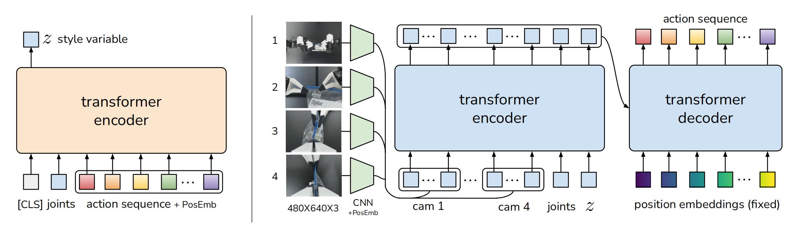
  </p>

- **[Diffusion Policy](./VA/Diffusion_policy/Diffusion_policy.md)**：借鉴视觉生成领域的 Diffusion 机制，从纯高斯噪声开始，在视觉观测的“条件引导”下，通过**多步迭代去噪**，生成一段连续的机器人动作序列。Diffusion 机制天生具备**强大的多模态生成能力和极其稳定的训练过程**，有利于解决人类示教数据存在的多模态性（例如面对同一障碍物，人类有时从左边绕，有时从右边绕）。

  <p align="center">
    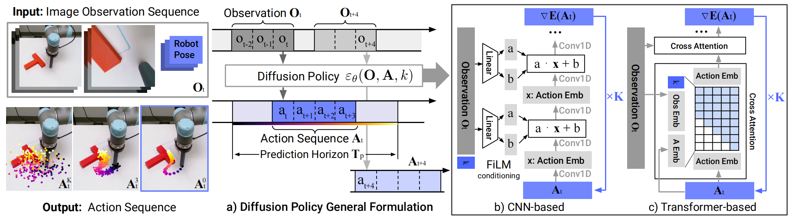
  </p>

<a id="vla"></a>

## VLA：从语言、视觉到动作的通用机器人 Policy

> 研究动机：单纯 VA Policy 通常不具备泛化性，只能应对单个任务，无法支持新指令、新物体和新任务组合；而 VLM 已经从互联网规模数据中学到了**丰富的语义知识、物体概念、空间关系和指令理解能力**，因此可以把**这些知识迁移到机器人控制中**，提升泛化性。

### 代表工作

#### Autoregressive VLA（自回归 VLA）

> 早期的 VLA 通常继承传统大模型的**自回归生成机制**，代表工作如 RT-2、OpenVLA 等。这类工作的核心思想是**把机器人动作离散化（通常是分成 256 个 bin）为类似语言 token 的形式，让 VLM 可以像生成文本一样生成动作**。

- **[RT-2](./VLA/RT系列/RT2.md)**：直接在强大的预训练 VLM（PaLI-X 5B/55B 和 PaLM-E 12B）上进行**联合微调**（机器人数据 + 原始的网络图文数据），将 VLM 在互联网规模数据上学到的丰富语义知识和推理能力迁移到机器人的底层控制中，得到端到端的 VLA 模型。

  <p align="center">
    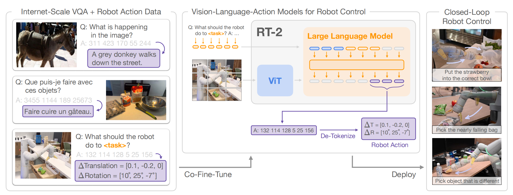
  </p>

- **[OpenVLA](./VLA/OpenVLA/OpenVLA.md)**：同 RT-2 一样直接继承强大的预训练 VLM（Prismatic-7B）训练得到。架构上采用**融合视觉编码器**，由 SigLIP 和 DINOv2 分别提取粗粒度和细粒度信息。模型完全**开源**，解决了此前 VLA 多为闭源、难以复现的问题。

  <p align="center">
    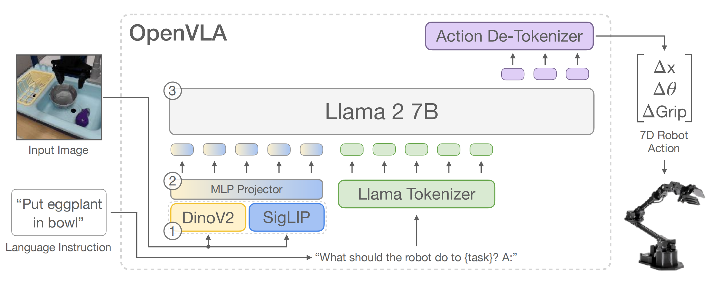
  </p>

#### Diffusion / Flow Matching based VLA

> 目前大部分的 VLA 模型通常采用**基于 Diffusion 或 Flow Matching 机制**来输出动作，代表工作如 $\pi_0$、RDT 等。相比于自回归方式，这类模型能够**并行**输出**连续**动作，有助于提高动作执行频率和精度，使得能够完成高度灵巧的任务。

- **[$\pi_0$](./VLA/π系列/π0.md)**：MoT 架构（预训练 VLM + **Flow Matching Action Expert**），使用预训练的 VLM 提取视觉和语言特征作为 Condition，然后通过 **Flow Matching** 生成连续动作，极大提升了机器人动作频率（50 Hz）和精度，使得能够完成高度灵巧的任务。

  <p align="center">
    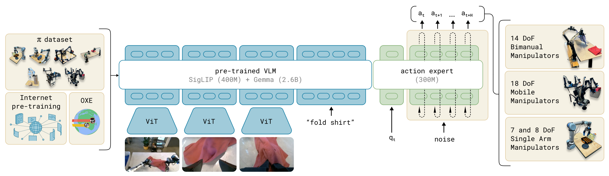
  </p>

- **[RDT](./VLA/RDT/RDT.md)**：面向双臂 manipulation，提出**统一动作空间**（128 维向量空间，预先划分好了各种可能用到的专属物理量槽位），使得模型能够打破物理形态壁垒，进行**跨机器人实体预训练**，从而学习可广泛迁移的物理控制先验知识。

  <p align="center">
    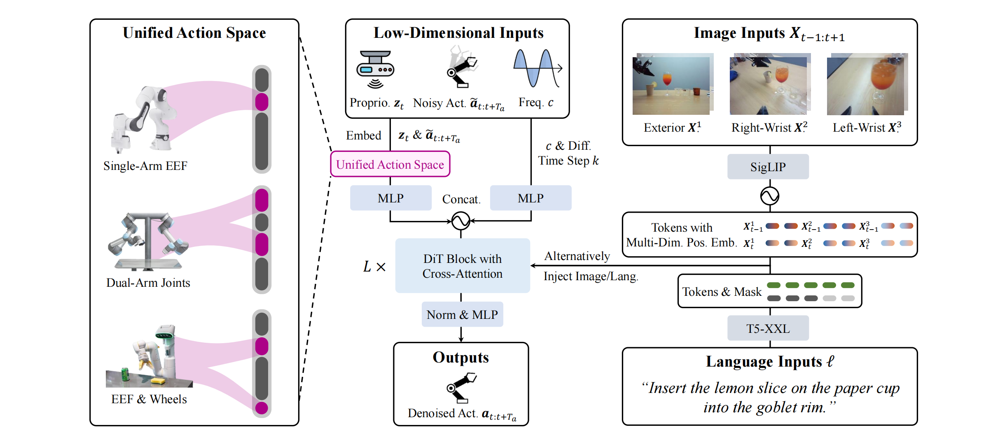
  </p>

#### Heterogeneous-Data Co-trained VLA

> 核心思想是**通过大规模异构数据联合训练提升 VLA 的泛化能力**，代表工作如 $\pi_{0.5}$、Qwen-VLA 等。相比只在机器人遥操作数据上训练，这类方法会混合使用跨机器人数据、真实机器人数据、仿真数据、人类视频、通用视觉语言数据等，使模型同时获得语义理解、任务分解、跨实体迁移和底层动作生成能力。

- **[$\pi_{0.5}$](./VLA/π系列/π05.md)**：基于 $\pi_0$ 架构，提出了一种全新的**联合训练**框架。它不仅使用目标移动机器人的数据，还大量引入了非移动机器人数据、实验室跨实体数据、高级语义子任务预测任务、人类口头指令以及多模态网络数据（如图像描述、VQA、边界框目标定位）。通过这种**异构数据**的联合训练，$\pi_{0.5}$ 实现了在**完全未见过的真实家庭环境**中执行长程、复杂的多阶段家务任务。

  <p align="center">
    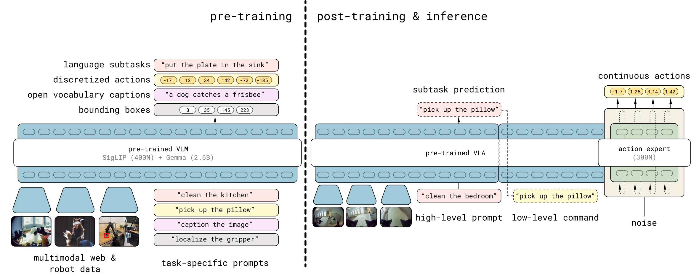
  </p>

- **[Qwen-VLA](./VLA/Qwen-VLA/Qwen-VLA.md)**：构建**大规模异构联合预训练数据混合集**，涵盖多机器人操作轨迹、人类第一视角演示、仿真合成、导航及通用 VLM 数据，通过**四阶段渐进式训练 pipeline**（action-only 预训练 $\rightarrow$ 多模态持续预训练 $\rightarrow$ SFT $\rightarrow$ RL），将 manipulation、navigation、人类第一视角轨迹和 trajectory-centric 任务统一到一个动作-轨迹预测框架中。

  <p align="center">
    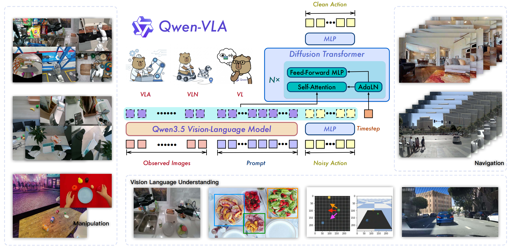
  </p>

#### RL-Enhanced VLA

> 核心思想是在模仿学习得到的 VLA 基础上，引入**强化学习**或**自主试错机制**进一步提升性能，代表工作如 $\pi_{0.6}$。

- **[$\pi_{0.6}$](./VLA/π系列/π06.md)**：引入了**强化学习**的思想，故意让模型去现实世界碰壁，并在快要失败时**让人类接管纠正**，为模型提供了极其宝贵的**“逆境恢复”**数据，从而提升鲁棒性、任务成功率和对新环境的适应能力。模型架构上，在 $\pi_{0.5}$ 基础上引入**价值网络**，学会自己评估状态好坏、计算优势值，并通过**优势加权流匹配（AWFM）**来迭代提升模型策略。

  <p align="center">
    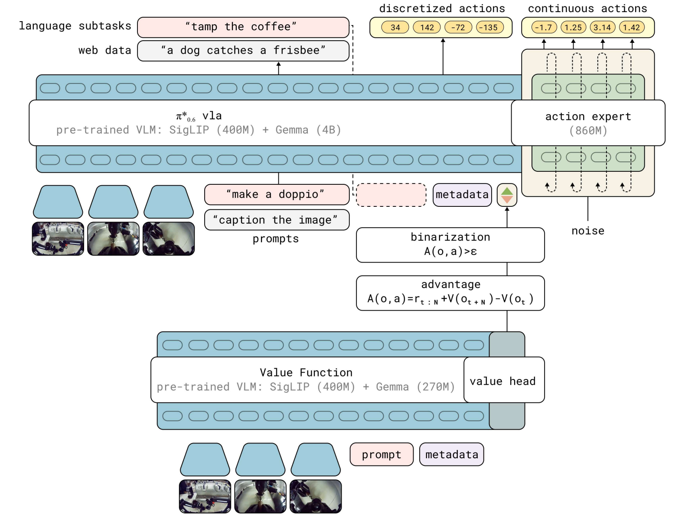
  </p>

#### World-Model-Guided VLA

> 核心思想是**用世界模型预测未来状态或子目标，再用这些预测结果指导 VLA 生成动作**，代表工作如 $\pi_{0.7}$。

- **[$\pi_{0.7}$](./VLA/π系列/π07.md)**：引入**“多模态提示词”**，不仅告诉模型“要做什么（What）”，还包含**关于策略和任务表现的元数据以及子目标图像**，告诉模型“怎么做（How）”。这种设计解决了混合次优数据带来的模糊性，使得模型不仅能吸收庞杂且低质量的数据而不受损，反而能够从中学习并展现出强大的开箱即用能力、跨实体泛化能力和零样本组合泛化能力。

  <p align="center">
    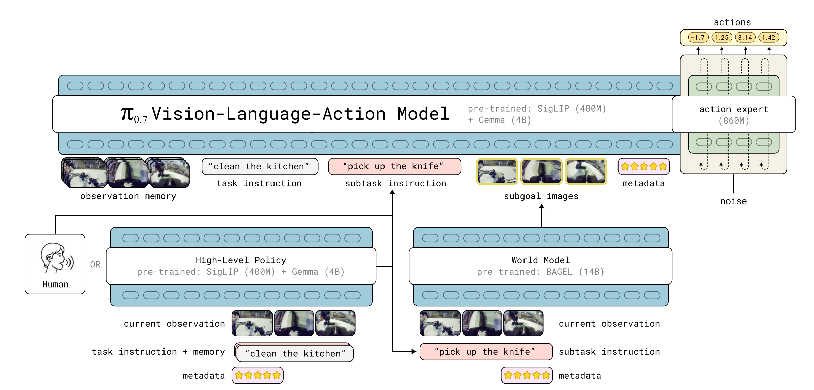
  </p>

#### Dual-System VLA

> 核心思想是**将高层语义推理与低层连续控制拆成快慢两个系统**，代表工作如 GR00T N1。慢系统通常由 VLM / LLM 负责理解图像、语言指令、任务语义和高层计划；快系统通常由 Diffusion Transformer 或 Action Expert 负责实时生成连续动作。

- **[GR00T N1](./VLA/GR00T系列/GR00T_N1.md)**：采用“**快慢系统（Dual-System）**”架构：慢系统 **System 2** 使用预训练 VLM 处理视觉和语言，负责语义理解与任务解释；快系统 **System 1** 使用基于 Flow Matching 的 Diffusion Transformer 生成高频连续动作，负责实时闭环控制。此外，GR00T N1 使用一个“**数据金字塔**”组织训练数据：底层是大规模 web data / human videos，中层是 simulation data 和 neural generated trajectories，顶层是真实机器人轨迹，从而在规模、泛化性和真实执行 grounding 之间取得平衡。

  <p align="center">
    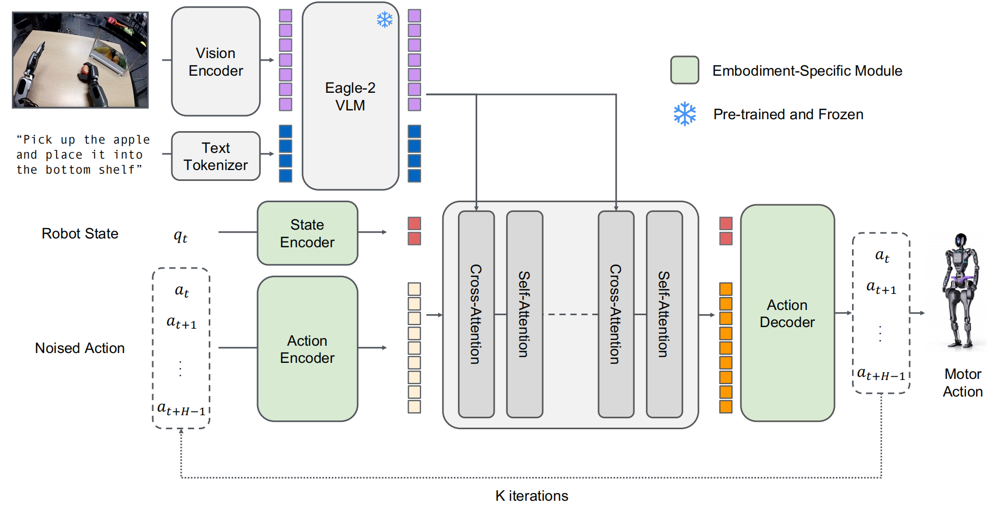
  </p>

<a id="wam"></a>

## WAM：从 Reactive Policy 到 Predictive Policy

> 研究动机：VLA 通常是 reactive mapping，即从当前观测和语言直接输出动作 $p(a|o,l)$，但不显式建模“如果执行某个动作，世界会如何变化”。这在长时程任务、接触丰富任务、遮挡场景、失败恢复和物理常识推理中会受限。WAM 定义为联合预测未来状态和动作的 embodied foundation model，即建模 $p(o',a|o,l)$，目标是让 Policy 具备 physical foresight。

### 代表工作（关注 Joint WAM 中的 Diffusion-based Generation）

#### Unified-stream（多个分支分别处理 World 和 Action）

- **[Motus](./WAM/Motus/Motus.md)**：基于 MoT 架构，通过共享注意力机制集成了**三大预训练专家**（视频生成器、动作专家和视觉语言理解专家），**能够在五种不同的推理模式（WM, VLA, IDM, VGM, WAM）之间自适应切换**。利用**光流**将视觉动态编码为像素级的“增量动作”，使模型能够**利用无标签的视频进行大规模的动作预训练**，并统一了不同机器人的动作模式。

  <p align="center">
    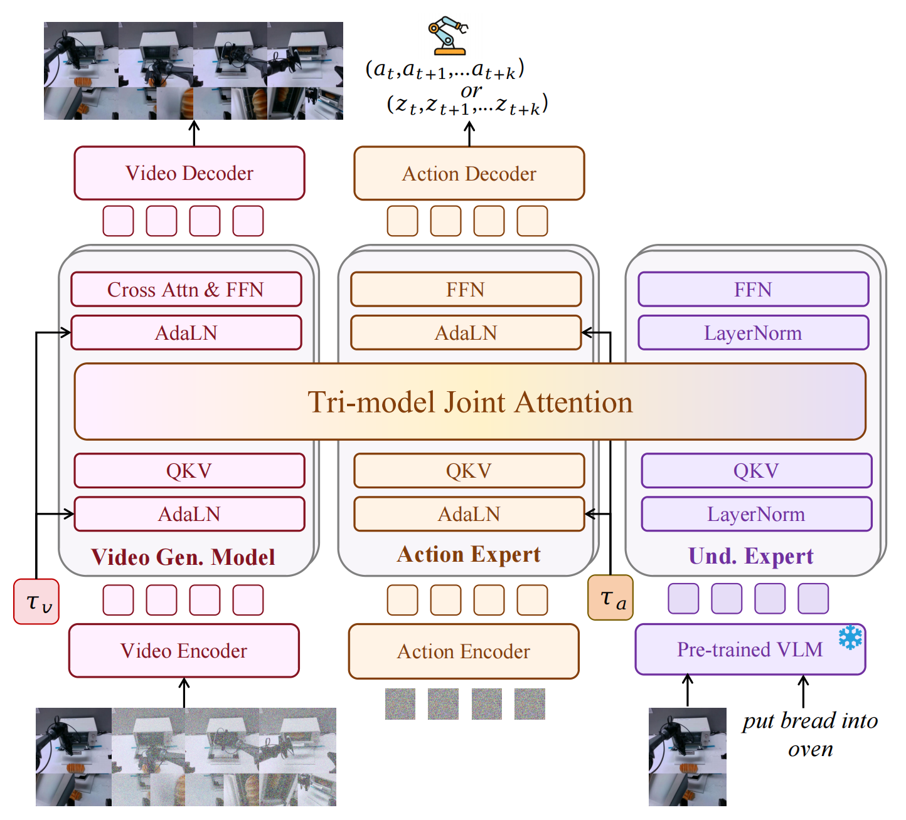
  </p>

- **[LingBot-VA](./WAM/LingBot-VA/LingBot-VA.md)**：基于 **Flow Matching** 框架在一个连续的潜在空间中以**自回归**的方式**交错生成**视频和动作块。**通过预测未来视觉动态再从中提取动作**，模型自然拥有了物理演化的理解能力。架构上采用共享隐空间的 MoT。推理时，采用**异步协调流水线**将动作预测与电机执行并行化，使用 **KV Cache** 缓存所有历史观测和动作，保存模型的长期记忆。

  <p align="center">
    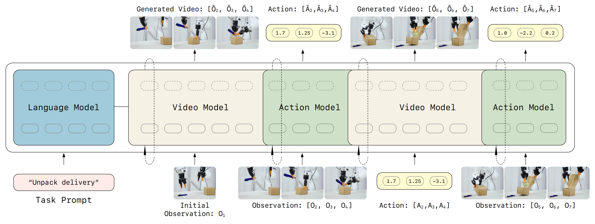
  </p>

- **[FastWAM](./WAM/Fast-WAM/Fast-WAM.md)**：在训练阶段保留了视频协同训练，但在测试阶段跳过了未来画面的预测；通过对比实验证明，WAM 的优势主要来自于视频协同训练目标本身，而推理时的未来生成并非关键；运行延迟仅为 190 毫秒，比现有的“先想象后执行”的 WAM 快 4 倍以上。

  <p align="center">
    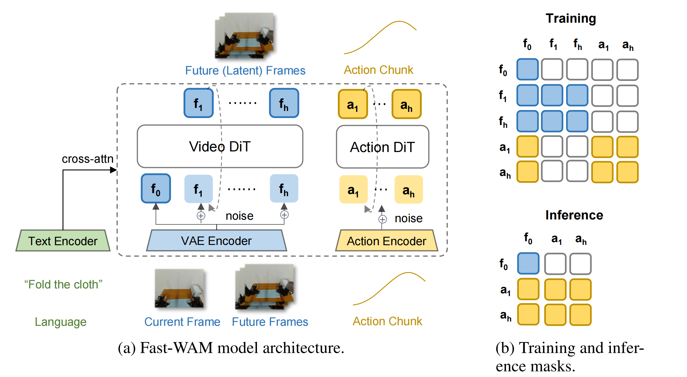
  </p>

#### Multi-stream（一个主干同时处理 World 和 Action）

- **[CosmosPolicy](./WAM/CosmosPolicy/CosmosPolicy.md)**：基于预训练视频模型 Cosmos-Predict2-2B 构建，**没有任何架构修改，仅通过在机器人演示数据上进行单阶段微调**，利用原生的扩散学习目标来联合建模所有模态；将机器人的本体状态、动作块以及未来状态的预期价值**伪装并编码为潜空间中的“帧”**，无缝插入到视频模型原有的潜在扩散序列；通过收集策略部署过程中的回放数据，Cosmos Policy 能够**从经验中学习**，优化其世界模型和**价值函数**。在推理时使用 **Best-of-N 采样**规划，通过生成动作候选、想象未来状态并**按预期价值排序**，显著提升了复杂任务的成功率。

  <p align="center">
    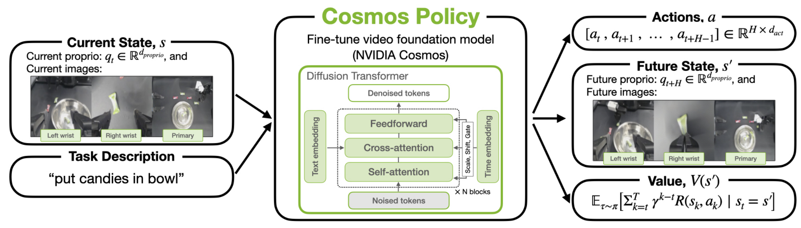
  </p>

- **[DreamZero](./WAM/DreamZero/Dream-Zero.md)**：基于预训练视频扩散模型 Wan2.1-12V-14B 构建，继承了视频模型中海量的物理演化先验规律，联合生成未来的“视频画面”与“动作指令”；采用了自回归 DiT 架构，利用 **KV Cache** 与 **DREAMZERO-Flash** 技术，成功将推理速度提升了 38 倍，实现了约 **7 Hz** 的实时闭环控制。

  <p align="center">
    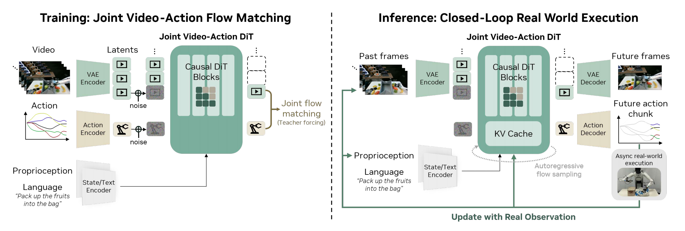
  </p>

<a id="notice"></a>

## 声明

本仓库仅用于个人学习和论文阅读整理。论文、图片及相关材料的版权归原作者、论文出版方或项目团队所有。
