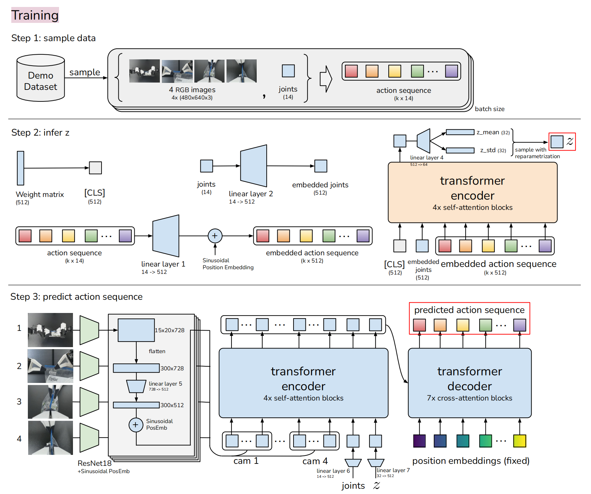
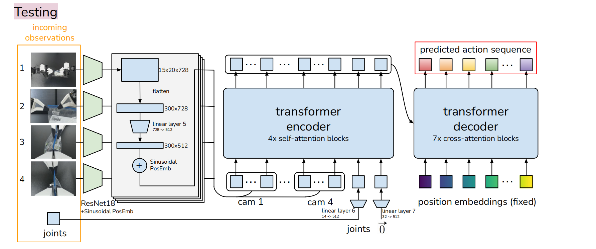

## ACT: Action Chunking with Transformers

### 一. 工作动机

- **核心痛点**：精细的机器人操纵任务（如穿线、安装电池、拉拉链）需要极高的精度、复杂的接触力协调以及闭环视觉反馈。传统方案通常依赖昂贵的高端硬件和繁琐的标定。在传统的模仿学习（如行为克隆 BC）中，**模型通常一次只预测下一步动作**。微小的执行误差会在长序列任务中不断累加，最终导致机器人偏离训练分布，任务崩溃。
- **核心思想**：提出一个低成本的开源硬件系统（ALOHA），并配套开发一种新颖的模仿学习算法——**带有 Transformer 的动作分块（ACT）**。通过**将连续的动作序列作为一个“块”进行并行预测**，有效克服误差累积和人类示教数据中的多模态/停顿问题。

------

### 二. ACT 模型与方法

ACT 的核心是将机器人策略建模为一个**条件变分自编码器（CVAE）**，并利用 **Transformer** 的非自回归特性实现高效的动作分块预测。

#### 2.1 核心理论基础：CVAE (条件变分自编码器)

为了学习人类示教数据中充满噪声、多模态（同一种任务有不同的抓取习惯）的动作序列，ACT 使用了 CVAE 架构：

- **条件 $c$**：当前的客观环境，即机器人的视觉图像观测 + 当前关节位置。
- **生成目标 $x$**：未来 $k$ 个时间步的真实动作序列（动作块）。
- **隐变量 $z$**：代表人类动作的“风格”或“微观变数”（如偏左抓还是偏右抓、动作快慢）。
- **运行逻辑**：
  - **训练时（上帝视角）**：编码器看到真实的未来动作，提取出本次动作的风格分布（均值和方差），采样出 $z$，连同条件 $c$ 交给解码器还原动作。
  - **测试时（实机运行）**：丢弃编码器。给定当前环境 $c$，直接将隐变量 $z$ 设为标准先验分布的均值（即 **$z=0$**），让解码器生成在当前环境下最标准、最平均的动作轨迹。

#### 2.2 模型架构深度剖析

**① CVAE 编码器（仅训练时使用）**

- **输入设计**：输入当前的关节位置和真实的未来 $k$ 步动作序列。**注意：为了节省显存和加快计算，编码器不输入高维图像**，仅凭关节位置和动作轨迹已足够推断出动作风格 $z$。
- **`[CLS]` Token 的作用**：在输入序列的最前面附加一个随机初始化、可学习的 `[CLS]` 向量。在经过 Transformer Encoder 的自注意力交互后，这个 `[CLS]` 向量“汇集”了整个未来动作序列的宏观特征，最终通过它来预测隐变量 $z$ 的均值 $\mu$ 和方差 $\sigma^2$。
  - **在模型参数层面（跨越多个训练轮次）**：`[CLS]` 本质上是一个被随机初始化的、可学习的向量参数（类似于网络中的权重矩阵）。在每一次反向传播时，优化器会根据损失函数计算出的梯度来更新这个向量。它在训练中学习到的是一种**“如何向整个序列提问”的最佳初始状态**。
  - **在前向传播层面（处理单条数据时）**：当这个 `[CLS]` 向量进入 Transformer Encoder 后，它会通过自注意力机制与序列中的其他 token（如动作、图像特征）进行信息交互。在 Encoder 的最后一层，这个原本只包含“提问模板”的 `[CLS]` 向量，就已经**汇集了当前这条数据的全局上下文信息**。模型随后就是用这个汇集了信息的向量去预测隐变量 $z$ 的。

**② CVAE 解码器（策略网络，测试时的主力）**

- **特征融合 (Transformer Encoder)**：使用 ResNet18 提取 4 个相机的图像特征，加上 2D 位置编码后展平。将其与当前的关节位置特征、隐变量 $z$（均映射至 512 维）拼接，送入 Transformer Encoder 进行全局上下文融合。
- **并行生成 (Transformer Decoder)**：
  - **输入只有位置编码**：Decoder 的输入**不是真实的动作值**（如果输入是动作值，推理时只能采用自回归形式，那样速度太慢，同时也背离了“动作分块”的初衷），而是 $k$ 个固定的位置编码。
  - **物理意义（Action Queries）**：这 $k$ 个位置编码相当于 $k$ 个“提问卡片”或“占位符”（我是第1步、我是第2步...），它们带着时间顺序去交叉注意力层中检索 Encoder 提取的环境信息。
  - **无掩码双向注意力（No Causal Mask）**：与传统的自回归 NLP 模型（必须加 Mask 防止偷看未来）不同，机器人的物理轨迹是一条需要**全局联合优化**的曲线。去掉 Mask 允许第 1 步和第 $k$ 步的查询向量相互交换信息，使得预测出的整条轨迹在运动学上极其连贯和丝滑，实现了“以终为始”的宏观规划。

#### 2.3 核心机制：动作分块与时间集成

- **动作分块 (Action Chunking)**：一次性输出未来 $k$ 个目标关节绝对位置（而不是变化值）。这相当于一种**宏观长规划**，可以帮助得到更好的当前动作。
- **时间集成 (Temporal Ensembling)**：模型并不是预测了 $k$ 步就盲目执行到底。实际上，模型**每 1 帧都会重新预测一次未来 $k$ 步**。对于同一个未来时间步，会产生多个重叠的预测结果。ACT 采用指数衰减权重 $w_i = \exp(-m \cdot i)$ 对这些预测进行**加权平均**（越老的预测权重越低）。这起到了极佳的**微观平滑**作用，避免了动作的突兀抖动。

#### 2.4 损失函数与 KL 散度

总体损失函数由两部分组成：

$$ \mathcal{L} = \mathcal{L}_{reconst} + \beta \mathcal{L}_{reg} $$

- **$\mathcal{L}_{reconst}$ (L1 重建损失)**：促使解码器生成的动作序列尽可能贴近人类的真实演示动作。采用 L1 Loss 因为它对精细位置序列的建模比 L2 更精确。
- **$\mathcal{L}_{reg}$ (KL 散度正则化)**：约束编码器预测的高斯分布 $\mathcal{N}(\mu, \sigma^2)$ 逼近标准高斯分布 $\mathcal{N}(0, 1)$。
  - **公式**：$D_{KL} = \int p(x) \log \frac{p(x)}{q(x)} dx = -\frac{1}{2} \left( 1 + \ln(\sigma^2) - \mu^2 - \sigma^2 \right)$
  - **目的**：测试时由于没有编码器，我们被迫给解码器喂入 $z=0$（标准正态分布的均值）。KL 散度就像一根皮筋，强行把训练时的分布拉向标准分布。这样测试时喂入 $z=0$ 才不会超出解码器的理解范围，从而生成合理且平滑的动作。

---

### 三. 训练和推理

#### a. 训练

#### b. 推理

------

### 四. 实验评估

- **数据集与硬件**：基于成本低于 2 万美元的 ALOHA 双臂远程操作平台（利用关节空间映射保证高带宽），收集了包含拉拉链、插电池等 6 个高精度真实任务的数据，每个任务仅需 10~20 分钟示教（约 50 条轨迹）。

* **核心研究问题与结论：**

  1. **ACT 与基线模型（BC-ConvMLP, RT-1, BeT 等）相比表现如何？**
     - **结论**：ACT 在所有精细任务上取得了压倒性的优势。在插电池和拉拉链等任务中，基线方法由于极严重的误差累积，最终成功率几乎为 0，而 ACT 达到了 96% 和 88% 的极高成功率。

  2. **动作分块（$k$ 值）和时间集成的具体影响？**
     - **结论**：分块大小 $k$ 的选择至关重要。$k=1$（单步预测）时成功率接近 0；随着 $k$ 增大，成功率飙升（在 $k=100$ 时达到峰值）。但如果 $k$ 过大（如 $k=400$，接近整个任务长度），模型在双向注意力下导致严重的“注意力污染”（远期误差反向污染近期规划），成功率开始下降。时间集成则进一步提升了各基线和 ACT 的动作平滑度与成功率。

  3. **CVAE 在处理人类数据时的必要性？**
     - **结论**：在完美的模拟器脚本数据中，去掉 CVAE 影响不大。但在包含多模态和噪声的**人类示教数据**中，移除 CVAE 导致成功率从 35.3% 暴跌至 2%。这证明了 CVAE 对于吸收人类动作“风格变数”的不可替代性。

  4. **高频控制的必要性（50Hz vs 5Hz）？**
     - **结论**：用户研究表明，将 ALOHA 系统的控制频率从 50Hz 降至 5Hz，远程操作完成任务的时间增加了 62%。高频低延迟的响应对于需要微操接触和视觉闭环的精细任务是物理层面的刚需。

- **局限性**：受限于低成本平行夹爪和电机的扭矩，系统难以完成需要多指协作（如拧紧瓶盖）或使用指甲的极限任务。由于缺乏更强的基础视觉语义预训练（相较于 OpenVLA 等），ACT 在遇到视觉特征极不明显的物体（如透明糖果纸）时，感知依然容易失效。