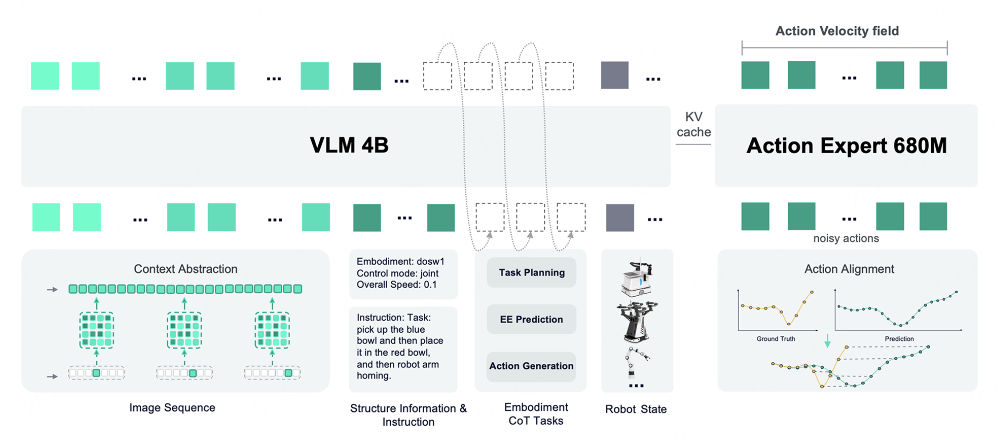
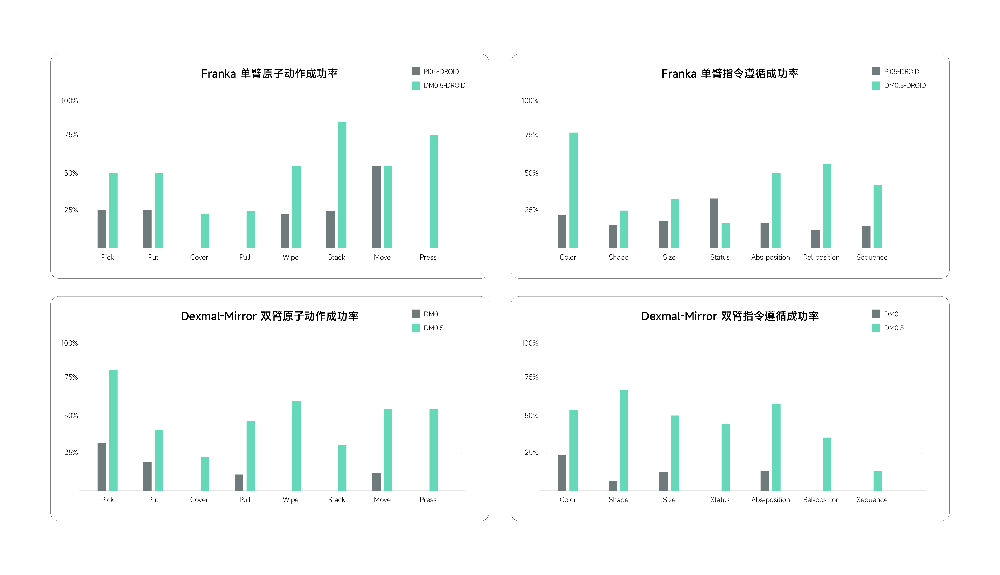
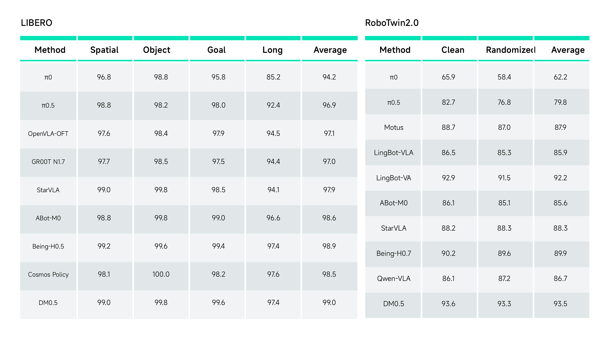
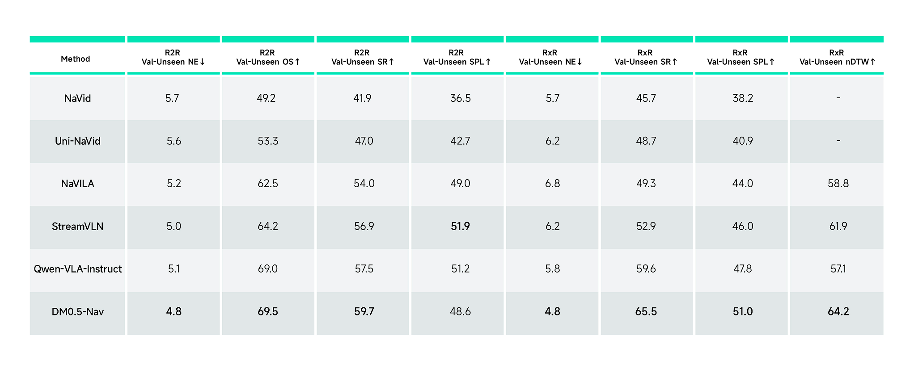

## DM0.5

> 论文：[DM0.5 官方技术博客](https://www.dexmal.com/blog/dm0.5)
> 项目：[DM0.5](https://www.dexmal.com/models/dm0.5)
> GitHub：[dexmal/opendm](https://github.com/dexmal/opendm)

---

### 一. 概述

**研究动机**：只依赖当前帧、在固定环境训练的 VLA，难以处理开放语言指令、长程任务和动态干扰。同时，遥操作示范存在执行快慢差异，固定时间对齐的动作监督容易让模型学习采集员的节奏，而非任务本身的动作规律。

**核心思想**：延续 DM0 的原生具身建模路线，以 4B VLM + 680M Action Expert 为基础，通过**历史信息融合**、**广泛的具身推理**、**动态动作匹配**和**多源数据清洗**，增强开放指令理解、任务记忆与连续动作生成。

---

### 二. 模型方法

#### 1. 整体架构

- **输入**：当前与历史图像、语言指令、机器人状态，以及本体、控制模式、速度等结构化信息。
- **VLM（4B）**：融合视觉、语言和任务上下文，承担自回归具身推理任务，并向动作专家提供 KV cache。
- **Action Expert（680M）**：接收带噪动作及 VLM 条件，通过 Flow Matching 预测动作速度场，生成连续 Action Chunk。
- **输出**：固定长度的未来动作序列，默认 chunk 长度为 50 步。

> 博客未给出 VLM 的具体底座名称、完整 attention mask、各输入 token 的精确排列及各机型动作维度

#### 2. Context Abstraction Layer：历史信息融合

从当前时刻向前取多个历史 slot，经过时间采样与空间抽样，将历史视觉信息压缩为**固定数量的 token**，再与当前观测一起输入模型。这样能够让模型在决策时获得一个短期情境记忆，为模型提供长达 **1 分钟**的任务进程状态变化，保留“杯子原来在哪里”“哪个区域已清理”等当前帧中缺失的信息，同时控制历史输入开销。

博客还采用**随机历史长度和历史增强**，使模型同时适应长历史、短历史和无有效历史的输入状态，降低了模型对固定历史窗口的依赖， 也让模型在历史缺失或部分失效时仍能退化到当前观测策略。

#### 3. Embodiment CoT：用语言表示任务进程

模型根据图像、机器人状态、任务指令和历史回答**受约束的问题**。博客将 11 类自回归任务归为三组，但未逐项列出全部任务：

| 类别 | 学习内容 | 对动作决策的作用 |
|---|---|---|
| 任务规划 | 当前阶段、前后步骤、任务进度 | 理解已完成什么、接下来做什么 |
| 事件与环境预测 | 任务边界、状态变化、未来关键事件 | 判断场景演化和阶段切换 |
| 动作生成 | 未来动作或动作语义摘要 | 形成未来动作意图的表征 |

这是训练中的联合监督设计，把机器人数据从单一动作监督扩展为“**指令理解、时序推理和动作生成**”的联合监督。模型不只学习当前画面对应的动作， 还学习在当前指令和任务进程下为什么应该执行这段动作，以及未来世界状态会发生的变化，从而提升复杂长程任务中的指令遵循、 动作连贯性和任务完成率。

> 博客没有明确要求部署时每个 chunk 都先显式生成完整 CoT，不能直接等同于固定的“先输出推理文本、再执行动作”流程。

#### 4. Trajectory Alignment Layer：动态动作匹配

核心是将监督从**固定时间点对齐**改为**轨迹进展对齐**：

1. 模型预测固定长度的未来动作片段，数据侧保留更细粒度的真实轨迹。
2. 为每个预测动作选择一个真实动作锚点，匹配索引必须严格递增，避免时间反转。
3. 根据预测动作与候选锚点之间的误差，用动态规划求整体匹配损失最小的锚点序列。
4. 同时考虑相邻锚点之间的轨迹连续性，防止只匹配容易的点、跳过关键动作过程。

**直观理解**：两次示范都经历“接近→抓取→抬起”，但完成抓取的时间不同。动态匹配允许动作按实际进展对齐，同时保留事件的先后关系与中间运动约束。

> 博客未公开完整点误差公式、连续性代价，以及它与 Flow Matching 损失的精确组合方式。

---

### 三. 训练流程

#### 1. 训练数据与清洗

| 数据类型 | 来源或覆盖范围 | 主要作用 |
|---|---|---|
| 机器人操作 | 松灵 ALOHA、Galaxea R1 Lite、AgiBot G1、Franka、UR5、ARX5、Dexmal 自研双臂移动机器人等 | 学习多本体操作与连续动作 |
| 具身导航 | 开源视觉语言/开放词汇导航数据、自采 3D 重建场景导航数据 | 长指令理解、路径决策 |
| 第一人称人类操作 | 日常生产环境中的手部交互、工具使用与物体操作 | 补充细粒度操作经验 |
| 通用视觉语言 | 图像、视频、视觉指令，以及自动生成的空间与状态推理数据 | 保持开放词表理解，增强时序与空间推理 |

> 博客未披露总小时数、轨迹数、各来源混合比例，以及人类操作视频是否具有可直接用于动作监督的标签。

数据清洗包含五类处理：

1. **异常值去除**：去除不可达状态、突变动作，以及视觉运动与状态/动作记录不一致的片段。
2. **静止帧去除**：移除了长时间无有效状态变化或动作变化的静止片段，以提升数据的有效动作密度。
3. **无价值动作去除**：过滤与目标无关、意图不明确或执行不到位的行为。
4. **动作模式去重**：对近似等价的末端运动统一关节表示，减少相互冲突的监督。
5. **错误标签重标注**：通过自动跨模态一致性检查修正子任务标签。

#### 2. 训练与优化

1. **构造上下文**：采样历史 slot，使用随机历史长度与历史增强，使模型适应长历史、短历史及无有效历史。
2. **多源混合预训练**：机器人操作数据构成动作学习的主体， 视觉语言数据用于维持视觉主干的开放词表理解和空间推理能力，导航数据提供长指令理解与路径决策监督， 视频理解数据进一步增强模型的时序建模、事件理解和动态场景表征能力。
3. **分组优化**：VLM 使用较小学习率以减轻遗忘，Action Expert 使用较大学习率充分学习动作分布；采用混合精度、分布式训练及动作专家的独立训练优化，以支持长上下文、多相机输入和 history token 带来的额外计算开销。
4. **下游 Fine-tuning / SFT**：针对目标任务与本体进行适配。博客强调可通过后训练迁移到未见机型，并展示操作、导航及记忆任务结果。

---

### 四. 推理流程

1. 获取当前图像、机器人状态、指令与有效历史，构造视觉上下文及本体相关条件。
2. VLM 编码上下文，向动作专家提供 KV cache。
3. Action Expert 从带噪动作出发，默认进行 **10 次 Flow Matching steps**，生成 **50 步 Action Chunk**。
4. 执行动作并根据新观测继续决策。

| 部署硬件 | 博客报告的优化后推理速度 |
|---|---:|
| 单张 RTX 4090 | 10 Hz |
| 单张 H100 | 20 Hz |

---

### 五. 实验

#### 1. 实验设置

* **Zero-Shot**
  * 8 类原语：pick、put、move、pull、cover、wipe、stack、press；
  * 7 类约束：颜色、形状、尺寸、状态、序列、相对/绝对位置；
  * Franka 上比较 π0.5-Droid 与 DM0.5-Droid，Dexmal-Mirror 上比较 DM0 与 DM0.5。
* **Fine tuning**
  * 抓取真机：RoboChallenge Table30 v2
  * 抓取仿真：LIBERO / RoboTwin2.0
  * 导航仿真：R2R / RxR
* **历史记忆能力**
  * 短程情境记忆（拿起杯子擦桌子）：机器人需要先拿起杯子，让杯子下方的桌面区域暴露出来；随后擦拭桌面； 最后将杯子放回最初的位置。
  * 长程情境记忆（人类示范学习）：在任务开始，人类会先进行一次规则展示，机器人需要观察示范中电池的放置方式， 并在后续机器人执行阶段保持这一规则。
* **策略鲁棒性**
  * 相机变化：Franka 上固定腕部相机、移动两台第三视角相机，设计了左右两侧各三个不同拍摄位姿，共计九组测试配置。
  * 人为干扰：目标与容器位置移动、短时遮挡

#### 2. 实验结果

##### Zero-Shot 真机

DM0.5 在绝大多数评测维度上均显著优于 PI05-Droid 和 DM0

##### RoboChallenge Table30 v2

* DM0.5 在 Table30 v2 上取得了 SOTA 的整体效果，整体 Success Rate 为 43%，综合 Score 为 54.42；
* DM0.5 不仅在记忆型任务上受益明显，也能在双臂协同和精细操作任务中保持领先表现。

| 方法      | Success Rate |     Score |
| --------- | -----------: | --------: |
| π0.5      |        14.3% |     31.48 |
| **DM0.5** |    **43.0%** | **54.42** |

##### LIBERO / RoboTwin2.0

**R2R / RxR**：在 R2R Val-Unseen 数据集上，其 Navigation Error（4.8） 和 Success Rate（59.7） 均达到最高。 在更具挑战性的 RxR Val-Unseen 数据集上，DM0.5-Nav 在所有四项指标上均位居第一。

##### 历史记忆能力

博客以视频案例展示：

* 拿起杯子擦桌子：DM0.5 可以通过历史视觉记忆恢复杯子的初始位置，并在任务结束时完成复位，验证了模型能利用近期历史追踪物体状态和任务进度；
* 人类示范学习：DM0.5 同样使用超过一分钟的历史视觉信息，使模型能够将早期示范转化为后续操作策略，并在跨阶段执行中保持规则一致性，验证了模型能保留早期示范并将其约束到后续机器人动作中。

##### 策略鲁棒性

博客以视频案例展示：

* 相机变化：尽管第三视角相机的位置发生变化，整体任务成功率仅呈现轻微波动，未出现系统性显著下降， 表明模型在不同视角条件下具备较强的鲁棒性；
* 人为干扰：在 Dexmal-Mirror 机型上，DM0.5 在人为移动目标以及短时遮挡的情况下，仍能保持对当前场景的理解，并持续推进任务流程。 当容器位置和朝向发生变化后，模型没有依赖原始固定轨迹，而是根据新的视觉状态重新调整机械臂末端位置与动作方向，继续完成对目标物体的操作。
