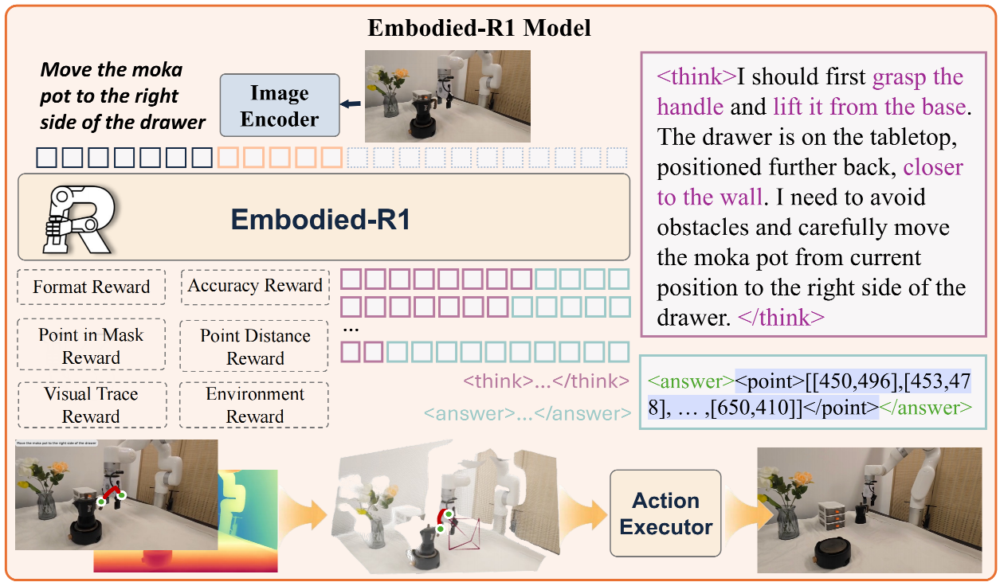
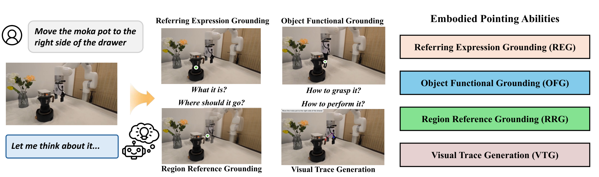
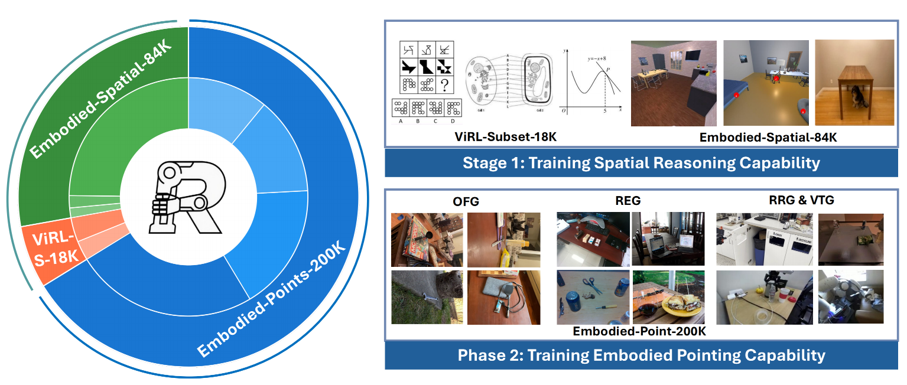

## Embodied-R1: Reinforced Embodied Reasoning for General Robotic Manipulation

### 一. 工作动机和核心思想

**工作动机**：本文旨在解决当前具身智能领域中的一个核心难题：**“从看到做”的鸿沟** 。即便是强大的视觉语言模型（VLM），也难以将丰富的视觉理解能力可靠地转化为机器人在物理世界中的有效动作 ，尤其是在未曾见过的新场景中。作者将这个鸿沟主要归因于两大挑战：

- **数据稀缺性**：高质量、带有物理交互的具身机器人数据量有限，难以支撑模型将语言和视觉与物理动作进行充分的“接地” 。
- **机器人异构性**：机器人硬件形态各异（如不同的机械臂、夹爪等），导致在一个机器人上学到的动作策略很难直接迁移到另一个形态不同的机器人上 。

**核心思想**：为了应对上述挑战，本文提出了一套全新的范式：**以“指向”为桥梁，通过“强化学习”来精通**。

- **核心概念：“指向”**
  - 不让模型直接输出与机器人本体硬件相关的底层动作指令，而是输出一个**统一的、与机器人形态无关的中间表示——“指向”** 。
  - “指向”是一种高度抽象和通用的指令，就像人用手指在图像上指出位置或规划轨迹一样，作为连接高层VLM和底层策略模型的桥梁，具体包括四大核心指向能力：**指代表达式定位 (REG)**、**区域指代定位 (RRG)**、**物体功能性定位 (OFG)** 和 **视觉轨迹生成 (VTG)**
- **核心方法：“两阶段强化微调” **
  - 为了让模型真正“理解”而非“背诵”如何指向，本文摒弃了在指向任务上容易“多解困境”的监督学习（SFT），转而采用**强化微调 (RFT)** 的训练范式。
  - 训练过程遵循一个**两阶段过程**，第一阶段旨在建立模型扎实的空间推理基础，第二阶段则让模型精通上述四种指向能力。

通过这种方式，Embodied-R1模型旨在成为一个具备强大空间推理和精确指向能力的通用“指挥官”，其输出的“指向”信号可以灵活地被下游不同的机器人执行器所理解和执行，从而实现强大的零样本泛化能力 。

---

### 二. VLM 架构

**基本架构**：Embodied-R1 的核心是一个经过特殊训练的视觉语言模型（VLM），其架构建立在一个强大的开源模型基础之上，并通过新颖的训练方法注入了物理世界的推理能力。

- **基础模型**：模型采用了 **Qwen2.5-VL-3B-Instruct** 作为其初始骨干模型 。
- **核心组件**：其架构遵循主流的VLM设计，由三个关键部分组成 ：
  1. **视觉编码器 (Vision Encoder)**：一个视觉 Transformer（ViT），负责将输入的图像转换成模型能够理解的数字化视觉特征。
  2. **投影器 (Projector)**：一个连接模块，负责将视觉特征“翻译”并对齐到语言模型的特征空间中，实现视觉与语言的融合。
  3. **大型语言模型 (LLM)**：模型的大脑，负责处理融合后的多模态信息，进行推理思考，并以自回归的方式生成包含思考过程和最终答案的文本。

**四大指向能力**：为了将复杂的机器人操作解耦为通用的、与机器人硬件无关的指令，本文定义了四种核心的“具身指向能力”。模型通过生成图像上的像素坐标点来实现这些能力 。

- **指代表达式定位 (Referring Expression Grounding, REG)**
  - **定义**：根据自然语言描述，在图像中精确定位并指认出特定物体。解决了“**是什么？**”的问题。
  - **任务示例**：在一个杂乱的工具箱场景中，对于指令“**请把那把黄色的螺丝刀递给我**” ，模型需要准确输出一个落在该螺丝刀上的坐标点。
- **区域指代定位 (Region Referring Grounding, RRG)**
  - **定义**：根据物体之间的空间关系描述，在场景的“自由空间”中确定一个合适的位置。解决了“**要去哪里？**”的问题。
  - **任务示例**：对于指令“**把香蕉放在锅和纸板围栏之间**” ，模型需要理解“之间”这个相对空间概念，并输出一个位于锅和围栏之间的空闲区域的坐标点。
- **物体功能性定位 (Object Functional Grounding, OFG)**
  - **定义**：识别并指出物体上用于交互的关键功能性部位。解决了“**如何抓取/使用它？**”的问题。
  - **任务示例**：对于指令“**你需要抓住那个锅铲**” ，模型需要推理出，为了“抓住”锅铲，应该在它的**手柄**位置输出一个坐标点。
- **视觉轨迹生成 (Visual Trace Generation, VTG)**
  - **定义**：生成一个以物体为中心的、有序的坐标点序列，来规划物体在整个任务中的运动轨迹。解决了“**如何完成这个动作？**”的全流程问题。
  - **任务示例**：对于指令“**把记号笔放进罐子里**” ，模型需要生成一个包含8个点的序列：轨迹起点在记号笔上，中间点描绘出一条平滑的移动弧线，终点则在罐子的开口内部。

**动作执行器**

Embodied-R1 输出“指向”信号之后，需要进一步转化为机器人最终物理执行动作。文中提供了两种主要的执行方案 ：

**1. 可供性点分支 (-P)：告诉机器人“去哪儿”**

在这种模式下，Embodied-R1 扮演“**目标设定者**”的角色，而路径规划则交给专门的模块负责。

- **VLM 角色 (设定目标)**：Embodied-R1 通过 **OFG** 和 **RRG** 能力，预测出任务的关键点，例如抓取物体的位置点和放置物品的目标点 。
- **运动规划器角色 (规划路径)**：将这些关键点交给运动规划器 **CuRobo** 。CuRobo 的任务是计算出一条从起点到终点的、能够避开障碍物的安全路径 。
- **模块流水线**：
  1. **Embodied-R1**：输出关键点（如抓取点A，放置点B）。
  2. **CuRobo**：接收点A和点B，规划出一条无碰撞的3D运动路径。
  3. **机器人**：执行CuRobo规划好的路径。

##### **2. 视觉轨迹分支 (-V)：告诉机器人“怎么走”**

在这种模式下，Embodied-R1 扮演“**路径规划师**”的角色，直接设计出完整的动作蓝图。

- **VLM 角色 (设计路径)**：Embodied-R1 通过 **VTG** 能力，直接生成一条完整的、包含8个点的**2D视觉轨迹**。
- **翻译器角色 (坐标转换)**：一个程序模块负责将这条2D像素轨迹“翻译”成机器人可以执行的3D空间轨迹。
  - **第一步 (2D -> 3D)**：利用针孔相机模型和深度信息，将8个2D像素点映射为8个3D空间坐标点 。
  - **第二步 (离散 -> 连续)**：对这8个离散的3D点进行**插值**，形成一条完整、平滑的3D运动轨迹 。
- **模块流水线**：
  1. **Embodied-R1**：输出完整的2D视觉轨迹。
  2. **翻译器**：将2D轨迹转换为平滑的3D轨迹。
  3. **机器人**：直接按照这条3D轨迹进行运动。

---

### 三. 数据集格式（数据集怎么构建的）

**两阶段数据集**：本文的训练遵循一个两阶段过程，每个阶段使用专门构建的数据集来达成不同的学习目标。

- **第一阶段：空间推理** 
  - **Embodied-Spatial-84K**：包含8.4万个样本，用于训练模型的基础空间感知和推理能力。
  - **ViRL-subset-18K**：包含1.8万个样本，作为补充的通用知识数据集，为了防止模型在专攻机器人任务时遗忘通用知识。
- **第二阶段：具身指向 (Embodied Pointing)** 
  - **Embodied-Points-200K**：一个包含约20万个样本的高质量、大规模数据集，用于训练模型的四种核心指向能力。

**构建方式**：

* **第一阶段：空间推理数据集**
  * **Embodied-Spatial-84K**
    * **原始数据集**：聚合自 **SAT** 和 **WhatsUp** 这两个知名的空间推理基准测试集 。
    * **原始样本**： (图片, "问题文本", "答案文本")。
    * **关键处理**：为了便于模型评估和奖励设计，所有原始数据都被系统地、统一地转换为**选择题格式**。
    * **最终格式**：(图片, 带选项的问题文本, 正确选项)
  * **ViRL-subset-18K**
    * **原始数据集**：**ViRL39K**，一个包含多种常识性问答的数据集 。
    * **原始样本**：(图片, "问题文本", "答案文本")。
    * **关键处理**：移除了过难的问题，并平衡了不同主题和类型的问题，最终得到**1.8万个问答对**。
    * **最终格式**：(图片, "问题文本", "答案文本")，同样也可能被转换为多项选择题以统一格式。
* **第二阶段：具身指向数据集 (Embodied-Points-200K)**：统一采用 **“(问题, 验证信息)”** 的格式，以支持强化学习训练 。
  * **REG (指代表达式定位) 数据**
    - **原始数据集**：整合了通用网络图片数据集 **RefCOCO** 以及多个具身机器人数据集 **RoboRefIt** 和 **RoboPoint**。
    - **原始样本**：通常是 (图片, "指代描述文本", 目标物体的边界框)。
    - **关键处理**：对成功标准进行了关键调整：不再使用有模糊性的边界框，而是将验证信息改为**物体的分割掩码**。模型的目标从输出框变为输出一个落入掩码内的点 。
    - **最终格式**：(图片, "问题文本", {type:"mask", file:"mask.png"})。
  * **RRG (区域指代定位) 数据**
    - **原始数据集**：
      1. **2D部分**：大量的开源具身操作视频数据集（约100万份）。
      2. **3D部分**：来自 **YCB** 和 **Objaverse-XL** 的超过200个不同物体的3D物体模型 。
    - **关键处理**：
      1. **2D部分**：通过一个自动化流水线处理视频：
         1. 首先从视频**末尾帧**提取物体最终位置和轮廓，生成对应掩码；
         2. 分析该位置与场景中参考物的相对关系，生成对应的自然语言指令；
         3. 回到视频初始帧，根据上一步生成的表相对关系的自然语言指令，在指定位置生成掩码，作为物体放置的目标区域
      2. **3D部分**：使用 **Isaac Gym** 模拟器，随机抓取2到5个的3D模型并放置在虚拟桌面上，自动生成场景的**RGB+深度图**，根据模版 "Place object A in front of object B" 生成对应的**文本指令**。
    - **最终格式**：
      - **2D**：(图片, "问题文本", {type:"mask", file:"target_region_mask.png"})
      - **3D**：(RGB图, 深度图, "问题文本", 模拟器奖励函数)
  * **OFG (物体功能性定位) 数据**
    - **原始数据集**：**HandAL** 数据集，其中包含了物体可操作部件的精细标注 。
    - **原始样本**：(物体图片, 部件标注)，原始标注可能是掩码或多边形。
    - **关键处理**：
      1. 将原始的部件标注转换为**边界框**作为验证信息 。
      2. 使用 **GPT-4o** 模型**改写和生成**与功能相关的自然语言问题，增强问题的多样性和泛化性 。
    - **最终格式**：(图片, "问题文本", {type:"bbox", coordinates:[x1,y1,x2,y2]})
  * **VTG (视觉轨迹生成) 数据**
    - **原始数据集**：机器人操作视频数据集 。
    - **原始样本**：机器人操作视频。
    - **关键处理**：通过一个复杂的自动化流水线处理视频：
      1. **识别关键物体**：用 GPT-4o 找出视频中被操作的核心物体 。
      2. **确定追踪起点**：用自监督关键点提取器等模型找到物体的抓取点，并为了鲁棒性**初始化三个追踪点** 。
      3. **追踪运动轨迹**：用 **CoTracker3** 追踪模型追踪这三个点，形成三条候选轨迹，并选择**最长**的那条作为最佳轨迹。
      4. **精加工与简化**：对最佳轨迹通过**三次样条插值**进行**平滑处理**，并最终**等距采样8个点**。
      5. **质量检查**：通过设定一些严格的规则（例如，如果物体的尺寸小于某个阈值，或者最终轨迹的长度短于某个阈值，就判定为不合格品并丢弃）来对数据进行进一步过滤。
    - **最终格式**：(图片, "问题文本", {type:"trace", points:[[x1,y1],...[x8,y8]]})

---

### 四. 微调过程

**训练流程**：遵循两阶段强化微调范式，采用基于GRPO的策略优化算法，其流程包含外循环和内循环。

* **两阶段强化微调（RFT）**

  * **第一阶段 (基础能力)**：用Embodied-Spatial-84K和ViRL-subset-18K混合训练，学习理解空间关系和通用知识。
  * **第二阶段 (专业技能)**：在具备基础能力后，用 REG/RRG/OFG/VTG 四大数据集混合训练，让模型精通四种核心的具身指向能力。

* **GRPO策略优化算法（单次外循环迭代）**：

  * **外循环：数据收集与准备阶段**

    * **第1步：同步策略**：将当前模型 $\pi_{\theta}$ (新策略)的权重赋值给副本 $\pi_{θ_{old}}$ (旧策略)，后者参数在本轮数据采集中保持固定。

    * **第2步：采样与缓存**

      - 从数据集中随机抽取一批大小为 $B$ 的输入数据 $x$

      - 对于这批 $B$ 个输入中的每一个，我们都用固定的旧策略 $\pi_{θ_{old}}$ 进行 $G$ 次独立的自回归采样，生成 $G$ 个候选答案 $\{y_i\}_{i=1}^G$

      - 在采样的同时，程序会计算并缓存每个生成的 token 在旧策略 $\pi_{θ_{old}}$ 下的（对数）概率 $\pi_{θ_{old}}(y_{i,t}|x,y_{i,<t})$，其将作为后续概率比率的分母

      - 至此，我们收集到了一个包含 $B \times G$ 个完整序列的“经验池”，每个序列都附带了其在旧策略下的生成概率。

    * **第3步：评估与计算优势**

      - 对于经验池中 $B \times G$ 个序列中的每一个，调用相应的奖励函数，计算出其奖励分数 $r(y_i,x)$

      - 根据下面的公式，计算并缓存每个 token 对应的优势值 $\hat{A}_{i,t}$
        $$
        \hat{A}_{i,t} = \frac{r(y_i,x) - \operatorname{mean}(\{r(y_1,x),\ldots,r(y_G,x)\})}{\operatorname{std}(\{r(y_1,x),\ldots,r(y_G,x)\})}
        $$

  * **内循环：策略优化阶段**：内循环旨在对新策略 $\pi_{\theta}$ 进行 $K$ 次迭代更新，对于每一次迭代：

    * **第4步：计算损失**

      * 将经验池中的所有 $B \times G$ 个序列，通过当前最新的、可训练的新策略 πθ 进行一次新的前向传播。

      * 这次前向传播的目的是得到每个词在新策略下的（对数）概率，这些值将作为概率比率的分子。

      * 利用之前缓存的旧策略概率以及优势值，根据下式计算损失函数
        $$
        \mathcal{L}(\theta) = \frac{1}{G} \sum_{i=1}^{G} \sum_{t=1}^{|y_i|} \min\left[
        \frac{\pi_{\theta}(y_{i,t} \mid x, y_{i,<t})}{\pi_{\theta_{\text{old}}}(y_{i,t} \mid x, y_{i,<t})} \hat{A}_{i,t},
        \operatorname{clip}\left(
        \frac{\pi_{\theta}(y_{i,t} \mid x, y_{i,<t})}{\pi_{\theta_{\text{old}}}(y_{i,t} \mid x, y_{i,<t})},
        1-\epsilon, 1+\epsilon
        \right) \hat{A}_{i,t}
        \right]
        $$

    * **第5步：更新策略**：反向传播，更新新策略 $\pi_{\theta}$ 参数

**奖励设计**：为了解决多任务学习中的“简单任务主导训练”问题，并为不同任务提供清晰的学习信号，本文设计了六大奖励组件$\{r_{\text{format}},r_{\text{acc}},r_{\text{mask}},r_{\text{dis}},r_{\text{trace}},r_{\text{env}}\}$，每个任务的奖励 $R$ 由这些组件加权求和得到，范围限制在 [0, 1] 区间。

* 格式奖励 $r_{\text{format}}$：检查输出是否遵循 <think>, <answer>, <point> 等预设格式，非0即1 ，且这是后续所有奖励计算的前置条件，格式错误则总奖励直接为 0 。

* 准确率奖励 $r_{\text{acc}}$：用于第一阶段的多选题任务，判断答案是否正确，非0即1 。

* 点在掩码内奖励 $r_{\text{mask}}$：用于指向任务，判断预测点是否落在目标掩码/边界框内，非0即1 。

* 点距离奖励 $r_{\text{dis}}$：一个密集的辅助奖励，根据预测点与目标中心的距离给分，距离越近分数越高，用于降低困难任务的学习门槛，避免模型因始终得0分而放弃学习 。

* 视觉轨迹奖励 $r_{\text{trace}}$：专用于VTG任务，通过计算预测轨迹与真实轨迹的均方根误差（RMSE）来评估相似度，其中若两条轨迹点数不一致，则总奖励直接为 0 。

* 环境奖励 $r_{\text{env}}$：用于 Isaac Gym 模拟任务，由模拟器直接返回任务成功（1）或失败（0）的信号 。

**关键训练超参数**：

- **骨干模型**：Qwen2.5-VL-3B-Instruct 。

- **优化器**：AdamW，学习率为1e-6，权重衰减为1e-2 。
- **批量大小**：128 。

- **GRPO采样数**：在强化学习训练中，为每个输入生成的候选答案数量（G）为8 。

- **KL惩罚系数**：1e-2 。

- **最大上下文长度**：4096个token 。

- **最大响应长度**：2048个token 。

---

### 五. 计算资源

* **硬件设备**：模型训练使用了 **8块 NVIDIA A100 40G GPU** 。
* **训练时长**：

  - 第一阶段（空间推理）训练了2个周期（epochs），耗时约 **48小时** 。

  - 第二阶段（具身指向）训练了1个周期（epoch），耗时约 **48小时** 。