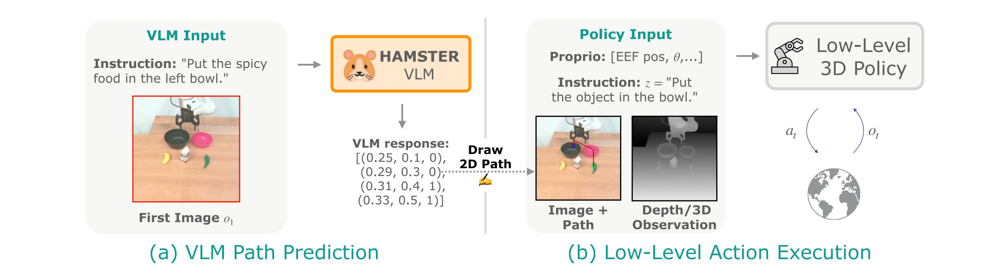

## HAMSTER: HIERARCHICAL ACTION MODELS FOR OPEN-WORLD ROBOT MANIPULATION

### 一. 工作动机

**核心问题**：当前主流的单体式 VLA 模型（如RT-2, OpenVLA）**严重依赖大规模的示例数据**，而这类数据的获取非常**昂贵耗时**，且**规模、质量和多样性也十分有限**。同时，其推理速度也**限制了在灵巧、动态任务上的应用**。相比之下，传统的小型模仿学习策略虽然在局部控制上表现出色，但缺乏长期规划和高级语义推理能力，**难以泛化到新场景和新任务**。

**核心思想**：将大规模 VLM 的**泛化优势**与小型策略模型的**执行效率和鲁棒性**相结合。关键洞察是**解耦**高级规划与低级控制，不让VLM直接预测动作，而是预测一个作为中间表示的**2D路径**。这种设计使得VLM可以利用大量廉价、易于获取且不含精确动作标签的**离域数据**进行训练 。

---

### 二. HAMSTER 模型

HAMSTER 是一种**层级式**视觉-语言-动作 (VLA) 架构，由两个解耦的模块构成 ：

1. **高级模块 (High-Level)**：一个经过微调的 VLM，负责接收初始图像和语言指令，进行高级语义推理，并生成一个粗略的**2D末端执行器轨迹路径**作为任务规划 。
2. **低级模块 (Low-Level)**：一个3D感知的模仿学习策略模型，负责接收VLM生成的2D路径作为引导，并结合机器人自身的实时观测（如本体感知、深度图）来生成精确、鲁棒的低级动作 。

这种层级式设计允许VLM专注于“做什么”和“大致怎么做”，而低级策略则专注于“如何精确地做”，从而实现了优势互补，既减轻了高层VLM在细粒度动作预测方面的负担，又降低了低层策略在复杂任务级推理上的压力。

* **高级模块**：VLM 路径生成器

  - **输入**：单张RGB图像 $img$ 和一句语言指令 $z$

  - **输出**：一个 2D 路径序列 $p=[(x_t,y_t,gripper\_opent)]_t$，其中 $(x_t,y_t)$ 是归一化的图像坐标，$gripper\_open$ 是夹爪开合状态

  - **模型**：基于开源的 **VILA-1.5-13b** 模型进行微调 。

  - **核心特点**：该模块完全在**离域数据集** 上进行训练，训练数据中不包含任何最终部署环境（即“在域”）的数据，以此来驱动模型的跨域泛化能力 。

* **低级模块**：路径引导的策略模型
  - **输入**：机器人本体感知 $s$，多模态观测 $o$，(如深度图像/点云)，语言指令 $z$ (可选)，以及**由高级 VLM 生成的 2D 路径 $p$** 
  - **输出**：机器人的低级动作指令 $a$
  - **模型**：可以是任何先进的模仿学习策略，论文中使用了 **RVT-2** 和 **3D-DA** 等 3D 感知模型 。
  - **核心特点**：
    - **路径融合**：通过将 2D 路径作为一个彩色的轨迹**叠加**在输入图像上（或另外开辟三个通道用来绘制彩色轨迹），从而为策略提供视觉引导，而无需对模型架构做重大修改 。
    - **在域训练**：该模块在一个小规模的、在目标机器人上采集的**“在域数据”** 上进行训练 。

---

### 三. 实验

* **数据和训练**

  * **VLM的离域训练**：
    - **数据集**：构建了一个不含精确动作标签的大规模、多源离域数据集 Doff 。
    - **数据构成**：
      1. **像素点预测数据** (770k样本)：来自 RoboPoint 数据集，用于学习物体与像素位置的对应关系 。
      2. **仿真机器人数据** (320k样本)：来自 RLBench 模拟器，用于学习通用的操纵逻辑和轨迹模式 。
      3. **离域真实机器人数据** (110k样本)：来自 Bridge 和 DROID 数据集，包含不同形态的机器人，用于增强在真实场景中的推理能力 。
    - **路径处理**：使用Ramer-Douglas-Peucker算法对原始轨迹进行简化，提取关键点，让VLM专注于高级规划 。

  * **低级策略的在域训练**：
    - 在目标机器人上采集少量（约320个episodes）的示教数据 。
    - 训练时使用的路径是“神谕路径”，通过将示教数据中的机器人真实运动轨迹（通过本体感知获得）投影到2D图像上生成得到，由此作为完美的引导信号 。
    - 采用标准的模仿学习目标进行训练 。

* **Q1: 模型是否能泛化到有显著视觉和语义变化的未知场景？**
  * **实验设置**: 在真实机器人上，跨越 7 个不同的泛化维度进行测试，包括未见过的物体-目标组合、视觉变化（光照、纹理、干扰物）、新的语言指令和空间关系、全新的物体等等。
  * **实验结论**: HAMSTER 在所有泛化维度上的表现都显著优于基线模型 ，平均成功率比强大的单体式模型 OpenVLA 高出 20%，实现了 50% 的相对性能提升，证明其能够有效地泛化到有巨大视觉和语义变化的场景中。
* **Q2：模型是否比单体式架构取得了更强的跨域泛化能力？**
  
  * **实验设置**: 将 HAMSTER（其VLM在离域数据上训练）与一个强大的单体式VLA模型OpenVLA进行对比，为保证公平，两者都在相同且小规模的在域数据集上进行了微调。
  * **实验结论**: HAMSTER 的平均成功率比 OpenVLA 高出 20%，相当于 50% 的相对性能增益 ，证明了其层级式架构在跨域泛化上的优越性。
* **Q3：模型是否有助于学习非抓取类和长时序任务？**
  * **实验设置**：评估任务不仅包括“抓取和放置”，还包括“按下按钮”和“推倒物体”等非抓取类任务 。此外，还在一些未被包含在域内训练集中的长时序任务（如开抽屉）上进行了定性评估 。
  * **实验结论**: 是的，HAMSTER 在所有任务类型（包括非抓取类）上的表现都优于 OpenVLA ，并且能够定性地展示出泛化到更复杂的长时序任务上的能力。

* ##### Q4：模型是否展现出很强的示教数据效率？

  - **实验设置**：在模拟环境中，将使用 50% 示教数据训练的 HAMSTER 与使用100%数据训练的基线模型进行性能对比。

  - **实验结论**：仅使用一半的示教数据，HAMSTER的成功率就达到了基线模型的两倍 ，表现出极高的示教数据效率。

* **Q5：模型的层级式架构和VLM微调是否提升了视觉和语义推理能力？**

  * **实验设置**：通过两组实验进行验证：一是测试模型在全新相机视角下的鲁棒性 ；二是测试VLM在处理需要世界知识或理解手绘草图等高难度语义任务时的表现 。
  * **实验结论**：HAMSTER对相机视角变化的鲁棒性远超OpenVLA；其在处理复杂的、未见过的语义任务时，表现优于像GPT-4o这样强大的闭源模型进行零样本生成的效果，且仿真数据提升了 HAMSTER 在现实世界的表现。

---

### 四、总结

- **主要贡献**：提出了一种层级式 VLA 架构 HAMSTER，通过**解耦高级规划和低级控制**，使VLM**能够利用海量的、廉价的离域数据**进行训练，从而在机器人开放世界操作中实现了**前所未有的泛化能力**。
- **三大优势总结**：
  1. **利用离域数据**：可利用无精确动作标签的仿真、视频等数据，打破了对昂贵示教数据的依赖 。
  2. **更强泛化能力**：实验证明其跨域泛化能力显著优于单体式模型 。
  3. **架构灵活高效**：允许低级策略使用丰富的3D传感器，且高级VLM和低级策略可以异步查询，保证了推理效率 。
- **局限性**：
  1. **缺乏3D理解**：VLM仅在2D空间进行预测，缺乏真正的3D空间推理能力 。
  2. **信息带宽有限**：2D路径仅能反应一些平移的位置信息，无法传递力、旋转等更丰富的操纵细节 。
- **未来工作**：研究可学习的、信息更丰富的中间接口；直接利用大规模人类视频数据来训练 VLM 。