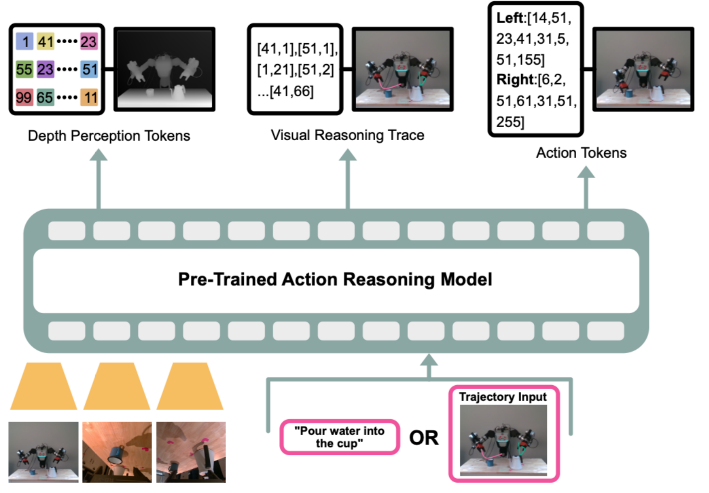
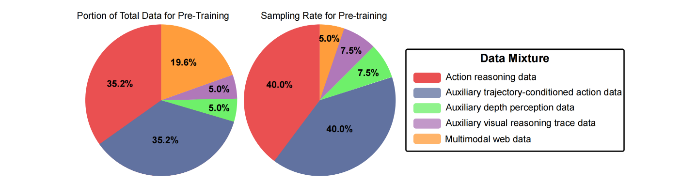

## MolmoAct：Action Reasoning Models that can Reason in Space

### 一. 工作动机和核心思想

**工作动机**：先前大多数机器人基础模型将视觉感知和语言指令**直接映射**到机器人控制指令，其内部决策过程不透明，像一个黑盒 。这导致了以下几个核心痛点：

- **适应性和泛化能力有限**：这种直接映射的模型在面对新任务、新场景或新机器人形态时表现得很“脆弱”，难以适应和泛化 。
- **缺乏可解释性**：当机器人执行失败或出现非预期行为时，很难理解其做出某个特定决策的原因，这给调试带来了巨大困难。
- **语义基础不牢固**：直接的像素到行为映射可能缺乏对物理世界和空间关系的深层理解，导致行为有时不符合常理 。

**核心思想**：正如人类在行动前会下意识地进行规划和推理一样，机器人应该学会“思考”，而不仅仅是“反应”。于是作者提出“**行为推理模型**” 范式，核心思想是**不再进行直接的端到端映射**，而是引入一个**结构化的三阶段推理流程**，将感知、规划和控制整合起来：

1. **感知3D结构**：首先，模型自回归地生成**深度感知词元**，来理解场景的三维布局和物体远近 。
2. **规划运动意图**：在理解了深度的基础上，模型继续生成**视觉推理轨迹**，这是一条可视化的、代表其未来运动意图的路径草图。
3. **执行接地动作**：最后，在同时以深度和轨迹为条件的情况下，模型生成最终的、精准的**动作词元** 。

---

### 二. VLM 架构

**基本架构**：MolmoAct 继承并扩展了其前身 Molmo 的 VLM 架构 ，遵循了经典的三段式设计，但针对机器人任务进行了专门优化。

- **核心组成**：
  1. **图像预处理器**：负责处理输入图像。针对 OpenAI CLIP 模型，它采用复杂的多尺度裁剪策略（一张全局图 + 若干局部图），并通过缩放和填充来保持图像原始长宽比，避免失真 。针对 SigLIP2 模型，则采用更简单的强制方形化缩放 。
  2. **视觉编码器**：采用 ViT 模型（如 OpenAI CLIP 或 SigLIP2）将每个图像Crop独立编码为图像块（patch）特征。
  3. **视觉-语言连接器**：作为桥梁，它从ViT的多个中间层提取并拼接特征以获得更丰富的表达 ，再通过注意力池化在保留局部空间结构的同时减少序列长度 ，最后用一个两层 MLP将视觉特征投影到LLM的嵌入空间中 。
  4. **大语言模型**：采用 Decoder-only 的LLM（如 Qwen2.5-7B 或 OLMo-2-7B）作为核心，处理融合后的文本和视觉 Token 序列，并自回归地生成输出 。
- **动作 Tokenization 优化**：256 个动作 bin 会映射到词汇表中 256 个最不常用词元上，但与传统方法映射到任意词元不同，MolmoAct 将相邻的动作 bin 映射到相邻的词元上，使得相邻动作的初始嵌入向量在数学上就很接近，为模型提供了符合物理规律的“先验知识”，从而显著加快了训练速度（训练时间减少了5倍以上） 。
  - 词汇表是“ ID $\leftrightarrow$ 词元内容 ”的映射，而嵌入表是“ ID $\leftrightarrow$ 词向量 ”的映射；
  - 这里的词元没有独立的语言学含义，其内容本身就是由字节（如â、½、ľ）直接构成的，也称为“底层字节级BPE符号”；
  - 文中给出的映射示例：0 $\leftrightarrow$ \u00e2\u00bd\u0139，这里的“u00e2\u00bd\u0139”是一个Unicode转义序列，会被解码为相应的字符串，此处被解码为“ â½ľ ”，而“ â½ľ ”这个字符串本身，既是这个词元（Token）的内容，也是上一点以及文中所说的那个“底层字节级BPE符号” 。

**三阶段结构化推理**：这是 MolmoAct 与传统端到端VLA模型的根本区别，模型不是直接输出动作，而是遵循“感知-规划-行动”的逻辑，自回归地依次生成三个部分的Token序列 。

1. **第一步：感知3D结构 (Sensing)**

   - **输出**：**深度感知词元** 。
   - **原理**：自回归地生成表示深度的 token 序列，这个序列的 ground trues 由 Depth Anything V2 模型和 VQ-VAE 模型生成。
   - **目的**：让模型在行动前首先理解场景的3D空间布局、物体远近等关键物理信息 。
   
2. **第二步：规划运动意图 (Planning)**

   - **输出**：**视觉推理轨迹** 。
   - **原理**：在理解了深度的基础上，模型继续生成代表末端执行器未来路径的 token 序列。这条轨迹是一条由1到5个关键点组成的2D折线，均匀采样自机器人从当前到任务结束的完整未来路径 。
   - **目的**：生成一个可视化的、中层的行动草图，为最终的底层动作提供明确的方向指引和空间锚点 。

3. **第三步：执行接地动作 (Acting)**

   - **输出**：**动作词元** 。

   - **原理**：最后，模型在**同时以深度 $d$ 和轨迹 $\tau$ 为条件**的情况下，生成代表机器人下一个具体微操作的动作 Token 。完整的生成过程遵循以下概率链式法则：
     $$
     p(\mathbf{d},\boldsymbol{\tau},\mathbf{a}\mid I,T)=\prod_{i=1}^{M+2} p\left(d_{i}\mid I,T,\mathbf{d}_{<i}\right)\times\prod_{j=1}^{L} p\left(\tau_{j}\mid I,T,\mathbf{d},\boldsymbol{\tau}_{<j}\right)\times\prod_{k=1}^{D} p\left(a_{k}\mid I,T,\mathbf{d},\boldsymbol{\tau},\mathbf{a}_{<k}\right)
     $$

   - **目的**：确保最终执行的动作是深思熟虑的，即深深植根于对场景3D空间的理解和清晰的运动规划之上。

**通过视觉轨迹实现可操纵性**：完全依赖语言进行引导和纠正存在三大挑战：

1. **语言模糊性**：“向左一点”之类的指令在量级、尺度上天生模糊不清 。
2. **数据依赖**：需要海量高质量的“语言-行为”数据才能建立可靠关联 。
3. **指令脆弱性**：模型对训练数据之外的措辞泛化能力差，指令稍微换种说法就可能无法理解 。

利用“视觉推理轨迹”这一中间表征，MolmoAct实现了一种比纯语言更精确、更直观的人机交互方式，解决了传统语言引导存在的以上三个问题 。

- **核心机制**：在测试时，用户可以不再依赖模型自己预测轨迹，而是可以直接在输入图像上**绘制一条期望的运动路径**。
- **工作流程**：
  1. 这条用户绘制的轨迹会被“印”在原始RGB图像 $I$ 上，合成一张**增强的观察图像 $I^+$** 。
  2. 模型接收这张增强图像 $I^+$ 和原始文本指令 $T$ 作为输入。
  3. 模型会**跳过**第一步（预测深度）和第二步（预测轨迹），**直接进入第三步**，即根据用户画好的路径，自回归地预测出精准的动作
- **优势**：
  - **无歧义且精确**：一条画出来的线在几何上是精确的，彻底消除了语言的模糊性 。
  - **易于编辑和交互**：实时拖拽路径点比反复输入修正性的语言指令更高效 。
  - **易于泛化**：模型学习的是通用的“跟随视觉路径”能力，不依赖特定任务的语言数据。

---

### 三. 数据集格式（数据集怎么构建的）

**预训练数据**：预训练阶段的数据是一个大型混合体，旨在为模型提供广泛的机器人技能和通用的视觉语言理解能力 。它主要由以下三种数据格式构成：

* **行为推理数据**：

  * **原始数据**：标准机器人操作数据集 Open X-Embodiment的子集，包括RT-1, BridgeData V2, BC-Z，包含多个机器人操作片段（episode），每个片段包含了一系列连续的时间步，每个时间步都是一个元组 $(I, T, a)$，分别代表：
    * $I$：当前时刻的RGB图像 ；
    * $T$：整个任务的文本指令；
    * $a$：机器人在当前时刻执行的真实底层动作。
  * **构建目标**：将每个 $(I, T, a)$ 元组，扩充为一个包含中间推理步骤真值（深度标签+轨迹标签）的训练样本。
  * **构建流程**：
      * **生成“深度感知词元”的真值标签 ($d$)**：
          1. **生成深度图**：将每一帧的RGB图像 $I$ 输入到专家模型 DepthAnything-v2，以获得一张高精度的深度图；
          2. **训练 VQVAE**：使用上一步生成的大量深度图（缩放至320×320像素）作为数据集 ，通过最小化重建损失来训练VQ-VAE模型。这个阶段的核心产出是一个学习好的、包含128个标准“深度模式”的码本（codebook） 。
          3. **编码生成索引**：在VQ-VAE训练好之后，再次将深度图（同样缩放至320×320像素）输入其中，但这次我们只使用其编码器部分，目的是将每一张深度图“量化”成一个由100个索引组成的向量，其中每个值都在1到128之间，代表了原深度图上对应区域的离散深度等级；
          4. **翻译成Token字符串**：这个由100个索引组成的序列，通过一一对应的关系，被“翻译”成一个由100个 ⟨DEPTH_k⟩ 词元组成的字符串，加上开始和结束符，共 102 个 token；
          5. **最终的真值标签**：这个由102个深度 token 组成的字符串，就成为了对应原始RGB图像的、关于深度信息的真值标签 。
          6. **MolmoAct的训练目标**：最终，训练MolmoAct这个VLM模型的目标，就是学会在只看到原始RGB图像的情况下，能够自回归地、准确地预测出这份由专家流程生成的深度信息真值标签 。
      * **生成“视觉推理轨迹”的真值标签 ($\tau$)**：
          1. **VLM定位手爪**：对片段中的每一帧，使用一个预训练好的VLM（Molmo），通过“指向机器人手爪”这样的提示词，来自动标注出手爪在2D图像上的精确坐标 $(u, v)$，将片段中所有帧的手爪坐标连接起来，就得到了完整的运动轨迹；
          2. **未来路径采样**：对于当前时间步 $t$ 的图像 $I$，取出它的**当前坐标点**和整个任务的**最终坐标点**。在这两点之间的路径上均匀地采样最多三个中间点，构成折线轨迹 $\tau$；
  * **输入与输出**：示例详见 54 页
      * **输入**：当前时刻的RGB图像  $I$ 和文本指令 $T$；

      * **输出**：一个拼接起来的、代表完整思考链的 token 序列：深度词元 ($d$) $+$ 视觉推理轨迹 ($T$) $+$ 动作词元 ($a$) 

* **辅助机器人数据**：

  * **原始数据**：与行为推理数据一致，都是 Open X-Embodiment 的子集，构建过程也一致。

  * **目的**：用于专项训练，以加强模型特定的中间推理能力，并实现可操纵性功能。

  * **输入与输出**：示例详见 55~56 页

    * **辅助深度数据**：输入 $(I, T)$，只输出深度字符串 $d$ ，目的是专门训练模型的3D感知能力。

    - **辅助轨迹数据**：输入 $(I, T)$，只输出轨迹字符串 $τ$ ，目的是专门训练模型的运动规划能力。

    - **轨迹条件下的动作数据**：输入增强图像 $I^+$（将真值 轨迹 $τ$ **直接画在**图像 $I$ 上得到）和文本指令 $T$，只输出动作字符串 $a$，目的是直接教会模型“看到图上画的线，就照着走”的能力。

* **多模态网络数据**：示例详见 56 页

  * **来源**：来自 Molmo 监督微调阶段的多模态网络数据混合体。
    * 通用视觉技能：VQA v2.0、Text VQA、OK-VQA 等 13 个学术数据集；

    * 细粒度理解和指向能力：PixMo；

    * 预测特定类别实例的边界框中心（将语言关联到图像区域）：LVIS 。

  * **格式**：不转换为机器人特定的格式，保留其原始的VQA等任务形式 。

  * **输入与输出**：
    - **输入**：一张网络图片和一句相关的文本问题 。
    
    - **输出**：一段纯文本回答 。
    
  * **目的**：确保模型在学习机器人技能的同时，保持其强大的通用视觉理解能力和常识，提升泛化性和鲁棒性 。

**中期训练数据: MolmoAct Dataset**

这是作者团队自己采集的、针对真实家庭环境的高质量数据集，用于进一步提升模型性能和真实世界泛化能力。

* **规模**：一个包含 **10,689 条**高质量轨迹的全新数据集，每条轨迹平均包含 **112** 个时间步，由使用带有多视角摄像头（2个外部，1个手腕）的单臂 Franka 机器人在多样的真实家庭和桌面环境下通过 **93** 个独特的操纵任务采集，其中真实家庭环境包括 73 项任务共 7,730 条轨迹，桌面环境包括 20 项任务共 2,959 条轨迹。

* **构建流程**：将这些新采集的原始轨迹数据，通过与预训练数据**完全相同的增强流程**进行处理 。

* **输入与输出**：该数据集被明确地转换成了以下两种格式，示例详见 57~58 页

  - **行为推理数据**：
    - **输入**：配对的相机视图（如侧视图+手腕视图）和文本指令
    - **输出**：深度词元 ($d$) $+$ 视觉推理轨迹 ($T$) $+$ 动作词元 ($a$) 

  - **轨迹条件下的动作数据**：
    - **输入**：配对的相机视图（轨迹已画在侧视图上）和文本指令
    - **输出**：只有动作词元 ($a$) 

---

### 四. 训练过程

MolmoAct采用了精心设计的三阶段训练流程，旨在使模型先具备广泛的通用能力，再专精于高质量的目标领域，最后快速适应新任务。

**Pre-training (预训练)**

- **目标**：构建一个具备广泛视觉语言理解能力和基础机器人操作技能的**通用模型** 。
- **数据集构成**：
  - **来源**：Open X-Embodiment (OXE) 的子集 (RT-1, BridgeData V2, BC-Z) 和多模态网络数据 。
  - **总样本数**：约 **26.3M** 个 。
  - **各类数据数量**：
    - 行为推理数据：**10.5M** 样本 。
    - 轨迹条件下的动作数据：**10.5M** 样本 。
    - 辅助深度数据：**1.5M** 样本 。
    - 辅助轨迹数据：**1.5M** 样本 。
    - 多模态网络数据：**2M** 样本 。
  - **采样率**：为了让模型充分学习关键但稀少的辅助任务，采用了**加权采样** ：
    - 行为推理数据：**40.0%**，其中 RT-1 (20%)，BridgeData V2 (12.5%)，BC-Z(7.5%)
    - 轨迹条件数据：**40.0%**，其中 RT-1 (20%)，BridgeData V2 (12.5%)，BC-Z(7.5%)
    - 辅助深度/轨迹数据：**各7.5%**  (被大幅过采样)
    - 多模态网络数据：**5.0%**  (被大幅欠采样)
- **计算资源与时间**：
  - **硬件**：256 块 H100 GPU 。
  - **批量大小**：全局批量为 512 。
  - **训练步数**：10万步梯度更新 。
  - **用时**：9,728 GPU小时，约 **38 小时** (9728 / 256) 。

**Mid-training (中期训练)**

- **目标**：在预训练模型的基础上，利用一个更高质量、更贴近目标场景的数据集，来增强其**在家庭环境下的通用操作和空间推理能力** 。
- **数据集构成**：
  - **来源**：作者团队自己采集的 **MolmoAct Dataset** 。
  - **各类数据数量**：
    - 行为推理数据: **100万** 样本 。
    - 轨迹条件下的动作数据: **100万** 样本 。
  - **特殊处理**：对于机器人同一时刻捕捉到的三张照片（侧视图1，侧视图2，腕部视图），通过将两个侧面图像和一个腕部图像分别配对得到两份样本：[侧视图1，腕部视图] 和 [侧视图2，腕部视图]。对于行为推理数据，其深度信息和轨迹信息的预测都是基于信息更全面的侧面图像进行的，而腕部图像则起到辅助作用。
- **计算资源与时间**：
  - **硬件**：128 块 H100 GPU 。
  - **批量大小**：全局批量为 128 。
  - **训练步数**：5万步梯度更新 。
  - **用时**：2,304 GPU小时，约 **18 小时** (2304 / 128) 。

**Post-training (后期训练)**

* **目标**: 让已经强大的通用模型，能够**快速、高效地迁移到一个全新的、特定的下游任务上** 。

* **数据集构成**:
  - **来源**: 针对**每一个新任务**，由人工遥操作机器人收集的**小规模全新演示数据** 。
  
  - **规模**: 每个新任务通常只需要 **30~50次** 演示 。
  
  - **数据格式**: 新数据同样被转换为“行为推理数据”和“轨迹条件下的动作数据” 。
  - **特殊处理**：后训练数据通常由一张正面或侧面视角图像与一张手腕视角图像配对组成，如[前视图，腕部视图]或[侧视图，腕部视图]，有时会提供多个腕部视图（例如双臂场景）。
  
* **训练方法**:

  - **关键技术**: 采用**参数高效微调 (LoRA)** ，将它们附加在模型中所有的线性层上，训练时只更新这些线性层和“解冻”的分词器嵌入层 和语言模型头（下文介绍），而其他预训练权重保持冻结，以保留通用知识 。

  - **关键优化**: 在此阶段引入**动作分块 (Action Chunking)**，训练模型一次性预测未来8个连续动作，以提升运行时效率 。

* **计算资源与时间**:
- **硬件与批量**: 根据任务变化，例如真实世界任务使用 32 块 H100，批量 64；仿真任务使用 64 块 H100，批量 128 。
  
- **训练步数**: **不固定**，根据具体任务的训练损失和评估表现，训练直至模型**完全收敛**为止 。

**实现细节**

1. **核心训练框架与加速技术**

   * **基础框架：PyTorch** 
     - 注意力机制采用PyTorch内置的**缩放点积注意力（SDPA）**实现，以提升效率 。

   * **分布式训练技术：FSDP (完全分片数据并行)**

     - **核心思想**：这是一种**数据并行**技术，将一批数据分给多块GPU，每块GPU在逻辑上都有完整的模型，并独立处理一部分数据 

     - **“分片”的含义**：由于模型太大（超过70亿参数），无法完整装入单块GPU显存，FSDP会将**模型参数**“切碎”成很多小分片，分散存储在所有GPU上。当某块GPU需要用到某一部分参数时，会临时从其他GPU那里高速调取，计算完毕后即释放，从而解决了显存瓶颈。因此，每块GPU在逻辑上都有完整的模型，都能执行从头到尾的完整计算流程。
       - 这里的切分方式不是按高级功能模块（如整个视觉编码器、整个LLM）来划分的，而是深入到模型的更底层结构，**对每一层的参数（如权重矩阵）进行切分**。

   * **训练加速技术：AMP (自动混合精度)**

     - **目的**：在不牺牲过多精度的情况下，大幅提升训练速度 。

     - **工作方式**：大部分计算使用低精度的 bfloat16 格式（计算更快），仅在少数对精度敏感的关键模块（如层归一化、旋转位置嵌入RoPE）上切换回高精度的 fp32 格式，以保证训练的稳定性 。

2. **数据与模型配置细节**
   * **序列长度上限**
     - 最终输入到 LLM 的完整序列（包含文本、所有视觉Token和特殊符号）长度上限被设定为 **2304 个词元** 。

   * **学习新词元（深度Token）的方法**

     - **语言模型头**：指LLM的**最后一层**，它负责将模型内部的特征向量转换为覆盖整个词汇表的概率分布，以预测下一个词元 。

     - **“解冻”**：指微调时，将模型某一部分的参数设置为**可训练状态**。为了让模型学会新的深度词元，作者解冻了两个关键部分：
       1. **分词器嵌入层（输入端）**：让模型能为新的 ⟨DEPTH_k⟩ 词元学习有意义的向量表示 。
       2. **语言模型头（输出端）**：让模型能学会**预测**并生成这些新的 ⟨DEPTH_k⟩ 词元 。

     - **实现技巧**：对于使用 Qwen2.5-7B 的 MolmoAct-7B-D 模型，直接将前 130 个**填充词元**替换为深度感知词元，对于使用 Olmo2-7B 的 MolmoAct-7B-O 模型，则将分词器和语言模型头填充到下一个512的倍数，然后再像处理MolmoAct-7B-D一样，用深度感知词元替换前130个词元。

   * **图像分辨率对齐**
     - **问题**：预训练用的 OXE 数据是低分辨率，而作者自采的 MolmoAct Dataset 是高分辨率 。

     - **解决方案**：在**预训练**阶段，为了保证输入数据的一致性，作者**主动将**自采集的高分辨率图像**降采样**到与OXE数据相同的320x240分辨率。这样做不仅对齐了数据分布，还因减少了视觉Token数量而加速了训练 。
       - 意味着在实际的预训练数据混合体中，除了OXE子集和多模态网络数据外，作者还加入了一部分他们自采的高分辨率数据 MolmoAct Dataset 。
3. **分布式训练关键细节**

   * **损失归一化偏差及其解决方案**
     * **关于自回归模型损失计算的背景**：对于自回归模型而言，因为模型逐个 token 进行输出的，总损失是每个 token 损失的（加权）累加。为了在不同长度的样本间进行公平比较，通常会用**“平均每个Token的损失”**来作为最终的衡量指标。
       * 对于自回归模型这种在整个词汇表上进行的多分类任务，其损失函数确实通常是**交叉熵损失**。
     * **问题来源**：在数据并行中，每块GPU独立计算自己分到的那部分数据的损失。如果采用朴素的“本地平均”方法（即每块GPU用自己的总损失除以自己的Token数），就会产生偏差：由于 token数量较少的样本（如机器人动作）通常更重要，会被设置较大的损失权重，因此对于短样本而言，其总损失（分子）并没有按比例减小，“平均每个Token的损失”会因为分母极小而被**不成比例地放大**，反之长样本的损失则会因为分母极大而被**稀释**。如果直接平均这两个有偏差的结果，训练信号就会被短样本的极端值所主导。
     * **MolmoAct的解决方案**：不使用“本地平均值”，而是计算一个**“全局平均每个样本的词元数”**（所有 GPU 的词元总数 / 所有 GPU 的样本数），并用这个全局平均词元数乘以各 GPU 的样本个数得到各 GPU 的经过调整后的词元个数，由这个新的词元个数计算每个 GPU 的损失。由于统一了分母（各GPU样本数一般一致），各GPU计算出来的损失值不会出现之前那样的极端分布（有的很大、有的很小），从而消除因样本长度不同和随机分配带来的偏差，让梯度更新更稳定 。
   * **LoRA参数的同步**
     - **实现方式**：在FSDP下，LoRA的参数**不被分片**，而是让每块GPU都保留一份**完整的副本** 。
     - **同步机制**：为了保证所有副本在训练后仍然保持一致，采用了**梯度钩子**技术。在每一步权重更新前，这个“钩子”会拦截所有GPU上为 LoRA 副本计算出的梯度，先将它们进行全局平均，然后再用这个唯一的、统一的平均梯度去更新每一份副本，这样就确保了所有LoRA参数的一致性 。
   * **FSDP的反向传播更新**
     1. 每块 GPU 会先**独立计算**出由其本地数据产生的梯度，其中对于**被切分**的非 LoRA 部分的权重矩阵，则会通过一次通信临时在自己的显存里**重建出完整的权重矩阵**，再计算出对重建出来的**整个权重矩阵**的梯度；
     2. 通过一次全局通信，将所有GPU的梯度进行**平均**，得到一个全局梯度；
     3. 对于 LoRA 部分，则直接将平均后的全局梯度分配给各个 GPU，而对于非 LoRA 部分，则将平均梯度进行切片，使得每一块GPU**只接收**与自己当初保管的**那一部分权重矩阵相对应的梯度分片**。
     4. 各 GPU 使用被分配的梯度来更新各自显存中保管的那些模型参数。
