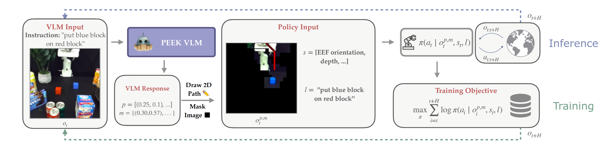
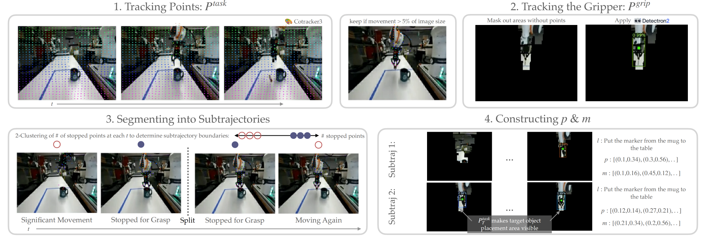

## PEEK: Guiding and Minimal Image Representations for Zero-Shot Generalization of Robot Manipulation Policies

### 一. 工作动机和核心思想

**工作动机：**通过模仿学习训练的机器人操作策略泛化能力很差，当面对新物体、混乱的环境或语义上的变化时，它们的性能会急剧下降。论文作者认为，这是因为传统策略被要求同时学习三个高度纠缠的复杂任务 ：

1. **去哪儿 (Where)**：应该关注场景中的哪些物体或区域 。
2. **做什么 (What)**：应该执行怎样的高层级动作 。
3. **怎么做 (How)**：如何在底层精确地执行这些动作 。

当策略失败时，往往是这三个方面同时出了问题 。例如，错误地抓取了一个干扰物，这既是注意力（Where）的失败，也是动作选择（What）和动作执行（How）的失败 。

**核心思想：**将高层级的推理与底层的执行分开，将关于“去哪儿 (Where)”和“做什么 (What)”的高层级语义和视觉推理任务，交给强大的视觉语言模型，让底层的机器人策略只专注于学习“怎么做 (How)”，即如何精确地执行动作 。为了实现这一思想，论文提出了PEEK (Policy-agnostic Extraction of Essential Keypoints) 框架，通过微调VLM，使其能够预测一种统一的、基于点的中间表征，具体包含两个部分，直接在机器人观察到的图像上进行标注：

* **末端执行器路径**：一系列2D点，用于指定机器人**做什么 (What)** 。
* **任务相关掩码**：一系列2D点，用于指示策略应该**关注哪里 (Where)** 。

通过让VLM“吸收”场景的语义和视觉复杂性，PEEK为下游策略提供了一个被简化和标注过的“窥视窗 (peek)” 。策略不再需要直接处理原始、复杂的图像，而是基于VLM提供的关于“Where”和“What”的最小化、引导性线索来学习如何行动 (“How”) 。

---

### 二. VLM 架构

**模型架构**：**VILA-1.5-3B**

- **预训练背景**：该模型已在交错的图文数据集和视频字幕数据上进行过预训练 。
- **选型考量**：作者对比了3B和13B参数的模型，发现3B模型在准确率上几乎没有损失，但推理速度更快，这对机器人闭环控制至关重要 

**两大中间表示 (路径与掩码)**

* **引导性路径 (p)**

  - **定义**: 一系列标准化的2D像素坐标 $p_t = [(x,y)_t, ..., (x,y)_T]$ ，代表了机器人末端执行器未来应该遵循的轨迹，明确了**“做什么”** 

  - **可视化方式**: 系统会将路径点用彩色的线段连接起来，并直接绘制在图像上。线段颜色会从深红色渐变为浅红色，以指示时间的先后顺序。

* **最小化掩码 (m)**

  - **定义**: 一个无序的、任务相关的2D像素坐标点集 $m_t = {(x,y)_i}$ ，用于标示出任务相关的物体和区域，明确了**“关注哪里”** 。

  - **可视化方式**: 系统会先创建一个纯黑的画布，然后以每个掩码点为中心，显示一小块方形区域（边长是图像尺寸的8%）内的原始图像内容。

**推理阶段**：为了平衡高层规划的准确性和底层控制的实时性，PEEK在推理时采用了一种混合策略。

- **低频调用**： VLM并不会在每个时间步都运行，而是以一个较低的频率（每H步）被调用一次，在RTX 3090上，单次VLM查询（生成一次路径和掩码）耗时约4-6秒 。
- **工作流程**:
  1. 在第 $t$ 步，调用 VLM，根据当前观察 $o_t$ 生成路径 $p_t$ 和掩码 $m_t$
  2. 在接下来的 $H$ 个时间步内（从 $t$ 到 $t+H$），系统会将同一个路径 $p_t$ 和掩码 $m_t$ 应用到所有新接收的图像上，输入到下游策略模型中
  3. H步之后，VLM会被再次调用以生成新的引导信息 。
- **策略输出**：在VLM的引导下，下游策略会一次性预测一个动作序列，称为“动作分块”（例如，在BRIDGE环境中一次预测5个动作，在Franka环境中一次预测8个动作）。

### 三. 数据集格式（数据集怎么构建的）

**数据集构成**：共 3.5M 样本。

* **像素点预测与通用视觉问答数据集**：用于维持VLM的通用世界知识和对象推理能力。
  * 包含约 770k 个像素点预测任务（RoboPoint Dataset，eg: l="Point to the cushions", ans = [(0*.*56*,* 0*.*69)*,*(0*.*43*,* 0*.*67)]）和约 665k 个视觉问答（VQA）示例（l = “What is the cat eating?,” and ans = “An apple."）。
* **机器人数据**：共 2M 个VQA对，包含148k 条轨迹，9 种不同的机器人形态，21 个机器人数据集。
  * **大规模真实机器人数据集**：来自 Open X-Embodiment 数据集中的20个不同的子数据集
    - 特殊处理：由于大多数原始完整轨迹的前20%未呈现夹爪或运动幅度极小，于是论文舍弃这部分数据。此外，论文通过重新采样每条预处理后的子轨迹的起点和终点（在轨迹首尾20%范围内）来扩充数据集，并重复此过程5次，来增广数据集。
  * **机器人仿真数据集**：LIBERO-90，用于进一步拓宽VLM的视觉特征覆盖范围
    * 特殊处理：将该数据集的图分辨率像从128x128 重新渲染到了256x256，以获得更高质量的视觉输入。

**自动化数据处理与标注流程**：直接从机器人操作视频中提取出用于VLM微调的（路径，掩码）标签。

1. **跟踪任务相关点 ($P^{task}$)**
   1. **追踪**：使用 **CoTracker3** 工具，在整个视频序列中追踪一个初始化在视频中间帧的均匀网格点；
   2. **筛选**：过滤掉那些在整个过程中运动幅度很小（小于图像尺寸的5%）的点，因为它们大概率属于静态背景；
   3. **输出**：剩下的点集被定义为“任务相关点” ($P^{task}$)，它们有效地捕捉了机械臂和被操作物体的动态信息。
2. **跟踪夹爪 ($P^{grip}$)**
   1. **预处理**：为了提高夹爪检测的准确性，系统会先进行一次屏蔽操作：只保留第一步得到的$P^{task}$点周围的图像区域，将其他无关背景涂黑；
   2. **检测**：在这个被“净化”过的图像上，运行一个专门为检测机器人末端执行器而微调过的**Detectron2**模型；
   3. **输出**：得到精确的夹爪轨迹序列 ($P^{grip}$)。
3. **切分子轨迹**：为了遵守**“最小化原则”**，避免过早地给策略模型提供与当前任务无关的远期未来信息，从而造成干扰 。
   1. **核心洞察**：当机器人执行抓取、放置等精细操作时，大部分任务相关点会趋于静止；
   2. **聚类**：系统会计算每一帧往后 5 或 3 帧的“静止点数量”，并使用**K-Means聚类 (K=2)** 算法将所有帧分为“显著运动”和“精细操作”两类；
   3. **分割**：系统会找到连续的“精细操作”片段，并取其中心帧作为子轨迹的分割点。
4. **构建最终VLM样本**
   1. **定义路径与掩码**：针对子轨迹片段的每一帧，系统正式定义VLM的预测目标：
      1. **路径 ($p_t$)**：直接使用第二步得到的夹爪轨迹，即 $p_t=P_t^{grip}$ ；
      2. **掩码 ($m_t$)**：由当前时刻t的任务相关点$P_{t}^{task}$和该子轨迹结束时刻 $T$ 的任务相关点 $P_{T}^{task}$联合组成，即 $m_t=P_t^{task}∪P_T^{task}$ 
   2. **格式化与后处理**：
      - 将路径和掩码的点坐标组合成一个文本字符串，作为 VLM 需要生成的答案 `ans` 。
      - 为了减少推理时的Token数量，系统会使用**Ramer-Douglas-Peucker算法**来简化路径和掩码中的点数 。

### 四. 训练过程

**核心超参数**：

- **训练轮数**：1
- **学习率**：5e−2
- **批次大小**：16

**计算资源**：

* **微调阶段 (Fine-tuning)**:
  - **硬件**: 使用了 **8块 NVIDIA A100 GPU**
  - **耗时**: 大约 **20小时**

* **推理阶段 (Inference)**:

  * **硬件**：一块 **NVIDIA RTX 3090 GPU**

  - **耗时**：在没有进行任何速度优化的情况下，每次VLM查询（即生成一次路径和掩码）需要 **4到6秒** 的时间 。

