## Qwen-RobotManip Technical Report: Alignment Unlocks Scale for Robotic Manipulation Foundation Models

### 一. 工作动机

**核心问题**：机器人操作模型想要像大语言模型一样通过大规模数据获得泛化能力（scale），但**机器人数据天然高度异构**。不同数据集里的机器人平台、关节数量、动作空间、相机位置、坐标系、控制频率、任务类型都不一样。如果直接把这些数据混在一起训练，模型不一定会从更多数据中受益，反而可能**因为表示冲突而学到互相矛盾的控制规律**。

**关键矛盾**：语言模型之所以能 scale，是因为网页、书籍、代码、对话等数据虽然来源不同，但最终都能**统一成 token 序列**。机器人操作数据却不是这样。**例如 Franka 是单臂 7-DoF 机械臂，ALOHA 是双臂机器人；有些机器人有灵巧手；有些数据记录 joint position，有些记录 end-effector pose；有些动作是绝对坐标，有些动作是 delta；相机有头部相机、腕部相机、第三视角相机；坐标系也可能是 robot base frame、world frame、camera frame。**

**核心思想**：Qwen-RobotManip 的中心观点是 **alignment first, then scale**。也就是说，在机器人操作中，不能只靠堆数据实现 foundation model，必须先进行**跨本体、跨坐标系、跨行为分布的统一对齐**。只有当不同数据源中的“相同物理动作”在模型看来具有相近表示时，大规模多源训练才会从互相干扰变成互相增强。

---

### 二. Qwen-RobotManip 方法

论文的方法可以分为两个核心部分：

1. **数据层面**：构建了一个大规模机器人操作预训练数据集，总量约 **38,100 小时**，包括真实机器人数据、人类第一视角操作视频，以及通过 human-to-robot synthesis 生成的机器人轨迹。其中 human-to-robot 部分把约 1,933 小时人类第一视角数据转换到 **15 种双臂机器人形态**上，生成约 24,808 小时合成机器人示教。
2. **模型层面**：提出了一套 **跨本体对齐框架**，从三个层面对齐不同机器人数据：representation alignment、motion alignment 和 behavior alignment。representation alignment 解决“**不同机器人状态和动作维度不同**”的问题；motion alignment 解决“**同一个末端运动在不同坐标系下数值不一致**”的问题；behavior alignment 解决“**不同机器人执行风格和控制频率不同**”的问题。

#### 数据层面

Qwen-RobotManip 的训练数据包括：

- **Robot data**（超过 11,000 小时）：真实机器人和仿真机器人示教数据，来自 OXE、RoboMIND、DROID、RH20T、AgiBotWorld-Beta、RoboCOIN、RDT、InternData-A1、Galaxea Open-World 等；
- **Human data**（约 1,933 小时）：人类第一视角手部操作视频，来自 EgoDex、VITRA、EgoVerse；
- **Human-to-Robot synthetic data**（约 24,808 小时）：把人类第一视角操作视频转换到 15 种双臂机器人形态的合成机器人示教。

  > 真实机器人数据质量高但贵，人类第一视角视频便宜但质量低，合成数据则试图把“人会怎么做”转换成“机器人可以怎么做”。
- **Vision-language co-training data**（约 28M）：通用视觉语言数据。

##### A. Human-to-Robot Data Synthesis

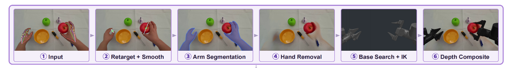

human-to-robot synthesis 的目标是把人类第一视角操作视频转换成机器人可学习的示教轨迹。它同时解决两个 gap：

- **形态 gap**：人手和机器人平行夹爪结构不同；
- **视觉 gap**：视频中看到的是人手，而不是机器人手臂。

###### A.1 形态 Alignment

论文把机器人在第 $t$ 帧的动作定义为：

$$
a_t = (p_t, R_t, w_t)
$$

其中：

- $p_t \in \mathbb{R}^3$：end-effector 位置；
- $R_t \in SO(3)$：夹爪姿态；
- $w_t \in \mathbb{R}_{\ge 0}$：夹爪宽度。

由于机器人平行夹爪只有两片夹爪，而人手有多根手指，作者先从 MANO hand keypoints 中提取手指三维关键点，并用食指和中指构造一个 **“虚拟手指”**：

$$
k_{\text{vf}} = 0.7 k_{\text{index}} + 0.3 k_{\text{middle}}
$$

然后把拇指和虚拟手指的中点作为夹爪中心，把两者距离作为夹爪宽度：

$$
p = \frac{1}{2}(k_{\text{thumb}} + k_{\text{vf}})
$$

$$
w = \|k_{\text{thumb}} - k_{\text{vf}}\|_2
$$

直观理解：

> 机器人两指夹爪可以看成“拇指 + 虚拟食指”在夹东西，所以作者把人类抓取动作压缩成一个平行夹爪动作。

夹爪姿态 $R$ 由三个正交轴构成：

$$
z = \frac{s \cdot (k_{\text{thumb}} - k_{\text{vf}})}{w}
$$

$$
y = \frac{z \times d}{\|z \times d\|}
$$

$$
x = y \times z
$$

其中：

- $d = k_{\text{vf}} - k_{\text{wrist}}$；$s=+1$ 表示右手，$s=-1$ 表示左手；
- $z$ 是夹爪两指连线方向；$y$ 是夹爪平面的法向；

> 这个符号翻转 $s$ 很重要，因为左右手天然镜像。如果不做统一，左右手的同类抓取动作会在坐标上方向相反，导致模型学到冲突信号。

###### A.2 视觉 Alignment

形态 alignment 只能得到机器人 EEF pose，但视频里仍然是人手。因此论文进一步将视频中的人手替换为机器人夹爪：

1. 用 SAM3 根据文本 prompt 分割人手和手臂区域；
2. 用 ProPainter 对被遮挡区域进行视频修复，得到没有人手的干净背景；
3. 为每种机器人搜索合适的底座 pose，使机器人的 IK 能尽量够到人手轨迹中的所有关键位置；

   > base pose 搜索可以写成：
   >
   > $$
   > T_{\text{base}}^*
   > =
   > \arg\max_{T_{\text{base}}}
   > \frac{1}{|\mathcal{K}|}
   > \sum_{k \in \mathcal{K}}
   > \mathbb{1}
   > \left[
   > IK(T_{\text{base}}^{-1}T^{ee}_k)
   > \text{ is feasible}
   > \right]
   > $$
   >
   > 其中 $\mathcal{K}$ 是覆盖轨迹空间极值的关键帧集合。这个目标的意思是：寻找一个机器人底座位置，使尽可能多的关键末端位姿可以被机器人 IK 到达。
4. 在 MuJoCo 中用 IK 跟踪 retarget 后的末端轨迹并渲染机器人；
5. 用 Depth Anything v3 估计场景深度，再用机器人渲染深度进行遮挡合成。

   > 深度合成公式为：
   >
   > $$
   > M^{occ}_t = \mathbb{1}[D^{robot}_t \leq D_t]
   > $$
   >
   > $$
   > I^{syn}_t =
   > M^{occ}_t \odot I^{robot}_t
   > +
   > (1-M^{occ}_t) \odot \hat{I}_t
   > $$
   >
   > 其中：
   >
   > - $D^{robot}_t$：机器人深度；
   > - $D_t$：原场景深度；
   > - $M^{occ}_t$：机器人是否在当前像素前景的遮挡 mask。
   > - $I^{robot}_t$：渲染出的机器人图像；
   > - $\hat{I}_t$：去除人手后的背景图像；

##### B. Multi-stage Data Curation

Qwen-RobotManip 很强调数据清洗，因为机器人数据中的错误不是普通噪声，而可能直接破坏物理因果关系。论文使用**五阶段 state-action signal filtering** 和**三类 cross-modal consistency check** 对数据进行过滤清洗。

#### 模型层面

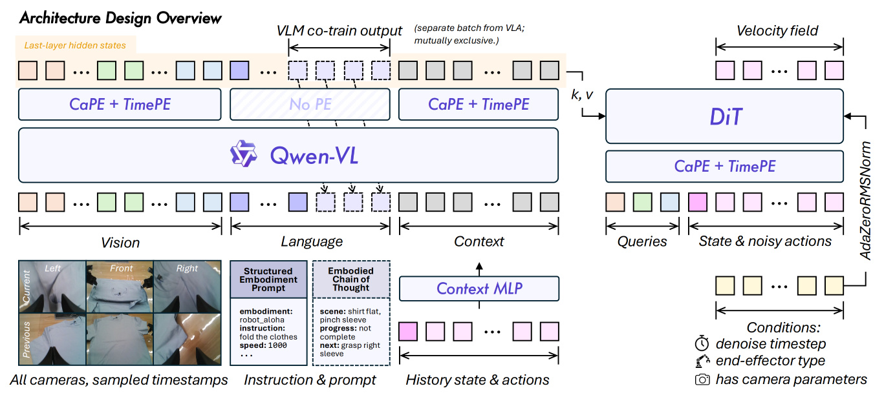

Qwen-RobotManip 的主结构是一个解耦式 VLA：

* **Vision-language backbone** 使用 Qwen3.5-4B。它把多视角图像 token 和文本 token 放在同一个 Transformer 中做 early vision-language fusion，输出最后一层 hidden states，维度为 $D_{vlm}=2560$。

* **Action expert** 是一个 flow-matching DiT：

  - Transformer block $N=10$，hidden dimension $D_{act}=768$，attention heads：12；

  - 输入：当前 proprioceptive state token + noisy action tokens；

  - 条件：VLM 最后一层 hidden states；

  - 交互方式：DiT block 通过 cross-attention 读取 VLM hidden states；
    - 偶数层 attend visual tokens，奇数层 attend language tokens。


##### A. Unified 80D State-Action Representation

不同机器人 embodiment 的状态和动作空间不同。Qwen-RobotManip 用一个固定的 **80 维向量**统一表示 state 和 action。

它由两个 29 维 per-arm block 和 22 个 reserved dimensions 组成。每个 per-arm block 包括：

| 组成 | 维度 | 含义 |
|---|---:|---|
| Joint positions | 7 | 机械臂关节位置 |
| End-effector pose | 9 | 3D position + 6D rotation |
| Gripper state | 1 | 平行夹爪状态 |
| Dexterous hand joints | 12 | 灵巧手关节 |
| 每臂合计 | 29 | 一个 arm slot |

其中：

- 单臂机器人只填一个 arm slot，另一个 arm slot 置零；
- 双臂机器人填两个 arm slots；
- 灵巧手机器人额外填 hand joints；
- 不存在的维度通过 binary mask 从 loss 中排除。

这样做的关键不是机械地补零，而是**让不同机器人在同一个语义模板中对齐**。例如“左臂 gripper state”永远在固定位置，“右臂 EEF pose”永远在固定位置。模型因此可以跨机器人共享表示。

对于 action：

- joint actions 使用绝对值；
- EEF actions 使用相对当前 state 的 relative deltas；
  - 其中 orientation delta 使用 3D rotation vector，而不是 state 中使用的 6D rotation representation。


##### B. Camera-frame Delta EEF Action

统一 80D 表示解决了“维度结构不同”的问题，但还没有解决“坐标系不同”的问题。不同数据集可能把同一个末端动作记录在 robot base frame、world frame 或 camera frame 中。这样即使物理动作相同，数值也可能完全不同。

Qwen-RobotManip 统一采用 **camera-frame delta pose** 表示 EEF action。具体来说，模型预测的是“从当前夹爪位姿到目标夹爪位姿的**相对变化**”，并且把这个相对变化转换到**参考相机坐标系**下表示。

> 如果两个不同机器人在相机画面里都表现为“夹爪向杯子移动”，那么用 camera-frame delta 表示时，它们的动作数值会更接近；如果用各自 robot joint space 表示，它们可能完全不像同一个动作。

为了让模型理解多相机几何关系，Qwen-RobotManip 还在 DiT 中加入 **CaPE** 和 **TimePE**：

- **CaPE**：Camera Positional Encoding，告诉模型每个视觉 token 来自哪个相机，以及该相机在空间中的位置和朝向；
- **TimePE**：Time Positional Encoding，告诉模型 action token 对应动作序列中的第几个时间步。

因此，camera-frame delta EEF action 解决的是“动作坐标系如何统一”的问题，CaPE / TimePE 则进一步帮助模型理解“从哪个视角看”和“动作发生在什么时间顺序上”。

##### C. Structured Embodiment Prompt

为了让模型知道当前机器人、任务和执行速度，Qwen-RobotManip 使用结构化 prompt：

```text
embodiment: robot_aloha
instruction: Take the toy off the table and put it on the mat.
speed: 1000
fps: 30
camera view direction: arm side
```

各字段含义如下：

- **embodiment**：当前机器人平台，例如 `robot_aloha`；
- **instruction**：高层语言任务指令；
- **speed**：该 episode 的时间步个数；
  - 数值越大，通常意味着这段示教执行得更长、更慢或包含更多中间步骤；数值越小，通常意味着执行过程更短、更快。

- **fps**：输入序列采样率，即每秒多少帧 / 多少个时间步；
  - speef / fps 即得到该 episode 的时长（单位：秒）

- **camera view direction**：相机相对机械臂的位置方向，例如 arm side（同侧）还是 opposite side（对侧）。

训练时，作者会以 15% 概率随机 drop 掉 embodiment、speed、fps 字段，提升模型在测试时 prompt 信息不完整情况下的鲁棒性。

##### D. In-Context Policy Adaptation

Qwen-RobotManip 还引入 **in-context policy adaptation**。它的目标是：在不更新参数的情况下，让模型根据当前 episode 的历史执行情况适应机器人和环境。

一个历史 context chunk 定义为：

$$
(o_h, s_h, a_h)
$$

其中：

- $o_h$：历史视觉观测；
- $s_h$：历史 proprioceptive state；
- $a_h$：历史执行的 action chunk。

这些历史片段告诉模型：“这个机器人刚刚看到了什么、处于什么状态、执行了什么动作、执行效果大概如何”。这些 context tokens 会和当前图像、语言、structured prompt 一起送入 VLM。这样 VLM 可以把历史执行行为当作一种 implicit embodiment identifier。

> 一个重要细节是 **stochastic context sampling**。训练时不是总取最近历史片段，而是随机采样历史窗口。这可以避免模型偷懒复制最近动作，而是迫使它学习 episode 级别的行为模式和动力学风格。

---

### 三. 训练与推理

#### 训练

机器人动作训练很容易导致 VLM 的原有视觉语言能力退化。比如模型原本能理解“把红色方块放到蓝色碗里”，但经过大量 action prediction fine-tuning 后，可能更依赖视觉模式而忽视语言变化。这种现象可以理解为 VLA-to-VA degradation。因此，Qwen-RobotManip 在 VLA 训练时同时加入 vision-language 数据。即采用 **dual-stream co-training**：

* VLA stream: robot / human / H2R manipulation data
* VL stream: vision-language co-training data

两类 batch 相互独立，训练比例为：VLA : VL = 9 : 1

##### A. Masked Flow Matching Loss

因为不同机器人只填充 80D canonical vector 中的一部分维度，所以需要 mask 掉无效维度：

$$
m \in \{0,1\}^{T \times D}
$$

masked flow matching loss 为：

$$
\mathcal{L}_{FM}
=
\frac{1}{B}
\sum_{i=1}^{B}
\frac{
\sum_{t,j} m_{i,t,j}
\left(
f_\theta(x_{i,t}, t_i, s_i, o_i)_j - v_{i,t,j}
\right)^2
}{
\sum_{t,j}m_{i,t,j}
}
$$

这个 per-sample normalization 很重要，因为不同 embodiment 的有效维度数量不同。如果不归一化，双臂机器人或灵巧手机器人会因为有效维度更多而在训练中占据更大权重。

##### B. VLM Next-token Prediction Loss

对于 VL batch，模型使用标准 next-token prediction loss：

$$
\mathcal{L}_{VLM}
=
-
\mathbb{E}
\sum_i
\log p_\phi(y_i \mid y_{<i}, c)
$$

##### C. Total Loss

$$
\mathcal{L}
=
\mathcal{L}_{FM}
+
0.1 \mathcal{L}_{VLM}
$$

#### 推理

推理时，模型从随机噪声动作开始，通过 Euler integration 得到动作 chunk。主模型使用 4 个 Euler steps，从而支持低延迟实时控制。

---

### 四. 实验

论文主要评估 Qwen-RobotManip 的三类能力：

- **Task & Scene Generalization**：任务和场景泛化；
- **Instruction Following**：是否真正根据语言指令选择动作；
- **Cross-Embodiment Transfer**：能否迁移到形态不同的新机器人。

实验覆盖：

- 标准 in-distribution benchmark：LIBERO、RoboTwin；
- OOD benchmark：LIBERO-Plus、RoboTwin-Clean2Rand、RoboCasa365、EBench；
- 新提出 benchmark：RoboTwin-IF、RoboTwin-XE；
- 真实机器人：AgileX ALOHA、ARX、UR、Franka；
- RoboChallenge Table30-v1 generalist track。

#### A. 研究问题一：标准 in-domain benchmark 是否足够？

**实验设置**：在 LIBERO 和 RoboTwin 等标准 benchmark 上比较预训练模型和从零训练模型。

**实验结果**：

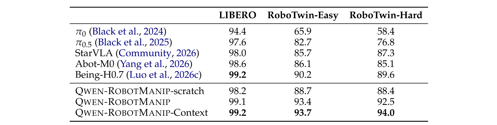

**实验结论**：标准 in-domain benchmark 不能充分反映 foundation model 的真实泛化能力。论文发现，在某些 in-domain 设置中，没有大规模机器人预训练的模型也能达到很高分，说明这些 benchmark 可能更多测的是分布内模式拟合，而不是真正的 OOD 泛化。

#### B. 研究问题二：Qwen-RobotManip 的 task & scene generalization 如何？

**实验设置**：在 LIBERO-Plus、RoboTwin-Clean2Rand、RoboCasa365、EBench 上测试模型对视觉扰动、物理扰动、布局变化、相机变化、长程任务和未见组合任务的泛化能力。

**实验结果和结论**：

* **LIBERO-Plus**：在 LIBERO 基础上多方面进行扰动。

  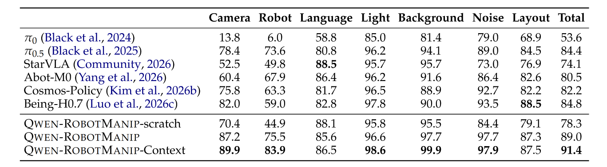

  其中 robot perturbation 和 camera perturbation 的提升尤其说明：大规模机器人预训练主要增强的是空间控制和机器人状态泛化，而不仅是视觉外观鲁棒性。

* **RoboTwin-Clean2Rand**：模型只在 Clean 数据上 fine-tune，然后在 Hard setting 下测试。

  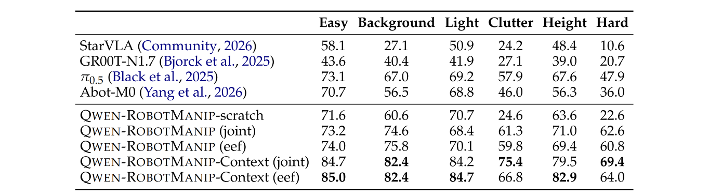

  这说明 Qwen-RobotManip 在真正 OOD 扰动下比 π0.5 更稳，尤其在 Hard setting 上提升明显。

* **RoboCasa365**：测试厨房场景中的 Atomic、Composite-Seen、Composite-Unseen。

  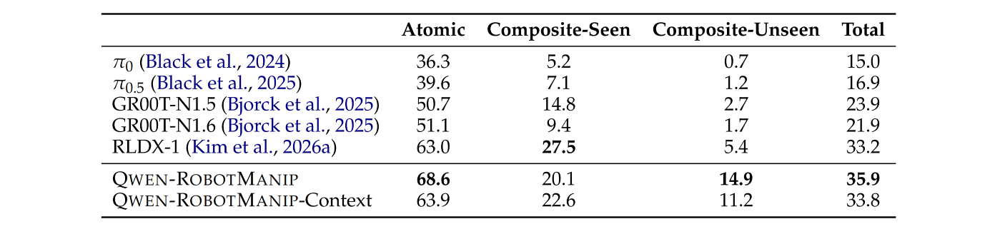

  其中 Composite-Unseen 更能体现长程组合泛化能力。

* **EBench**：包含 tabletop、dexterous、locomotion、bimanual、long-horizon 等多类任务。

  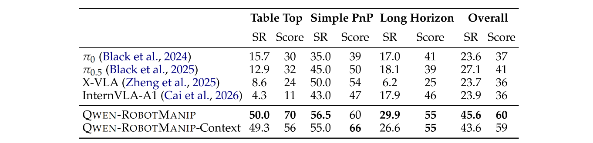

#### C. 研究问题三：模型是否真的听语言？

**实验设置**：论文提出 RoboTwin-IF，用于测试 instruction following。它要求模型在同一个视觉场景中，根据不同语言指令选择不同动作。例如场景里同时有 bell、stapler、可抓物体，模型必须根据指令决定是 ring bell、press stapler 还是 pick target object。这类设置避免模型只靠视觉捷径行动，因为同一个场景中存在多个可行操作，唯一决定正确动作的是语言。

**实验结果**：

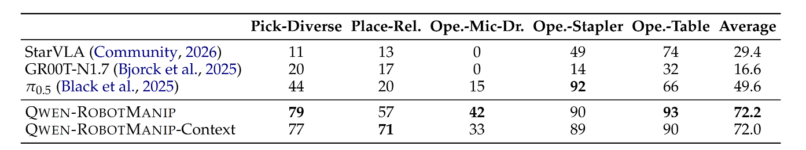

**实验结论**：典型子任务提升包括：

- Pick-Diverse：从 44 提升到 79；
- Place-Relative：从 20 提升到 57；
- Operate-Mic-Drawer：从 15 提升到 42；
- Operate-Tabletop：从 66 提升到 93。

这说明 Qwen-RobotManip 的 VL co-training 和 structured prompt 对保持语言条件控制能力非常重要。

#### D. 研究问题四：能否 zero-shot 迁移到新机器人？

**实验设置**：论文提出 RoboTwin-XE。模型只在 AgileX ALOHA 数据上 fine-tune，然后直接测试到不同 embodiment：

- ARX-X5；
- UR5-WSG；
- Franka Panda。

测试时没有使用目标机器人数据。场景、物体布局、扰动 seed 尽量保持一致，主要考察模型是否能跨机器人外观和运动学差异迁移。

**实验结果**：

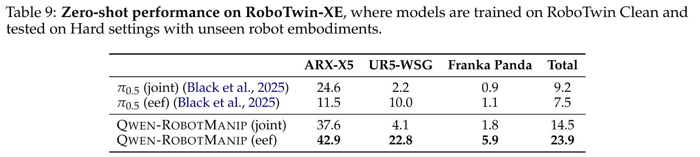

**实验结论**：camera-frame EEF action 明显优于 joint action。joint-space action 仍然强绑定具体机器人，而 camera-frame EEF action 更容易把“视觉上相同的操作技能”迁移到新 embodiment。

#### E. 研究问题五：真实机器人上是否有效？

**实验设置**：论文在 AgileX ALOHA、ARX、UR、Franka 等真实平台上评估。

* **AgileX ALOHA ID tasks** 

  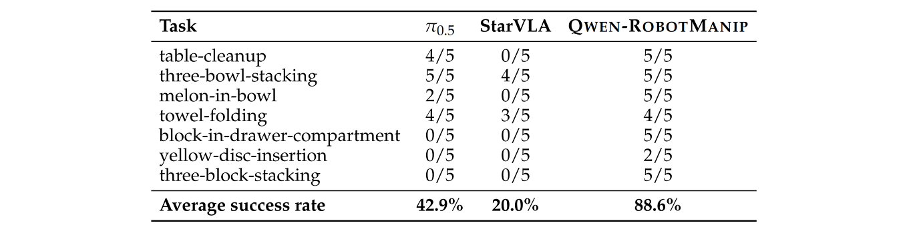

* **AgileX ALOHA OOD tasks**

  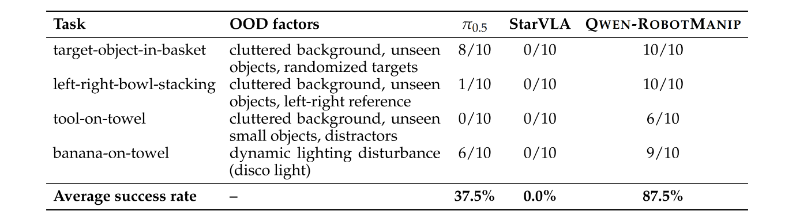

  说明模型不只是在仿真里泛化，也能迁移到真实机器人场景中的未知物体、复杂背景、空间关系和动态光照扰动。

* **ARX few-shot adaptation**

  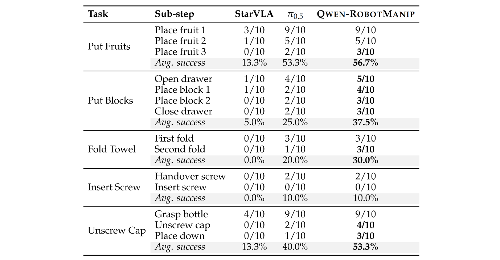

  Qwen-RobotManip 在大多数任务上优于 π0.5，但 Insert Screw 这种高精度插入仍然很难，完整插入成功率所有方法都很低。这说明模型虽然提升了泛化，但 contact-rich 高精度任务仍未完全解决。

* **RoboChallenge Table30-v1 generalist track** 中：

  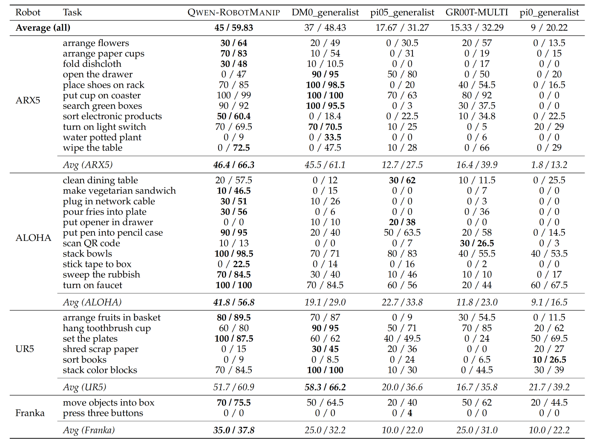

#### F. 研究问题六（消融实验）：哪些设计真正有用？

##### F.1 Unified action space / UnifiedEEF 是否有用？

**实验设置**：比较没有 UnifiedSpace、没有 UnifiedEEF、完整模型。

**实验结果**：

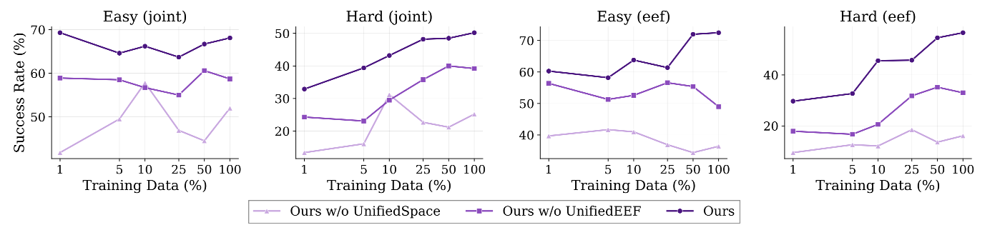

**实验结论**：只有做了统一 state-action representation 和 camera-frame EEF alignment，模型才能稳定从更多跨本体数据中受益。完整方法在数据规模增加时呈现更清晰的 scaling law，而没有对齐的版本曲线更不稳定，甚至出现性能崩塌。

##### F.2 Human-to-Robot synthetic data 是否有用？

**实验设置**：比较 robot-only、+ego、+h2r 三种数据组合。

在 RoboTwin-Clean2Rand (eef) 上：

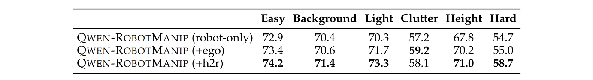

在 LIBERO-Plus 上：

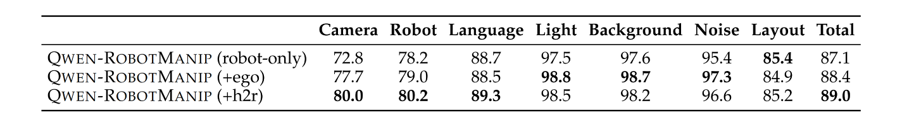

结论是：raw ego data 主要带来视觉多样性，而 H2R data 进一步通过 action alignment 和 visual alignment 释放价值。

##### F.3 VL co-training 是否有用？

**实验设置**：比较完整模型、去掉 pre-training 阶段 VL data、在 post-training 中加入 VL data。

**实验结果**：

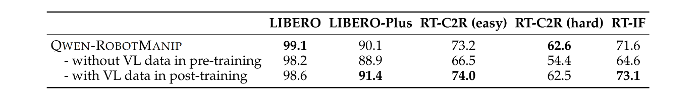

可以看到，去掉 VL data 后，在 LIBERO 这种相对 in-domain benchmark 上只掉 0.9，但在 RoboTwin-C2R 和 RoboTwin-IF 上明显下降。这说明越是 OOD、语言相关、场景复杂的任务，越依赖 VLM 原有视觉语言能力。

---

### 五. 局限性

论文虽然展示了很强的结果，但仍然存在一些值得注意的局限：

* **human-to-robot synthesis 仍然有近似误差**：人手到机器人夹爪的 retargeting 不能完全保留人类灵巧操作细节，inpainting 和渲染合成也可能引入视觉伪影。
* **跨本体迁移还没有完全解决**：RoboTwin-XE 中 Franka Panda 的 zero-shot 成功率仍然较低，说明不同机械结构和 workspace 的迁移依然困难。
* **高精度 contact-rich 操作仍然是瓶颈**：例如 ARX few-shot 中 Insert Screw 的完整插入成功率很低，说明孔位对齐、接触力控制、细粒度误差修正仍然困难。
* **OOD benchmark 仍以仿真为主**：LIBERO-Plus、RoboTwin-C2R、RoboTwin-IF、RoboTwin-XE 等虽然比标准 benchmark 更强，但仍不能完全代表真实世界的长尾变化。
* **数据清洗和合成管线复杂**：该方法的效果依赖大规模 curation、相机标定、URDF、IK、分割、inpainting、深度估计等环节，复现成本较高。
* **需要 calibrated camera parameters**：camera-frame delta EEF action 和 CaPE 依赖相机内外参。如果部署场景相机标定不准，动作表示和几何编码都可能受影响。
* **action chunk 和推理延迟限制快速反应**：固定长度 action chunk 和多步 Euler denoising 对实时性有一定影响，论文也指出 sub-second reactive control 仍可能受限。
* **开源数据覆盖仍有限**：虽然总数据量达到 38,100 小时，但机器人任务、物体、真实场景和失败恢复数据仍远少于互联网图文数据，距离真正通用机器人还有差距。
