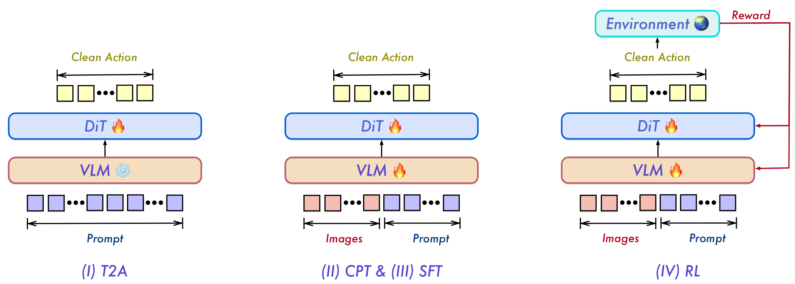
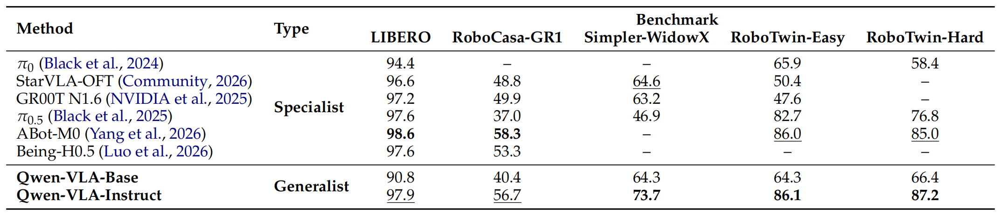
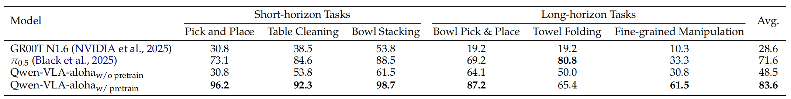
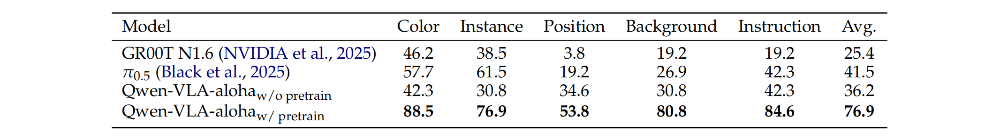
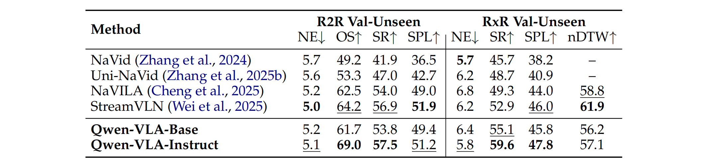
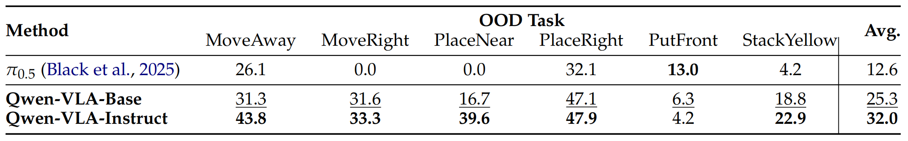
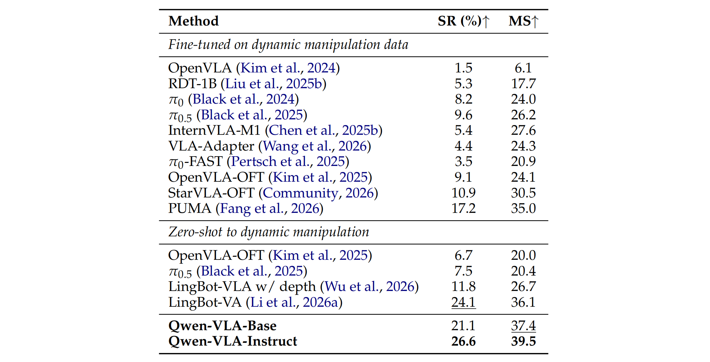

## Qwen-VLA: Unifying Vision-Language-Action Modeling across Tasks, Environments, and Robot Embodiments

### 一. 工作动机

**核心问题**：现有具身智能模型通常按照任务类型、环境类型或机器人本体分别设计，例如机械臂操作模型主要面向 tabletop manipulation，导航模型主要面向 waypoint prediction，人类第一视角数据又常以手部轨迹或身体轨迹形式存在。这些任务表面上差异很大，输出空间、控制频率、动作维度、预测 horizon、评估协议都不同，**因此模型容易形成“专用系统”，难以跨任务、跨环境和跨机器人本体迁移**。

**核心思想**：Qwen-VLA 的基本判断是，不同具身任务虽然输出形式不同，但都可以抽象为同一种条件预测问题：**给定视觉观测、语言指令和机器人本体约束，预测未来一段动作或轨迹**。因此，作者将 manipulation、navigation、人类第一视角轨迹和 trajectory-centric 任务统一到一个**动作-轨迹预测框架**中，用 **Qwen3.5-4B** 作为视觉语言主干，并接入一个**基于 DiT 的 Flow Matching Action Decoder** 来生成连续动作。通过四阶段训练流程，实现一个**能够同时处理操作、导航和轨迹预测的通用 VLA 模型**。

**本文贡献**：

1. **模型方面**：提出 Qwen-VLA 模型，将机器人操作、导航、人类第一视角动作建模统一至**共享动作-轨迹空间**；基于Qwen3.5-4B VLM 主干与 DiT 架构 Flow Matching Action Expert，实现多机器人平台、多任务类别的统一具身控制。

2. **数据方面**：构建**大规模异构联合预训练数据混合集**，涵盖多机器人操作轨迹、人类第一视角演示、仿真合成、导航及精选 VLM 数据；提出**本体感知提示条件化**，无需为每个机器人设计独立策略，单模型统一适配多平台、多控制规范、多预测时域。

3. **训练方面**：设计**渐进式训练 pipeline：动作预训练、多模态持续预训练、SFT、RL 四阶段训练**，打通离散视觉语言 token 与连续动作轨迹的维度鸿沟，提升训练稳定性与下游任务迁移能力。

4. **实验方面**：在操作、导航、分布外鲁棒性、跨本体泛化基准上完成全面评估，证实联合训练与渐进式学习可在场景、物体、光照、本体分布偏移下稳定提升多任务性能。

---

### 二. Qwen-VLA 模型


Qwen-VLA 是一个统一 VLA 模型，由 **Qwen3.5 VLM 主干**和 **DiT-based Flow Matching Action Expert** 两部分组成。VLM 负责高层语义理解、视觉 grounding、语言指令理解和空间推理；Action Expert 负责从 VLM 表征和带噪动作 chunk 中生成连续动作轨迹。

##### A. 统一问题建模

模型将多种具身任务统一写成条件预测形式：

$$
p_\theta(y_{t:t+H-1} \mid o_t, x, e, z)
$$

其中 $o_t$ 是视觉上下文，可以是单帧/多帧图像、视频观测或历史窗口；$x$ 是语言指令；$e$ 是本体描述 prompt，用于说明机器人平台、控制频率、动作约定和预测 horizon；$z$ 是可选任务标识；$y_{t:t+H-1}$ 是未来一段动作或轨迹。

这个目标序列在不同任务中含义不同：

- 对 manipulation，$y$ 是未来机器人动作，例如末端执行器位姿、关节位置、夹爪状态或灵巧手关节；
- 对 navigation，$y$ 是未来路经点或相对位移，例如 $(\Delta x, \Delta y, \Delta \theta)$；
- 对 human egocentric data，$y$ 是人体或双手的未来运动轨迹，例如 MANO hand pose 或骨架关节轨迹；
- 对 trajectory-centric 任务，$y$ 是对应智能体或周边物体连续坐标空间轨迹。

##### B. 整体架构

Qwen-VLA 的模型结构可以理解为“预训练多模态主干 + 连续动作生成专家”：

- **VLM 主干**：采用 Qwen3.5-4B，它是一个原生多模态模型，采用早期视觉-语言融合架构：视觉 token 由 ViT 产生并与文本 token 早期融合到同一个 Transformer token stream 中，在单个Transformer内统一处理图像、视频与语言输入。
- **Action Expert**：采用单流 DiT-style Flow Matching Policy。它将 VLM hidden states 与 noisy action chunk 拼接成一个序列，通过 joint self-attention、AdaLN timestep conditioning 和 RoPE 处理，最后输出 action velocity field。
- **参数规模**：Action Expert 约 1.15B 参数，其中 16 个 DiT blocks 是主体，每个 block 约 70.8M 参数，总计约 1.13B；其余参数包括 action projection MLP（4.9M）、VLM hidden state 到 DiT channel 的线性映射（3.9M）、timestep embedding（2.8M）和输出 AdaLN 调制层（4.7M）。

> Qwen-VLA 与 $\pi_0$ 的一个结构差异是：$\pi_0$ 更像是在单一 Transformer 中设置 VLM expert 和 action expert 两套权重；Qwen-VLA 则更明确地将 Qwen3.5 VLM 作为认知主干，把 DiT action decoder 作为解码器式动作专家接在其上。解耦式架构设计让 Action Expert 专注细粒度动作生成，适配具身动作分布的多模态与高频动力学特性，同时保留 VLM 主干预训练能力。

##### C. 本体感知提示条件化

为了让一个模型支持多种机器人本体，Qwen-VLA 不为每种机器人单独设计 head，而是在每条训练样本前加入一个本体描述 prompt：

```text
The robot is {robot_tag} with {single arm / dual arms}[, waist][, and mobile base]. The control frequency is {FPS} Hz. Please predict the next {chunk_size} control actions to execute the following task: {ori_instruction}.
```

这个 prompt 指定机器人平台、单臂或双臂、是否有腰部或移动底盘、控制频率、预测动作长度以及原始任务指令。**模型通过这个文本接口理解当前动作空间的控制约定，因此不同机器人可以共用同一个 VLM 和同一个 DiT action decoder**。

##### D. 统一动作与轨迹表示

Qwen-VLA 统一的是张量接口和 mask 机制，而不是统一物理动作语义。每个样本提供一个目标张量：

$$
Y \in \mathbb{R}^{H \times K}
$$

其中 $H$ 是统一的最大预测 horizon，$K$ 是统一的最大通道数。控制信号类型主要包括两类：

- **操作控制信号**：包括末端执行器相对位置 $\Delta x, \Delta y, \Delta z$，末端旋转（欧拉角/四元数），绝对关节位置，夹爪开度，灵巧手关节角度；
- **导航轨迹信号**：采用 VLN 中常见的 waypoint 表示，每个 waypoint 是 $(\Delta x, \Delta y, \Delta \theta)$，表示平面相对位移与航向角变化。

某个控制模式实际只使用 $c \le K$ 个通道，模型将有效动作值放在前 $c$ 维，其余维度用 0 padding，并使用二值 mask：
$$
M \in \{0,1\}^{H \times K}
$$

mask 标识哪些时间步和通道是有效监督。这样可以避免 padding 位置影响梯度，同时避免为每种机器人单独设计输出 head。

##### E. 视觉与多视角输入表示

对于多摄像头机器人数据，论文使用 view-specific boundary tokens 标记不同图像来源，例如 ego camera、left wrist camera、right wrist camera：

```text
<|tag_start|> <image> <|tag_end|>
```

这种做法让 VLM 能区分不同视角的来源，使 Action Expert 可以根据任务需要选择性关注头部视角、第三人称视角或腕部视角，同时不需要改动模型结构。

---

### 三. 训练与推理

Qwen-VLA 的训练目标由**连续动作生成损失**和**视觉语言损失**共同组成。动作部分使用 Flow Matching，视觉语言部分保留 next-token prediction，用于防止大规模具身数据训练时破坏 VLM 原有的感知和语言能力。

##### A. Flow Matching 动作损失

对具有连续控制目标的样本，设 clean target 为 $Y_0 \in \mathbb{R}^{H \times K}$，噪声为 $Y_1 \sim \mathcal{N}(0,I)$，线性插值得到带噪动作：

$$
Y_\tau = (1 - \tau)Y_0 + \tau Y_1, \quad \tau \in [0,1]
$$

为避免补零维度主导梯度，采用逐通道、逐时间步**双层平均损失**。对激活 $c$ 个通道、有效时长 $H_{\text{task}}$ 的样本，掩码 $M \in \{0, 1\}^{H \times K}$ 定义有效区域。对每个有效通道 $k$：

$$
\ell_k = \frac{\sum_{h=1}^H M_{h,k} \left\| \left( v_\theta(Y_\tau, \tau \mid o_{1:t}, x, e, z) - (Y_1 - Y_0) \right)_{h,k} \right\|_2^2}{\sum_{h=1}^H M_{h,k}}
$$
再对 $c$ 个有效通道做均匀平均，得到动作总损失：

$$
\mathcal{L}_{\text{act}} = \mathbb{E}_{\tau, Y_0, Y_1} \left[ \frac{1}{c} \sum_{k=0}^{c-1} \ell_k \right]
$$
双层平均保证各控制维度梯度贡献均等，完全屏蔽补零位置梯度。

##### B. 视觉语言损失

为了保留 Qwen3.5 的视觉语言能力，模型同时在辅助 VLM 数据、细粒度具身动作描述、自动驾驶 VQA 和通用 VL 数据上做 next-token prediction：

$$
L_{vl} = -\sum_i \log p_\theta(w_i \mid w_{<i}, o_{1:t})
$$

最终联合损失为：

$$
L = \lambda_{act}L_{act} + \lambda_{vl}L_{vl}
$$

其中 $\lambda_{act}$ 和 $\lambda_{vl}$ 用于平衡动作监督和视觉语言监督的梯度规模。**每个批次按固定采样比例混合多任务样本**，单次优化**同时更新VLM主干与Action Expert**，融合操控、VLN轨迹、视觉语言三类监督信号。

##### C. 四阶段训练流程



VLA 模型需联合训练认知主干与运动解码器，分工模式类似生物运动控制中的大脑与小脑。但初始状态存在严重不对称：**VLM 主干已具备大规模预训练通用表征，DiT动作解码器随机初始化**。**直接联合训练效率低、稳定性差**：解码器需同时学习动作分布形态、语言-本体条件规则、Flow Matching动力学、视觉动作对齐；同时图像编码消耗大量计算，随机解码器的噪声梯度易破坏 VLM 预训练表征。

Qwen-VLA 的训练策略分为四个阶段。这个设计来自一个“动作学习是结构化解压缩”的观点：语言指令和 embodiment prompt 是高度压缩的任务描述，而机器人动作轨迹是高维、长序列、具身相关的控制信号，**因此需要先让 action decoder 学会从语言描述解压出动作先验，再引入视觉 grounding**。

1. **Stage I: Text-to-Action DiT Pretraining (T2A)** 
   冻结 VLM，只训练 DiT action decoder。输入只有语言指令和 embodiment prompt，不输入图像。**目标是让 DiT 学会从压缩的语言描述中重建高维动作分布，形成语言驱动的动作先验**。

   > T2A 的作用不是普通 warm start，而是让 DiT 先学到动作空间结构、语言到动作分布的对应关系、不同 embodiment prompt 如何调制动作参数化，以及完整轨迹的时间一致性。之后 CPT/SFT 才负责把这些动作先验与真实视觉观测对齐。

2. **Stage II: Continued Pretraining (CPT)** 
   解冻 VLM 和 DiT，在**大规模异构数据**混合上继续预训练。此阶段**引入视觉观测**，使 T2A 学到的动作先验被具体视觉场景 grounding，并让模型同时吸收真实机器人数据、仿真数据、人类第一视角数据、导航数据和视觉语言数据。

3. **Stage III: Supervised Fine-Tuning (SFT)** 
   从 checkpoint 分出两个 SFT 分支：一个是 multi-task SFT，在 VQA、spatial grounding、manipulation、navigation 等多任务上联合微调；另一个是在真实机器人 ALOHA teleoperation 数据上微调，用于验证预训练模型向真实硬件迁移的能力。

4. **Stage IV: Reinforcement Learning (RL)** 
   从 multi-task SFT checkpoint 出发，在 SimplerEnv 中用稀疏二值成功奖励进行 **PPO 训练**，得到最终的 Qwen-VLA-Instruct。RL 只在单一仿真环境中采集 rollout，用于检验闭环成功率优化是否能迁移到其他 benchmark 和 OOD 设置。

> | 版本                           | 来源                                                     | 含义                                                      |
> | ------------------------------ | -------------------------------------------------------- | --------------------------------------------------------- |
> | **Qwen-VLA-Base**              | 大规模预训练后的基础模型，stage2的产物                   | 通用 VLA 表征，未经过最终 RL 指令对齐                     |
> | **Qwen-VLA-Instruct**          | multi-task SFT 后再经过 SimplerEnv RL                    | 论文主打的 generalist policy，在多个 benchmark 上表现最好 |
> | **Qwen-VLA-aloha w/ pretrain** | 从 Qwen-VLA-Base 出发，在 ALOHA teleoperation 数据上微调 | 面向真实 ALOHA 机器人的专门微调版本                       |

**D. 推理流程**

推理时，模型输入视觉观测、语言指令和 embodiment prompt，由 VLM 产生 hidden states，再由 DiT action decoder 从噪声动作开始，通过少量 Euler integration steps 从 $\tau=1$ 逐步积分到 $\tau=0$，生成一个动作 chunk。不同任务的动作 chunk 长度由 prompt 和训练设置指定，例如仿真 manipulation 常用 $H=16$，VLN waypoint prediction 使用 $H=8$。

---

### 四. 实验

##### 预训练数据组成

Qwen-VLA 的预训练混合数据覆盖机器人操作轨迹、人类第一视角轨迹、导航轨迹、合成仿真轨迹和视觉语言数据。论文给出的预训练数据比例为：

| 数据来源 | 比例 |
|---|---:|
| Robot Manipulation Trajectories | 74.2% |
| Human Egocentric Trajectories | 6.0% |
| Navigation Trajectories | 7.5% |
| Synthetic Simulation Trajectories | 3.7% |
| General Vision-Language Data | 3.4% |
| Spatial Grounding (2D) | 2.5% |
| Autonomous Driving VQA | 2.4% |
| Fine-Grained Embodied Action Caption | 0.2% |

其中机器人操作数据是主体，包含 RobotSet、Galaxea、AgiBot World、RoboCOIN、RoboMIND V1/V2、RDT-1B、DROID、BridgeData V2、RH20T、RT-1、BC-Z 等开源真实机器人数据，累计超10000小时；也包含 InternData-A1、GR00T-X-Embodiment-Sim 等仿真数据。作者还加入了超过 1000 小时的自研真实机器人数据，以及约 8M 条自研合成仿真轨迹。

覆盖的机器人本体包括 WidowX、Google Robot、Franka Panda、ARX5、Fourier GR-1、Mobile ALOHA、AgiBot A2-D、Galaxea R1、AIRBOT MMK2、TienKung 和 Real Human 等。动作类型覆盖 $\Delta$EEF + gripper、absolute joint + gripper、absolute joint + dexterous hand、MANO-derived human wrist motion 等。

##### 核心实验

* **研究问题一：单一 generalist policy 在多种仿真 manipulation benchmark 上表现如何？**

  

  * **实验设置**：在 LIBERO、Simpler-WidowX、RoboCasa-GR1、RoboTwin 2.0 四大仿真基准上评估 Qwen-VLA，并与多个 specialist VLA policy 对比。specialist 模型通常分别在每个 benchmark 上单独微调，而 Qwen-VLA 是一个通过 embodiment prompt 统一部署的 generalist 模型。
  * **实验结论**：Qwen-VLA-Instruct 作为单通用模型，在多个 benchmark 上达到或超过 specialist；Base版本具备优秀基线能力，经SFT后全维度大幅涨分。

* **研究问题二：大规模预训练是否能迁移到真实 ALOHA 双臂机器人？**

  ##### In-domain

  

  ##### OOD

  

  * **实验设置**：在真实 ALOHA 平台上评估，任务包括 pick and place、table cleaning、bowl stacking、bowl pick & place、towel folding 和 fine-grained manipulation。对比从头训练的 Qwen-VLA-alohaw/o pretrain 与从 Qwen-VLA-Base 微调的 Qwen-VLA-alohaw/ pretrain。
  * **实验结论**：预训练带来显著提升。in-domain 平均成功率从 48.5% 提升到 83.6%。在 OOD 设置下，Qwen-VLA-alohaw/ pretrain 平均达到 76.9%，显著高于 π0.5 的 41.5% 和从头训练版本的 36.2%。这说明性能提升主要来自预训练表征，而不是单纯来自模型结构。

* **研究问题三：Qwen-VLA 是否能同时具备导航能力？**

  

  * **实验设置**：在 VLN-CE 的 R2R 和 RxR Val-Unseen split 上评估 Base 和 Instruct 版本，并与 NaVid、Uni-NaVid、NaVILA、StreamVLN 等开放基线对比。
  * **实验结论**：Qwen-VLA-Instruct 在 R2R 上达到 OS 69.0、SR 57.5、SPL 51.2；在 RxR 上达到 SR 59.6、SPL 47.8。结果说明 VLA 与 VLN 数据联合训练可以保留较强导航性能，并支持一个模型同时处理机器人操作和连续环境导航。

* **研究问题四：模型能否泛化到未见过的静态 manipulation 任务？**

  > * 静态 manipulation 任务：环境中的关键物体在机器人执行过程中**基本不主动运动**，任务主要考察空间理解、目标识别、抓取、放置、旋转、排列等能力。
  > * 动态 manipulation 任务：目标物体或环境状态会**随时间变化**，机器人必须在时间窗口内做出连续、及时的动作，不能只依赖静态图像中的几何关系。

  

  * **实验设置**：作者构建 SimplerEnv-OOD，模型只在 Bridge 中简单 pick-and-place 数据上微调，评估时要求执行未见过的空间关系和操作原语，包括 MoveAway、MoveRight、PlaceNear、PlaceRight、PutFront 和 StackYellow。
  * **实验结论**：Qwen-VLA-Instruct 平均成功率为 32.0%，高于 Qwen-VLA-Base 的 25.3% 和 π0.5 的 12.6%。尤其在 MoveRight、PlaceNear、PlaceRight 等空间泛化任务上优势明显，说明联合预训练增强了语言空间关系到连续动作的映射能力。

* **研究问题五：模型能否 zero-shot 泛化到动态 manipulation？**

  

  * **实验设置**：在 DOMINO 动态 manipulation benchmark 上进行 zero-shot 评估，覆盖 35 个 suite，报告 Success Rate 和 Manipulation Score。
  * **实验结论**：Qwen-VLA-Instruct 达到 SR 26.6%、MS 39.5，是表中最高结果。它不仅超过 zero-shot 组的 OpenVLA-OFT、π0.5、LingBot-VLA 和 LingBot-VA，也超过了若干在动态 manipulation 数据上专门微调的方法，例如 PUMA 的 SR 为 17.2%、MS 为 35.0。论文认为这种能力来自广泛的 action-and-trajectory 预训练以及 Flow Matching decoder 生成连贯动作 chunk 的能力。

---

### 五. 局限性

* **具身动作数据仍远少于视觉语言数据**：虽然 Qwen-VLA 使用了大规模混合数据，但**真实具身交互数据的规模、多样性和覆盖范围仍然远低于通用 VLM 预训练数据**。这限制了模型对长尾物体、复杂环境、稀有机器人本体和 contact-rich interaction 的鲁棒性。

  > 在 Qwen-VLA 自己的预训练混合数据中，机器人 manipulation trajectories 占比最高；但**从整个基础模型训练生态看**，可用的具身动作数据规模和多样性仍远小于互联网级视觉语言数据。

* **联合训练存在优化折中**：模型同时学习视觉语言理解、导航和动作生成，**不同目标之间可能发生冲突**。论文指出 action-oriented training 能提升 policy learning，但可能使一些纯视觉语言或导航评估略有退化，因此仍需要更好的 objective balancing、data curriculum 和模块化设计。

* **评估仍偏短时长和 benchmark-driven**：尽管论文覆盖了多个 benchmark 和 OOD 设置，但当前评估仍主要是短 horizon、可控任务和标准 benchmark。**长时间真实世界部署、失败恢复、多阶段任务规划和长程记忆仍未充分解决**。

* **缺少更丰富的物理反馈**：当前框架主要依赖视觉、语言和动作轨迹，默认不使用显式 proprioception，**也没有系统整合力觉、触觉等反馈**。对于需要精细接触控制、插入、柔性物体操作或高精度装配的任务，这可能成为瓶颈。
