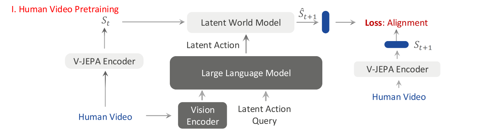
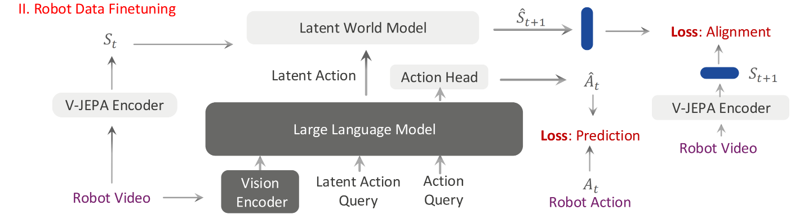

## VLA-JEPA: Enhancing Vision-Language-Action Model with Latent World Model

> 论文：[arXiv:2602.10098](https://arxiv.org/abs/2602.10098)
> 项目：[Project Page](https://ginwind.github.io/VLA-JEPA/)
> GitHub：[ginwind/VLA-JEPA](https://github.com/ginwind/VLA-JEPA)

### 一. 工作动机

**核心问题**：VLA / WAM 的训练不能只依赖带 action label 的机器人轨迹。真实机器人数据昂贵且难采集，而互联网上往往存在大量 **action-free videos**，也就是只有视频、没有动作标签的数据。问题是：**这些纯视频数据到底如何转化为对 policy 预训练有用的信号？**

**关键矛盾**：很多 latent action 方法表面上是在从视频里学习“动作”（例如Motus的光流法），但实际可能学到的是**像素变化**，而不是对控制有用的**状态转移**。例如背景移动、相机抖动、光照变化、纹理变化都可能在像素层面很明显，但它们不一定对应机器人可以控制的物理变化。

**核心思想**：VLA-JEPA 的思路正是让模型学习“**动作相关的状态转移**”，称为 **latent action / latent transition**。具体来说，VLM 只看初始图像和语言指令，并通过 **Latent Action Query** 输出 latent action 表示；然后 Latent World Model 用这个 latent action 去预测未来的 **latent state**，而不是预测未来图像像素。未来帧只通过 frozen target encoder 构造监督目标，不作为 VLM 的输入。这样，训练信号会逼迫 latent action 更关注“状态如何变化”，而不是背景、光照、纹理等低层像素变化。

> 在 VLA-JEPA 中，JEPA 机制体现在 Latent World Model 预测 latent state，而不是预测像素；但论文的关键目的，是借助这个 latent-state prediction loss 来训练 VLM 的 Latent Action Query，使其输出真正有用的 latent action 表示。

---

### 二. VLA-JEPA 方法

论文的方法可以分为两个核心部分：

1. **Human Video Pretraining**：在没有动作标签的人类视频上，用 JEPA-style latent world modeling 学习状态转移表示；
2. **Robot Data Fine-tuning**：在带动作标签的机器人数据上，同时优化 latent world modeling loss 和 flow-matching action prediction loss，让学到的状态转移表示真正服务于动作生成。

#### 整体结构

VLA-JEPA 的模型主要包括四个模块：

- **VLM Backbone**：使用 Qwen3-VL-2B，负责处理初始图像和语言指令；
- **V-JEPA2 Encoder**：作为 frozen world state encoder，把视频帧编码成高层 state representation；
- **Latent World Model**：根据历史 state 和 latent action 预测未来 state representation；
- **Action Head**：使用 DiT-B，根据 action-conditioning representation、基于 flow matching 生成连续机器人动作轨迹。

和两类 learnable tokens（用于输入给 VLM）：

- **`<latent_i>`**：Latent Action Query，用于学习从更好地查询当前状态 $s_i$ 到未来状态 $s_{i+1}$ 的 latent transition/latent action；
- **`<action>`**：Action Query ，用于学习从更好地查询真实机器人动作。

#### A. Human Video Pretraining



human video pretraining 的目标是：**在没有动作标签的情况下，让模型从视频中学习状态转移规律**。

论文把一个人类视频样本表示为：

$$
D = \{(O_0, O_1, ..., O_v, \ell)\}
$$

其中：

* $O_v = (I_{v, t_0}, I_{v, t_1}, …, I_{v, t_n})$ ：第 $v$ 个视角下的视频序列，由多个时间步的图像帧组成。

- $\ell$ ：语言指令；

##### A.1 World State Encoder

VLA-JEPA 不直接预测图像像素，而是先用 frozen V-JEPA2 encoder 把每一帧编码成 state representation。对于多视角输入，作者把不同视角的特征拼接成 unified world-state representation：

$$
s_{t_i} = \|_v F(I_{v,t_i})
$$

其中：

- $F(\cdot)$ 是 V-JEPA2 encoder；
- $I_{v,t_i}$ 是第 $v$ 个视角在时间 $t_i$ 的图像；
- $\|_v$ 表示沿视角维度拼接。

这样得到的 $s_{t_i}$ 就不是一张图，而是一个高层 latent state。它更偏向表达场景、物体、交互状态，而不是保留每个像素细节。

##### A.2 Latent Action Pretraining through World Modeling

VLM 输入的是初始观测、语言指令和一系列`<latent_i>` token， 输出一组 latent action representation：

$$
z_{t_i} = p^{VLM}_{\theta}(\{I_{j,t_0}\}_{j=0}^{v}, \ell, \langle latent_i \rangle)
$$

这里的 $z_{t_i}$ 可以理解为第 $i$ 个 latent action token。举个例子：

随后，latent world model 接收历史 state 和这些 latent action，预测未来 state：

$$
\hat{s}_{t_{1:i+1}} = p^{WM}_{\theta}(s_{t_{0:i}}, z_{t_{0:i}})
$$

训练时，未来帧只通过 frozen V-JEPA2 encoder 产生 target state，**不会作为输入提供给 VLM**。这就是论文反复强调的 **leakage-free state prediction**。这点很关键：模型不能偷看未来帧，只能利用当前观测和 latent token 去预测未来 latent state。因此 `<latent_i>` 更可能学到“状态如何变化”，而不是“未来帧是什么样”。

举个例子：

> 假设视频有 5 帧：
>
> ```
> I_t0, I_t1, I_t2, I_t3, I_t4
> ```
>
> 输入给 VLM 的是：
>
> ```
> I_t0 + language + <latent_0> + <latent_1> + <latent_2> + <latent_3>
> ```
>
> 输出是：
>
> ```
> z_t0, z_t1, z_t2, z_t3
> ```
>
> 这些 $z$ 的语义大致是：
>
> ```
> z_t0：希望表示 s_t0 → s_t1 的 transition
> z_t1：希望表示 s_t1 → s_t2 的 transition
> z_t2：希望表示 s_t2 → s_t3 的 transition
> z_t3：希望表示 s_t3 → s_t4 的 transition
> ```
>
> 随后 latent world model 再结合历史 world states 和这些 $z$ 去预测未来 state：
>
> ```
> world model input:
> s_t0, z_t0 → predict s_t1
> s_t0:s_t1, z_t0:z_t1 → predict s_t2
> ...
> s_t0:s_t3, z_t0:z_t3 → predict s_t4
> ```

##### A.3 Time-causal Attention

latent world model 使用 time-causal attention：

- 在同一个时间步内部，world state tokens 和 latent action tokens 可以双向互相注意；
- 在不同时间步之间，只能看当前及过去时间步，不能看未来时间步。

这相当于告诉模型：预测未来时不能使用未来信息。它和 leakage-free 设计是一致的，都是为了避免 latent action 退化成未来帧编码器。

##### A.4 World Modeling Loss

VLA-JEPA 在 latent space 中对齐预测 state 和 target state：

$$
\mathcal{L}_{WM} = \sum_{k=1}^{T} \mathbb{E}_{s_{t_k} \sim F(\cdot)} (\hat{s}_{t_k} - s_{t_k})
$$

公式可以简单理解为：

> 预测出来的未来 latent state 要尽量接近 frozen V-JEPA2 encoder 编码出的真实未来 latent state。

它不是 pixel reconstruction loss，而是 latent alignment loss。

#### B. Robot Data Fine-tuning



在机器人数据上，VLA-JEPA 不只预测未来 latent state，还要预测真实 robot action。

##### B.1 Action Token Conditioning

在机器人数据阶段，模型会在 `<latent_i>` tokens 后面加入 `<action>` tokens。VLM 接收初始图像、语言指令、`<latent_i>` tokens 和 `<action>` tokens。`<latent_i>` tokens 对应位置的输出 hidden states 被用作 latent action，送入 latent world model；`<action>` token 对应位置的输出 hidden state 被记为 $z_a$ ，作为 flow-matching action head 的条件，用于生成真实机器人动作：

$$
z_a = p^{VLM}_{\theta}(\{I_{i,t_0}\}_{i=0}^{v}, \ell, \langle latent_i \rangle, \langle action \rangle)
$$

##### B.2 Conditional Flow-Matching Action Head

VLA-JEPA 的动作头使用 conditional flow matching。给定 ground-truth action sequence $a_{0:H}$ 和高斯噪声 $\epsilon$ ，定义插值：

$$
a_t = (1-t)\epsilon + t a_{0:H}, \quad t \sim U(0,1)
$$

action head 学习一个 velocity field：

$$
v_{\theta}(a_t, t \mid z_a)
$$

训练目标是让预测速度接近从噪声到真实动作的目标速度：

$$
\mathcal{L}_{FM} = \mathbb{E}_{a_{0:H}, \epsilon, t} \left[ \|v_{\theta}(a_t, t \mid z_a) - (a_{0:H} - \epsilon)\|_2^2 \right]
$$

推理时，从随机噪声开始，通过 flow integration 逐步生成动作轨迹。

##### B.3 Robot Data 上的总损失

对于带动作标签的机器人数据，总训练目标为：

$$
\mathcal{L} = \mathcal{L}_{FM} + \beta \mathcal{L}_{WM}
$$

其中：

- $\mathcal{L}_{FM}$ ：负责真实动作预测；
- $\mathcal{L}_{WM}$ ：继续保持 latent state transition prediction；
- $\beta$ ：控制 world modeling loss 的权重。

---

### 三. 训练与推理

#### 训练（8 张 A100）

VLA-JEPA 的训练可以理解为两阶段：

1. **Pretraining**：用 human video 和 robot data 学 latent transition / latent world model；
   * 训练 50K steps；
   * 数据分布：
     * **Human video pretraining data**：Something-Something-v2，约 220K 人类视频；
     * **Robot pretraining data**：DROID，约 76K 高质量机器人示教轨迹；
2. **Fine-tuning**：在目标机器人任务上 fine-tune action head 和相关模块。
   * simulation fine-tuning 训练 30K steps，real-world fine-tuning 训练 20K steps；
   * 数据分布：
     * **LIBERO / LIBERO-Plus fine-tuning**：使用 LIBERO 中约 2K expert demonstrations；
     * **SimplerEnv fine-tuning**：使用 Fractal 和 BridgeV2，对应 Google Robot 和 WidowX；
     * **Real-world fine-tuning**：在 Franka 平台上采集 100 条 demonstrations，覆盖 3 个 pick-and-place 任务。

```text
初始图像 + 语言 + <latent_i> + <action>
→ VLM

<latent_i> 输出 z_ti
→ Latent World Model
→ 预测未来 latent state
→ 和 V-JEPA encoder 得到的未来 state 做 alignment loss

<action> 输出 za
→ Flow-Matching Action Head
→ 预测真实 robot action
→ 和动作标签做 action loss
```

#### 推理（4 个 denoising timesteps）

推理时，流程可以概括为：

1. 输入当前图像、语言指令、`<latent_i>` tokens 和 `<action>` tokens；
2. `<action>` tokens 产生 action-conditioning representation；
3. flow-matching action head 从噪声生成连续动作轨迹。

```text
当前图像 + 语言 + <latent_i> + <action>
→ VLM

<action> 对应输出 za
→ Flow-Matching Action Head
→ 生成 action chunk
→ 执行动作
```

> 推理时保留 latent action queries，但不需要用 Latent World Model 做未来 state prediction；Latent World Model 的作用主要是训练时塑造 latent action 表示。

---

### 四. 实验

论文主要评估 VLA-JEPA 的三类能力：

- **Generalization**：是否能在不同任务和环境中泛化；
- **Robustness**：是否能应对 camera、robot、language、light、background、noise、layout 等扰动；
- **Real-world deployment**：是否能在真实 Franka 机械臂上稳定执行。

实验覆盖：

- **LIBERO**：分布内仿真任务；
- **SimplerEnv**：真实数据训练、仿真环境评估，测试 real-to-sim gap；
- **LIBERO-Plus**：对原始 LIBERO 做多维度扰动，测试 OOD robustness；
- **Real-world Franka**：真实桌面 pick-and-place 任务。

#### A. 研究问题一：VLA-JEPA 在 LIBERO 上是否有效？

**实验设置**：在 LIBERO 四个 task suites 上比较 VLA-JEPA 和 LAPA、UniVLA、OpenVLA-OFT、π0、π0.5、GR00T N1 等方法。

**实验结果**：

| Method | Spatial | Object | Goal | LIBERO-10 | Avg |
|---|---:|---:|---:|---:|---:|
| π0 | 96.8 | 98.8 | 95.8 | 85.2 | 94.2 |
| π0.5 | 98.8 | 98.2 | 98.0 | 92.4 | 96.9 |
| VLA-JEPA | 96.2 | 99.6 | 97.2 | 95.8 | 97.2 |
| VLA-JEPA w/o human videos | 94.8 | 99.6 | 95.8 | 94.0 | 96.1 |

**实验结论**：VLA-JEPA 在 LIBERO 上取得最高平均成功率，说明 latent world modeling 不只是一个辅助预训练任务，确实可以提升 下游 policy。去掉 human videos 后平均成功率从 97.2 降到 96.1，说明 human video 有帮助，但在分布内任务上提升并不巨大。

#### B. 研究问题二：VLA-JEPA 在 SimplerEnv 上表现如何？

**实验设置**：在 SimplerEnv 的 Google Robot 和 WidowX Robot 上测试 real-to-sim gap 下的泛化能力。

**实验结果**：

| Method | Google Robot Avg | WidowX Robot Avg |
|---|---:|---:|
| villa-X | 44.9 | 40.8 |
| RoboVLMs | 51.7 | 37.5 |
| π0-Fast | - | 48.3 |
| VLA-JEPA | 65.2 | 57.3 |
| VLA-JEPA w/o human videos | 78.4 | 57.3 |

**实验结论**：VLA-JEPA 在 SimplerEnv 上整体具有竞争力，尤其在 Google Robot 上明显优于多数 baseline。但一个有意思的现象是：去掉 human videos 后 Google Robot 平均成功率反而更高。这说明 human video 并不是在所有场景都直接提升动作执行能力，数据质量和 robot expert demonstrations 仍然非常关键。

#### C. 研究问题三：human video 是否提升 OOD robustness？

**实验设置**：在 LIBERO-Plus 上测试 7 类扰动：Camera、Robot、Language、Light、Background、Noise、Layout。

**实验结果**：

| Method | Camera | Robot | Language | Light | Background | Noise | Layout | Avg |
|---|---:|---:|---:|---:|---:|---:|---:|---:|
| OpenVLA-OFT | 56.4 | 31.9 | 79.5 | 88.7 | 93.3 | 75.8 | 74.2 | 69.6 |
| π0 | 13.8 | 6.0 | 58.8 | 85.0 | 81.4 | 79.0 | 68.9 | 53.6 |
| π0-Fast | 65.1 | 21.6 | 61.0 | 73.2 | 73.2 | 74.4 | 68.8 | 61.6 |
| VLA-JEPA | 63.3 | 67.1 | 85.4 | 95.6 | 93.6 | 66.3 | 85.1 | 79.5 |
| VLA-JEPA w/o human videos | 40.3 | 55.7 | 72.9 | 88.2 | 70.5 | 38.2 | 74.6 | 62.9 |

**实验结论**：human video 的价值在 LIBERO-Plus 上更明显。VLA-JEPA 从 62.9 提升到 79.5，尤其在 Language、Light、Background、Layout 等扰动上表现更强。这说明 human video 更像是在增强模型已有技能的鲁棒性和稳定性，而不是直接提供可执行的机器人动作动力学。

#### D. 研究问题四：真实机器人上是否有效？

**实验设置**：使用 Franka Research 3 + Robotiq 2F-85 gripper，在真实桌面任务上评估。训练数据包括 100 条 demonstrations，测试包括：

- **ID tasks**：训练中见过的任务；
- **Task OOD**：未在训练中出现的新任务；
- **Object-layout OOD**：任务见过，但物体布局随机化。

**实验结果**：

| Method | ID | Task OOD | Object-layout OOD |
|---|---:|---:|---:|
| π0 | 0.57 | 0.00 | 0.37 |
| π0.5 | 0.37 | 0.20 | 0.27 |
| VLA-JEPA | 0.70 | 0.17 | 0.47 |

**实验结论**：VLA-JEPA 在 ID 和 object-layout OOD 下优于 π0 / π0.5，在 task OOD 下略低于 π0.5。论文还观察到，VLA-JEPA 的轨迹更稳定，不容易越过安全边界；但它的细粒度语言理解不如 π0.5，可能抓错指令目标。

一个有意思的现象是，VLA-JEPA 学会了 **repeated grasping**：如果第一次没抓好，会重新打开夹爪再次尝试。作者认为这来自 human videos 中大量重复抓取和失败修正行为，而普通 robot demonstrations 中较少专门包含这种行为。

#### E. 研究问题五：human video 的作用到底是什么？

**实验结论**：human video 不是直接教会模型机器人动力学，因为人手和机器人动作空间不同，也没有真实 action labels。它更像是提供了以下能力：

- 更多物体交互模式；
- 更多失败后重试的行为；
- 更多背景、光照、视角和布局变化；
- 更稳定的任务进展先验。

因此，human video 对 **OOD robustness** 的帮助大于对 **ID success rate** 的帮助。

#### F. 研究问题六：future video horizon 如何影响效果？

**实验设置**：比较未来视频长度 $T \in \{4, 8, 16\}$ 。

**实验结果**：

| T | Spatial | Object | Goal | LIBERO-10 | Avg |
|---:|---:|---:|---:|---:|---:|
| 4 | 95.0 | 99.2 | 95.8 | 89.0 | 94.8 |
| 8 | 94.8 | 99.8 | 95.8 | 94.0 | 96.1 |
| 16 | 92.8 | 98.8 | 98.0 | 92.2 | 95.5 |

**实验结论**： $T=8$ 效果最好。未来 horizon 太短时，动态信息不足，尤其影响 long-horizon 任务；horizon 太长时，会引入冗余信息，在需要精细操作的 spatial 任务上反而变差。

---

### 五. 局限性

论文虽然很适合启发 video-only pretraining，但仍有一些局限：

* **ID 场景中 human video 的提升有限**：在 LIBERO 和 SimplerEnv 中，去掉 human videos 后性能并没有明显下降，甚至在某些 SimplerEnv 设置下更高。
* **语言细粒度理解仍然不足**：真实机器人实验中，VLA-JEPA 轨迹更稳定，但有时会抓取不符合指令的对象，说明其 instruction following 仍有短板。
* **方法依赖 frozen V-JEPA2 encoder 的表示质量**：如果 target encoder 的 latent state 本身不够 action-relevant，world modeling loss 也可能学到不理想的目标。
* **尚未充分解决 human-to-robot embodiment gap**：VLA-JEPA 不像 Qwen-RobotManip 那样显式做人手到机器人动作 retargeting，也没有完整处理跨 embodiment action alignment。
* **实验中的 pure video 来源仍较有限**：主要使用 Something-Something-v2 这类 human action video，还没有证明任意公司内部纯视频都能直接带来同等收益。

---

### 六. 对 FastWAM 预训练的启发

这篇工作对 FastWAM 最直接的启发是：**公司内部大量不含动作标签的纯视频数据，可以先作为 world model / state transition pretraining 数据，而不是强行转成动作标签。**

具体可以借鉴三个方向：

#### A. 用 video-only 数据学习 latent state transition

FastWAM 如果直接做未来帧预测，模型可能会学到背景、纹理、相机运动等无关变化。VLA-JEPA 提醒我们，可以把目标改成：

> 当前观测 + latent transition token $\rightarrow$ 未来状态的高层 latent representation。

这样可以避免模型把主要容量浪费在像素级重建上。

#### B. 避免 future leakage

在设计 video-only pretraining 时，要注意不能把未来帧作为输入喂给产生 latent transition 的模块。未来帧最好只进入 frozen / momentum target encoder，用来产生监督目标。

对应到 FastWAM，可以考虑：

```text
student pathway: 当前观测 / 历史观测
目标分支: 未来观测经过 frozen encoder 后得到 target latent
loss: student 预测的 future latent 与 target latent 对齐
```

这样 latent transition 更不容易退化成“未来帧压缩码”。

#### C. video-only pretraining 不应替代 action learning

VLA-JEPA 的实验说明，human video 更强地提升 OOD robustness 和重复抓取等行为先验，但不能直接替代高质量 robot demonstrations。因此，对于 FastWAM，更合理的路线可能是：

1. 用纯视频数据做 latent world model pretraining；
2. 用带动作标签的机器人数据做 action grounding；
3. 在最终 policy 中保留 world modeling auxiliary loss，避免预训练得到的动态表征被 action fine-tuning 破坏。

#### D. 一个可能的研究问题

可以把后续 idea 表述为：

> 如何在 FastWAM 中引入 leakage-free latent world modeling，使无动作标签视频能够成为有效的预训练数据，并提升 downstream policy 的 OOD robustness？

这个问题和公司已有数据资源高度匹配，也比单纯“从视频中提取 latent action”更稳妥，因为它不假设纯视频中一定能恢复出真实动作，而是先学习对控制有用的状态变化表示。
