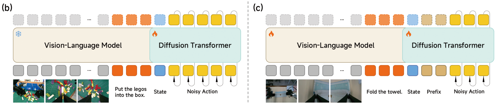
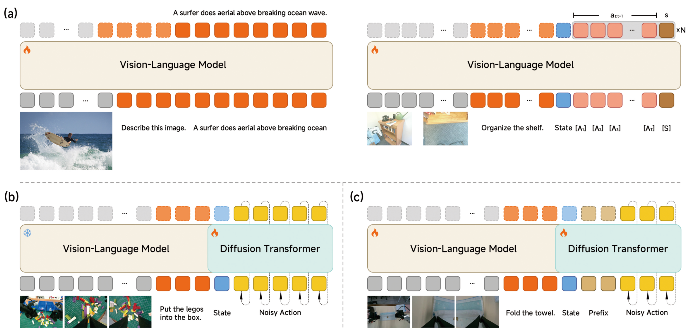
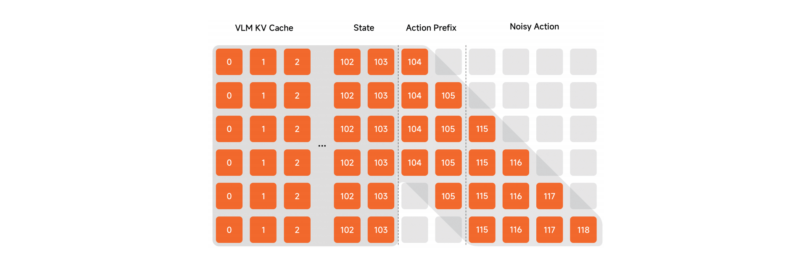
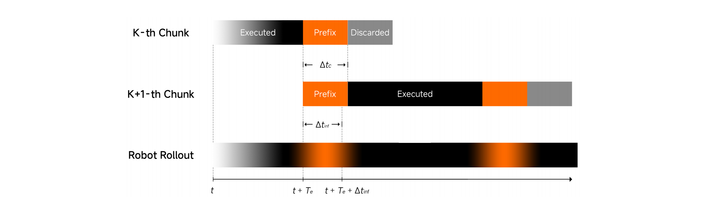
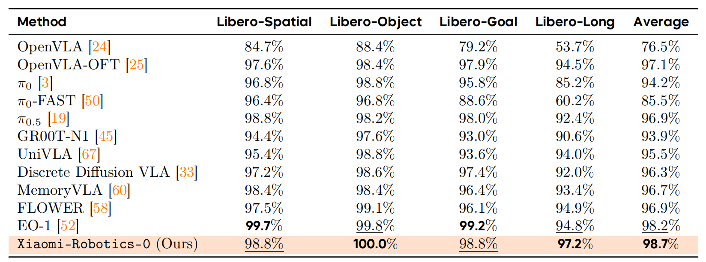
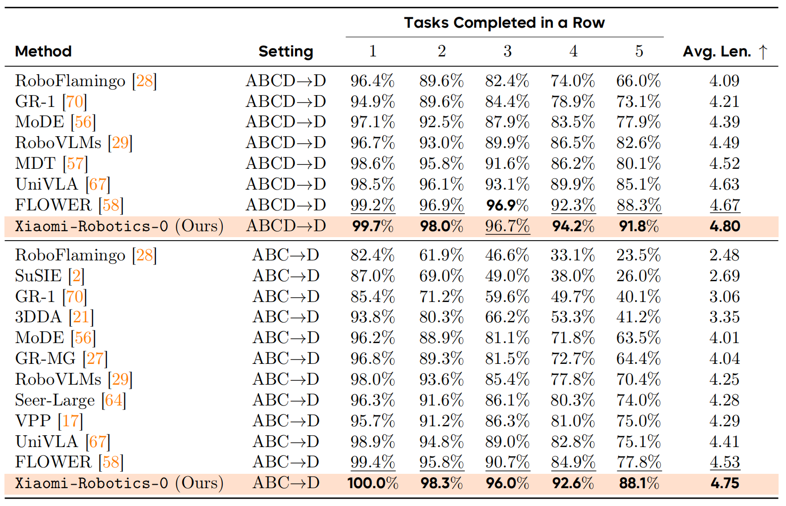
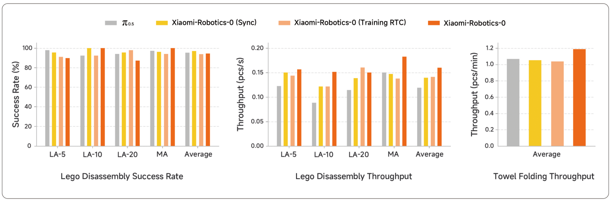
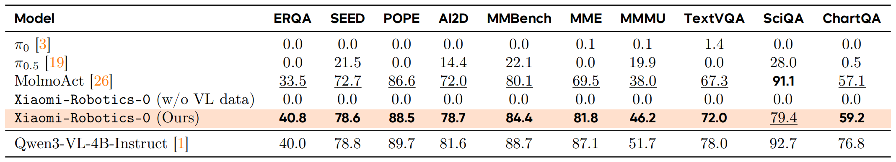

## Xiaomi-Robotics-0: An Open-Sourced Vision-Language-Action Model with Real-Time Execution

> 论文：[arXiv:2602.12684](https://arxiv.org/abs/2602.12684)
> 项目：[Project Page](https://xiaomi-robotics-0.github.io/)
> GitHub：[XiaomiRobotics/Xiaomi-Robotics-0](https://github.com/XiaomiRobotics/Xiaomi-Robotics-0)

### 一. 工作动机

**核心问题**：大参数量 VLA 的推理延迟会破坏真实机器人的连续控制。

- **同步执行**：机器人执行完当前 action chunk 后停下，等待下一次推理，动作之间存在停顿。
- **异步执行**：机器人在执行当前 chunk 时并行推理下一段动作，但新旧 chunk 可能时序错位，造成抖动或动作跳变。

**核心思想**：Xiaomi-Robotics-0 使用预训练 VLM 理解图像和语言，以 DiT 通过 Flow Matching 生成连续动作；训练时混合机器人轨迹与通用 VL 数据，并针对异步执行引入 **clean action prefix** 和 **Λ-shape attention mask**，兼顾动作连续性与策略反应性。

---

### 二. Xiaomi-Robotics-0 模型

Xiaomi-Robotics-0 是一个端到端 VLA，输入当前观测图像、语言指令和机器人本体感知状态，输出未来 $T$ 步 action chunk。



**A. 整体架构**

模型采用 **Mixture-of-Transformers（MoT）** 架构，总参数量约 **4.7B**。

| 模块 | 配置 | 作用 |
|---|---|---|
| VLM | Qwen3-VL-4B-Instruct | 编码观测图像与语言指令 |
| DiT Action Expert | 16-layer Diffusion Transformer | 根据多模态条件生成连续 action chunk |
| 状态编码器 | MLP | 编码机器人本体感知状态 |
| 时间条件 | adaLN | 将 Flow Matching timestep 注入 DiT |

**B. VLM**

VLM 处理当前观测 $\mathbf{o}_t$ 和语言指令 $l$ ，其最后 16 层 KV Cache 作为 DiT 的视觉语言条件。这样既能利用预训练 VLM 的语义知识，也无需将连续动作离散化为 token。

**C. DiT Action Expert**

DiT 的基本输入序列为：

$$
[SINK],\ \mathbf{s}_t,\ \tilde{\mathbf{a}}_t^\tau,\ldots,\tilde{\mathbf{a}}_{t+T-1}^\tau
$$

- $[SINK]$ ：learnable attention sink token，用于稳定注意力分布；

  > [SINK] 是一个用于吸收暂时无用注意力的“空白槽位”，有些注意力头在某些情况下没有特别重要的信息需要关注，但 Softmax 又要求注意力权重之和为 1。此时，模型可以把多余的注意力分配给 `[SINK]`，而不是错误地集中在某个 action token 上。
- $\mathbf{s}_t$ ：经 MLP 编码的机器人状态；
- $\tilde{\mathbf{a}}^\tau$ ：带噪 action chunk；
- $\tau$ ：通过 adaLN 注入的 Flow Matching timestep。

  > adaLN 是 **Adaptive Layer Normalization（自适应层归一化）**。
  >
  > * 普通 LayerNorm 使用固定的缩放和偏移参数： $\mathrm{LN}(h)=\gamma\odot\frac{h-\mu}{\sigma}+\beta$
  >
  > * adaLN 则让缩放量和偏移量由外部条件决定： $\mathrm{adaLN}(h,\tau)=\gamma(\tau)\odot\mathrm{LN}(h)+\beta(\tau)$
  >
  > 在 Xiaomi-Robotics-0 中，外部条件是 Flow Matching timestep $\tau$ ：
  >
  > ```text
  > τ → MLP(timestep embedding) → γ(τ), β(τ) → 调节 DiT 中间特征
  > ```

Pre-training 阶段的 DiT 使用 causal attention，使后续动作能够关注较早动作，建模 action chunk 内的时间关系。

---

### 三. 训练流程

#### 1. 训练数据

| 数据类型 | 规模 | 主要来源与用途 |
|---|---:|---|
| 机器人轨迹 | 约 200M timesteps | DROID、MolmoAct 等**开源数据**及**小米自采数据** |
| Lego Disassembly | 338 小时 | 面向**真实双臂任务**的遥操作数据 |
| Towel Folding | 400 小时 | 面向**可变形物体**操作的遥操作数据 |
| Vision-Language 数据 | 超过 80M samples | 保留 VLM 能力并增强 robot-centric 视觉理解 |

> VL 数据覆盖 visual grounding、VQA、image captioning 和 embodied reasoning & planning。
> 训练时 VL 数据与机器人轨迹的采样比例为 **1:6**。



#### 2.  (a) Pre-training Stage 1：训练 action-aware VLM

模型在 VLM 后追加 $T$ 个 learnable action tokens $[A_i]$ 和一个 score token $[S]$ ：

$$
\mathbf{o}_t,\ l,\ \mathbf{s}_t,\ [A_1],\ldots,[A_T],\ [S]
$$

为处理动作分布的 multi-modality，模型采用 **Choice Policies**：

1. 同时预测 $N$ 个候选 action chunk 及其分数；
2. 计算每个候选与 ground truth 的 $L_1$ 距离；
3. 使用 winner-takes-all，**只更新距离最小的候选**。

$$
\begin{aligned}
d_n &= \left\|\hat A^{(n)}-A^{GT}\right\|_1,
\qquad n^*=\arg\min_n d_n, \\
\mathcal L_{\mathrm{action}} &= \left\|\hat A^{(n^*)}-A^{GT}\right\|_1, \\
\mathcal L_{\mathrm{score}} &= \sum_{n=1}^{N}\ell(\hat s_n,d_n),
\qquad \mathcal L=\mathcal L_{\mathrm{action}}+\lambda\mathcal L_{\mathrm{score}}.
\end{aligned}
$$

> 目的是使 VLM 表征具备 action awareness（动作意识），并加快后续 DiT 收敛。[S] 的作用是提供辅助监督，促使 VLM 学到与动作质量、任务可行性有关的 action-aware 表征。

同时在 VL 数据上使用 next-token prediction，防止 VLM 的视觉语言能力发生灾难性遗忘。

#### 3. (b) Pre-training Stage 2：训练 DiT

完成 Stage 1 后：

- 冻结 VLM；
- **从头训练 16-layer DiT**；
- VLM 仅作为多模态条件编码器；
- DiT 使用 Flow Matching 生成连续动作。

带噪动作定义为：

$$
\tilde{\mathbf{a}}_{t:t+T}^{\tau}=\tau\mathbf{a}_{t:t+T}+(1-\tau)\boldsymbol{\epsilon},\qquad \boldsymbol{\epsilon}\sim\mathcal{N}(\mathbf{0},\mathbf{I})
$$

训练目标为：

$$
\mathcal{L}(\theta)=\left\|\mathbf{v}_{\theta}(\mathbf{o}_t,l,\mathbf{s}_t,\tilde{\mathbf{a}}^\tau,\tau)-\mathbf{u}(\tilde{\mathbf{a}}^\tau,\mathbf{a},\tau)\right\|_2^2
$$

$\tau$ 从 Beta 分布采样，使训练更关注噪声较强的时间步。

#### 4. Post-training：适配目标机器人

**同步版本**：解冻 VLM 和 DiT，在目标机器人轨迹上继续使用 Flow Matching 训练。

**(c) 异步版本**：将上一轮已确定执行的 $\Delta t_c$ 个动作放在 noisy actions 前，作为 **clean action prefix**：

$$
[SINK],\mathbf{s}_t,\underbrace{\mathbf{a}_t,\ldots,\mathbf{a}_{t+\Delta t_c-1}}_{\text{clean prefix}},\underbrace{\tilde{\mathbf{a}}_{t+\Delta t_c}^{\tau},\ldots,\tilde{\mathbf{a}}_{t+T-1}^{\tau}}_{\text{待生成动作}}
$$

clean prefix 能连接新旧 chunk，但也可能使模型只复制前序动作，忽略视觉和语言。论文采用三项改进：

- **RoPE position offset**：给 noisy action tokens 的位置索引增加 10，使其与 clean prefix 可区分；

- **Λ-shape attention mask**：邻近 prefix 的动作可关注 prefix，保证平滑；较远动作不能关注 prefix，迫使模型重新依赖视觉、语言和状态；

  

- **Adaptive loss re-weighting**：根据 online prediction 与 ground truth 的 $L_1$ 误差提高偏差较大样本的权重，让模型重点学习：当执行状态已经偏离演示轨迹时，如何纠正明显错误并回到合理动作。

训练时从 $\{0,1,\ldots,6\}$ 中随机采样 $\Delta t_c$ 。

---

### 四. 推理流程

#### 1. Action chunk 生成

1. 使用最新图像和语言指令计算 VLM KV Cache；
2. 从标准高斯分布初始化 action chunk： $\mathbf{a}^{\tau=0}_{t:t+T}\sim\mathcal{N}(\mathbf{0},\mathbf{I})$ ；

3. 执行 **5 步 Flow Matching**，将 $\tau$ 从 0 积分到 1；
4. 输出连续的 $T$ 步 action chunk。

在 RTX 4090 上，单次推理延迟约为 **80 ms**。

#### 2. 同步执行

机器人执行当前 chunk 的前 $T_e$ 步后，使用最新观测推理下一段动作，并在推理期间保持静止：

```text
推理 A → 执行 A 的前 T_e 步 → 等待推理 B → 执行 B
```

优点是时序简单、反应较准确；缺点是 chunk 之间存在停顿。

#### 3. 异步执行



机器人执行完当前 chunk 的前 $T_e$ 步后启动下一轮推理，同时继续执行当前 chunk 的剩余动作：

```text
机器人：执行前 T_e 步 ── 继续执行旧 chunk ── 切换到新 chunk
                    │
模型：               └── 推理新 chunk
```

新推理使用当前 chunk 从 $T_e$ 到 $T_e+\Delta t_c-1$ 的动作作为 clean prefix。假设机器人继续执行了 $\Delta t_{\mathrm{inf}}$ 步。推理完成后：

- 从新 chunk 的第 $\Delta t_{\mathrm{inf}}$ 步开始执行；
- 设置 $\Delta t_c\geq\Delta t_{\mathrm{inf}}$ ，确保之后切换到新 chunk 时衔接平滑。

因此，已经在推理期间执行过的 prefix 不会重复执行，机器人直接从时间对齐的位置接入新 chunk。

所有输入模态根据 timestamp 重采样到统一的 **30 Hz** 时间线，以保持相机、机器人状态和动作时序一致。

---

### 五. 实验

#### 1. 仿真基准

**LIBERO**



**CALVIN**



* ABCD $\rightarrow$ D 表示在 A、B、C、D 上训练，在 D 上测试；ABC $\rightarrow$ D 表示只在 A、B、C 上训练，在未见过的 D 上测试。
* `Tasks Completed in a Row` 的 `1、2、3、4、5` 表示成功连续完成至少 $k$ 个任务的比例。
* `Avg. Len.` 是每条五任务指令链平均连续完成的任务数量，最大值为 5。

**SimplerEnv**

| 方法 | Google Robot Visual Matching | Google Robot Variant Aggregation | WidowX |
|---|---:|---:|---:|
| $\pi_0$ | 71.4% | 54.7% | 69.2% |
| EO-1 | 76.5% | 63.0% | 72.7% |
| **Xiaomi-Robotics-0** | **85.5%** | **74.7%** | **79.2%** |

模型在三个基准上均取得论文报告时的 SoTA 结果。

#### 2. 真实机器人实验

实验平台为双臂机器人，每条机械臂 6-DoF，配备两个腕部相机和一个外部相机。真实任务包括：

- **Lego Disassembly**：拆解 Lego 并按颜色分类；
- **Towel Folding**：取出、展平、折叠并放置毛巾。



> * Xiaomi-Robotics-0 (Sync) 表示同步执行版本；Xiaomi-Robotics-0 (Training RTC) 相比于完整版去除了 RoPE position offset、Λ-shape attention mask 和 Adaptive loss re-weighting。
> * Throughput（吞吐量）衡量机器人在单位时间内成功完成多少工作，重点反映执行效率，而不只是单次任务成功率。这里`pcs/min` 表示 pieces per minute (每分钟成功处理的物品数量)。

异步执行显著提高 throughput，但在精细 Lego 抓取中，同步方法的成功率略高，体现了执行速度与反应精度之间的权衡。

#### 3. Vision-Language 能力保持



混合 VL 数据后，模型基本保留底层 VLM 的视觉语言能力；去除 VL 数据会导致严重灾难性遗忘。
