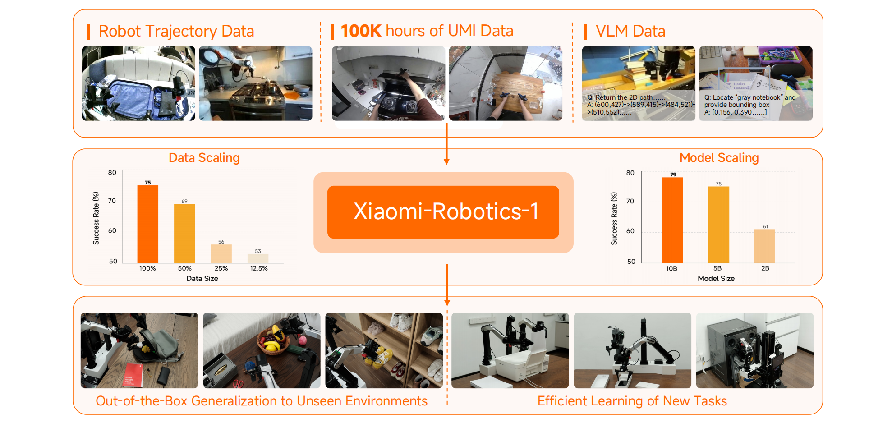
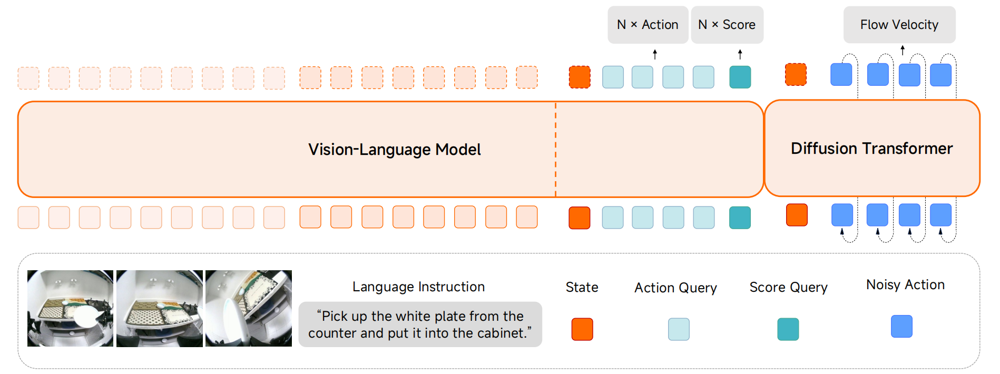
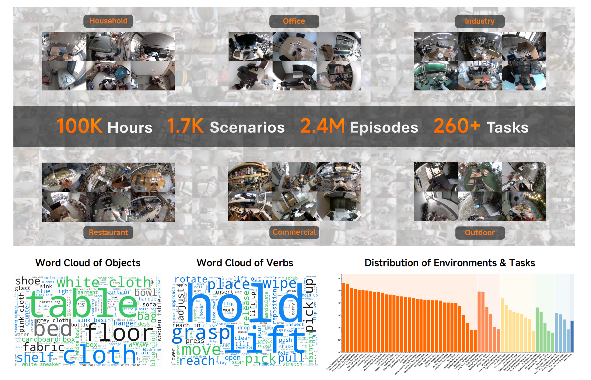
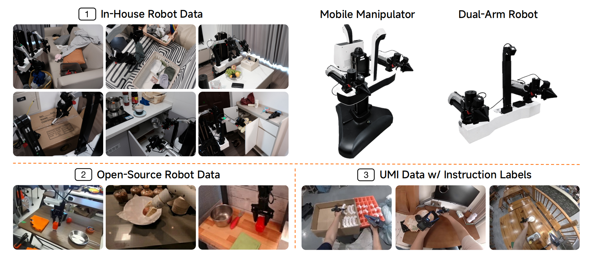
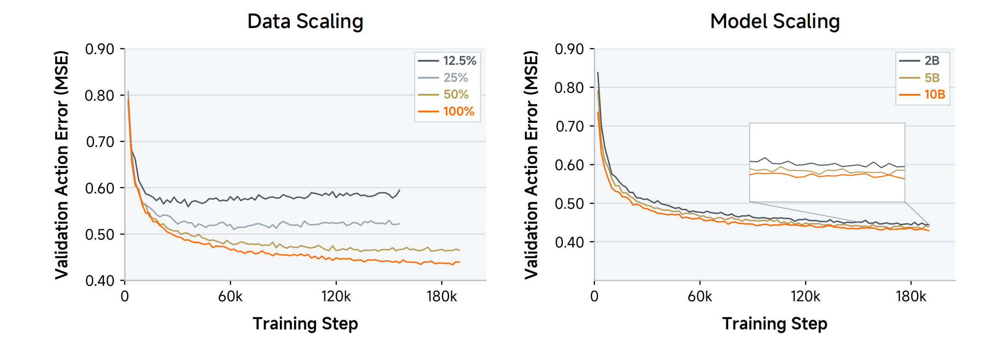
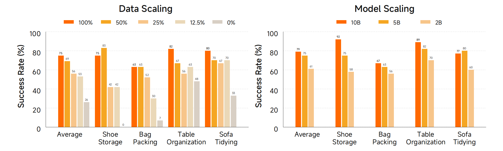
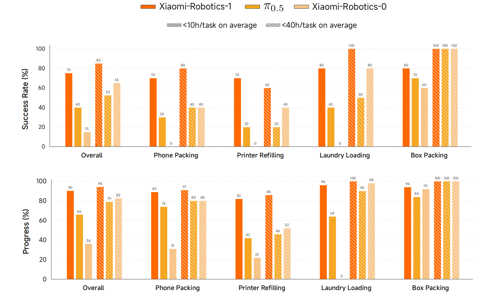

## Xiaomi-Robotics-1: Scaling Vision-Language-Action Models with over 100K Hours of Real-World Trajectories

> 论文：[arXiv:2607.15330](https://arxiv.org/abs/2607.15330)
> 项目：[Xiaomi-Robotics-1](https://robotics.xiaomi.com/xiaomi-robotics-1.html)
> GitHub：[XiaomiRobotics/Xiaomi-Robotics-1](https://github.com/XiaomiRobotics/Xiaomi-Robotics-1)

### 一. 概述

**研究动机**：VLA 的规模化受制于真实机器人数据。传统遥操作依赖固定机器人平台，成本高、场景覆盖窄且数据冗余，难以复现 LLM/VLM 的 Scaling 路线。

**核心思想**：使用**便携式 UMI 手持夹爪**在开放环境中采集超过 10 万小时、与具体机器人本体解耦的操作轨迹，并采用类似 LLM 的两阶段范式：先从大规模 UMI 数据学习通用操作先验，再用多种真实机器人数据完成 embodiment 与指令对齐。

主要贡献：

1. 构建超过 **100K 小时**的真实 UMI 数据，覆盖 **1.7K 场景、2.4M 轨迹和 260+ 任务**。
2. 提出可扩展的 **VLM + DiT** VLA，并验证数据规模和模型规模均能提升策略（scaling up），其中数据扩展收益更显著。
3. 在真实机器人和 RoboCasa、RoboCasa365、VLABench、RoboDojo 上验证泛化与低数据微调能力。

### 二. 模型方法

#### 1. 整体架构

Xiaomi-Robotics-1 是一个端到端 VLA，输入当前观测 $o_t$ 、语言指令 $l$ 和机器人状态 $s_t$ ，输出长度为 $H$ 的 action chunk：

$$
\max_{\theta}\;\mathbb{E}_{(o_t,l,a_{t:t+H})\sim\mathcal D}
\left[\log \pi_{\theta}(a_{t:t+H}\mid o_t,l)\right].
$$

模型采用 Mixture-of-Transformers（MoT）结构：

- **VLM**：基于 Qwen3-VL，编码图像与语言，提供多模态 KV cache。
- **DiT Action Expert**：接收机器人状态、噪声动作和 VLM 条件，通过 Flow Matching 生成连续动作。
- VLM 与 DiT 层数一致，但 DiT hidden size 更小；两者逐层交互。

| 版本 | 层数 | VLM hidden / 参数量 | DiT hidden / 参数量 | 总参数量 |
|---|---:|---:|---:|---:|
| Xiaomi-Robotics-1-2B | 28 | 2048 / 2.1B | 1024 / 470M | 2.6B |
| Xiaomi-Robotics-1-5B | 36 | 2560 / 4.4B | 1024 / 604M | 5.1B |
| Xiaomi-Robotics-1-10B | 36 | 4096 / 8.8B | 2048 / 1.5B | 10.5B |

#### 2. Flow Matching Action Expert

给定真实动作 $a_{t:t+H}$ 和高斯噪声 $\epsilon\sim\mathcal N(0,I)$ ，构造插值动作：

$$
\tilde a_{t:t+H}^{\tau}
=\tau a_{t:t+H}+(1-\tau)\epsilon.
$$

DiT 学习预测将噪声动作输运到真实动作的速度场：

$$
\begin{aligned}
\mathcal L_{\mathrm{Flow}}(\theta)
&=\left\|
v_{\theta}(o_t,l,s_t,\tilde a_{t:t+H}^{\tau},\tau)
{}-(a_{t:t+H}-\epsilon)
\right\|_2^2.
\end{aligned}
$$

时间步采用偏向低噪声区域的 Beta 采样：

$$
u\sim\mathrm{Beta}(1.5,1),\qquad
\tau=(1-u)\times0.999\in[0,0.999].
$$

$\tau$ 通过 adaLN 注入 DiT。

#### 3. Choice Policies 辅助分支

训练时，VLM 末端加入 state token、action query tokens 和 score query tokens，一次回归 $K$ 个候选 action chunk 及其分数。第 $k$ 个候选的监督分数为它与 GT 动作的 L1 距离：

$$
s_k=\left\|\hat a_{t:t+H}^{k}-a_{t:t+H}\right\|_1.
$$

选择距离最小的候选 $\hat a^*$ 计算动作回归损失，同时让所有 score 预测对应距离：

$$
\mathcal L_{\mathrm{Regression}}(\theta)
=\left\|\hat a^*_{t:t+H}-a_{t:t+H}\right\|_1
+\sum_{k=1}^{K}\left\|\hat s_k-s_k\right\|_2^2.
$$

该分支用于使 VLM 表征具备 action awareness（动作意识），并加快 DiT 收敛。为防止 DiT 直接复制 VLM 的动作预测，DiT **不能关注 action/score query 对应的 KV token**，只能使用视觉和语言条件。

### 三. 训练流程

#### 1. Pre-training：学习通用操作先验

UMI 是带第一视角相机的便携式手持夹爪，不要求采集现场部署完整机器人。数据覆盖家庭、办公室、工业、餐饮、商业和户外场景。

**自动语言标注流程**：

1. 将长轨迹等长切分为短片段。
2. 使用 Qwen3.5-27B 描述夹爪与物体的状态变化。
3. 使用并行 producer–consumer 标注系统（步骤 1 和 2 并行），在大约两周内完成超过 10 万小时数据的自动标注。

> 这里的语言主要是状态变化描述，例如“夹爪抓住杯子，并将杯子从桌面移动到盒子内部”，而非人类常用的命令“把杯子放进盒子”。优点在于精确描述了当前图像到目标状态之间的变化，模型学习的是： $\text{当前状态}+\text{目标状态描述}\rightarrow\text{实现该变化的动作}$ 。

**Pre-training 联合优化三项目标**：

$$
\mathcal L
=\mathcal L_{\mathrm{Flow}}
+\mathcal L_{\mathrm{Regression}}
+\lambda\mathcal L_{\mathrm{NTP}},
\qquad \lambda=0.1.
$$

- $\mathcal L_{\mathrm{Flow}}$ ：训练 DiT 生成动作。
- $\mathcal L_{\mathrm{Regression}}$ ：训练 VLM 的 Choice Policies。
- $\mathcal L_{\mathrm{NTP}}$ ：在视觉语言数据上保持 next-token prediction 能力。

视觉语言数据与 UMI 数据的采样比例为 **1:9**。为提高效率，视觉语言 token 使用 sequence packing；每个样本采样 4 个 Flow Matching 时间步，并将 4 份 DiT 输入合并到一次前向中。

#### 2. Post-training：对齐机器人本体与指令

Post-training 解决两个差异：

1. 将 UMI 手持夹爪的操作能力迁移到真实机器人 embodiment。
2. 将描述性的 state-transition language 对齐为人类使用的 imperative instruction。

约 10K 小时数据包括：

- 超过 7,200 小时自采移动操作机器人和双臂机器人数据；
- Bridge V2、RT-1、DROID 等公开机器人数据；
- 超过 1,000 小时人工切分并标注指令的 UMI 数据。

机械臂动作统一表示为当前末端位姿到目标末端位姿的相对变换；不同机器人和 UMI 的末端坐标系方向被统一，使相同运动方向对应相同动作值；底盘使用速度，腰部使用相对位置变化；缺失的动作维度通过 mask 忽略。

训练目标与 Pre-training 相同，视觉语言、公开机器人、指令 UMI、自采机器人数据的采样比例为 **0.5:0.5:0.5:8.5**。

### 四. 推理流程

首先，VLM 编码当前多视角观测与指令，得到视觉语言 KV cache。随后从高斯噪声动作 $a^0$ 开始，将机器人状态和 VLM 条件输入 DiT，并使用 5 步 Euler integration，步长 $\Delta\tau=0.2$ ：

$$
a^{\tau+\Delta\tau}
=a^{\tau}+\Delta\tau\cdot
v_{\theta}(o_t,l,s_t,a^{\tau},\tau).
$$

最后，将 $\tau=1$ 时得到的 action chunk 发送给机器人执行。

Choice Policies 的动作和分数不负责最终控制；推理动作由 DiT 生成。论文未披露 action chunk 长度 $H$ 、端到端延迟和推理硬件。

### 五. 实验

- **下游微调**：Phone Packing、Printer Refilling、Laundry Loading、Box Packing；低数据共 36 小时，高数据共 144 小时，每个任务测试 10 次。
- **仿真基准**：RoboCasa、RoboCasa365、VLABench、RoboDojo。

#### 1. Scaling 与真实机器人泛化

**设置**：固定 5B 模型改变 UMI 数据比例；固定约 20K 小时数据比较 2B、5B、10B 模型。注意该受控实验使用约 20K 小时子集，并非全部 100K 小时。

**结果**：

**结论**：验证集动作误差随数据量和模型量增加而下降，且主要瓶颈更偏向数据规模与多样性。

#### 2. Out-of-the-box 泛化

**设置**：Shoe Storage、Bag Packing、Table Organization、Sofa Tidying。任务类型在 Post-training 中出现过，但测试环境和物体实例未见过，且不做测试场景微调。

**结果**：

**结论**：随着 UMI 预训练数据和模型规模增大，模型在未见环境和物体上的成功率持续提升，说明预训练获得的操作先验能有效迁移到真实机器人。其中数据扩展的收益比模型扩展更显著。

#### 3. 下游微调

**设置**：Phone Packing、Printer Refilling、Laundry Loading、Box Packing；低数据共 36 小时，高数据共 144 小时，每个任务测试 10 次。

**结果**：

**结论**：Xiaomi-Robotics-1 在低数据条件下优势更明显，说明大规模 UMI Pre-training 提供了可迁移的操作先验。

#### 4. 仿真基准

**设置**：RoboCasa、RoboCasa365、VLABench、RoboDojo。

**结果**：

| 基准 | Xiaomi-Robotics-1 | 对比结果 |
|---|---:|---:|
| RoboCasa Avg. Success | **74.5%** | World2Act：72.6% |
| RoboCasa365 Avg. Success | **57.4%** | ABot-M0.6：46.6% |
| VLABench Avg. Success | **59.1%** | ERVLA：53.2% |
| RoboDojo Avg. Score | **20.07** | Hy-Embodied：13.07 |
| RoboDojo Avg. Success | **13.93%** | Hy-Embodied：8.80% |

**结论**：Xiaomi-Robotics-1 在 RoboCasa、RoboCasa365、VLABench 和 RoboDojo 上均取得领先结果，表明其具备较强的多任务操作与跨场景泛化能力；但在需要历史信息的 Memory 任务上仍相对较弱。

### 六. 局限性

1. 受计算成本限制，受控 Scaling 实验只使用约 20K 小时子集，尚未给出完整 100K 小时上的系统 Scaling Law。
2. Out-of-the-box 实验只测试未见环境和物体实例，任务类型本身在 Post-training 中出现过，不能等同于未见任务的 zero-shot 泛化。
3. UMI 预训练后仍需要约 10K 小时多机器人 Post-training，尚未做到无需 embodiment 对齐即可部署。
4. 真实机器人微调实验每个任务仅测试 10 次，成功率统计粒度较粗。
5. 模型不显式输入历史观测，因此在 RoboDojo 的 Memory 任务上弱于带记忆设计的方法。
