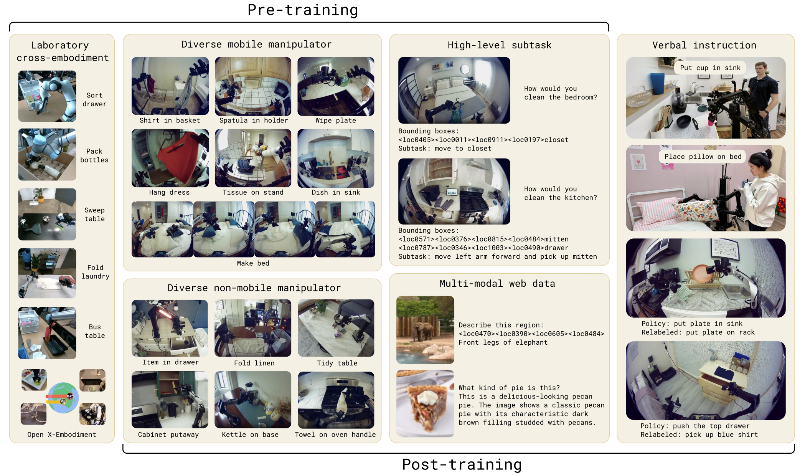

## π0.5: A Vision-Language-Action Model with Open-World Generalization

### 一. 工作动机

**核心问题**：尽管 VLA 模型在端到端机器人控制上展现了令人印象深刻的结果，但**“开放世界泛化”（Open-world generalization）**仍然是具身智能最大的难题之一 。当机器人离开实验室，面对真实世界中从未见过的家庭环境、多样的物体和意想不到的突发状况时，现有的模型往往表现不佳 。

**核心思想**：为了实现广泛的泛化能力，系统必须能够从**各种异构的信息源**中获取经验和知识 。`π0.5` 基于 `π0` 架构，提出了一种全新的**联合训练（Co-training）框架** 。它不仅使用目标移动机器人的数据，还大量引入了非移动机器人数据、实验室跨实体数据、高级语义预测任务、人类口头指令以及多模态网络数据（如图像描述、VQA） 。通过这种**异构数据**的联合训练，`π0.5` 实现了在**完全未见过的真实家庭环境**中执行长程、复杂的多阶段家务任务 。

------

### 二. π0.5 模型

`π0.5` 继承了 `π0` 的核心设计（预训练VLM主干 + 动作专家），但为了兼容广泛的联合训练任务并实现**分层推理**，它在架构和动作表示上进行了重大升级 。

**A. 整体架构**

与 `π0` 类似，`π0.5` 采用单一的 Transformer 架构，但内置两套独立的权重（混合专家） ：

- **VLM主干**：继承自 PaliGemma，负责处理图像块、文本词元以及离散化后的机器人状态 。(`width=2048`, `mlp_dim=16384`, 2B参数) 
- **动作专家**：专门用于通过流匹配（Flow Matching）生成连续动作序列 。(`width=1024`, `mlp_dim=4096`, 300M参数) 

> **`π0.5` 与 `π0` 的核心差异之一：统一高低级策略**：`π0` 直接将观察输入映射到动作流。而 `π0.5` 被设计为一个不仅能输出动作，还能输出文本（如回答问题或预测下一步高级子任务）的模型 。它将分布分解为 `pi_θ(a_t:t+H, l_hat | o_t, l) = pi_θ(a_t:t+H | o_t, l_hat) pi_θ(l_hat | o_t, l)`，这意味着同一个模型既充当输出高级语义文本 `l_hat` 的“大脑”，又充当输出低级连续动作 `a_t:t+H` 的“小脑” 。

**B. 离散与连续动作的混合表示**

为了解决纯连续动作训练效率低的问题，`π0.5` 创新性地在同一个模型中结合了**离散动作词元（FAST tokenizer）**和**连续动作流（Flow Matching）** 。

- **损失函数**：模型被优化以最小化一个组合损失：`Loss = E_D, τ, ω [H(x_1:M, y_1:M^l) + α ||ω - a_t:t+H - f_θ^a(a_t:t+H^τ, ω, o_t, l)||^2]` 

  其中，第一项是交叉熵损失（用于文本词元和 FAST 离散动作词元的自回归预测），第二项是动作专家的流匹配均方误差损失 。

**C. 注意力掩码设计**

为了防止不同模态和不同表示之间发生信息泄露，`π0.5` 设计了精密的注意力掩码：

- **前缀掩码**：图像、文本提示和机器人状态词元之间具有完全的双向注意力 。

  >与 `π0` 存在差异：在 `π0` 中，机器人状态通常被视为连续向量输入到动作专家中，而 `π0.5` 则将其离散化为文本词元，输入到 VLM 主干，这是为了更好地统一预训练阶段的数据格式，让 VLM 能像处理自然语言一样无缝处理机器人的状态信息。

- **FAST 动作词元**：关注前面的多模态前缀，并对**先前**的 FAST 动作词元进行自回归关注。

- **动作专家嵌入**：关注前缀并**相互关注**，但**绝对不关注 FAST 动作词元**，以**避免两种动作表示之间的信息泄露** 。

- **单向信息流**：信息严格从 VLM 单向流向动作专家，VLM 的任何嵌入都不会去关注动作专家。

------

### 三. 训练与推理

`π0.5` 放弃了 `π0` 从头到尾使用流匹配的训练方式，采用了一种“**先离散后连续**”的两阶段训练范式，极大提升了训练效率和多任务兼容性 。

**A. 第一阶段：预训练 (Pre-training)**

在这个阶段，模型被当作一个标准的自回归 Transformer 进行训练（关闭动作专家，损失函数 `α=0`），其中所有的动作数据都被 FAST Tokenizer 转化为**离散的文本词元**进行下一步预测（让模型将网络视觉-语言知识、跨机器人物理常识与机器人控制在一个统一的文本空间中对齐）。

- **数据配方** ：
  1. **MM (Diverse Mobile Manipulator)**：目标移动机械臂在不同家庭中的约400小时数据。
  2. **ME (Diverse Multi-Environment non-mobile)**：静态非移动机械臂在各种家庭环境中的数据（跨实体+多样化背景）。
  3. **CE (Cross-Embodiment laboratory data)**：实验室环境下的多形态机器人数据（包含 OXE 数据集）。
  4. **HL (High-Level subtask prediction)**：将长任务人工标注为语义子任务（如“调整毯子”），训练模型在预测动作前先预测子任务文本。
  5. **WD (Multi-modal Web Data)**：包括图像描述、VQA和边界框目标定位等互联网数据。

**B. 第二阶段：后训练/微调 (Post-training)**

这个阶段的目的是让模型专精于移动操作任务，并**激活“动作专家”**以实现基于流匹配的高频、高精度连续动作生成 。

- **训练变化**：
- 引入流匹配损失（`α=10.0`），随机初始化动作专家并开始和 VLM 主干一起**联合训练** 。
  
- 数据集剔除实验室级数据 (CE)，仅保留高质量的移动/静态家庭环境数据 (MM, ME)、网络数据 (WD) 和子任务数据 (HL) 。
  
- **引入口头指令**：人类监督者通过自然语言一步步指导机器人完成**长程任务**的专家演示，专门用于强化模型的高级**子任务预测能力** 

> 在后训练阶段，模型并非分步运行，被优化以**最小化一个组合损失函数**，“一次性”训练而成：
>
> 1. **VLM 主干**负责计算交叉熵损失，用于自回归预测文本词元（这些文本既包括了高级子任务的语义描述，也包括了**使用 FAST Tokenizer 编码后的离散动作词元**）；
> 2. **动作专家**同时负责计算流匹配的均方误差损失，用于预测连续的动作向量场 。

**C. 推理流程 (分层决策，“两步走)**

在部署时，`π0.5` 展现出类似“思维链（Chain-of-Thought）”的决策过程 ：

1. **高级推理**：接收如“清理卧室”的顶层指令，模型首先自回归解码出一句**子任务文本 `l_hat`**，例如“捡起枕头” 。
2. **低级执行**：将生成的子任务 `l_hat` 作为上下文条件输入给动作专家，通过 10 步流匹配去噪，直接输出连续的低级动作块 (Action Chunk) 供机器人执行 。

------

### 四. 实验

论文在完全未见过的新厨房和新卧室中进行了大量实机评估 。

- **研究问题一：π0.5 在真实家庭环境中的泛化能力如何？**
  - **实验设置**：让机器人在三个全新的真实家庭中执行清理厨房、整理卧室等长程任务（约2-5分钟，含多个子阶段） 。
  - **实验结论**：`π0.5` 仅需简单的顶层指令（如“把盘子放进水槽”），就能自主规划合理的子步骤并顺利完成极其复杂的任务，展现了远超以往 VLA 模型的开放世界泛化水平 。
- **研究问题二：随着训练场景数量的增加，性能如何扩展？**
  - **实验结论**：随着训练地点数量的增加（从3个增加到104个），模型在多阶段任务和语言指令遵循上的表现稳步提升 。在104个地点的训练后，即使不使用测试家庭的数据，`π0.5` 的表现也逼近了直接在测试家庭数据上训练的基线模型 。
- **研究问题三：联合训练配方中各成分的贡献是什么？(Ablations)**
  - **跨实体数据 (CE/ME)**：至关重要。移除其他机器人或实验室数据会导致特定操作任务（如把物品放入抽屉）的成功率大幅下降 。
  - **网络数据 (WD)**：对于处理**分布外 (OOD)** 的未见物体极其重要，WD 赋予了模型广泛的物理世界语义知识 。
  - **口头指令 (VI)**：虽然数据量小（仅占高级数据的11%），但对模型的高级推理（子任务规划）能力有着决定性的提升作用 。
- **研究问题四：π0.5 与 π0 的对比表现如何？**
  - **实验结论**：`π0.5` 显著优于原始 `π0` 以及强化版的 `π0`-FAST+Flow 。这证明了结合高级子任务数据 (HL)、网络数据 (WD) 以及“先离散后连续”的混合训练范式的巨大优越性 。
- **研究问题五：高级子任务预测 (High-level inference) 有多重要？**
  - **实验结论**：完整的 `π0.5` （显式生成子任务文本后再动作）表现最佳 。有趣的是，即便是“隐式”包含这些高级标签进行训练但不进行显式推理的模型，也比完全没有这些数据的基线强 。同时，即使直接使用强大的 GPT-4 作为高级策略来指挥机器人，效果也远不如经过机器人数据微调的 `π0.5` 高级策略 。

------

### 五. 局限性

- **仍然存在执行失败**：面对不熟悉的把手、物理阻力较大的抽屉，或者当机械臂遮挡了视线（部分可观测性）时，模型依然会出错 。
- **高级策略易分心**：高级子任务规划有时会陷入死循环（比如在放东西时反复开关抽屉） 。
- **指令理解有限**：受限于训练数据，目前只能处理相对简单的指令，无法处理高度复杂的逻辑约束或人类偏好 。
- **缺乏长程记忆**：模型上下文长度有限，不具备在不同房间之间导航或记住物品存放位置所需的“长期记忆”能力。