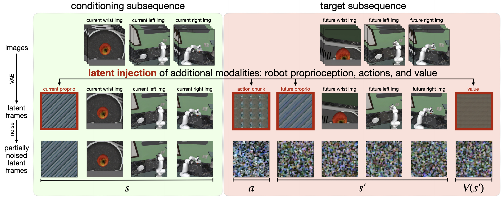

## 一. 文章内容概括

#### 解决了什么问题？

- **架构与训练流程复杂**：现有的许多将视频模型适配于机器人控制的研究，通常需要**多阶段训练**（例如先微调视频模型，再单独训练动作模块），并**引入新的架构组件**（如独立的动作扩散器或逆动力学模型），增加了系统的复杂性 。  
- **未能充分利用预训练时空先验**：虽然部分研究提出了统一的视频-动作模型，但它们往往**不依赖预训练的视频模型进行初始化**（因为需要自定义设计），从而无法充分享受海量互联网视频中蕴含的物理规律和时空先验 。  
- **纯演示数据对规划的局限性**：如果仅使用成功的专家演示数据进行训练，世界模型和价值函数只能看到**狭窄的状态-动作分布（全部是成功结果）**，这导致它们在面对分布外的状态时泛化能力差，难以支持有效的模型驱动规划 。  

#### 怎么解决的？

- **无架构修改的单阶段微调**：提出了 Cosmos Policy，**直接基于一个 2B 参数的大型预训练视频模型（Cosmos-Predict2-2B）构建**。该方法**没有任何架构修改**，仅通过在机器人演示数据上进行**单阶段微调**，利用原生的扩散学习目标来联合建模所有模态 。  
- **潜在帧注入技术**：巧妙地将机器人的本体状态、动作块以及未来状态的预期价值**伪装并编码为潜空间中的“帧”**，直接无缝插入到视频模型原有的潜在扩散序列中 。  
- **基于经验的价值细化与规划**：通过收集策略部署过程中的回放数据，Cosmos Policy 能够从经验中学习，优化其世界模型和**价值函数**。在推理时使用 **Best-of-N 采样**规划，通过生成动作候选、想象未来状态并**按预期价值排序**，显著提升了复杂任务的成功率。  

---

## 二. 模型结构

Cosmos Policy 的核心思想是作为一个统一的模型，在不改变底层视频生成网络结构的前提下，联合预测动作、未来状态和价值 。  

#### A. 整体架构

**直接继承自 NVIDIA 的 Cosmos-Predict2-2B-Video2World**，这是一个基于 DiT 的潜在视频扩散模型，使用 Wan2.1 VAE Tokenizer 对连续 Token 进行操作。不需要像以前的工作那样设计独立的动作模块，而是直接将“动作”视为序列中的一种特殊特征来学习。  

#### B. 输入编码

- **语言指令**：文本描述被编码为 **T5-XXL 嵌入向量**，通过 Cross-attention 作为 DiT 的条件输入 。  

- **其余模态编码**：输入原始图像序列 $[41, H, W, 3]$（包含复制 4 遍的真实照片和凑数的纯黑图片），经过**冻结的 Wan2.1 VAE Tokenizer** 压缩为潜在帧 $[11, H', W', 16]$（这里的 Tokenizer 可以理解为 Encoder，它会将除首帧外的后续每 4 帧压缩为 1 帧），具体是：[ 空白占位符, 本体状态, 手腕视角图像, 第三人称视角 1 图像, 第三人称视角 2 图像, 动作块, 未来本体状态, 未来手腕视角图像, 未来第三人称视角 1 图像, 未来第三人称视角 2 图像, 状态价值 ]。

  > 其中非图像模态（本体状态 $[d_{proprio}]$、动作块 $[H, d_{act}]$ 和状态价值 $[1,]$）使用潜在注入技术伪装成视频帧：
  >
  > 1. **占位：** 首先在输入序列中插入**全零**的占位图像，让 VAE 把它们编码成全零的“占位潜在帧” 。  
  >
  > 2. **归一化：** 将实际的本体状态、动作块和价值的数值，**线性缩放到 [-1, +1]** 的范围内 。  
  >
  > 3. **复制与展平：** 将这些一维数值向量进行**大量且重复的复制**，直到其数据量足够填满整个 $H'\times W'\times C'$ 的三维张量体积 。  
  >
  > 4. **强行覆盖：** 用这些填满数值的三维张量，直接在潜空间中**完全覆盖**掉第一步生成的全零占位潜在帧 。

  

- **加噪过程**：在构建好完整的潜在序列后，对**目标潜在帧**添加**随机采样的高斯噪声** 。  

#### C. 输出解码层

- **逆向提取**：模型输出潜在帧后，要还原动作块或状态价值，只需反向执行之前的伪装操作：
  1. **跳过 VAE 解码：** 绝对不能把包含动作或价值的潜在帧送入 VAE Decoder，因为 VAE 是用来还原图像的，对这些物理控制数值不起作用 。  
  2. **全局求均值：** 既然训练时是通过“大量复制”将动作向量铺满了整个 $H'\times W'\times C'$ 体积，那么在提取时，只需要沿着这些复制的维度**计算平均值**即可，这能在很大程度上消除扩散生成过程中的局部噪声方差 。  
  3. **逆归一化：** 将求完平均值后得到的 [-1, +1] 范围内的向量，按原比例**逆向缩放**回真实的物理尺度，就可以直接发送给机器人的底层控制器执行了 。
- **视频可视化（可选）**：如果需要查看模型“脑补”的未来画面，提取出的未来图像潜变量可以输入给冻结的 VAE Decoder 进行显式图像渲染 。  

---

## 三. 训练与推理流程 

#### A. 训练流程

##### 阶段一：基础训练阶段

在此阶段，模型完全依赖人类提供的数据集进行训练，尚未与真实物理环境交互。

1. **严格的数据定义**：

   - **演示数据**：纯粹的人类完美成功操作数据。

   - **初始回放数据**：演示数据的**超集**。它包含了人类专家的成功数据，以及人类在录制时**失误/手滑导致的失败数据**。

     > 在某些极高要求的数据集如真机 ALOHA 中，由于没有失误，此数据集在此阶段等同于演示数据 

2. **2:1:1 混合批次训练**： 每个训练 Batch 被严格切分为 50/25/25，通过动态掩码调控“条件”（干净）和“目标”（加噪）：

   - **50% 策略训练**：采样自**演示数据**，学习目标为 $\pi(a, s', V(s')|s)$。模型必须学会“怎么做才是对的”。
   - **25% 世界模型**：采样自**初始回放数据**，学习目标为 $p(s', V(s')|s, a)$。通过包含人类失误的数据，学习真实世界的重力、摩擦力等客观物理演化规律。
   - **25% 价值函数**：采样自**初始回放数据**，学习目标为 $p(V(s')|s, a, s')$。

3. **定制化噪声分布**： 传统视频生成模型原生偏好低噪声，但这会导致预测动作不精确。作者将对数正态噪声修改为**混合对数正态-均匀分布**（增加 30% 概率采用大噪声），迫使模型在极端模糊的高噪声条件下也能精准推演动作，极大提升了闭环控制的鲁棒性 。

   > 三类数据都是对“目标”进行加噪，而“条件”保持干净，且所有“目标”都施加高噪声。

4. **训练产物**  ：最终得到**唯一的一个基础权重文件** ，这个权重既能当策略用，也初步具备了推演未来和打分的能力。

##### 阶段二：规划模型微调

阶段一产出的“基础模型”虽然能直接用来执行动作，但其世界模型只见过人类的高质量数据，缺乏对“分布外”极端错误状态的认知，容易在规划时产生“动作明明很离谱，却脑补出完美结果”的幻觉。因此必须进入阶段二 ：  

1. **部署与收集**： 将阶段一的基础模型部署到真实环境中执行任务，收集它自己产生的轨迹。此时收集到的，才是**真正意义上包含模型自身成功与失败经验的回放数据** 。  

2. **比例大反转的微调**：

   拿着这些真实的社会毒打经验，去微调基础模型（阶段一产出的权重）。此时将数据比例切换为 **10（策略） : 45（世界模型） : 45（价值）**。这意味着模型现在将绝大部分的算力和梯度更新都倾注在了“学习物理环境演化”和“评估动作好坏”上 。

3. **训练产物**：微调结束后，我们得到了**第二个权重文件**，它就是规划模型 。

#### B. 推理流程

Cosmos Policy 在实际部署时提供两种推理模式：

* **模式一：并行输出（直接策略模式，不带规划）**

  - 模型一次性通过多步扩散去噪，**同时且并行**地预测出当前的动作块 $a$、未来状态 $s'$ 和未来价值 $V(s')$。
  - **特点**：因为不用做规划，系统拿到动作 $a$ 后直接发给机器人执行，而 $s'$ 和 $V(s')$ 在这里其实是“副产品”，可以直接丢弃。这种模式的优势是**延迟极低、速度极快**（甚至只需要 1 步去噪就能运行）。

* **模式二：串行输出（模型驱动规划模式）**

  - 模型分为三个阶段，严格按照因果顺序**自回归串行**生成。

    1. 第一阶段：用**训练阶段一的基础模型**先生成 $N$ 个不同的动作候选 $a$。
    2. 第二阶段：用**训练阶段二的规划模型**把生成的 $a$ 作为已知条件，预测它们分别对应的未来状态 $s'$（每个动作生成 3 个未来状态预测）。
    3. 第三阶段：用**训练阶段二的规划模型**把生成的 $s'$ 也作为已知条件，最后预测这些状态的价值打分 $V(s')$（每个未来状态生成 5 个价值预测）。

    经过三阶段之后，每个动作会得到 15 个价值分数，在面对多模态高方差的价值分布时，单纯求平均会导致误差。系统采用“多数均值”法：先判断这 15 个预测中是“成功”居多还是“失败”居多（通过阈值划分），随后只在占多数的群体内部计算平均分，以此对候选动作进行**打分排序**。之后选择具有最高综合预测价值分数的动作块。由于搜索开销较大，模型会完整执行整个动作块（而不是退化水平控制策略中只执行一小部分），以平衡规划收益与计算延迟，随后再利用真实的物理世界新观测进入下一个循环。  

  - **特点**：这种模式算力开销大、耗时长，但由于后续的预测是严格建立在前面步骤的基础上的，因此**评估极其精准**，能够让机器人在复杂任务（如高精度抓取）中选出成功率最高的动作轨迹。