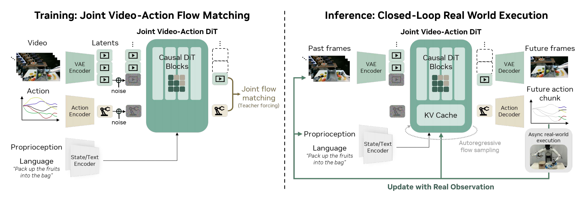

## DreamZero: World Action Models are Zero-shot Policies

> 论文：[arXiv:2602.15922](https://arxiv.org/abs/2602.15922)
> 项目：[Project Page](https://dreamzero0.github.io/)
> GitHub：[dreamzero0/dreamzero](https://github.com/dreamzero0/dreamzero)

### 一. 文章内容概括

#### 解决了什么问题？

- **泛化能力局限**：现有的 VLA 模型在语义泛化上表现出色，但在面对未知环境和未见过的物理动作（即**新技能的零样本泛化**）时表现挣扎 。
- **数据效率低下**：VLA 模型高度依赖**针对特定任务重复收集**的大规模演示数据，难以从高度多样化、非重复的异构机器人数据中有效学习 。
- **实时性不足**：大参数模型推理延迟高，视频扩散类模型的迭代去噪过程进一步加剧**延迟**（单次推理可能需要几秒），导致无法满足真实的机器人闭环高频实时控制 。

#### 怎么解决的？

- **联合视频与动作建模**：提出了 Dream-Zero，基于一个 14B 的预训练视频扩散模型 Wan2.1-12V 构建。模型并非直接预测动作，而是**联合生成未来的“视频画面”与“动作指令”**，从而自然继承了视频模型中海量的物理演化先验规律，具备物理世界理解能力，而非单纯的动作模仿。
- **高效的系统与算法优化**：为了打破延迟瓶颈，文章采用了**自回归**的 DiT 架构利用 **KV Cache** 加速，并提出了一系列软硬件优化与 **DREAMZERO-Flash（解耦视频和动作噪声调度）**技术，成功将推理速度提升了 38 倍，实现了**约 7Hz** 的实时闭环控制。

  > 自回归体现在跨视频 chunk 的因果上下文建模与 KV Cache 复用，flow matching 体现在每个 chunk 内部对视频 latent 和 action 的连续去噪生成。

---

### 二. 模型结构

DREAMZERO 架构采用了一个**单一的端到端自回归 Diffusion Transformer (DiT) 网络**，以联合预测视频和动作 。

**A. 整体架构**

模型通过最小化引入的额外参数来保留视频预训练骨干的泛化能力：

- **主干网络 (Backbone)**：继承自开源的高质量视频扩散模型 Wan2.1-12V-14B-480P，包含约 140 亿参数的 Causal DiT Blocks 。
  - **冻结模块**：文本编码器 (Text Encoder)、图像编码器和解码器 (VAE Encoder/Decoder) 在训练期间保持冻结 。
  - **可训练模块**：状态编码器 (State Encoder)、动作编码器 (Action Encoder)、动作解码器 (Action Decoder)，以及所有 DiT 块 (Causal DiT Blocks)。

**B. 输入编码层**

- **编码**：

  - **图像与视频流 $o_{0:l}$** ：对于多视角的机器人数据，系统将它们拼接为单帧画面。先通过冻结的 **VAE 编码器**提取出视觉潜变量 $z_1^k$ 。

    > 这里的“拼接”指的是空间拼接，因为 Wan2.1 这个视频生成底座原本只接受标准的单视角 RGB 视频（即通道数为 3）。如果把双视角在通道维度拼接（变成 6 通道），或者强行修改编码器去处理多视角，就会破坏 Wan2.1 预训练好的权重分布。

  - **语言指令 $c$**：由冻结的**文本编码器**处理并映射为特征向量。

  - **本体状态信息 $q_k$**：当前的本体关节状态信息，通过专门的可训练的**状态编码器**映射为特征向量。
  - **动作 $a_1^k$**：通过**动作编码器**映射为特征向量（仅训练时使用）

- **加噪**：在当前时间步 $t_k$ ，向干净的视频潜变量 $z_1^k$ 和归一化的动作 $a_1^k$ （仅训练时对动作添加噪声）中注入高斯噪声，得到带噪的输入 $z_{t_k}^k$ 与 $a_{t_k}^k$ 。

**C. 核心自回归 Transformer 层 (Causal DiT Blocks)**

- **Chunk-wise 自回归生成**: 为了处理长序列并利用 KV Cache 提升效率，模型以 **块 (Chunk)** 为单位运行（输入Chunk、输出Chunk）。每个 Chunk 包含 $K=2$ 个视频潜在帧，并在时间跨度上对齐动作域的长度 H = 48 步，它们都完美等价于未来 1.6 秒的物理世界演化。

  > 为什么对齐？AgiBot 的控制频率是 30Hz，DreamZero 设定的动作预测视野 H = 48。因此，一个 Action Chunk 代表了物理世界中 48 / 30 = 1.6 秒的动作轨迹。训练数据的原生视频采样率被设为 5 FPS。那么 1.6 秒对应的原生视频帧数是 1.6 * 5 = 8 帧。Wan2.1 的 3D VAE 具有时空压缩特性，在时间维度上的压缩倍率通常是 4 倍。因此，这 8 帧原生视频经过 VAE 编码后，在潜空间中刚好变成了 8 / 4 = 2 个 Latent Frames，即 K = 2。

- **因果注意力掩码**: 在训练时，当前带噪 video-action chunk 通过因果注意力只能 attend 到之前由真实轨迹提供的 clean chunks，这既**避免了预测未来产生的误差累积**，又保持了原生帧率下的视频-动作严格对齐 。

**D. 输出解码层（仅推理）**

- **视频预测**：自回归 DiT 块输出的潜变量速度场，经过流匹配去噪后，送入冻结的 **VAE Decoder**，在脑海中“显式”生成预测出的未来视频帧 。
- **动作预测**：同时输出的动作速度场，通过可训练的 **Action Decoder**，解析为真实可执行的连续动作块。

---

### 三. 训练与推理流程

**A. 训练流程 (Joint Video-Action Flow Matching)**

训练的目标是让模型学会如何通过 Teacher Forcing 机制，根据之前的干净历史上下文，对当前块的视频和动作进行联合去噪 。

1. **构建输入**：从数据集中采样出长度为 $M$ 的轨迹切块。给定之前的干净上下文 $C_k=\{(z_1^j,a_1^j)\}_{j=1}^{k-1}$ 。

2. **时间步采样与加噪 (DREAMZERO-Flash)**：

   * 原始 DreamZero 对视频和动作使用相同的噪声时间步，使二者在多步推理中同步去噪：模型先根据高噪声的未来视频预测粗略动作，再随着视频特征逐渐清晰，多次修正动作。若直接压缩为一步推理，视频和动作虽然都从纯噪声开始，但**动作必须在唯一一次预测中直接变为可执行结果，无法再利用后续更清晰的视频特征纠错**，因此性能明显下降。
   * DREAMZERO-Flash 为此解耦视频和动作的训练噪声：动作时间步保持均匀采样 $t_{\mathrm{act}}\sim\mathcal U(0,1)$ ，视频时间步则通过 $t_{\mathrm{vid}}\sim 1-\mathrm{Beta}(7,1)$ 更多地落在高噪声区域。这样，模型会频繁遇到“**未来视频仍高度嘈杂，但动作已处于不同去噪阶段**”的组合，从而**降低动作预测对未来视频必须先充分变清晰的依赖**。
   * 因此，在少步甚至一步推理时，即使生成的未来视频 latent 仍较模糊，模型也能结合清晰的历史观测、语言指令和机器人状态，直接生成较准确的动作。DREAMZERO-Flash 本质上是牺牲不必要的未来视频生成质量，优先保证控制精度，将推理延迟由约 350 ms 降至约 150 ms。

3. **计算损失并反向传播**：模型 $u_\theta$ 输出联合速度，并使用**均方误差**衡量预测速度与真实速度 $v^k=[z_1^k,a_1^k]-[z_0^k,a_0^k]$ 之间的差异：

   $\displaystyle \mathcal{L}(\theta)=\mathbb{E}\left[\frac{1}{K}\sum_{k=1}^{K}w(t_k)\left\|u_\theta([z_{t_k}^k,a_{t_k}^k];C_k,c,q_k,t_k)-v^k\right\|_2^2\right]$

**B. 闭环推理流程 (以单次前向传播为例)**

$$
\pi_0(o_{l:l+H},a_{l:l+H}\mid o_{0:l},c,q_l)=\pi_0(o_{l:l+H}\mid o_{0:l},c,q_l)\cdot\pi_0(a_{l:l+H}\mid o_{l:l+H},q_l)
$$

含义：DreamZero = video prediction + IDM
假设我们正在进行闭环控制推理，设置 Action Horizon $H=48$ ，视频块 $K=2$ 。

1. **计算 KV Cache**: 接受语言指令 $c$ 、初始真实图像 $o_{\mathrm{init}}$ ，将 $o_{\mathrm{init}}$ 过 VAE 变为干净潜变量 $z_{\mathrm{init}}$ 。模型将这些特征输入 DiT 走一次前向传播，但不预测动作，仅仅是为了**计算并缓存它们的 Key 和 Value 矩阵 (KV Cache)** 。

2. **自回归流匹配采样 (生成当前动作)**:

   - **输入**：采样一个高斯纯噪声 $x_0=[z_0,a_0]\sim\mathcal{N}(0,I)$ 。这里的动作维度是 $\mathbb{R}^{B\times48\times\mathrm{Dim}}$ 。
   - **迭代**：进行 $N$ 步求解器去噪（如果开启了 Flash，则 $N$ 可以压缩到只需 1-4 步）。在这 $N$ 步内部，带噪动作和视频会借助步骤 1 缓存好的 KV Cache 进行注意力计算，模型逐渐修正速度向量 $v_i$ ，并最终解出当前块无噪声的动作序列预测值 $x_1^{\mathrm{action}}$ 。

3. **真实观测注入 (执行与纠偏)**:

   - 取出输出的预测动作块 $\hat{a}$ ，经过 Savitzky-Golay 滤波器平滑后发送给底层控制器异步执行 。

   - **消除误差累积的精华操作**：正常自回归视频模型会把刚刚“脑补”预测出的视频帧加进 KV Cache 用于下一轮，这就容易因产生幻觉导致误差放大。DREAMZERO 的做法是等待执行动作后，**采集现实世界真实产生的新图像 $o_{\mathrm{real}}$ 及其对应的 $z_{\mathrm{real}}$**，强制写入模型的 KV Cache 中 。这保证了长程规划时，机器人的视觉特征永远与物理世界的绝对真理对齐。

     > 每轮推理中，预测的未来视频 latent 只作为当前动作生成的中间结果使用；动作执行后，它们不会保留在 KV Cache 中，而是由执行后的真实观测 latent 替换，KV Cache 中长期保留的是历史真实观测对应的视觉上下文。

     
     
     
