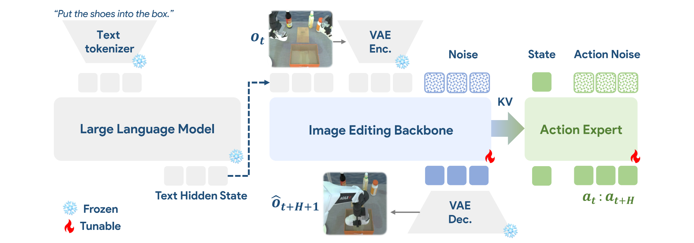
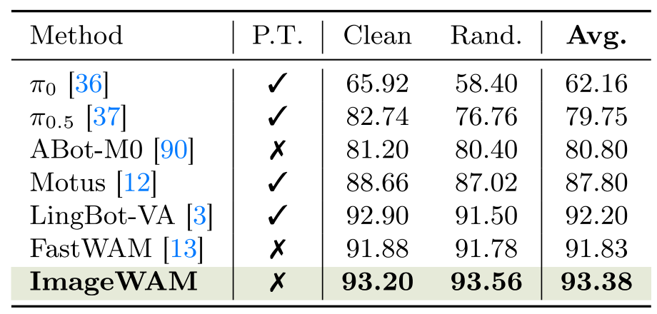
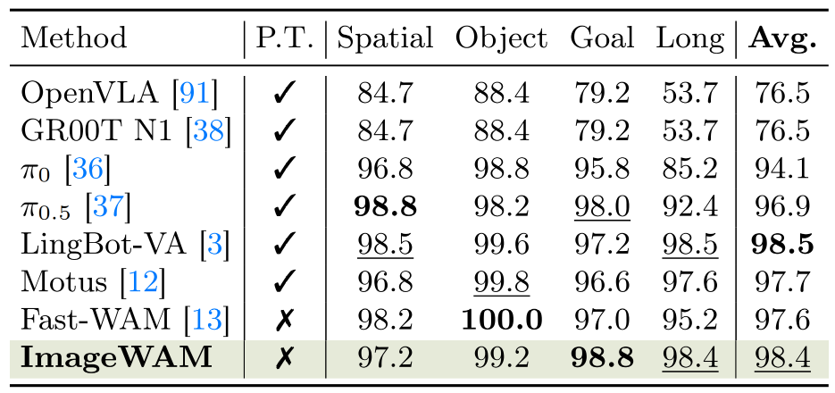
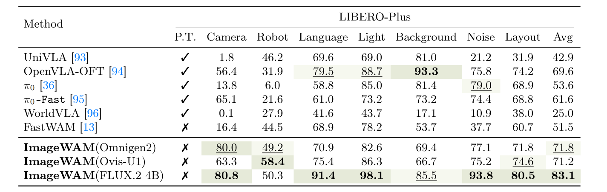
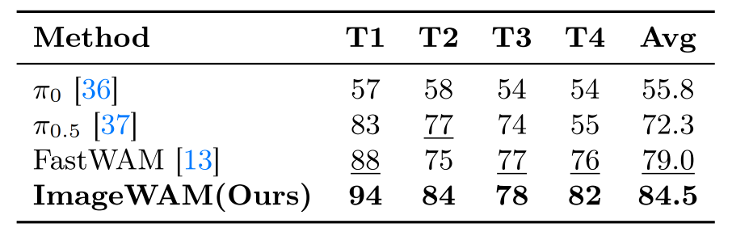
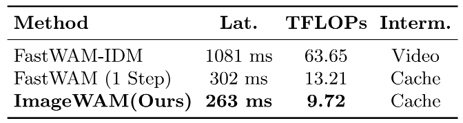
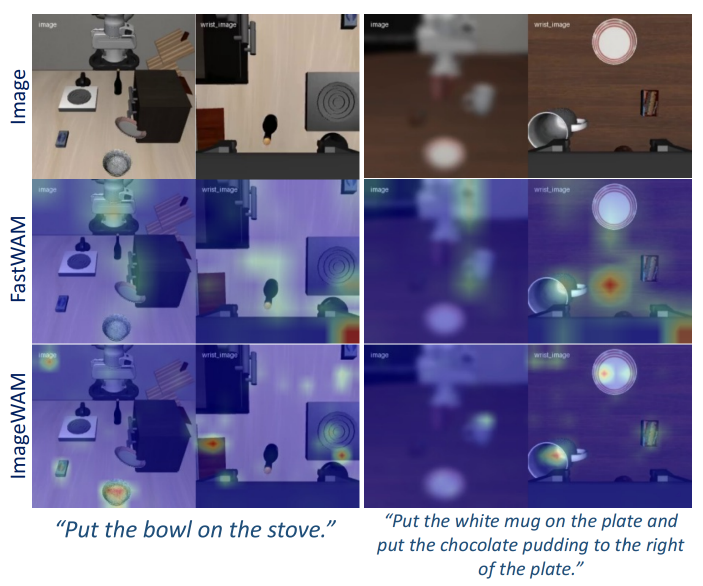

## ImageWAM: Do World Action Models Really Need Video Generation, or Just Image Editing?

### 一. 工作动机

**核心问题**：World Action Model（WAM）通常依赖 video generation 来连接“世界建模”和“动作预测”。这类方法的直觉是：模型先想象未来视频，再根据想象出的未来状态预测机器人动作。但**完整生成未来视频代价很高**，而且**生成出来的视频不一定都是对动作有用的信息**。

**关键矛盾**：机器人 policy 真正需要的不是一段视觉上完整、逼真的未来视频，而是理解“**当前画面在任务指令下应该发生什么关键变化**”。例如“把杯子放进碗里”这个任务中，模型最需要知道的是杯子和碗之间的目标关系、夹爪应该接近哪里、物体最终大致应该移动到哪里，而不是背景纹理、光照变化或多帧时间连续性。

**核心思想**：ImageWAM 认为 WAM 不一定需要显式生成未来视频。相比 video generation，image editing 更适合作为机器人 policy 的视觉生成先验：它从当前图像和语言指令出发，学习“**应该把当前画面编辑成什么目标状态**”。**ImageWAM 并不在推理时真正解码出编辑后的图像**，而是取 image editing backbone 在 denoising 过程中的中间 KV cache，作为一种 compact world-action context，供 action expert 预测动作。

> 可以理解为：ImageWAM 不是让模型“完整脑补未来视频”，而是让模型利用 image editing 模型内部的“当前图像应该如何变化”的表示，直接辅助动作生成。

---

### 二. ImageWAM 方法



#### 2.1 Image Editing Backbone

ImageWAM 可以基于不同 image editing model 构建，例如 OmniGen2、Ovis-U1 和 FLUX.2。论文中的核心实现思路是：保留 image editing model 的 instruction-conditioned visual transformation 能力，并把它的**中间表示**转移给机器人 action expert。

image editing backbone 的输入包括：

- 当前图像 observation；
- 语言任务指令；
- image editing denoising 过程中的 noisy latent。

它原本的目标是生成一个符合指令的 edited image。ImageWAM 则不关心最终生成图像是否好看，而是关心**中间 transformer layers 产生的 KV cache 是否包含对动作有用的视觉变化信息**。

#### 2.2 Editing KV Cache

在训练时，ImageWAM 会随机采样一个 image editing 去噪时间步，然后运行 editing branch，并收集**每一层 transformer 的 key-value cache**：

$$
C_{edit} = \{(K_l, V_l)\}_{l=1}^{L}
$$

其中：

- $L$：editing backbone 的 transformer 层数；
- $K_l, V_l$：第 $l$ 层的 key / value cache；
- $C_{edit}$：作为 action expert 的上下文输入。

这些 editing cache 不等于目标图像本身，而是 image editing model 在思考“这张图应该怎么改”时产生的中间表示。

#### 2.3 Action Expert

ImageWAM 的 action expert 使用 flow matching 来生成 action chunk。给定当前机器人状态、动作噪声和 editing cache，action expert 预测从噪声到真实动作序列的 velocity field。这里的 action chunk 是一段连续动作序列，而不是单步动作。这样可以支持机器人在一个推理周期内执行多步控制。

---

### 三. 训练与推理

#### 3.1 训练目标

ImageWAM 的训练包括两个目标：

1. **Image editing objective**：让 editing branch 保持预测任务相关未来目标帧的能力；
2. **Action flow matching objective**：让 action expert 根据 editing context 生成机器人动作。

##### A. Image Editing Objective

image editing branch 接收当前图像和任务指令，并学习预测一个未来 endpoint frame。这里的 endpoint frame 可以理解为任务执行后比较关键的目标视觉状态。

训练时会在图像 latent 和噪声之间做 flow matching：

$$
x_t = (1-t)\epsilon + t x_1
$$

其中：

- $x_1$：目标未来图像的 latent；
- $\epsilon$：高斯噪声；
- $t$：image flow time。

editing branch 预测 velocity field，使其能够从噪声走向目标图像 latent。这个目标的作用不是为了推理时生成好看的图像，而是为了**让 editing branch 的中间 cache 保留“任务相关的视觉变化”信息**。

##### B. Action Flow Matching Objective

action expert 也使用 flow matching。给定真实动作序列 $a_{0:H}$ 和噪声 $\epsilon_a$，构造插值动作：

$$
a_t = (1-t)\epsilon_a + t a_{0:H}
$$

action expert 预测 velocity field：

$$
v_\theta(a_t, t \mid C_{edit}, o_t, q_t)
$$

其中：

- $C_{edit}$：editing KV cache；
- $o_t$：当前视觉观测；
- $q_t$：当前机器人 proprioceptive state；
- $a_{0:H}$：真实 action chunk。

直观理解：action expert 学习如何在 editing context 的指导下，从随机动作噪声生成正确动作序列。

```text
当前图像 + 指令 + 带噪 future endpoint latent（随机采样 timestep）
→ editing branch 单步 forward
→ 得到 editing KV cache
→ 计算 image editing velocity loss

当前图像 + 指令 + editing KV cache + 带噪 action chunk（随机采样 timestep）
→ action expert 单步 forward
→ 计算 action flow matching loss

总 loss = image editing loss + action flow matching loss
→ 联合反向传播
```

> ImageWAM 训练理论上也可以设计成 FastWAM那样的 joint forward + mask 的形式，但原文为了尽量复用现成的 image editing backbone，只在其外部接入 action expert，减少对 editing backbone 内部结构的改动，因此采用了更模块化的串行结构。

#### 3.2 推理流程

ImageWAM 的推理流程非常关键，因为它的加速优势主要来自这里。

传统 video WAM 推理：

```text
当前图像 + 指令
→ 多步 denoising 生成未来视频 token
→ 解码或处理未来视频
→ action expert 预测动作
```

ImageWAM 推理：

```text
当前图像 + 指令
→ 选定一个固定 editing denoising timestep
→ 只运行一次 editing branch forward
→ 得到 editing KV cache
→ action expert 生成 action chunk
```

因此，ImageWAM 推理时：

- 不生成完整未来视频；
- 不解码 edited image；
- 不跑完整 image editing denoising trajectory；
- 只取一次 editing branch 的中间 cache 作为 action context。

这使它比 video-generation WAM 更轻量。

---

### 四. 实验

论文主要在四类环境中评估 ImageWAM：

- RoboTwin 2.0；
- LIBERO；
- LIBERO-Plus；
- 真实双臂机器人平台。

#### 4.1 RoboTwin 2.0

RoboTwin 2.0 是一个双臂机器人操作 benchmark，包含 50+ 个任务，要求模型在不同物体布局和场景条件下协调双臂完成操作。

实验结果显示：



这里比较重要的是：ImageWAM 没有额外使用 embodied policy pretraining，但仍然超过 FastWAM 和一些 VLA/WAM baseline。

#### 4.2 LIBERO

LIBERO 包含 Spatial、Object、Goal 和 Long 四个 suite，用于测试空间理解、物体识别、目标导向行为和长程任务。

实验结果显示：



ImageWAM 在 Long suite 上表现较好，说明 editing-aware representation 对长程任务也有帮助。

#### 4.3 LIBERO-Plus

LIBERO-Plus 在 LIBERO 基础上加入 camera、robot、language、light、background、noise、layout 等扰动，更能测试模型的 OOD robustness。



这说明 image editing backbone 的 instruction-conditioned visual transformation prior 对 OOD 视觉扰动和布局变化有明显帮助。

#### 4.4 真实机器人实验

真实机器人实验使用 Dobot XTrainer 双臂平台，包含四个任务：

- T1：Stack Three Bowls；
- T2：Fold Towel；
- T3：Open Drawer & Store Marker；
- T4：Hang Cup On Rack。

实验结果：



ImageWAM 在真实机器人上也超过 FastWAM，说明它不是只在仿真 benchmark 上有效。

#### 4.5 效率分析

论文对比了 video-generation WAM 和 ImageWAM 的推理开销：



这说明 ImageWAM 相比显式未来视频生成路径明显更快。论文还强调，相比 video-based WAM，ImageWAM 将 FLOPs 降到约 1/6，latency 降到约 1/4。

#### 4.6 Attention 可视化



论文通过 attention visualization 发现，ImageWAM 的 attention 更集中在任务相关变化区域，比如被操作物体、目标容器和接触区域，而不是大面积背景。这说明 editing cache 不是普通视觉特征，而更像是围绕“该改哪里、怎么改”的任务相关表示。

---

### 五. 局限性与思考

1. 效果依赖 image editing backbone 的质量。论文中不同 backbone 的结果差异明显，FLUX.2 4B / 9B 版本在 LIBERO-Plus 上更强。这说明 editing prior 的强弱会直接影响 action prediction。

2. image editing 直接进行 endpoint transformation，跳过完整时间过程的显式建模。**对于一些必须理解中间接触过程、连续动力学或时序约束的任务，仅靠 endpoint edit-aware representation 可能不够**。

3. ImageWAM 推理时固定选一个 editing denoising timestep。这个 timestep 是否对所有任务都最优还值得进一步研究。不同任务阶段可能需要不同层次的 editing representation：粗略移动阶段可能需要语义目标，精细接触阶段可能需要几何细节。

4. ImageWAM 虽然不解码 edited image，但仍然需要运行 image editing branch。对于更大规模 backbone，其实际部署成本仍需要和轻量 VLA / WAM 方法仔细比较。
