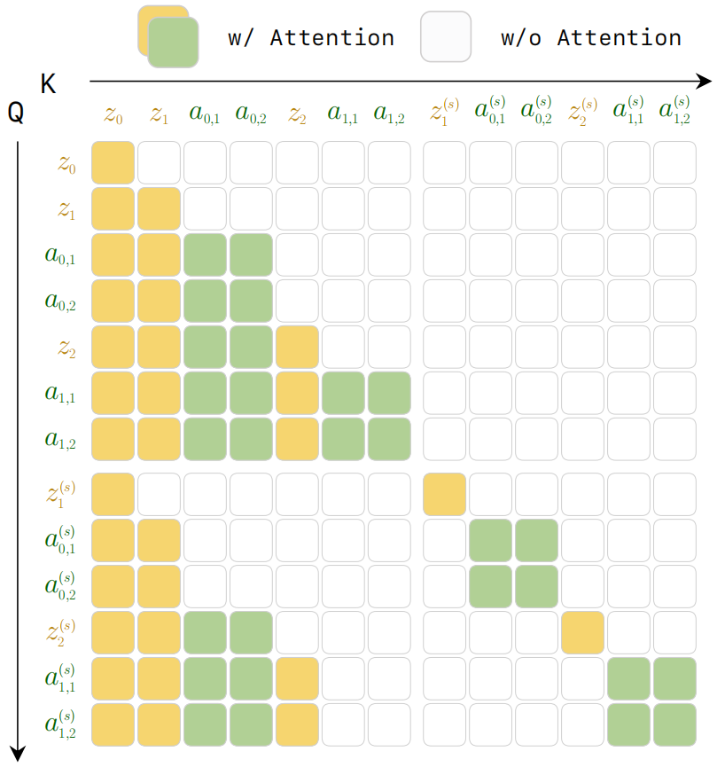
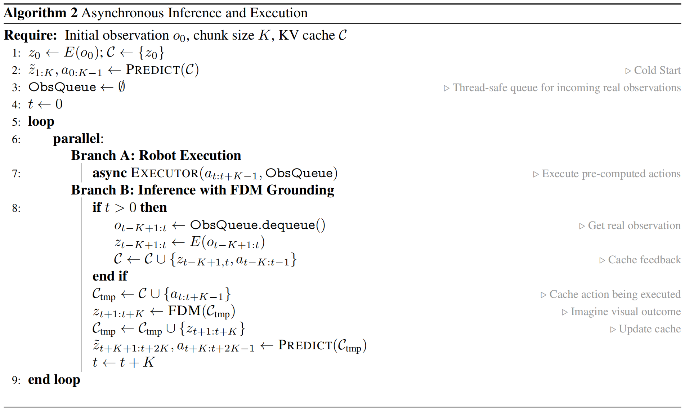
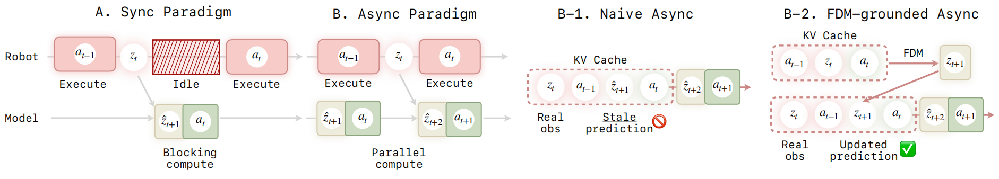

### 一. 文章内容概括

#### 解决了什么问题？

- **表征纠缠**：现有的 VLA 模型通常采用前馈范式，**将视觉场景理解和运动控制知识强行压缩到一个统一的共享表征空间中** 。这种纠缠导致模型在样本效率和泛化能力上表现受限。  
- **闭环反应性与因果性缺失**：现有基于 Chunk 的视频-动作扩散模型往往**缺乏持久的历史缓存**，导致记忆受限 ；并且片段内的双向注意力机制使得**未来 token 会影响过去**，这**违背了物理世界呈现的严格单向因果性**，使其难以结合实时反馈进行闭环调整。  
- **推理延迟瓶颈**：大规模自回归视频-动作模型通过**迭代去噪**生成高保真视频帧时，会产生**极高的计算开销**，这导致严重的推理延迟，难以满足机器人的实时高频控制需求。  

#### 怎么解决的？

- **自回归视频-动作世界模型**：提出了 LingBot-VA，基于 **Flow Matching** 框架在一个连续的潜在空间中以**自回归**的方式交错生成视频和动作块。**通过预测未来视觉动态再从中提取动作**（逆动力学），模型自然拥有了物理演化的理解能力。此外还用了 **KV Cache** 缓存所有历史观测和动作，保存模型的长期记忆。
- **混合 Transformer 架构 (MoT)**：设计了具有共享隐空间的 MoT 架构，以不对称的容量分别处理视觉流与动作流，并在特征融合时保持各自模态独立性。  
- **异步推理与噪声历史增强**：为打破推理延迟，提出了**异步协调流水线**将动作预测与电机执行并行化 。同时引入噪声历史增强，**使动作解码器学会在模糊的视觉特征中提取准确动作**，将推理时的视频去噪步数减半，实现高效控制。  

------

### 二. 模型结构

LingBot-VA 采用了一个**基于 Flow Matching 的自回归扩散 Transformer 架构**，对视频和动作进行联合建模 。

  

**A. 整体架构**

- **双流主干网络（Figure2）**：包含两个平行的 Transformer 分支。视频流初始化自拥有大规模预训练先验的 **Wan2.2-5B**（隐藏层 token 向量维度 `d_v=3072`，30 层 Transformer）；动作流深度相同但宽度显著缩小（`d_a=768`），仅引入约 **350M** 额外参数 。  
- **动作网络初始化策略**：为了避免动作流随机初始化导致的联合注意力破坏，动作网络权重通过对预训练视频权重进行**插值复制**（类似FastWAM），并应用缩放因子 `α=sqrt(d_v/d_a)` 进行初始化，以**保证输出方差一致**，加速收敛 。  

**B. 输入编码层**

- **图像与视频流 `o_t`**：利用冻结的 **Wan2.2 causal VAE** 将高维的视觉观测压缩为紧凑的潜在特征 token `z_t` 。为了提升效率，**视频帧在时间维度上被下采样**（因子 `τ=4`，通过 3D VAE 连续吞入 4 帧浓缩为 1 个潜在表征）实现稀疏化。  
- **语言指令 `c`**：通过冻结的 **T5 文本编码器**处理，并借由 Cross-Attention 注入模型 。  
- **动作 `a_t`**：通过**单层轻量级 MLP** 将动作向量投影为动作 token 嵌入，并与降维后的视频 token **按照时间顺序交错**，构成联合序列 `[z_t, a_t,1, a_t,2, ..., a_t,τ, z_t+1, ...]` 。  

**C. 核心自回归 Transformer 层 (MoT Blocks)**

- **MoT 融合机制**：在每一层中，视频和动作 token 各自通过**独立的 QKV 投影矩阵处理**（保持特定模态表征），其中 动作 token 需要先被**线性映射到视频维度（768 `→` 3072）**以参与**联合的跨模态自注意力**计算，最后再**通过残差连接退回动作维度**。  
- **因果注意力掩码（Figure3）**：所有交错的块通过统一的**单向注意力掩码**进行处理，**每个 token 仅能关注时间序列中不晚于它出现的 token**。这不仅确保了**物理世界的因果一致性**，还使得实时闭环观测能够平滑融入 。  



**D. 输出解码层（仅推理）**

- **视频预测**：自回归流匹配输出预测的潜在视频块，利用 VAE 解码为未来视觉状态 `z_hat_t+1:t+K` 。  
- **动作解码**：作为一个逆动力学模块，动作流将特征输入一个线性投影头，以**预测出的未来视觉状态以及历史观测**为条件，将其解析为低维的可执行动作序列 。  

------

### 三. 训练与推理流程

**A. 训练流程**

训练的目标是将视频预测和逆动力学动作预测统一在一个自回归 video-action 序列中。  

1. **构建输入**：从数据集中采样**交错的视频-动作长序列** `[z_t, a_t,1, a_t,2, ..., a_t,τ, z_t+1, ...]`，并使用带有掩码的因果注意力。

2. **噪声历史增强**：由于动作执行不需要完美的像素级重建，训练时会以 `p=0.5` 的概率对模型所依赖的“过去视觉历史 `z_le t`”注入插值噪声（`s_aug ∈ [0.5, 1]`） 。这迫使动作解码器学会**在模糊的潜在表征下依然能鲁棒地提取出精确的动作特征**。  

3. **计算损失**：联合优化视频动力学损失 `L_dyn` 和动作逆动力学损失 `L_inv`，二者均基于**均方误差**衡量预测速度与真实速度向量的差异 。  
   ```text
   L = L_dyn + λ L_inv
   ```
   后训练阶段还会额外引入一个基于正向动力学的对齐损失 `L_fdm` 。  

> LingBot-VA 虽然在控制逻辑上可以解释为“先预测未来视觉状态，再由状态转移推断动作”，但它并不是把 video/world prediction 与 action decoding 视为两个完全独立的模块分别训练。相反，它将 video tokens 和 action tokens 交错组织到同一个自回归 video-action 序列中，并在连续 latent space 中通过 autoregressive diffusion / flow matching 框架对世界预测和动作生成进行联合建模。因此，从架构耦合和联合优化的角度看，LingBot-VA 更适合归类为 Joint WAM。

**B. 闭环推理流程（Algorithm2）**



1. **KV Cache 缓存历史**: 得益于严格的**自回归**架构，模型在每一步只需计算最新的“观测-动作”对的全注意力，**之前积累的所有序列历史对将被持久化保存在 KV Cache 中**，有效解决了长视野任务中的“失忆”与轨迹漂移问题 。  

2. **加速自回归采样 (视频局部去噪)**: 因为训练阶段应用了“噪声历史增强”，**推理时生成未来视频块无需完全积分到 `s=1`，仅需积分到 `s=0.6`（使用 Euler 求解器仅需 3 步）**，从而大幅削减了流匹配迭代带来的延迟 。**动作 token 则完全去噪到 `s=1.0`** 。  

3. **异步并行执行与 FDM 纠偏（Figure4）**:

   

   - **异步并行执行**：当机器人底层在执行当前预测出的动作块 `a_t` 时，模型不用挂起等待，而是**同时并行去预测下一个动作块 `a_t+1`**，巧妙掩盖了计算耗时 。  
   - **消除陈旧预测误差**：如果仅使用异步并行，模型会基于“虚构的过期预测画面”继续脑补，最终丧失对真实环境的反应力 。LingBot-VA 的精髓在于引入了**正向动力学模型**：在得到最新的真实观测反馈 `z_t` 后，系统会强制模型结合正在执行的动作 `a_t`，“想象”出修正后的当前视觉状态 `z_t+1`，并用它**更新替换掉 KV Cache 中的旧预测**。这确保了模型在规划下一步前，随时与物理世界的真实变化对齐。

---

### 四. 实验

**研究问题一：LingBot-VA 在处理真实世界中复杂、长程且高精度的操作任务时表现如何？**

- **实验设置**：在物理机器人平台上评估了六类任务，涵盖长程操作（做早餐、拆快递）、高精度任务（插管、捡螺丝）以及形变物体操作（折衣服、折裤子） 。使用进度得分和成功率作为衡量指标，并与强基准模型 `π0.5` 进行对比 。  
- **实验结论**：LingBot-VA 在所有任务和指标上均达到 **SOTA** 表现，显著超越基准 。实验证明，视频生成提供的物理演化信号对处理非刚性材料（如折衣服）具有重要的隐式引导价值，使动作更符合物理逻辑 。  

**研究问题二：模型在不同机器人形态及仿真基准下的泛化能力和稳定性如何？**

- **实验设置**：在 RoboTwin 2.0（包含 50 个双臂协作任务，分为简单和随机化困难模式）和 LIBERO（包含 Spatial, Object, Goal, Long 四大套件）仿真基准上进行评估 。  
- **实验结论**：在 LIBERO 上以 **98.5%** 的平均成功率刷新纪录 。在双臂操作挑战 RoboTwin 2.0 中，**随着任务跨度（Horizon）增加，LingBot-VA 的优势更加明显（Horizon=3 时领先第二名约 8%-9%）**，验证了自回归机制对长程任务上下文维持的有效性 。  

**研究问题三：核心设计（异步推理、预训练策略、权重初始化）对系统性能有何影响？（消融实验）**

- **实验设置**：
  1. **同步 vs 异步**：对比在相同任务下的成功率与执行耗时 。  
  2. **预训练价值**：对比使用 LingBot-VA 预训练权重与直接使用视频大模型 Wan 权重进行微调的效果 。  
  3. **初始化方案**：对比随机初始化动作网络与使用视频权重插值并应用缩放因子 `α` 的方案 。  
- **实验结论**：
  1. 异步推理在**保证成功率**的前提下，使任务完成速度提升了 **2 倍** 。  
  2. LingBot-VA 预训练模型表现**远超原始 WAN 模型**，证明联合视频-动作预训练赋予了模型更强的视觉-运动先验 。  
  3. 使用缩放因子的初始化策略**显著稳定了训练初期动态，加速了收敛过程** 。  

**研究问题四：LingBot-VA 在样本效率方面是否具有优势？**

- **实验设置**：在真实世界和仿真环境中，通过限制微调阶段的演示数据量（5 到 50 个不等）来观察性能变化 。  
- **实验结论**：**在所有数据规模下均优于基准模型** 。在极低数据量（10 个演示）时优势最突出，进度得分比基准高出 10%-15%，体现了其利用视频预训练知识快速迁移的能力 。  

**研究问题五：自回归架构是否增强了机器人的时间记忆与状态追踪能力？**

- **实验设置**：设计了需要依赖历史状态的特殊任务，包括“擦盘子”（需计数并重复 6 次）和“搜箱子”（需记住已搜过的空箱子并搜索另一个） 。  
- **实验结论**：LingBot-VA 在此类非马尔可夫决策任务中大幅领先基准模型 。这归功于其**自回归架构配合 KV Cache 能够持久保存完整的历史交互信息**，避免了“失忆”问题 。  

**研究问题六：模型对于未见过物体（Novel Object）及空间分布外（OOD）场景的泛化表现如何？**

- **实验设置**：测试模型处理训练集中未包含的新奇形状/纹理物体，以及超出训练分布的随机空间放置位置 。  
- **实验结论**：由于世界模型通过视频预测学习到了**物体无关的物理先验**，LingBot-VA 在面对新奇物体和 OOD 位置时展现出了更强的零样本泛化潜力 。  

---

### 五. 局限性

1. **计算开销仍需进一步优化**：尽管模型已经通过“异步推理”和“局部去噪”大幅降低了延迟，但流匹配视频生成的计算量依然庞大。未来需要开发更高效的**视频压缩**方案，以从根本上减少计算开销 。  
2. **感知模态较为单一**：目前的框架主要依赖视觉和动作指令。未来计划引入**多模态传感输入（如触觉、力觉以及音频等）**，以使得机器人在处理涉及复杂物理接触动力学的任务时能够更加鲁棒 。