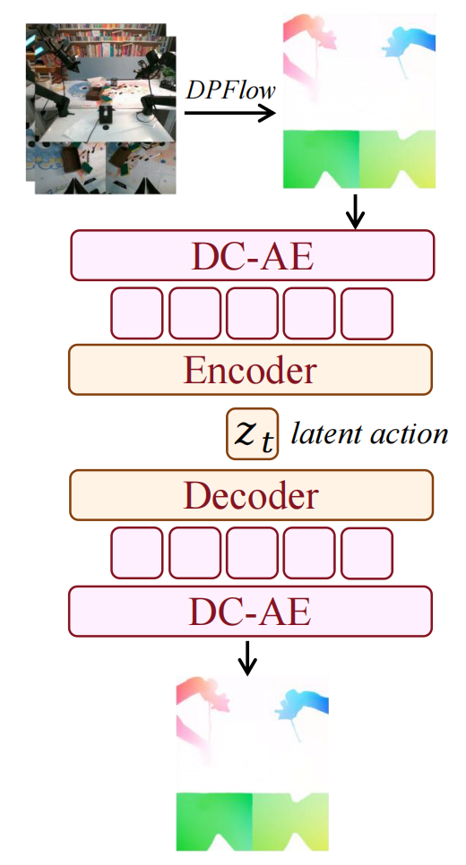
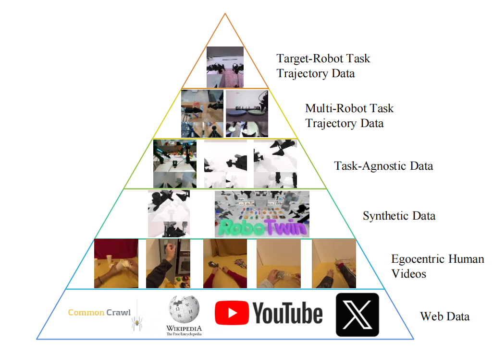

## 一. 文章内容概括

#### 解决了什么问题？

- **系统碎片化**：现有的具身智能模型通常将世界模型和动作控制孤立建模，导致五种关键的建模范式（VLA、WM、IDM、VGM、联合预测）被割裂，这种碎片化阻碍了多模态生成能力的有效统一。  
- **异构数据利用困难**：不同机器人的动作空间差异巨大，导致现有的动作控制模型高度依赖带有特定动作标签的机器人轨迹数据。因此，模型难以从海量缺乏动作标签的异构数据（如互联网视频和第一人称人类演示）中直接学习跨具身的通用物理交互和运动先验。  

#### 怎么解决的？

- **统一模型与模式调度**：提出了一个基于混合 Transformer (MoT) 架构的统一模型，通过共享的注意力机制集成了三大预训练专家（视频生成器、动作专家和视觉语言理解专家），同时引入了为视频和动作分配不同时间步与噪声尺度的调度器，使得单一模型能够在五种不同的推理模式（WM, VLA, IDM, VGM, 联合预测）之间自适应灵活切换 。  
- **基于光流的潜在动作**：利用光流将视觉动态编码为像素级的“增量动作”，打通了视觉动态与控制信号的壁垒，使模型能够利用无标签的视频进行大规模的动作预训练，并统一了不同机器人的动作模式。
- **三阶段训练与六层数据金字塔**：设计了从互联网规模视频到目标机器人演示的六层数据金字塔，并配合三阶段训练流水线（视频预训练、潜在动作联合预训练、目标具身微调），逐步将丰富的物理先验注入策略中 。  

------

## 二. 模型结构

#### A. 整体架构 (MoT)

模型包含三个独立但相互协同的专家模块：

- **理解专家 (Understanding Expert)**：Transformer 模块（参数量为 253.5M，包含 30 层 Transformer Blocks），接收特征提取器 Qwen3-VL-2B 输出的特征作为初始输入。  
- **生成专家 (Video Gen. Model)**：采用 Wan 2.2 5B 作为视频基础模型，负责视觉画面的生成与预测 。  
- **动作专家 (Action Expert)**：构建了与 Wan 同等深度的 Transformer 块（参数量为 641.5M，包含 30 层 Transformer Blocks），用于处理动作序列 。  

#### B. 核心多模态融合：三模型联合注意力

- 在 Motus 中，每个专家模块保持独立的 Transformer 结构（包括独立的 AdaLN 和 FFN），但它们共享拼接的多头自注意力层 。  
- 这种设计避免了将不同模态 Token 简单拼接带来的任务干扰，在保留专家各自特定功能的同时，实现了高效的跨模态知识融合 。  

#### C. 输入与潜在动作编码层 

- **光流压缩**：对于无动作标签的视频，系统首先使用 DPFlow 提取连续帧之间的**光流**并转为 RGB 图像 。随后，通过深度卷积变分自编码器 (DC-AE) ，将其编码成了 4 个 512 维的 Token（即拼接为 4 × 512 的特征矩阵） ，然后经过一个轻量级编码器，进一步压缩为与真实机械臂动作空间尺度匹配的 **14 维潜在动作向量 $z_t$** 。（这部分训练过程详见P5“Training and Distribution Alignment”）

  

- **动作-视频 Token平衡**：由于视频 Token 数量远大于动作 Token，直接联合预测会导致模型**过拟合于视频生成**。Motus 在训练和推理时对视频帧进行降采样（如设置视频帧率为动作帧率的 1/6），以保证注意力机制中的 Token 平衡 。

  > **训练侧**：在**准备数据**时，动作信号以 30Hz 的高频密集采样，而对应的视频画面则以 5Hz 的低频稀疏采样。也就是说，在物理世界的同一段时间内，数据本身就配对成了“6 个动作节点对应 1 张视频画面”。  
  >
  > **推理侧**：当模型预测一个包含 48 个动作的 Chunk 时，它**直接且仅输出** 8 帧视频画面的潜变量（因为 48 / 6 = 8） 。它不会去生成多余的 40 帧视频，从而极大节省了显存和算力开销，同时维持了动作专家和视频专家在注意力计算时的 Token 数量平衡 。    

------

## 三. 训练与推理流程

#### A. 训练流程

##### 六层数据金字塔

从金字塔底部到顶部，数据的**数量逐渐递减**，但数据的**质量逐渐递增**，具体分为以下六个层级：

- **Level 1 (底层): Web Data（互联网数据）**
  - **特点**：规模极其庞大（如 YouTube 视频、维基百科百科等），**蕴含最基础的世界常识和物理规律** 。  
  - **用途**：用于现成的基础模型（VGM 视频生成模型和 VLM 视觉语言模型）的预训练 。  
- **Level 2: Egocentric Human Videos（第一人称人类视频）**
  - **特点**：包含人类视角的丰富物理交互过程，但**缺乏机器人的动作控制标签** 。  
- **Level 3: Synthetic Data（合成数据）**
  - **特点**：通过**仿真器（如 RoboTwin）生成**的数据，易于大规模获取 。  
- **Level 4: Task-Agnostic Data（无特定任务数据）**
  - **特点**：机器人通过**随机探索**获取的图像-动作对，**不为完成具体任务**，仅用于感知控制空间的边界 。  
- **Level 5: Multi-Robot Task Trajectory Data（多机器人任务轨迹数据）**
  - **特点**：带有明确动作标签的高质量**跨具身机器人**操作演示数据 。  
- **Level 6 (顶层): Target-Robot Task Trajectory Data（目标机器人任务轨迹数据）**
  - **特点**：数量最少，但**与最终部署环境（机器人+任务）最完全一致**，是高精度的针对性演示 。  

##### 三阶段训练

 **Stage 0: 预训练基础模型**

- **数据层级**：Level 1 (互联网数据) 。  
- **训练状态**：此阶段不涉及 Motus 的从头训练，而是**直接利用现成的**、经过海量互联网数据预训练的视频生成模型 (VGM) 和视觉语言模型 (VLM) 作为底座 。  

**Stage 1: 学习视觉动态**

- **核心目标**：让模型在逼真的物理交互中建立认知“锚点” 。通过微调，使得 VGM 能够根据自然语言指令和一张初始图像，生成物理上合理、连贯的未来任务视频序列 。  
- **使用数据**：Level 2 (第一人称人类视频)、Level 3 (合成数据)、Level 5 (多机器人任务轨迹数据) 。  
- **训练状态**：**仅微调 VGM (视频生成模型)**，VLM 和动作专家不参与训练 。  

**Stage 2: 学习动作表示**

- **核心目标**：搭建“视觉预测”与“物理控制”之间的桥梁，通过将运动和物理交互知识强行嵌入到潜在动作空间中，完成动作专家的初始化 。  
- **使用数据**：Level 2 (第一人称人类视频)、Level 3 (合成数据)、Level 4 (无特定任务数据)、Level 5 (多机器人任务轨迹数据) 。  
- **训练状态**：**联合预训练**。**冻结 VLM 模块**，利用视频、语言以及提取出的**潜在动作 (Latent Actions)** 对 Motus 的三大专家进行联合预训练 。  

**Stage 3: 目标机器人专精化**

- **核心目标**：在目标机器人的专属数据上进行监督微调，确保模型之前习得的庞大物理先验能够完全适应并转化为特定机器人的动力学和运动学特性 。  
- **使用数据**：Level 6 (目标机器人任务轨迹数据) 。  
- **训练状态**：使用目标机器人的**真实动作 (Actions)** 对包含全部 3 个专家在内的完整 Motus 模型进行最终的对齐与微调 。 

**算法流程**
$$
\begin{array}{ll}
\hline
\textbf{Algorithm 1 } \text{Training} \\
\hline
\begin{array}{rl}
1: & \textbf{repeat} \\
2: & \quad o_{t:t+k}^0, a_{t+1:t+k}^0, \ell \sim D_{\text{expert}} \\
3: & \quad \tau_o, \tau_a \sim \text{Uniform}(\{1, 2, \dots, T_\tau\}) \\
4: & \quad \epsilon_o, \epsilon_a \sim \mathcal{N}(\mathbf{0}, \mathbf{I}) \\
5: & \quad o_{t+1:t+k}^{\tau_o} = (1 - \tau_o)o_{t+1:t+k}^0 + \tau_o\epsilon_o \\
6: & \quad a_{t+1:t+k}^{\tau_a} = (1 - \tau_a)a_{t+1:t+k}^0 + \tau_a\epsilon_a \\
7: & \quad v_o^\theta, v_a^\theta = \text{Model}_\theta(o_t^0, o_{t+1:t+k}^{\tau_o}, a_{t+1:t+k}^{\tau_a}, \tau_o, \tau_a, \ell) \\
8: & \quad l_{\text{action}}^\theta = \|v_a^\theta - (\epsilon_a - a_{t+1:t+k}^0)\|_2^2 \\
9: & \quad l_{\text{obs}}^\theta = \|v_o^\theta - (\epsilon_o - o_{t+1:t+k}^0)\|_2^2 \\
10: & \quad l^\theta = l_{\text{action}}^\theta + l_{\text{obs}}^\theta \\
11: & \quad \theta \leftarrow \theta - \eta \nabla_\theta l^\theta \\
12: & \textbf{until } \text{converged}
\end{array} \\
\hline
\end{array}
$$

#### B. 灵活的多模式推理流程

Motus 构建了类似 UniDiffuser 的调度器，推理时通过改变视频和动作的初始噪声状态和去噪时间步，无缝切换五种工作模式 ：  

1. **视频生成模式 (VGM)**：$p(\mathbf{o}_{t+1:t+k} \mid \mathbf{o}_t, \ell)$

   给定当前观测和指令，动作维度保持**纯噪声**状态，逐步对视频维度进行去噪，预测**未来的视觉画面**。
   $$
   \begin{array}{ll}
   \hline
   \textbf{Algorithm 2 } \text{VGM} \\
   \hline
   \textbf{Require:} \quad o_t^0, \ell, \theta \\
   \begin{array}{rl}
   1: & \epsilon_o, \epsilon_a \sim \mathcal{N}(\mathbf{0}, \mathbf{I}) \\
   2: & o_{t+1:t+k}^{T_\tau} \leftarrow \epsilon_o \\
   3: & a_{t+1:t+k}^{T_\tau} \leftarrow \epsilon_a \\
   4: & \textbf{for } \tau = T_\tau \dots 1 \textbf{ do} \\
   5: & \quad v_o, v_a = \text{Model}_\theta(o_t^0, o_{t+1:t+k}^\tau, a_{t+1:t+k}^{T_\tau}, \tau, T_\tau, \ell) \\
   6: & \quad o_{t+1:t+k}^{\tau-1} = o_{t+1:t+k}^\tau + v_o d\tau \\
   7: & \textbf{end for} \\
   8: & \textbf{return } o_{t+1:t+k}^0
   \end{array} \\
   \hline
   \end{array}
   $$

2. **世界模型模式 (World Model)**：$p(\mathbf{o}_{t+1:t+k} \mid \mathbf{o}_t, \mathbf{a}_{t+1:t+k})$

   给定当前观测和一段**干净**的动作指令序列，通过去噪推演预测出**执行该动作后的未来视觉观测结果**。
   $$
   \begin{array}{ll}
   \hline
   \textbf{Algorithm 3 } \text{World Model} \\
   \hline
   \textbf{Require:} \quad o_t^0, a_{t+1:t+k}^0, \ell, \theta \\
   \begin{array}{rl}
   1: & \epsilon_o \sim \mathcal{N}(\mathbf{0}, \mathbf{I}) \\
   2: & o_{t+1:t+k}^{T_\tau} \leftarrow \epsilon_o \\
   3: & \textbf{for } \tau = T_\tau \dots 1 \textbf{ do} \\
   4: & \quad v_o, v_a = \text{Model}_\theta(o_t^0, o_{t+1:t+k}^\tau, a_{t+1:t+k}^0, \tau, 0, \ell) \\
   5: & \quad o_{t+1:t+k}^{\tau-1} = o_{t+1:t+k}^\tau + v_o d\tau \\
   6: & \textbf{end for} \\
   7: & \textbf{return } o_{t+1:t+k}^0
   \end{array} \\
   \hline
   \end{array}
   $$

3. **逆动力学模型模式 (IDM)**：$p(\mathbf{a}_{t+1:t+k} \mid \mathbf{o}_{t:t+k})$

   给定一段**干净**的视频观测序列，将动作维度初始化为纯噪声并逐步去噪，推断出**产生该视觉变化所需的物理动作**。
   $$
   \begin{array}{ll}
   \hline
   \textbf{Algorithm 4 } \text{IDM} \\
   \hline
   \textbf{Require:} \quad o_{t:t+k}^0, \ell, \theta \\
   \begin{array}{rl}
   1: & \epsilon_a \sim \mathcal{N}(\mathbf{0}, \mathbf{I}) \\
   2: & a_{t+1:t+k}^{T_\tau} \leftarrow \epsilon_a \\
   3: & \textbf{for } \tau = T_\tau \dots 1 \textbf{ do} \\
   4: & \quad v_o, v_a = \text{Model}_\theta(o_{t:t+k}^0, a_{t+1:t+k}^\tau, 0, \tau, \ell) \\
   5: & \quad a_{t+1:t+k}^{\tau-1} = a_{t+1:t+k}^\tau + v_a d\tau \\
   6: & \textbf{end for} \\
   7: & \textbf{return } a_{t+1:t+k}^0
   \end{array} \\
   \hline
   \end{array}
   $$

4. **VLA 控制模式**：$p(\mathbf{a}_{t+1:t+k} \mid \mathbf{o}_t, \ell)$

   给定单帧观测和语言指令，视频维度保持**纯噪声**状态，模型专注于对动作维度去噪，直接输出**控制策略**。  
   $$
   \begin{array}{ll}
   \hline
   \textbf{Algorithm 5 } \text{VLA} \\
   \hline
   \textbf{Require:} \quad o_t^0, \ell, \theta \\
   \begin{array}{rl}
   1: & \epsilon_o, \epsilon_a \sim \mathcal{N}(\mathbf{0}, \mathbf{I}) \\
   2: & o_{t+1:t+k}^{T_\tau} \leftarrow \epsilon_o \\
   3: & a_{t+1:t+k}^{T_\tau} \leftarrow \epsilon_a \\
   4: & \textbf{for } \tau = T_\tau \dots 1 \textbf{ do} \\
   5: & \quad v_o, v_a = \text{Model}_\theta(o_t^0, o_{t+1:t+k}^{T_\tau}, a_{t+1:t+k}^\tau, T_\tau, \tau, \ell) \\
   6: & \quad a_{t+1:t+k}^{\tau-1} = a_{t+1:t+k}^\tau + v_a d\tau \\
   7: & \textbf{end for} \\
   8: & \textbf{return } a_{t+1:t+k}^0
   \end{array} \\
   \hline
   \end{array}
   $$

5. **视频-动作联合预测模式**：$p(\mathbf{o}_{t+1:t+k}, \mathbf{a}_{t+1:t+k} \mid \mathbf{o}_t, \ell)$

   给定观测和指令，从高斯噪声中同时**联合去噪**，输出**未来的视频帧序列和精确的动作轨迹块** 。  
   $$
   \begin{array}{ll}
   \hline
   \textbf{Algorithm 6 } \text{Video-Action Joint Prediction Model} \\
   \hline
   \textbf{Require:} \quad o_t^0, \ell, \theta \\
   \begin{array}{rl}
   1: & \epsilon_o, \epsilon_a \sim \mathcal{N}(\mathbf{0}, \mathbf{I}) \\
   2: & o_{t+1:t+k}^{T_\tau} \leftarrow \epsilon_o \\
   3: & a_{t+1:t+k}^{T_\tau} \leftarrow \epsilon_a \\
   4: & \textbf{for } \tau = T_\tau \dots 1 \textbf{ do} \\
   5: & \quad v_o, v_a = \text{Model}_\theta(o_t^0, o_{t+1:t+k}^\tau, a_{t+1:t+k}^\tau, \tau, \tau, \ell) \\
   6: & \quad o_{t+1:t+k}^{\tau-1} = o_{t+1:t+k}^\tau + v_o d\tau \\
   7: & \quad a_{t+1:t+k}^{\tau-1} = a_{t+1:t+k}^\tau + v_a d\tau \\
   8: & \textbf{end for} \\
   9: & \textbf{return } o_{t+1:t+k}^0, a_{t+1:t+k}^0
   \end{array} \\
   \hline
   \end{array}
   $$